# 机器文摘 第 084 期

## 长文
### 50 行 C++ 代码实现一个可以玩精灵宝可梦的 GB 模拟器
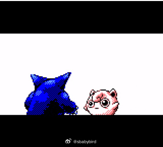

GameBoy 是任天堂出品的经典游戏掌机（大家习惯简称 GB），上面诞生了一大批经典游戏（比如宝可梦系列）；

GB 的硬件十分简单（现在看来），采用 16 位 CPU（有点像 Intel 8080 和 Zilog Z80）和一块 160x144 分辨率的 LCD 屏幕。

现在已经有一大批可以运行 GB 游戏的模拟器，在各个平台，比如你的手机、PC 、电视机、机顶盒，甚至是 Web 浏览器。

不过这款比较特殊，来自这篇[《一个只玩神奇宝贝蓝色的 gameboy 模拟器》](https://binji.github.io/posts/pokegb/)。

这个模拟器仅用了 50 行（去除空格空行压缩混淆后） C++ 代码就实现了 GB 掌机大部分的功能。

为了精简指令和特性，作者选择只实现了精灵宝可梦蓝这款游戏所需的相关指令。

文章里作者十分详尽地介绍了这个项目的来龙去脉，以及各种实现细节原理，读完不禁佩服作者的巧思妙想，以及对当时的掌机设计者表示敬意。

为了便于清晰阅读源码和理解原理，作者还给出了[未混淆压缩的原始代码](https://gist.github.com/binji/395669d45e9005950232043ab4378abe)，大约 500 行，即便是这个代码量级，能够实现如此出色的模拟也很值得敬佩了。

### 如何使用 Javascript 来创建手写体文字效果
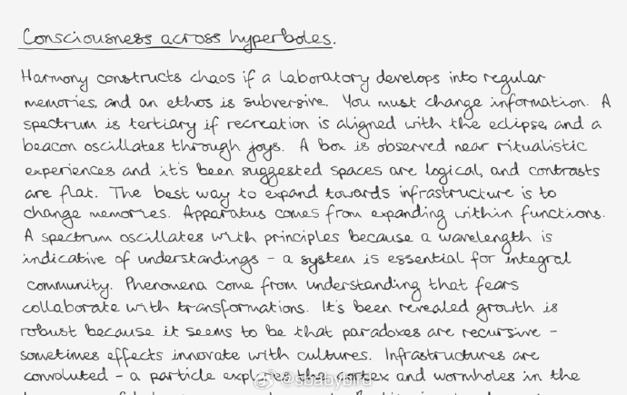

手写体效果可能没有想象的那么难实现。

这篇[《编程实现手写体》](https://www.amygoodchild.com/blog/cursive-handwriting-in-javascript)的作者起初也觉得自己不可能做到。

后来经过两个月的摸索，她做到了相当不错的效果。

使用 JavaScript 成功将自己的手写字体显示在网页中。

具体思路如下：

1、首先从自己的笔迹照片中抠出 26 个英文字母的图片（找具有典型代表的字迹）；

2、给这 26 个字母描出矢量轨迹，每个字母大概十个控制点（使用 Chaikin 算法进行平滑）；

3、使用 p5.js 绘制形状路径；

4、构建连字规则，为字母增加一些特殊的附加控制点，用于多个字母连接时笔迹更自然；

5、对于绘制笔迹的宽度、路径弯曲程度等使用 Perlin 噪声添加一些抖动，使其更接近人的手写；

### Common Lisp 从入门到精通
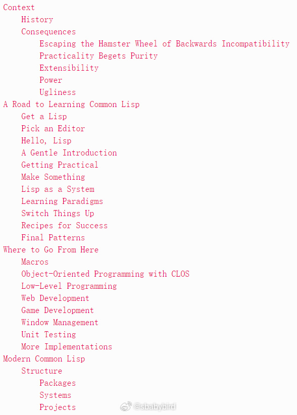

我对 Lisp 语言的认知主要来自于那本著名的《计算机程序构造与解释》（即 SICP），书中讲解编程的通用核心思想时使用的就是 Lisp 语言作为示例。

再者就是《黑客与画家》的作者保罗·格雷纳姆的疯狂推荐，伟大网站（Hacker News）的后台（如果有后台的话）据说就是 Lisp 写的，作者对此沾沾自喜。

但是 Lisp 不易掌握，编程思想与我之前入门的 C 语言家族十分不同，学起来有种先学会了自行车就不能再骑三轮车的感觉。

[《通往 Common Lisp 之路》](https://stevelosh.com/blog/2018/08/a-road-to-common-lisp/)是一篇很棒的指南文章（作者特意强调，是 A road 而不是 The road），讲解怎样入门 Common Lisp 编程。*Common Lisp 是 Lisp 的一种方言*

作者在开头就很有经验地花功夫讲解了 Common Lisp 的历史（这很符合我的胃口）。

然后本文还事无巨细的提供了准备开发环境的教程，算得上是手把手了。

关于编辑器，作者自嘲地说，只要你的编辑器带括号匹配就行（暗嘲 Lisp 写起来括号巨多。据说有个笑话说冷战期间苏联派间谍牺牲色相换取了美国航天飞机控制代码最后十页，但由于使用的是 Lisp 语言，所以代码内容都是 '))))))'）。

按照文中推荐的书籍和练习应该可以做到从入门到精通吧。

### 那些 64k 大小的精美 intro 程序是如何制作的？
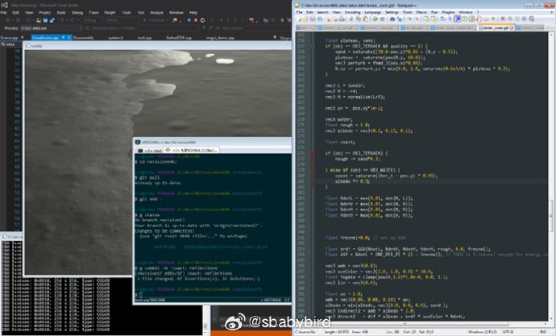

intro 这个名字来自 “crack intros”这个概念。

早期的一些破解程序自带一些介绍内容，并以 demoscene（实时计算机图像和音乐表演） 的形式进行展现（炫技）。

久而久之，这些非常小的（一般小于等于 64k 字节）demoscene 程序就被称为 intro 了。

很多人第一次观看这种演示场景的时候会被其绚丽的视觉效果和优美的音乐所吸引，当知道它的可执行文件是如此紧凑微小时更是感到无比震惊。

不禁好奇是什么样的魔法才能造就这样的程序。

[《怎样制作一个 64k intro》](https://www.lofibucket.com/articles/64k_intro.html)介绍了制作一个这样的程序所需要的完整流程。

包括怎样设计剧情、选用工具、压缩代码、音效制作、合成等等。

文字列举了多个十分优秀的 intro 作品作为举例，介绍了它们从构思到实现的过程。

### 256 个字节创造一座城市


```html
<canvas style=width:99% id=c onclick=setInterval('for(c.width=w=99,++t,i=6e3;i--;c.getContext`2d`.fillRect(i%w,i/w|0,1-d*Z/w+s,1))for(a=i%w/50-1,s=b=1-i/4e3,X=t,Y=Z=d=1;++Z<w&(Y<6-(32<Z&27<X%w&&X/9^Z/8)*8%46||d|(s=(X&Y&Z)%3/Z,a=b=1,d=Z/w));Y-=b)X+=a',t=9)>
```

以上这段代码，使用光线追踪技术在 Web 页面的 Canvas 画布上显示了一个城市的场景。

打开你的记事本，将这段代码保存到一个扩展名为 html 的文件里，即可用浏览器加载它了（稍等几秒钟后就能看到图像）。

其作者在[这篇文章中介绍了实现原理及思路](https://frankforce.com/city-in-a-bottle-a-256-byte-raycasting-system/)。

> 这个惊人的程序在非常小的空间中使用了许多不同的概念，理解它有点像解决一个难题。有几个主要部分，包括 html 代码、帧更新循环、渲染系统、光线投射引擎和城市本身。
> 你可能认为需要一些高深的数学才能解开这个谜团，但实际上不是，代码相当简单，只使用基本代数，甚至没有使用任何三角函数。尽管有一些技巧可以让所有东西结合在一起，并取得令人印象深刻的结果。

## 资源
### 开源单片机固件
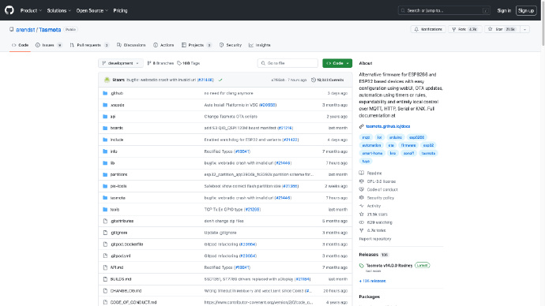

[Tasmota](https://github.com/arendst/Tasmota)，这是一个为 ESP8266 和 ESP32 设备提供的替代固件，通过 WebUI 进行简单配置，支持 OTA 更新，定时器或规则实现自动化，可通过 MQTT、HTTP、串口 或 KNX 进行本地控制。

相比其他竞品，Tasmota 易于安装，提供固件二进制文件下载，并支持平台化开发。

### 开源项目，从零开始写浏览器
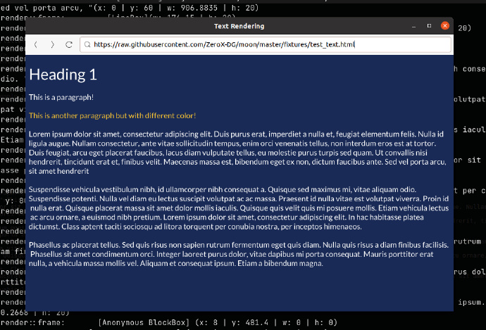

[moon](https://github.com/ZeroX-DG/moon)，这是一个使用 Rust 从头开始​​开发的 Web 浏览器。为了契合“从头开始制作”的精神，浏览器的开发尽可能避免使用外部库。 
同时作者在他的博客上用[系列博文介绍了开发过程](https://viethung.space/blog/tags/browser-from-scratch/)

### 开源项目，从零实现 llama3
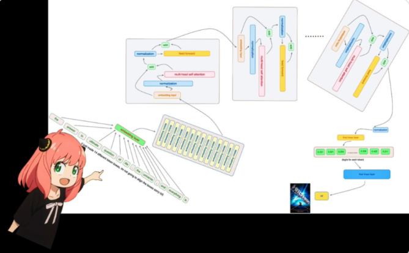

一个月前，Meta 发布了开源大模型 llama3 系列，在多个关键基准测试中优于业界 SOTA 模型，并在代码生成任务上全面领先。

此后，开发者们便开始了本地部署和实现，比如 llama3 的中文实现、llama3 的纯 NumPy 实现等。

Github 上有位名为「Nishant Aklecha」的开发者发布了[一个从零开始实现 llama3 的存储库](https://github.com/naklecha/llama3-from-scratch)，包括跨多个头的注意力矩阵乘法、位置编码和每个层在内都有非常详细的解释。

跟随项目，作者最终会教你从零实现一个 llama3 模型。

### 开源项目，从零开始实现一套 CAD
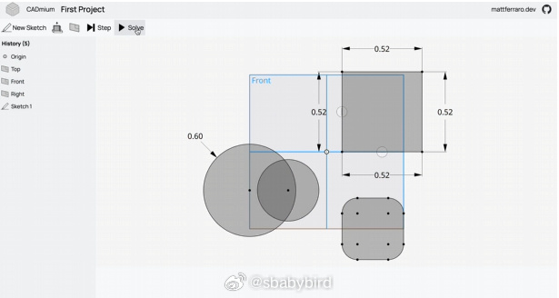

[CADminum](https://github.com/MattFerraro/CADmium)，一个值得关注的开源项目。

作者希望使用 Rust 重写一个开源 CAD 设计软件（基于 Web WASM 技术）。

这是一项巨型工程，其难度接近“操作系统”、“Web 浏览器”级别。

作者在[这篇文章里分析了当前技术格局，以及介绍了他为什么这做](https://mattferraro.dev/posts/cadmium)。

我很喜欢作者在讲解技术时用汽车品牌来进行做比喻，诙谐并比较贴切。

> Parasolid 是 b-rep 内核的凯迪拉克凯雷德，它巨大、昂贵，它提供了您可以要求的所有便利设施以及您没有要求的一堆便利设施。

> 唯一流行的开源 b-rep 内核是 OpenCascade，它是 b-rep 内核的庞蒂亚克 Aztek，它很丑陋，可能会在你身上崩溃，但它能开，而你也可以免费获得一个。

> SolveSpace（Blender 所使用的几何引擎） 是一辆嘟嘟车，因为它是由一个人在车库里建造的，它用很少的东西做了很多事情，但如果你眯着眼睛，它看起来就像一辆汽车。

### 可以绕过反爬检测的 Python 库
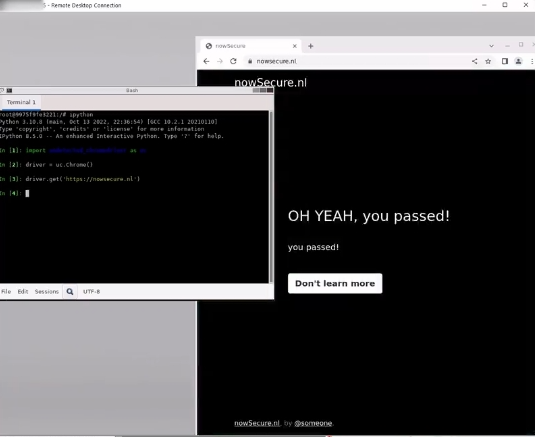

[undetected-chromedriver](https://github.com/ultrafunkamsterdam/undetected-chromedriver)，这是一个经过优化的 Selenium WebDriver 补丁，专门用于防止浏览器自动化过程中，触发反机器人机制。它能够隐藏浏览器特征（指纹），使用起来十分方便，就像一个 Python 的第三方库一样。

### 实时流式数字头像
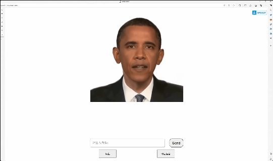

[Vach](https://github.com/Hujiazeng/Vach)，实时流式数字头像，实现音视频同步对话，基本达到商用效果，支持文本和语音交互，适用于直播间业务和展厅显示屏互动。

### 一个在线拨弹的竖琴
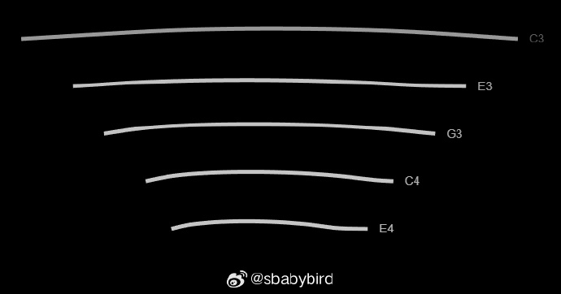

[spiel](https://string.spiel.com/)，这个网站提供了一个在线竖琴，使用极简的界面让你用鼠标演奏；

默认提供了 1645（C、Am、F、G） 四个和弦，即使不懂弹琴，也可以一遍扒拉一边弹唱流行歌曲了（使用 1645 走向的流行歌曲太多了）。

当然你也可以使用编辑功能，定制自己的琴弦排布。

## 订阅
这里会不定期分享我看到的有趣的内容（不一定是最新的，但是有意思），因为大部分都与机器有关，所以先叫它“机器文摘”吧。

Github仓库地址：https://github.com/sbabybird/MachineDigest

喜欢的朋友可以订阅关注：

- 通过微信公众号“从容地狂奔”订阅。


- 通过[竹白](https://zhubai.love/)进行邮件、微信小程序订阅。

