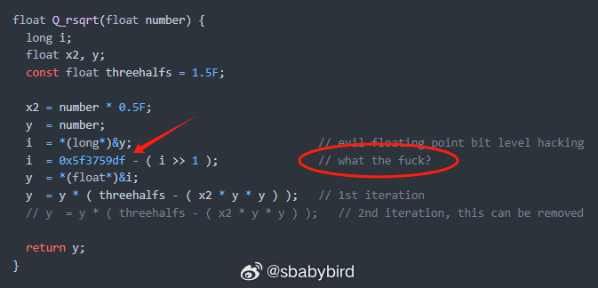
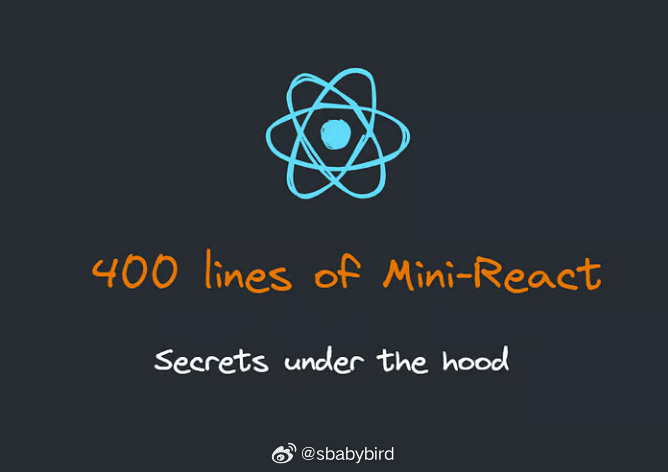
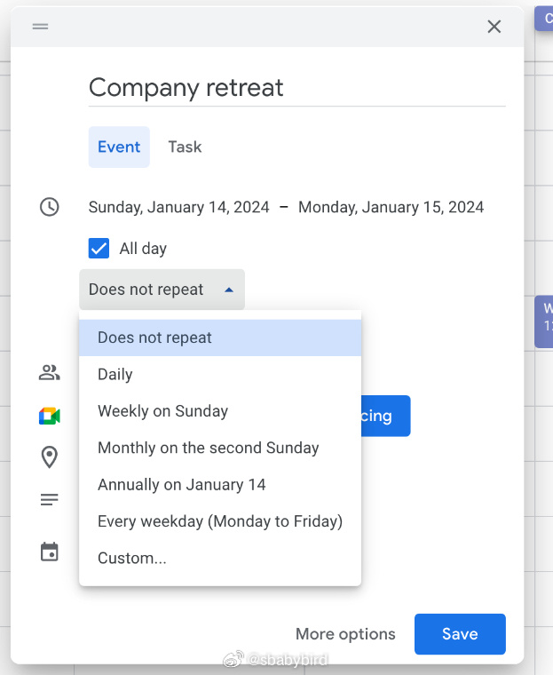
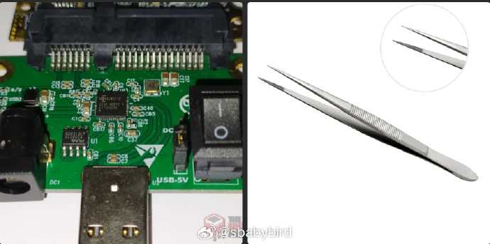
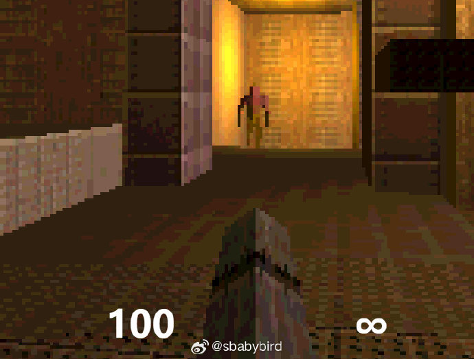
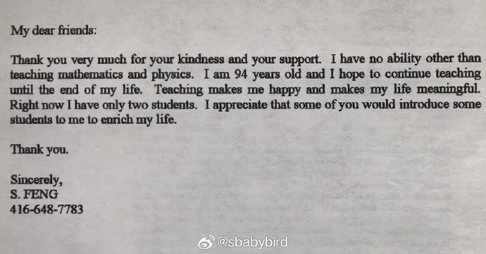
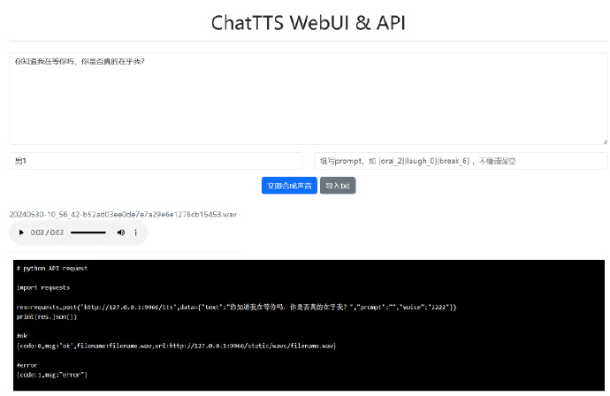
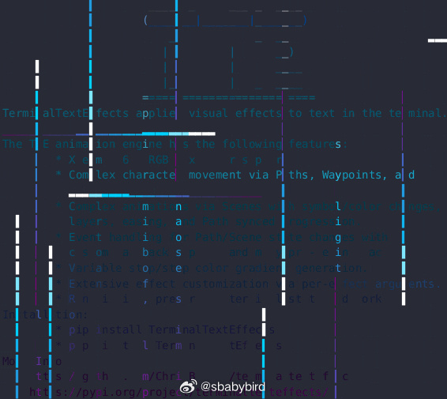
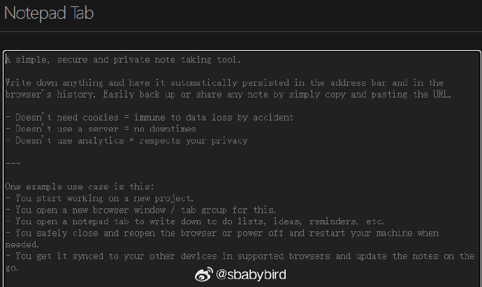

# 机器文摘 第 085 期

## 长文
### 没有硬件加速的年代，怎样快速求平方根

约翰卡马克当年在编写 Quake （雷神之锤）时，找了一个快速求平方根的算法，极大地提升了当时依赖 CPU 进行 3D 图形渲染的速度。

不过卡据马克自己说，这个算法他也是抄来的，并且当时也没有真正理解代码中出现的那一串神奇的魔术数字`0x5f3759df`（还在代码注释里写了句 WTF）。

这篇[《关于快速求平方根倒数算法的一切》](https://github.com/francisrstokes/githublog/blob/main/2024/5/29/fast-inverse-sqrt.md)，给出了该算法从数学层面的解释。

详细解释了那串魔术数字`0x5f3759df`的由来。

要想弄明白该算法的原理，既需要了解计算机存储浮点数的原理，又要具有一定的数学知识。

看完之后，忍不住赞叹，发明这个算法的人简直是个天才。

因为该算法直接利用了计算机存储浮点数的方式（1位符号位，8位指数位，23位有效数字位）以及指数值与平方根算法的猜测值之间的关系，给求平方根这件事巧妙地增加了“硬件级别的加速”。

### 400 行代码实现一个 React.js

如果你是一个前端工程师，你可能已经使用 React 一段时间了，但可能还不知道它的工作原理。

[《Build Your Own React.js in 400 Lines of Code》](https://webdeveloper.beehiiv.com/p/build-react-400-lines-code)一文作者发布了一个项目，[使用 400 行 js 代码实现一个自己的 React 框架](https://github.com/ZacharyL2/mini-react)（具有 React 的核心能力）。

文章从 JSX 的概念讲起，逐步实现了一个渲染网页元素 Render 渲染器。

由于只实现核心功能，所以代码很简练，便于理解背后原理。

### 通过一个真实的项目学习数据库表设计

[《Database Design for Google Calendar: a tutorial》](https://kb.databasedesignbook.com/posts/google-calendar/)是一篇关于数据库设计的教程。

旨在展示如何为一个具有相当复杂性的现实世界项目（Google日历的克隆版）设计数据库表。

通过阅读本文，可以跟随作者一步步构建起一个功能完备的 Google日历系统克隆版，从概念到实现，每个细节都经过精心打磨。

对于从模糊的需求概念到系统设计这类任务，本文提供了一种全新的、以最小化建模为核心的设计方法论。

### 通过降低固态硬盘容量以增加其读写寿命

固态硬盘（SSD）的 QL C和 SLC 是指不同的闪存技术，它们根据存储单元中可以存储的数据位数来区分。

QLC（Quad-Level Cell） 中，每个存储单元可以存储 4 位（bit）的数据，即 2 个比特（bit）的信息。与之前的技术相比，QLC 提供了更高的存储密度，这意味着在相同的物理空间内可以存储更多的数据。QLC技术的一个优点是成本较低，因为它能在更小的空间内存储更多数据。然而，QLC闪存的写入寿命和性能通常低于SLC和MLC闪存。QLC SSD通常适合于对写入次数要求不高的应用场景，例如大容量数据存储。

SLC（Single-Level Cell） 中，每个存储单元只存储 1 位数据。SLC 闪存因其较高的写入寿命和更快的读写速度而受到青睐，但成本相对较高，且存储密度较低。SLC SSD通常用于需要高性能和高可靠性的应用，例如服务器、高端个人电脑和其他对性能要求极高的场景。

我一直以为这种颗粒生产出来就是固定形式的了，但有一篇文章刷新了我的认知。

[通过降低固态硬盘容量以增加其读写寿命](https://theoverclockingpage.com/2024/05/13/tutorial-transforming-a-qlc-ssd-into-an-slc-ssd-dramatically-increasing-the-drives-endurance/)，这篇文章介绍了一种方法，通过重新开卡的方式（指对新的SSD进行初始化设置，使其能够被操作系统识别并使用的过程，应该就是低级格式化），将固态硬盘颗粒从 QLC 改为 SLC，增加硬盘读写寿命的方法。但同时也牺牲了容量。

文章里，作者将一块固态硬盘从 500G 改为 120G 容量，但擦写寿命预期从原有的 120TB 提升到了 40000TB（增加了 33 倍）。

## 资源
### 运行在浏览器里的雷神之锤

[q1k3](https://js13kgames.com/entries/q1k3)，运行在浏览器里 13k 大小的雷神之锤。

### 又一个在线学习 CSS 布局的小游戏

[cssgridgarden](https://cssgridgarden.com/)，一个专门学习 CSS Grid 布局的小游戏，通过编写 CSS 代码来通过关卡。

### 94 岁的视频 UP 主

在油管上看到一个数学UP主，讲解细致入微，步骤详尽（从来不略），更难得的是他已经94岁高龄，且以教育和传授知识为人生意义，实在让人敬佩。

账号为 [@ycmathematicsphysicsandche5659](https://www.youtube.com/@ycmathematicsphysicsandche5659)

### 开箱即用的 ChatTTS 安装包

最近爆火的 TTS 项目 ChatTTS，开源社区有位大佬为它创建 Web 界面和 API 接口。

提供了网页中使用 ChatTTS 合成语音及 API 接口服务，支持 Windows、Linux、macOS 部署。

其中 Windows 用户可直接下载安装包，一键安装开箱即用！

GitHub：https://github.com/jianchang512/ChatTTS-ui

### 好酷的终端动画效果库

[showroom](https://chrisbuilds.github.io/terminaltexteffects/showroom/)，一个在文字终端靠字符颜色渲染动画效果的库。

### 浏览器自动化插件

[Automa](https://github.com/AutomaApp/automa)是一款浏览器扩展，通过连接模块实现浏览器自动化，能够自动填表、执行重复任务、截图和抓取网站数据。

可以像 comfyui 一样在 chrome 中自定义创建能自动完成某种工作的网页工作流。

### 一个有趣的网页笔记本

[notepadtab](https://notepadtab.com/)打开后是一个极简的笔记编辑框，直接输入任意内容即可。

巧妙的是，这个页面会根据输入内容自动更新 URL 地址。

也就是说输入内容记录在了 URL 里，可以随时收藏、拷贝、转发。

如果你把它保存在浏览器的收藏夹里，而浏览器又可以同步收藏夹的话，那就真正做到了“云”同步了。

## 观点
### 健康地获取信息与健康饮食同样重要
最近打算把睡前刷 B 站的习惯也给戒掉。

过量的信息输入会带来焦虑，因为到处都是看到别人在输出、在表达，给自己的精神带来了无形的压力。

应该进一步降低信息输入量和速度。

打个不太贴切的比方，信息整理和输出是你在锻炼精神肌肉，而大量垃圾信息（刷视频、刷新闻）就像垃圾食品只能带给你脂肪，脂肪一旦多起来就危害健康了。

健康地获取信息与健康饮食同样重要，在信息时代的今天，前者甚至更容易带来风险，毕竟健康饮食人人都知道，而信息获取习惯则还没有足够引起人们的重视。

### 最早的信息注入攻击
现在想想，马三立那段经典的《逗你玩儿》，里面那个贼算是我国最早使用“[注入攻击](https://zh.wikipedia.org/zh-cn/%E4%BB%A3%E7%A2%BC%E6%B3%A8%E5%85%A5)”的人了吧。 ​​​

## 订阅
这里会不定期分享我看到的有趣的内容（不一定是最新的，但是有意思），因为大部分都与机器有关，所以先叫它“机器文摘”吧。

Github仓库地址：https://github.com/sbabybird/MachineDigest

喜欢的朋友可以订阅关注：

- 通过微信公众号“从容地狂奔”订阅。

- 通过[竹白](https://zhubai.love/)进行邮件、微信小程序订阅。

