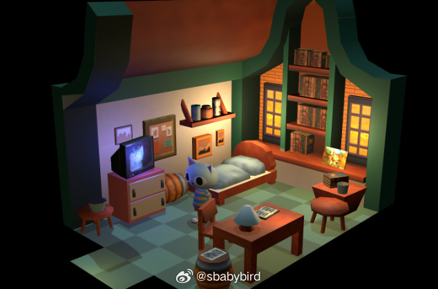
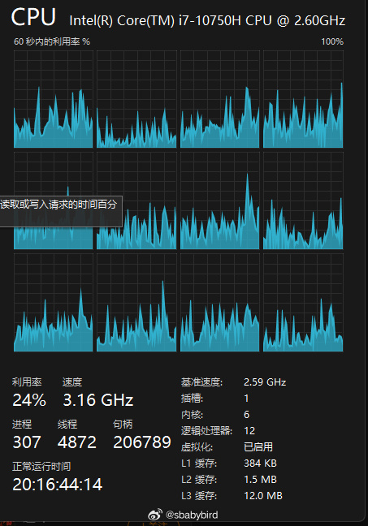
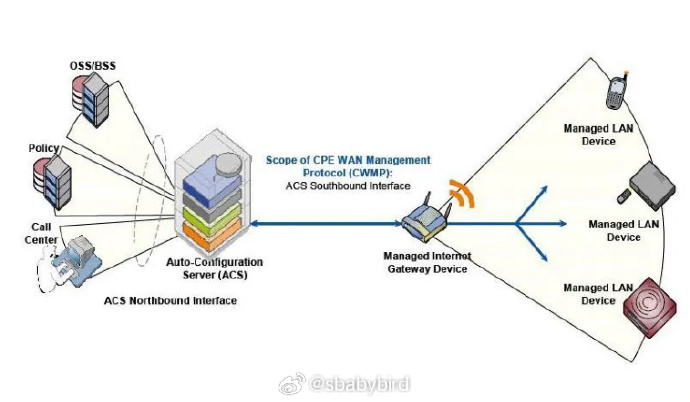
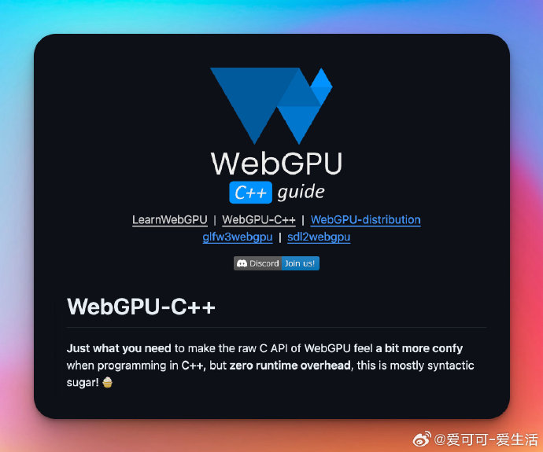
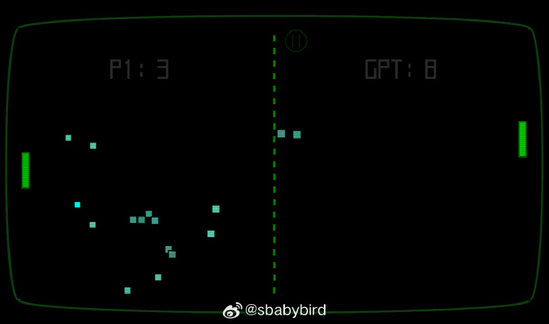
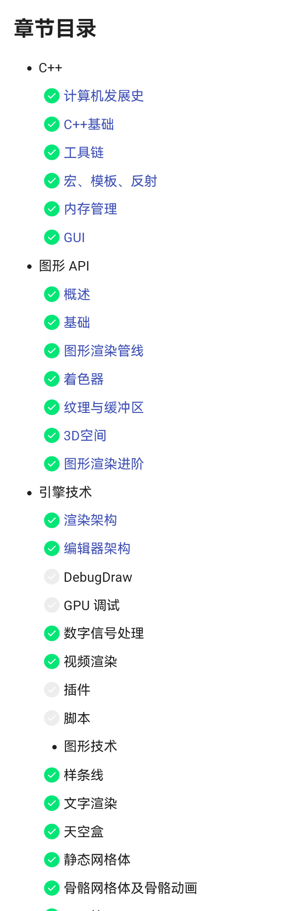
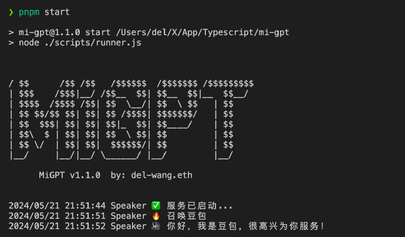
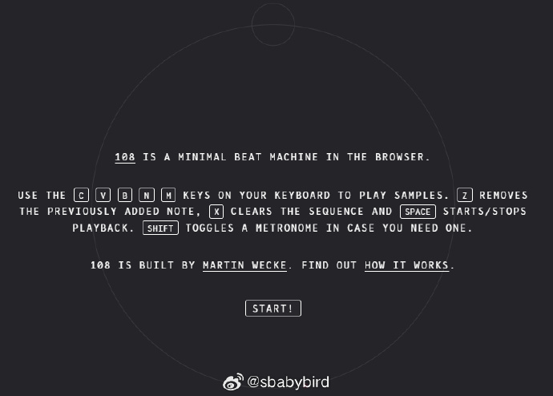

# 机器文摘 第 086 期

## 长文
### 用三个月时间做一个游戏引擎

游戏编程、图形编程总是那么迷人，但是对于初学者来说往往不知该从何处下手。

有句话叫读万卷书不如行万里路，学习一项技能最好的方法就是动手去做。

不用设想一步到位或者找到一条完美的训练路径，或者做好了十足准备再去动手，那样你可能永远也无法入门。

这篇[《我是怎样学 Vulkan 编程的》](https://edw.is/learning-vulkan/)文章作者便是十足的行动派，在 0 经验的情况下，三个月撸了一个还算凑合的游戏引擎。

在本文里作者详细记录了学习过程和经验，对于想涉猎游戏图形编程的人来说，是一份不错的参考（也是激励）。

主要内容如下：
1. 要学习的基础知识：OpenGL 。

2. 一些需要避免的陷阱：不要试图做一个全能的东西。

3. 选择合适的图形 API：根据你希望运行的平台决定，目前在 Windows + Linux 开发跨平台小游戏似乎 Vulkan 是首选。WebGPU 也可以，但是目前标准还不够稳定。

4. Vulkan 学习资料。

5. 引擎架构设计。

6. 学习心得：主要是踩的坑。

### CPU 的缓存为什么要分级？

现代 CPU 一般把缓存分为 3 级，L1、L2、L3，容量依次增加，速度依次降低。

有网友询问，为什么不能把一级缓存做得跟三级缓存一样大，然后去掉后面两级不就行了吗？

答案是不行，[这篇文章给出了解释](https://fgiesen.wordpress.com/2016/08/07/why-do-cpus-have-multiple-cache-levels)。

简单来说：

1、想象一下，你是公司的CEO，你负责处理所有的决策和任务。但你不可能记住每一个细节，所以你需要一个助手团队来帮助你。

2、你的办公桌抽屉（L1缓存）是最方便的，里面放着你经常需要快速查阅的文件和信息。当需要做出快速决策时，你可以直接从抽屉里拿文件，这非常快。

3、但是，抽屉的空间有限，不能放太多东西。所以，你还有一个更大的文件柜（L2缓存），它就在你的办公室里，虽然不如抽屉那么快，但比去公司的档案室（主存储器）要快得多。

4、如果文件不在抽屉或文件柜里，你就得去档案室（L3缓存或主存储器）查找，这需要更多的时间，但档案室可以存储大量的文件和信息。

回到最初的问题，如果把 L1 做的跟 L3 一样大行吗？

如果做那么大，他就不是抽屉了（L1）了，你也不可能在一个像房间那么大的抽屉里快速去到想要的东西。

### 当心你的 Wifi 路由被安装后门

有一个名叫 Sam 的电脑高手，在家里的网络中尝试进行一项秘密任务：利用一个漏洞从一台服务器上窃取文件。

为了这个任务，他启动了一个小型的网络服务器，用来接收那些偷偷摸摸的数据。

但是，当他测试自己的服务时，一件奇怪的事情发生了。

日志文件显示，有一个神秘的“访客”几乎在他发送测试信息的同时，就复制并发送了完全相同的信息。

这就像是有人悄悄地站在 Sam 的肩膀上，看着他的每一个动作，然后迅速模仿。

Sam 感到非常困惑，心想：“这真是太奇怪了，难道我的电脑被黑客入侵了吗？”于是，Sam 决定用他的 iPhone 再试一次，结果发现那个神秘的IP地址又出现了，就像是一个看不见的影子，紧紧跟随着他的每一个网络请求。

Sam 开始调查这个神秘的 IP 地址，就像侦探追踪罪犯一样。他发现这个 IP 地址属于一个叫 DigitalOcean 的公司，而且与一些可疑的网站有关联，这些网站曾经被用来进行网络钓鱼攻击。Sam 意识到，这个 IP 地址可能是一个网络犯罪团伙的老巢。

时间飞逝，三年后的一次度假中，Sam和一群网络安全专家朋友聊天时提起了这件事。

他们决定像一群网络世界的探险家一样，深入挖掘这个谜团。

他们发现了一个模式，表明可能有恶意软件使用特殊的技巧来隐藏自己的行踪。

Sam 进一步探索了一种叫做 TR-069 的神秘协议，这是互联网服务提供商用来远程管理用户的网络设备的后门。

他发现了一个巨大的安全漏洞，这个漏洞允许任何人通过网络进入并控制 Cox 公司客户的设备，就像是给了黑客一把万能钥匙。

最后，Sam像一个负责任的超级英雄一样，向Cox公司报告了这些漏洞。

Cox公司迅速行动，修复了这些安全问题，阻止了潜在的网络灾难。

看完[这个 Sam 的故事](https://samcurry.net/hacking-millions-of-modems)，我看了一眼我家的 Wifi 路由器（也支持远程控制），我现在觉得它一点儿也不安全。

## 资源
### C 封装的 WebGPU API

[WebGPU-Cpp](https://github.com/eliemichel/WebGPU-Cpp)：为WebGPU原生API提供单文件、零开销、C++风格的封装，使C API在C++编程中更为简洁，主要增加语法糖以减少冗余。

### Pong 游戏的网页升级版

[paddle](https://raould.github.io/pn0gstr0m/)，一个 web 2d 游戏，类似早期的 Pong 游戏，跟计算机对打乒乓球，球速降低了（反应时间增加了），但是球会根据回合次数自动分裂，以对方接不住的球数为己方得分。我玩了一会儿，已加入摸鱼收藏夹。 ​​​

### C++ 开发图形引擎电子书

[《 现代图形引擎入门指南 》](https://italink.github.io/ModernGraphicsEngineGuide/)系列文章适用于有志于从事 C++ 开发的学生，主要技术路线是图形和引擎，对于其他相关方向，前面一些章节也具有参考意义。

> 该系列文章旨在归纳现代图形引擎开发必备的基本技术路线，它并不是一个细致入微的教程，也没有包含太多的高级篇章，这些文章的目的不是为了让读者走捷径，而是为了让初学者 少走弯路 ，把更多的精力放在更高级的理论技术上面，在此之前，读者至少要达到一个这样的境界 — I can do anything if I want

> 在这些文章中，你能学到：
> 🌟现代C++开发工作流 ：工具链、平台、内存、库、宏、模板、反射。
> 🌟GUI及工程架构
> 🌟现代化的图形API ：是Vulkan，还是DX12、Metal呢？哦，都不是，但包您满意，拭目以待。
> 🌟Unreal Engine 5

### 用 GPT 把小爱音箱变成 AI 语音助手

[MiGPT](https://github.com/idootop/mi-gpt)，旨在将小爱音箱打造成你的专属 AI 语音助手。

> 通过该项目，你可以将小爱音箱和米家智能设备与 ChatGPT 的理解能力完美融合，打造成一个懂你、有温度与你共同进化的家。
> 
> 项目亮点：
> - LLM 回答：通过接入 ChatGPT 等大模型，让你的小爱音箱变身聊天高手。
> - 角色扮演：一秒调教小爱，成为你的完美伴侣或贴心闺蜜。
> - 流式响应：可快速响应你的指令，对你的爱意秒回。
> - 长短期记忆：记住与你每一次的对话，越聊越默契。
> - 自定义 TTS：可接入豆包同款音色替换小爱同学的语音。
> - 智能家居 Agent：根据你的心情为你播放喜欢的音乐，调节灯光，逗你开心。

### 在线鼓机

[108](https://martinwecke.de/108/)，这个网站提供了一个在线鼓机，具有 5 个经典采样。

可以帮你快速制作一组 beat 节奏，并导出 wav 文件到本机。

作者开放了其源码：https://github.com/hatsumatsu/108 ​​​

## 观点
### 用与学
所有的工具，都是在实际项目中边用边学才掌握。

不存在单独的课程去把它训练好，那样即使当时会了过了也忘。

工具类的技能，跟语文数学这种基础知识有些不同。工具类技能非常侧重于在实际项目上的练习。

不要想着找个时间像上课那样专门把他学好，应该拿起就用，在实际的 project 中反复使用，直到烂熟于心。

推荐这个项目列表：https://github.com/practical-tutorials/project-based-learning

## 订阅
这里会不定期分享我看到的有趣的内容（不一定是最新的，但是有意思），因为大部分都与机器有关，所以先叫它“机器文摘”吧。

Github仓库地址：https://github.com/sbabybird/MachineDigest

喜欢的朋友可以订阅关注：

- 通过微信公众号“从容地狂奔”订阅。

- 通过[竹白](https://zhubai.love/)进行邮件、微信小程序订阅。

