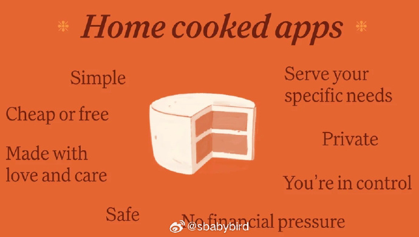
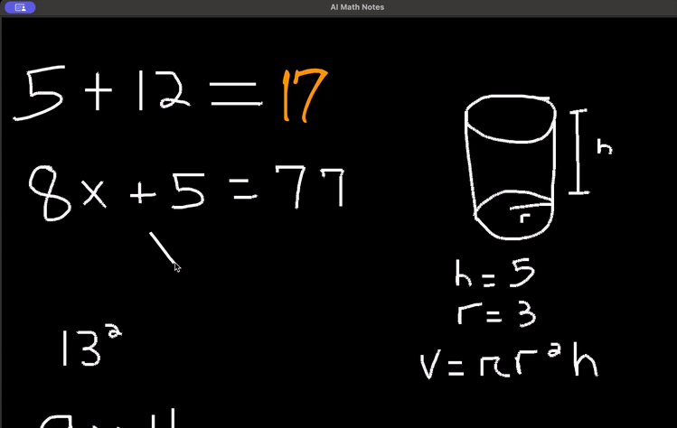
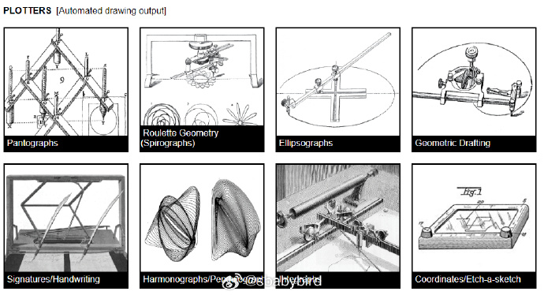
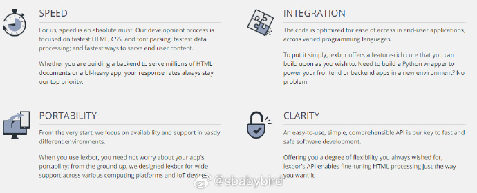
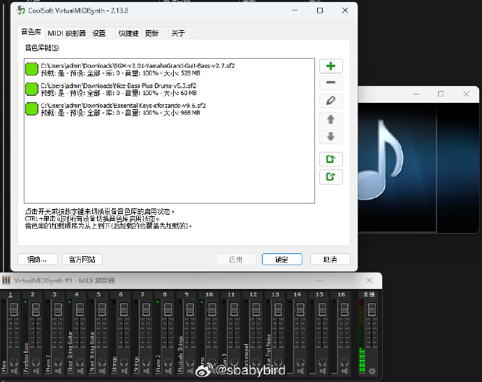
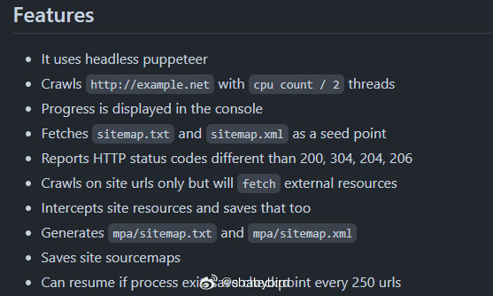

# 机器文摘 第 087 期

## 长文
### 家常软件和赤脚程序员

在端午假期这几天，我在 chatGPT 的帮助下给老婆写了一个浏览器插件，它的功能只有一个，将网页中任何图片上的字给扣出来。

写的过程虽然不算轻松，但受益于 AI 技术的强大，在写代码方面不用动用太多脑力，很多不熟悉的 API 或者方法调用，都可以借助 AI 实现。

从使用结果上来看，老婆十分满意，而且有一种尊贵 VIP 的感觉。

*这款插件目前过于简陋，我暂时还无法将其上架至插件商店。*

我还没来及给这样的软件下定义，今天就看到一个有意思的名词，“Home cooked app”————家常软件。

像“家常菜”那样的家常软件，虽然不像饭店里的那样具有商业价值，但是是你亲手端出来的，别有一番风味。

[《home-cooked-software》](https://maggieappleton.com/home-cooked-software)，是一篇演讲记录，作者提到了家常软件这个概念，并且表达了对于其发展的个人预判。

作者认为，随着 AI 能力的提升，软件开发的门槛急速降低，人们对于这种以前“不好意思提出的极度个性的需求”将迅速膨胀。

“家常软件”开发者将越来越多，并且进入一个黄金时代。

作者甚至参考中国上世纪 60 年代的“赤脚医生”概念，创造了一个“赤脚开发者”称谓。

演讲内容值得一看，摘抄部分有趣的观点如下（坦白说，我觉得作者有些过于乐观了）：

1. 使用专业软件就像是餐厅专业厨师制作的一顿饭或蛋糕，可能比家常的好吃多了，但是你无法控制它的制作方式，以及他们在里面放了多少黄油。

2. 商业的标准化软件是由不太了解我们的人为我们制作的。

3. 工业软件的定位迫使它们不可能满足小众需求。

4. 这个世界充满了需要解决的问题。虽然并非所有这些问题都有软件形状的解决方案，但其中有一大堆问题。

5. 将工具和逻辑链接在一起的架构使语言模型比其他方式更强大，最终能够在我们现有的编程环境中完成相当复杂的任务。

6. 这些人（指赤脚开发者）深深植根于他们的社区，因此他们了解周围人的需求和问题。因此，他们完全有能力解决本地问题。

### 史上最好的屏幕保护程序

这里有个故事[讲述了 Windows NT 屏保 "3D Pipes" 的诞生](https://gizmodo.com/you-can-now-enjoy-the-best-screensaver-of-all-time-in-y-1847738622)。

当时 Windwos NT 3.5 首次实现了对 OpenGL 的完整硬件加速支持，但苦于没有什么程序可以展示这个牛逼特性。

于是他们在内部团队搞了一个编程竞赛，谁能写的程序被投票最多，就把它加入到系统自带的屏幕保护程序中。

之所以要作为屏幕保护程序推出，主要是出于安全考虑，因为一旦程序出毛病倒不至于给系统带来太大麻烦，告诉用户先别用那个屏保即可。

于是诞生了一组酷炫的、发挥 OpenGL 图形优势的程序，其中包括：3D 文本、3D 迷宫、3D 飞行物，以及本文主角：3D Pipes。

文章最后还提供了[一个在线体验该屏保的地址](https://1j01.github.io/pipes/)。

## 资源
### 苹果的 “备忘录数学计算器” 开源版

苹果 WWDC 2024 大会上，在 iPad 上演示通过键入或手写数学表达式后，利用 AI 可立即呈现解答结果。

在 GitHub 上发现有一个开源版 [“AI Math Notes”](https://github.com/ayushpai/AI-Math-Notes)，完美实现类似的功能。

这是一款用 Python 语言开发的交互式绘图应用，允许你在画布上绘制数学方程，再使用多模态 LLM 来计算并在旁边显示结果。

### xv6 中文文档

xv6 是 MIT 开发的一个教学用的完整的类 Unix 操作系统，并且在 MIT 的操作系统课程 6.828 中使用。通过阅读并理解 xv6 的代码，可以清楚地了解操作系统中众多核心的概念，对操作系统感兴趣的同学十分推荐一读！这份[中文翻译的 MIT xv6 文档](https://th0ar.gitbooks.io/xv6-chinese/content/index.html)是阅读代码过程中非常好的参考资料。

### 古老的绘图设备收藏

[DrawingMachines.org](https://drawingmachines.org/)，是一个专注于收集和记录光学、机械和自动化绘图机器、设备、辅助工具和仪器的档案网站。

目标是揭示那些被遗忘、过时或不熟悉的绘图技术，记录艺术与技术之间关系的历史，并尝试揭示他们的原理。

去看一下在没有计算机的时代，人们是怎样作出精美的图形的吧。

### 无需 flash 插件的小游戏网

[1u9u](https://1u9u.com/)，1.8 万个 flash 小游戏。不需要安装 flash 插件，直接在线玩。

每个游戏均有截图。

使用 [ruffle](https://ruffle.rs/) 模拟 flash 插件。 ​​​

### 一个干净的，从零开始编写的 HTML 渲染库

[lexbor](https://github.com/lexbor/lexbor)，一个开源的 HTML 渲染库。

对于有志于浏览器开发的程序员（在下佩服！），这个库可以看一下，是一个完整的 HTML 渲染引擎，而且十分简洁。

主要特点：

- 纯 C 语言实现，速度快，支持 C99。
- 没有任何外部依赖。
- 模块化设计，每个模块相对独立，可单独使用。

### 一个超好的 SooundFonts 资源站

发现一个超级好的 [SoundFonts](https://baike.baidu.com/item/Sound%20Font/3442190) 资源站[soundfonts4u](https://sites.google.com/site/soundfonts4u/)。

SOUNDFONT，顾名思义，就是“声音字体”。文件扩展名为 *.SF 或 *.SF2。 它是由新加坡创新公司 Creative Technology 在中档声卡上 (EMU SoundBlaster)使用的音色库技术（现在用的较少了）。

但是这项技术十分牛逼，可以做到用很逼真的音色来播放 MIDI 歌曲，虽然现在随着网速的增加，大家已经在线可以听无损音乐了，但是 MIDI 有它自己的韵味儿。

soundfonts4u 这个网站里提供了很多优质的 sf 格式的音色库，最大的竟然高达 968MB，当然不敢用创新声卡加载了，但是网站也提供了软件用于加载音色。

希望在电脑上播放高品质 MIDI 音乐的朋友绝对要收藏。

### 把网站保存在 zip 包里

[map-archive](https://github.com/potahtml/mpa-archive)是一个运行在 node.js 环境的爬虫工具，可以将多页面网站保存到本地的 zip 包里，并且重新通过这个 zip 包在本地进行发布站点。 

## 观点
### 人们只想回到过去
人们对旧时的物件、文艺作品、甚至演员艺人，往往都会加上一层美化滤镜，不由自主地觉得越古老就越“正宗”、“功夫越深”，并深切鄙视当下。

造成这种行为的根本原因在于，生命对于时间之箭的无能为力，人几乎从一出生开始，就拼命地想回到过去。 ​​​

## 订阅
这里会不定期分享我看到的有趣的内容（不一定是最新的，但是有意思），因为大部分都与机器有关，所以先叫它“机器文摘”吧。

Github仓库地址：https://github.com/sbabybird/MachineDigest

喜欢的朋友可以订阅关注：

- 通过微信公众号“从容地狂奔”订阅。

- 通过[竹白](https://zhubai.love/)进行邮件、微信小程序订阅。

