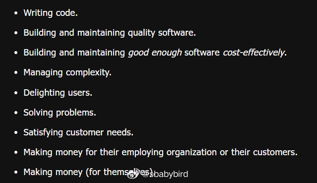

# 机器文摘 第 088 期

## 长文
### 通过重新定义问题来降低本质复杂性

在《人月神话》里，把复杂性分为两种：

1. 本质复杂性（Essential Complexity），指的是你要解决的问题本身的复杂性，是无法避免的。
2. 附属复杂性（Accidental Complexity），是指我们在解决本质问题时，所采用的解决方案而引入的复杂性。

书中提出了十分经典的，具有长久影响力的那句话：“没有银弹”：指的是软件本质的复杂度是无法避免的。

然而，作为一名软件工程师，要懂得质疑。

这篇[《关于本质复杂性的笔记》](https://olano.dev/blog/a-note-on-essential-complexity)（原文是西班牙文，后被翻译为英文），就质疑了软件本质复杂性无法降低的观点。

文章认为：
> 即使我们不能仅通过改变软件来消除本质复杂性，但这并不意味着我们对此无能为力。如果我们能够改变问题的定义，或者让世界适应软件，而不是相反，那么软件解决的问题可以重新定义，本质不是一成不变的，而是可以讨论的，是工程师可以工作的一部分。

> 通过重新定义问题，软件工程师的目标可以简化为减少任何类型的复杂性。这涉及到质疑假设、说服利益相关者，并可能需要重新考虑软件系统或组织本身的复杂性。

如果延申思考的话，解决任何问题都可以视为一个管理复杂度的任务。

当你觉得问题麻烦无法解决的时候，有人已经重新定义了该问题。

### 光盘的历史意义

[《光盘简史》](https://www.fastcompany.com/91128052/history-of-cd-roms-encarta-myst)，讲述了CD-ROM技术及其在90年代对数字媒体和互动娱乐的影响，特别是它如何推动了多媒体百科全书和游戏的发展。

文章回顾了CD-ROM作为存储介质的兴起和衰落，以及它在技术史上的地位。

CD-ROM（光盘只读存储器）在90年代初作为新兴的存储技术，以其大容量和快速读取能力，彻底改变了数字媒体的存储和分发方式。

CD-ROM使得丰富的多媒体内容，包括视频、音频和图像，能够被集成到单一的光盘上，为用户带来了前所未有的互动体验。

微软的《Encarta》作为首款CD-ROM百科全书，不仅提供了丰富的信息，还集成了互动功能，标志着传统印刷百科全书向数字媒体的转变。

游戏《Myst》利用CD-ROM的存储优势，创造了一个沉浸式的虚拟世界，成为当时最畅销的电脑游戏之一。

CD-ROM的普及促进了家庭电脑的升级，加速了互联网和在线媒体的发展，为后来的数字时代奠定了基础。

尽管CD-ROM在技术上具有重要意义，但随着更高效存储技术的出现，如DVD和在线流媒体，CD-ROM逐渐退出了主流市场。

CD-ROM时代的产品，如《Encarta》和《Myst》，不仅是技术成就，也成为了90年代文化和技术发展的重要标志，值得被保存和研究。

### 怎样做大数运算？

现在计算机大部分都是 64 位的字长，64 位用于表示整型数字的话，最大可以到 18,446,744,073,709,551,615 

如果超出这个大小，还能算吗？

如果你手头有一个 Python 解释器（C 实现版本），你可以尝试在它的交互命令中输入比较大的数字让他进行运算试试。

你会发现 CPython 可以处理非常大的数字，他是怎么实现的？

[《动手写一个大数计算库》](https://austinhenley.com/blog/bignum1.html)，提供了一种简单易懂的方法。

作者首先翻看了 CPython 的源码，找到了大数处理部分，发现比较复杂（超过 6000 行代码和 100 多个函数）。

然后自己动手写了一个极简的（只支持：比较大小、加、乘运算，不过其它的也好处理）。

核心思路是将数字用字符串存储起来，然后按单个字符为一位进行对应计算。

虽然实现不完整，但是很容易就能理解他的代码思想。

## 资源
### 俄罗斯方块字体

[tetris-font](https://erikdemaine.org/fonts/tetris/?text=hello+world&speed=10)

这个网站可以用俄罗斯方块将你输入的字符拼凑出来，并带有动画效果。

只支持 26 个英文字母，不支持标点符号和其他字符。 ​​​

## 观点
### 程序排错的通用思路
最近指导同事解决了几个他们一度认为不可能解决的技术问题。

给他们信心带来极大提升的同时，我也在思考这背后的统一方法。

实际上整个解决过程我并没有亲自动手。

我只是给他们提供思路。

具体操作和实施都是他们进行的，因为我是通过互联网远程遥控指挥他们。

但是这背后的思想其实都是同一个思想。

那就是“逐步缩小错误发生的范围”。

怎么理解这个？

就是，首先拿出一个基础环境，这个基础环境绝对正常，然后一步一步引入有问题的模块。

先保证一个最小化的正确环境，将所有模块都屏蔽掉，逐渐打开它们，慢慢加到一个出错的临界点。

直到定位到一个模块，一打开，就出错，那么范围就缩小到了这个地方了。

这就是“缩小范围”。

当然我在这里所说的模块。

不一定是一个物理实体。

可能是一个函数、一段代码、一个子系统。

这个方法看似简单。但要在合理的时间合理的地点运用起来，它的力量非常强大。

## 订阅
这里会不定期分享我看到的有趣的内容（不一定是最新的，但是有意思），因为大部分都与机器有关，所以先叫它“机器文摘”吧。

Github仓库地址：https://github.com/sbabybird/MachineDigest

喜欢的朋友可以订阅关注：

- 通过微信公众号“从容地狂奔”订阅。

- 通过[竹白](https://zhubai.love/)进行邮件、微信小程序订阅。

