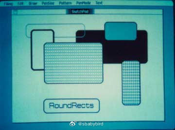
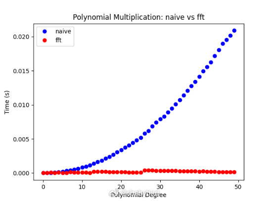
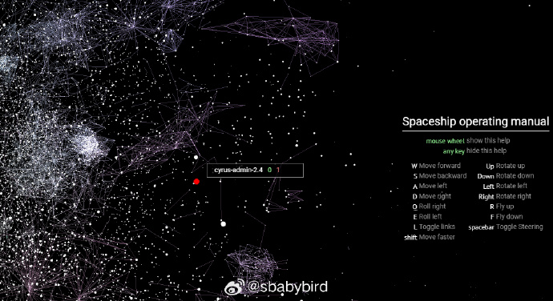
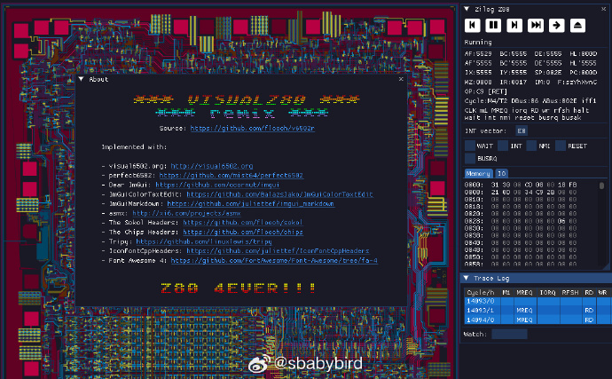
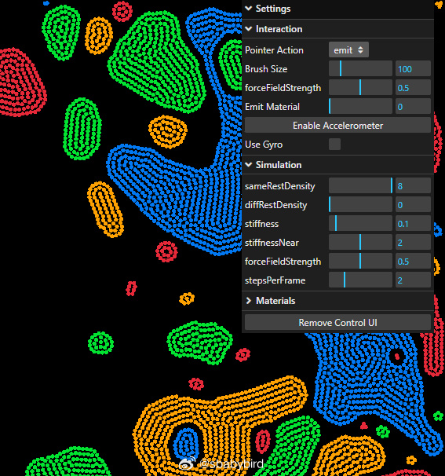
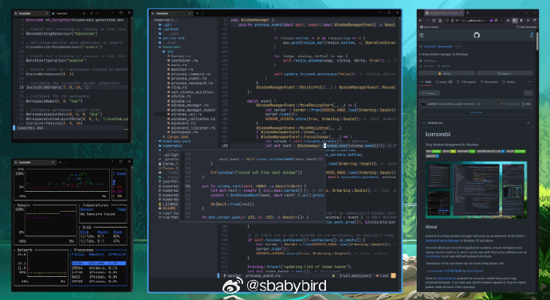
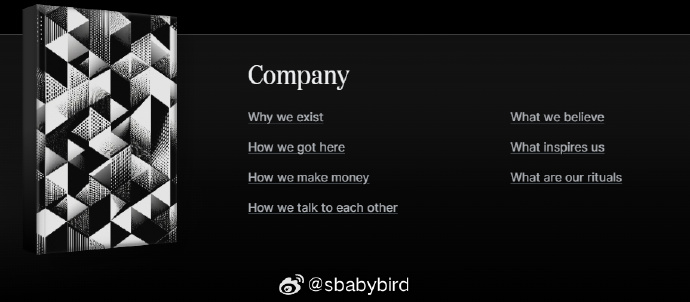

# 机器文摘 第 089 期

## 长文
### 圆角矩形的故事

苹果 Macintosh 电脑的图形界面开发，在早期层遇到过不少的挑战。

怎样快速地绘制“圆角矩形”就是其中一项。

[《圆角矩形无处不在》](https://www.folklore.org/Round_Rects_Are_Everywhere.html)记录了当时（1981年）乔布斯“逼迫”技术人员实现高速圆角矩形绘制的故事。

当时 Macintosh 电脑所用的 68000 处理器在硬件层面并不支持浮点数预算，而绘制圆形或椭圆意味着要大量求解平方根，这是硬件级别的限制。

工程师比尔发明了一个快速绘制圆形和椭圆的算法，不依靠高精度浮点运算，仅仅使用普通的加减法。

当他兴高采烈地到公司进行演示时，并没有获得期望中的赞赏，而是乔布斯还想要自行车：“能不能快速绘制圆和矩形的组合？。。。”

比尔有些失落，并且提出并没有绘制圆角矩形的必要，不过乔布斯不吃这一套，拉着他到大街上溜达了一圈，找出了很多现实中圆角矩形的例子。

最终比尔被说服，回家熬了一个通宵实现了圆角矩形高速绘制的算法。

### 用傅里叶变换加速多项式相乘

不要被标题吓到，[这是一篇很有趣且容易理解的文章](https://www.alvarorevuelta.com/posts/fft-polynomials)。

只要初中数学水平，就知道如何进行多项式相乘：把他们的项分别相乘，然后再将结果加起来，最后合并同类项化简即可。

然而使用上述方法的复杂度会随着多项式的阶数增高而迅速增高（具体来说是：O(n^2))。

这篇文章以科普的方式，介绍了一种将复杂度降低至 O（nlogn）的方法，文章写的算是容易理解，具体要点如下：

1. 多项式可以使用傅里叶变换从“值域”转换为“频域”，如果采用 FFT 快速傅里叶变换算法则复杂度为 O（nlogn）。
2. 转换为“频域”后再进行相乘，其复杂度仅为 O（n），因为这变成了简单的元素相乘。
3. 再将相乘的结果转换为“值域”使用 IFFT 算法的话复杂度仍为 O（nlogn）。

虽然貌似步骤增多了，但是其计算速度得以极大提升（尤其是复杂的多项式）。

那么问题来了，多项式相乘在现实中有什么用吗？

答案是，在很多领域都有重要意义，包括不限于：信号处理、数字通信、计算机图形学、密码学、物理模拟、经济学和金融。

### 可编程字体

原来字体文件可以做这么多事情？

用于 Firefox 和 Chrome 等应用程序的字体整形引擎 HarfBuzz 带有一个可执行 Wasm 整形器，允许使用任意代码来“整形”文本。

然而有人发现它可以做的事情远不止给字体“整形”。

[llama.ttf](https://fuglede.github.io/llama.ttf/)，将一个大语言模型放入到字体文件里，并且可以在所有使用了 HarfBuzz 的软件中体验。

只需选择那种字体，然后键入一串用于激活的魔法字符串，即可开始人机对话。。。

作者还给出了一些用字体所做的有趣的事情，甚至可以用于打游戏。

## 资源
### 用开源代码组成的银河系

[代码星系](https://anvaka.github.io/)，基于各种流行的包管理体系，提取出软件包的信息，制作出类似星系云图的可视化效果。

可以通过键盘鼠标进行交互漫游，有种在太空中飞速遨游的感觉。 ​​​

### 可视化远古 CPU 的运行

[v6502r](https://github.com/floooh/v6502r)是一个将 6502 CPU 内部结构及其运行过程进行可视化的开源项目。

[visualz80remix](https://floooh.github.io/visualz80remix/)，则是基于 v6502r 做了一个在线页面，实时在网页里可视化 z80 CPU 的内部构造和指令执行过程。

注：z80 和 6502 都是上世纪 70 年代生产的经典 CPU，字长均为 8 位，基于它们诞生了一大批经典的、物美价廉的个人电脑。

### 流体模拟

[ll](https://grantkot.com/ll/)，基于 WASM 技术的流体模拟页面 Demo，效果酷炫。可以设置重力加速、粒子颜色等，如果在手机上还能体验通过传感器控制。 ​​​

### 适用于现代 Windows 的平铺桌面管理器

[komorebi](https://github.com/LGUG2Z/komorebi)是一个平铺窗口管理器，可作为Windows 10及更高版本中Microsoft桌面窗口管理器的扩展。

komorebi 允许您使用一个控制台程序来控制应用程序窗口、虚拟工作区和显示显示器，该命令可与第三方软件（如 AutoHotKey）一起使用，以设置用户定义的键盘快捷键。

### 初创公司 Resend 开源了他们公司

[handbook](https://resend.com/handbook)，这里是他们提供的全部手册，涵盖了公司经营理念、用人、技术栈、设计、售后服务、市场营销等运营整个公司相关的全部文档指南。

对于如何运营一个现代化科技初创公司感兴趣的朋友可以了解一下。

Resend 创立于 2023 年 1月份，主打产品是电子邮件相关的效率工具，公司愿景是提升人们的沟通效率。

公司推崇远程办公和线上协作，并严格限制加班时间。

选择将这些信息开源出来，也是对营销方式的一种探索。

## 观点
### 不负责任地猜想
资源过剩的时代，帮人筛选东西应该也是一种刚需。

不一定是物理实体，数字消费品也算。

你帮别人严格把关，严格到极致，就产生了价值。

这样，就连喜欢挑剔的人，也有了创造和输出价值的方式。

不过，需要什么样的渠道呢？大众点评那种恐怕不行，还不够严格。

东方甄选，网易严选这种带货卖货的，又太泛。

应该再垂直一些。

形成某些细分领域的权威。

给现在的网络评测，测评人，恰饭的环境及业务逻辑升升级，不收厂商的钱，改收用户的钱，也许能探索一条新路。

## 订阅
这里会不定期分享我看到的有趣的内容（不一定是最新的，但是有意思），因为大部分都与机器有关，所以先叫它“机器文摘”吧。

Github仓库地址：https://github.com/sbabybird/MachineDigest

喜欢的朋友可以订阅关注：

- 通过微信公众号“从容地狂奔”订阅。

- 通过[竹白](https://zhubai.love/)进行邮件、微信小程序订阅。

