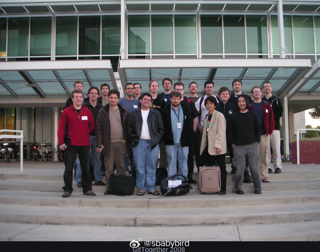
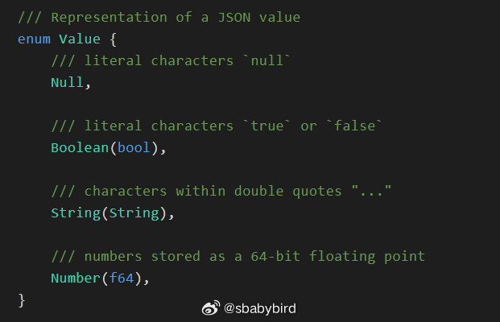
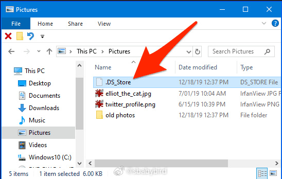
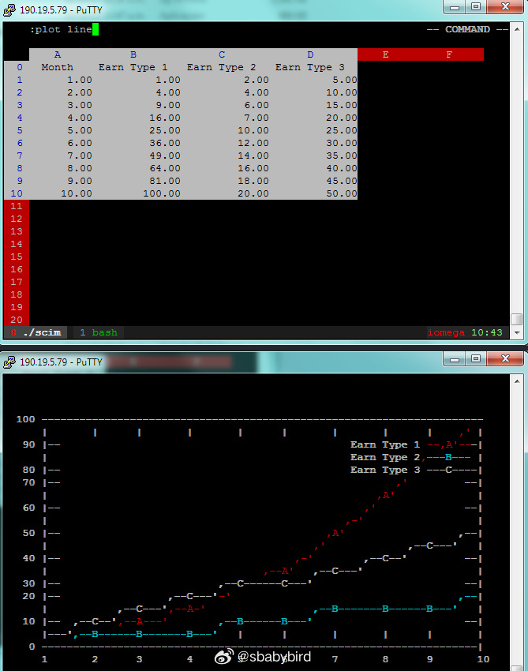
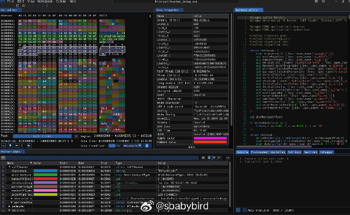
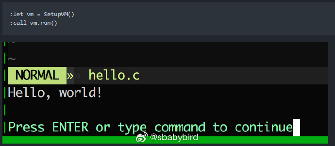

# 机器文摘 第 090 期

## 长文
### Git 的故事

[《Git 的故事：这次没有这么好玩》](https://blog.brachiosoft.com/posts/git/)（文章支持繁体中文和英文两个版本）。

这是一篇真正的长文，长的几乎像一本小书了。

在阅读这篇文章之前，我曾一度认为 Git 就是 Linus 这个大神在某个商用的版本管理工具不让使用之后，一怒之下花了一周时间再次创造的奇迹（上一次是 Linux）。

然而，事实并非如此，Linus 虽然天才，但是也不是那么简单就拿出了 Git，虽然这次仍然体现了他的天才创意在里面，但这个工具的思想已经有了很多前人的经验在里面了。

文章作者可能具有撰写科技传记的经验，故事写的看似平铺直叙，但又生动有趣。

里面再次提到 Linus 所推崇的设计理念：“简单”，好的设计一定是简单的设计。

看完既激励人心，又让人对那些默默无闻的社区贡献者心生敬意。

> Stack Overflow 在 2022 的調查中，Git 市佔率高達 94%，以至於隔年 Stack Overflow 乾脆放棄問大家用什麼版控系統。

> 歷史上從來沒有一個版控軟體能如此稱霸市場，下一個能取代 Git 的會是什麼？不少人說可能會與 AI 有關，但沒人說得準，不過可以確信的是，過程中一定會有一連串的偶發事件和一群傑出的駭客。

### 手把手教你写一个 JSON 解析器

[《实现 JSON 解析 （Rust）》](https://blog.davimiku.com/tutorials/json-parsing-rust-1)，通过从头开始实现 JSON 解析来学习解析器的基础知识。

这篇文章既适合想要入门解析器编写的人，又适合没用过 Rust 但是想看看 Rust 语言怎么样的人。

作者写的非常细心，文章经过精心排版。

连最基础的语法介绍都不放过，看完相当于学习了解析器的编写思路，也熟悉了一下 Rust 语言。

### 使用 JavaScript 模拟 2000 万个粒子

即使在资源有限的情况下，通过创新和优化，也能够达成看似不可能的目标。

[《使用 JavaScript 模拟 2000 万个粒子》](https://dgerrells.com/blog/how-fast-is-javascript-simulating-20-000-000-particles)记录了一位拥有黑客精神的程序员在资源受限的情况下，进行大规模粒子实时渲染的探索故事。

在手机上只用 CPU 的情况下，达到了渲染 100 万个粒子运动 60fps 的帧率。在他的 M1 芯片苹果电脑上达到了 2000 万粒子 20 fps，更高性能的桌面电脑上这个数字可达 3000 万。

其实，对于大部分编程问题，要解决的根本问题就是如何组织数据的问题。

拿本文这个问题来说，如果使用传统的数组对象，对上千万的粒子数据进行随机存取，会带来极低的缓存命中率和执行效率。

作者也是首先就想到了这一点，他先从找到更合适的数组表示方法（选用了 JavaScript 里的 TypeArray）下手。

通过 Web Workers 进行多线程计算。

使用 ImageData 建立像素缓冲区，逐步提升效率。

最终找到了一个天才的渲染策略：他用粒子网格计数作为纹理，渲染一个全屏的四边形，而不是一个个实例化的粒子。这种方法固定了每帧传输到GPU的数据量，使得渲染过程不再依赖于粒子的数量。达到了想要的目标。

### intel 无线模块产品规格对比

我最近购买 intel 无线模块踩了个坑。

Intel AX 系列无线模块是目前在笔记本、迷你主机、单片机等设备中广泛使用的网络硬件。

当前主要流行的有：AX200、AX210、AX201、AX211 等版本，看上去感觉就是新旧程度不同，感觉都差不多。

[但是这里面有一个重大区别](https://ark.intel.com/content/www/cn/zh/ark/compare.html?productIds=189347%2C130293)。

AX 系列尾号为 1 的型号，只能搭配 Intel 酷睿 10 代及以上 CPU 进行使用，原因是无线模块的部分功能需要依赖 CPU 里面的专属接口。

而尾号为 0 的型号就没有这个问题，可以用于各种设备，包括 ARM 架构的单片机、AMD 的 x64 CPU 等。

### 那个惹人厌的 .DS_Store 文件夹哪儿来的

如果你尝试过从苹果电脑拷贝文件夹到 Windows 电脑，你一定见过一个文件 .DS_Store ，特别的碍眼。

[《浅谈 DS_store 的起源》](https://www.arno.org/on-the-origins-of-ds-store)，文章记录了这个玩意儿诞生的原因，以及为什么现在这么泛滥。

一句话来说：苹果电脑的“文件资源管理器”程序需要用它来记录一些“元信息”，但是由于设计失误，导致过度创建这个文件。而且 .DS_Store 这个名字取得也太随意，跟它的作用并没有太大关系。

ps：看来，无论哪儿的公司，多牛逼的程序员，都逃脱不了维护屎山的命运。

## 资源
### 命令行里的 excel，但是 vim 风格

[sc-im](https://github.com/andmarti1424/sc-im)，是一个在终端控制台运行的电子表格程序。

通过控制台的字符进行界面渲染，最大支持 65536 行、702 列数据。

支持 csv、tab、xlsx 文件的导入，支持导出 markdown。

最大的特点是采用了 vim 的命令风格，可以使用键盘快速操控导航。

有强大的命令支持（跟 vim 一样采用 ：冒号输入），甚至可以绘制图表。

### 关爱程序员健康的十六进制编辑器

[ImHex](https://github.com/WerWolv/ImHex)是一个开源跨平台（Windows、MacOS、Linux、Web）十六进制编辑器，主要用于程序员调试和编辑二进制文件。

使用 [Dear ImGUI](https://github.com/ocornut/imgui) 作为界面渲染库。

支持暗黑模式，据作者说，做这款编辑器主要是为了夜猫子程序员的视网膜着想。

### 用 Vim script 编写的 C 语言编译器

Vim script 本来是在编辑器之神 Vim 中运行的脚本语言，用于给 Vim 编写扩展。

现在有人用它[实现了一个支持 C11 标准的编译器](https://github.com/rhysd/8cc.vim)。

至于为什么要这样做，我想这就是骇客精神吧。

如果非要说有点儿用的话，我推测，也许在 Vim 中作为一个 LSP 语法解析的后端或许能用。

### 基于 Web 的视频特效工具

[PKIMOV](https://pikimov.com/)，Adobe After Effects 的免费平替。而且还不用安装，直接在线使用。

如果有轻量的在线制作视频特效合成需求，可以尝试一下这个工具。

操作界面与交互逻辑与 AE 非常相似。 ​​​

## 观点 
### 选择的问题
人们有时会感到后悔，是因为陷入了一个思维误区，即：认为自己有得选。

实际上几乎所有人在所有时间，在面临选择的时候，都是没得选的。

这牵涉到“自由意志”的哲学问题，但也是人性决定的，很多事情让你回到过去，你还是会做出一模一样的选择。

当意识到自己没得选的时候，痛苦就会减少，很多人把精神托付给宗教也是这个原因，他们希望一切“让别人安排”。

## 订阅
这里会不定期分享我看到的有趣的内容（不一定是最新的，但是有意思），因为大部分都与机器有关，所以先叫它“机器文摘”吧。

Github仓库地址：https://github.com/sbabybird/MachineDigest

喜欢的朋友可以订阅关注：

- 通过微信公众号“从容地狂奔”订阅。

- 通过[竹白](https://zhubai.love/)进行邮件、微信小程序订阅。

