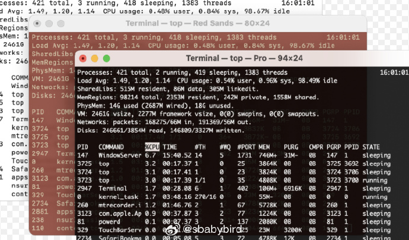
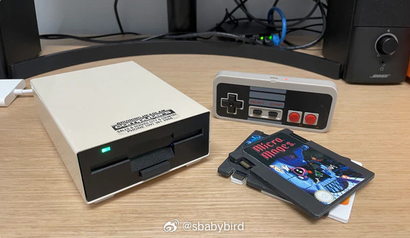
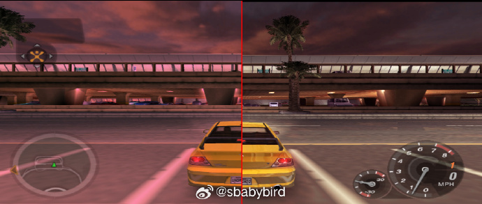
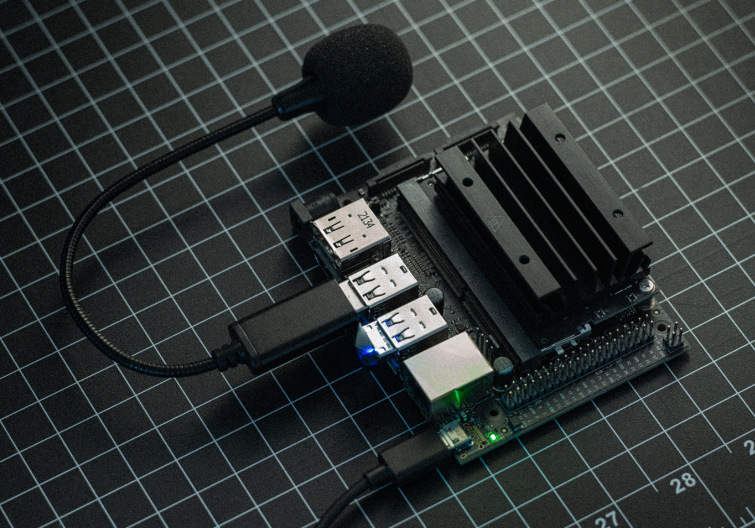
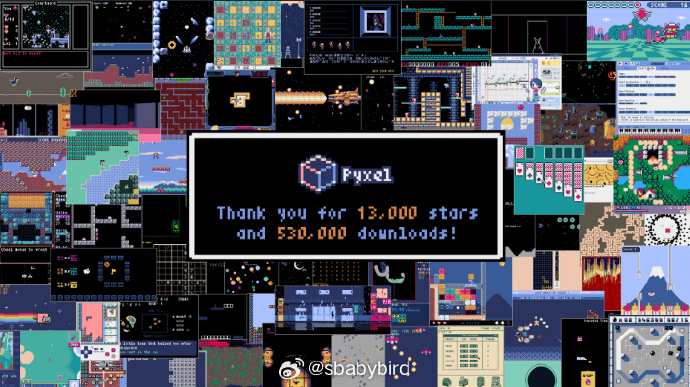
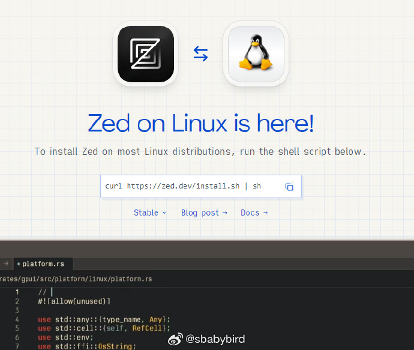

# 机器文摘 第 091 期

## 长文
### 在终端命令行界面输入文本这事儿挺复杂

如果工作中经常需要登陆远程主机 shell，使用终端的命令行界面进行文本输入是最频繁的事情了。

然而很多时候这种文本输入的体验并不一致，很让人困惑。

比如即便是资深的人士，也不敢保证在某个命令行窗口，键入 Ctrl+E 是将光标移动到行尾，Ctrl+A 移动到命令开头。

这种行为是否有效，取决于各种因素，有的时候是 shell 的版本导致，或者对于快捷键绑定的方式不一样。

或者干脆，如果你正好在某个古老命令的交互界面，那么你在键盘的方向键上按箭头以及按各种 Ctrl+ 快捷键，很可能得到这样的回显：“`^[[D^[[D^[[C^[[C^`”。

这一切是怎么回事？

[《在终端中输入文本很复杂》](https://jvns.ca/blog/2024/07/08/readline/)，这篇文章做了比较深入的分析。

了解了背后的原理之后，就不会对终端的文本交互行为感到困惑了。

简单概括：要想在命令行交互时获得比较一致的体验，取决于对一个叫做 readline 库的使用。

所执行程序如果底层依赖 readline 做文本交互（事实上大部分是用这个库做的实现），即可保证一些基本的键盘响应一致：

1. Ctrl+A 到行首；
2. Ctrl+E 到行尾；
3. Ctrl+U 删除当前行；
4. Ctrl+W 向前删除一个词；
5. Ctrl+左右箭头键：前后移动一个词；
6. Ctrl+R 搜索历史记录；

最后，文章讨论了很多引申问题，比如 shell 的 vi 键绑定或者 emacs 绑定等等，还有很多细节问题会影响文本输入体验。

### 写作是思考的工具

如果你有什么想法，或者你深信不疑的观点，最好把它写下来，在写的过程中你也许会发现逻辑上的漏洞甚至错误。

如果不写下来，只停留在想法上，你会觉得你的观点很完美，无懈可击，你就陷入这样自我欺骗的循环里了。

[《如何在写作中思考》](https://www.henrikkarlsson.xyz/p/writing-to-think)花费大量篇幅展示并论证了一个观点：写作可以帮助你完善你的思维。

写作可以迅速使你在脑海里模棱两可的东西固化成文字，使你开始怀疑这些文字的正确性。

这个从动态思维到静态文字的过程，特别像量子力学所说的“波函数坍缩”。

当一切皆有可能的东西变成实在，你就不再有理由给自己找借口：“我不是那个意思。。。”

这种硬性的要求，迫使你进行更深入的思考，以及清晰的表达。

### 装在软驱里的电脑

[《Floppy8 一个小电脑，但是在软驱里》](https://abe.today/blogs/main/floppy8-a-tiny-computer-in-a-floppy-drive)。

作者逛 ebay 的时候发现了一个长相有点儿像古老电脑 Amiga 1010 磁盘驱动器的软驱，虽然不确定这就是 Amiga 的产品，但是设计感十足。

总之就是，这个设备的外观一下子打动了他，福至心灵，情怀上脑，他决定将这个软驱买回来，然后改造一番。

大概花了几个周的时间，作者实现了支持外插“游戏卡带”的小计算机，可以运行一些复古游戏，甚至能够播放 4k 视频。

整个项目的亮点在于作者精心设计了一个可以插入软驱的卡带（实际存储用的 micro SD 卡），通过插入电脑来实现更换游戏内容。

文中完整记录了制作过程。

## 资源
### pcsx2 模拟器出了 2.0 正式版了

[pcsx2](https://pcsx2.net/blog/2024/pcsx2-2-release) 是一个模拟索尼 PlayStation 2 游戏机的模拟器， 可以加载游戏光盘镜像进行游玩。

此次发布 2.0 稳定版本比之前的 1.6.x 稳定版本在体验上有了巨大提升：

1. 使用 QT 作为界面渲染框架，支持现代化的全屏交互操作；
2. 更高性能的 cpu 、内存模拟，游戏体验提升；
3. 更高的兼容性，GTA 重影、极品飞车模糊、狂暴飞车天空看不见等大量的兼容性图形问题得到修复；
4. 支持单个游戏独立配置，有些游戏需要开启或关闭某些模拟器特性才能正常运行，可以单独给他配置，系统在加载时自动切换；
5. 渲染后端支持现代图形 API Vulcan ，渲染性能提升超过 30%；

### 边缘设备上的Whisper实时语音转录工具

[Whisper Edge](https://github.com/maxbbraun/whisper-edge )，利用硬件机器学习加速器实现始终在线的语音识别。当前支持Jetson Nano和Coral Edge TPU设备。

### 基于 Python 的复古游戏引擎

[Pyxel](https://github.com/kitao/pyxel)是一个 python 的经典像素风游戏制作引擎。

由于像素风游戏的机制非常简单 (如：最多只能显示 16 种颜色、播放 4 种声音等)，现在你也可以轻松地享受这种游戏的制作过程。 

### 使用 Rust 编写的开源代码编辑器 Zed 出 Linux 版本了

[zed linux](https://zed.dev/linux)

可以直接通过一行命令脚本进行安装。

> 编辑器本体代码采用 GPL 授权形式，服务器端组件使用 AGPL 授权，GPUI 用户界面框架则以 Apache 2 授权发布。

> Zed 编辑器最大的优势是“高性能”，号称能够充分利用设备的 CPU、GPU 能力，让应用程序启动、文件加载、键盘响应速度“更快”，官方声称，与微软 Visual Studio Code 相比，Zed 的启动速度快了 4 倍，而 RAM 占用少了一半。

## 观点
### 谷歌浏览器内置插件
今天在 V 站听说一个有趣的事情：谷歌浏览器里面带有一个隐藏的插件。

当用户访问谷歌网站的时候（即网址为 google.com），这个插件就启动收集用户的硬件信息，内容相当的丰富。

这个插件的代码是写死在 chrome 代码里的，也就是说用户无法屏蔽。

看来，谷歌早就不是那个自称“不作恶”的谷歌了。 ​​​

### 物联网图形编程
昨天，我大舅竟然问我写程序的问题

他买了个廉价单片机芯片电路板，准备折腾物联网智能家居控制。

但是编写程序烧录不到板子上，找我远程连线。

最后我发现是编程环境的中文路径问题，帮他解决了。

他用的就是那种积木编程，少儿学编程的那种拖拽界面。

看来想折腾不一定非得要什么语言，还是得在具体的项目上练。

现在国内的物联网芯片商家很卷，二十块钱卖你一套板子，还送你编程教程、各种打包编译环境。

### 不能离线安装的游戏
微软有个游戏叫模拟飞行（开飞机的），它的资源库大小有多大呢

10PB。

也就是 1万 T，或者 1千万 G。

所以都装在本地的话，连硬盘都买不起。 ​​​

## 订阅
这里会不定期分享我看到的有趣的内容（不一定是最新的，但是有意思），因为大部分都与机器有关，所以先叫它“机器文摘”吧。

Github仓库地址：https://github.com/sbabybird/MachineDigest

喜欢的朋友可以订阅关注：

- 通过微信公众号“从容地狂奔”订阅。

- 通过[竹白](https://zhubai.love/)进行邮件、微信小程序订阅。

