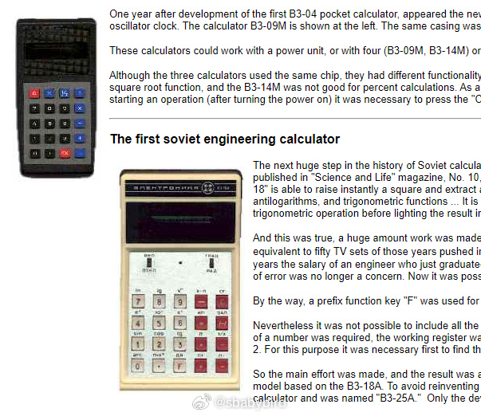
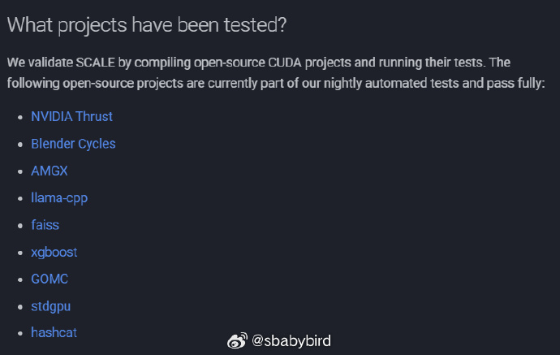
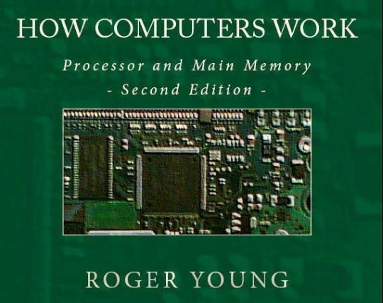
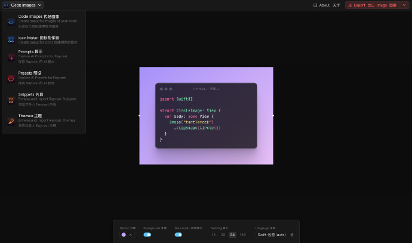
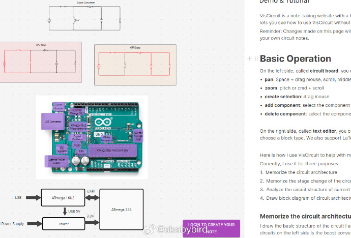
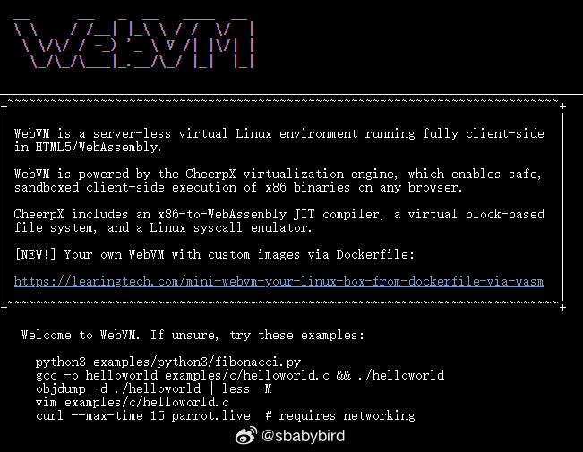

# 机器文摘 第 092 期

## 长文
### 苏联计算器简史

[苏联计算器简史](https://kimi.moonshot.cn/chat/cqat74ucp7fcufcoehug)

这篇文章讲述了苏联计算器的发展历程，从最初的独特操作语言到后来的现代化设计。

在上世纪 70 年代初，计算器的交互操作才开始变得通用，而早期的计算器，比如列宁格勒“Svetlana”工厂生产的C3-07，每个型号都有自己特定的操作程序。

B3-18 是苏联第一款工程计算器，它能够进行更复杂的数学运算，比如三角函数和对数运算，这在当时非常先进。

文章还提到了苏联计算器的一些有趣特点，某些型号的计算器在显示数字时会用到一些特殊的技巧。

比如在C3-07型号上，零的高度只有正常数字的一半，以帮助用户更容易地找到最重要的数字。

随着技术的发展，苏联的计算器也开始使用集成电路和更先进的能源技术，比如太阳能和液晶显示，这使得计算器更加节能和便携。

B3-34 是苏联最受欢迎的计算器之一，它不仅功能强大，而且具有一些未公开的特殊功能，在特定条件下，一些按键会有不同寻常的作用。

通过本文，可以了解苏联工程师在计算器设计上的创新和努力。

即使在技术和资源受限的情况下，工程师们也能够创造出功能丰富且有趣的计算器。

### box-shadows 都是能干啥

[box-shadows](https://dgerrells.com/blog/how-not-to-use-box-shadows)，一篇讲解前端技术的精品文章。

探讨了如何以创造性的方式使用 CSS 的 box-shadows，看看使用 box-shadows 都是有哪些限制，以及可以整出什么花活儿。

作者前端技术功底深厚，文中提供了多个有趣的效果展示 Demo。

除了 CSS 相关的技巧外，作者对于 JavaScript 代码的相关优化也颇有心得。

亮点如下：
1. 层叠多个 box shadows 可以创建深度视觉效果（3D 渲染）；
2. 使用 box shadows 实现光线追踪渲染；
3. 在线交互体验作者编写的 Demo；

## 资源

### 在 AMD 显卡上跑 CUDA 程序

不用改一行代码，即可将你的 CUDA 程序在 AMD 显卡上运行。

AI 时代，天下苦 Nvidia 久矣！

大量的 AI 研究与计算都依赖基于 Nvidia 显卡的 CUDA 计算平台。

而且 CUDA 这个计算平台是商业封闭平台，不能在别的底层硬件运行（比如 AMD 、Intel 等厂商的显卡）。

所以 N 卡价格水涨船高，老黄股票赚了个盆满钵满。

现在看到了希望，[SCALE](https://docs.scale-lang.com/)，一个在 AMD 平台模拟 CUDA 的中间层。

通过 GPGPU 编程将普通的 AMD GPU 也提供了一层 CUDA 接口。

我不知道这种假装会不会带来侵权问题。

不过可以先观望一下，这个项目目前已经做到了在部分 A 卡上运行一大批依赖 CUDA 的计算应用了。

### 电子书《计算机是如何工作的》

[《 How Computers Work ：Processor and Main Memory 》](http://www.fastchip.net/howcomputerswork/p1.html)

本书从头开始讲cpu是怎么工作的，有 pdf 和 doc 两种格式供下载 。

具体内容涵盖了计算机的基础知识、内存、指令、处理器、编程和其他相关话题。书中使用继电器而非晶体管来简化电路，适合没有技术背景的读者。

### 代码图片生成器

来自 Raycast 团队开源的一个 Web 工具箱 ray.so。

提供了精美的代码图片生成器、图标制作器以及多种高颜值的 Raycast 主题等等。

GitHub：https://github.com/raycast/ray-so

### 在线设计电路板并记录笔记

[viscircuit](https://viscircuit.com/demo)，这个网站可以让你在线以可视化的绘制电路板图纸，并使用 Markdown 格式做笔记。

### 在线获取图书信息的 API

[SaltyLeo 的图书元数据 API](https://book-db-v1.saltyleo.com/)

这个网址提供了一个在线 API ，用于获取图书的元信息：作者、出版社、封面、简介等。

可以用来刮削元数据补充自己的书库，也可以用作建站使用。 ​​​

### 基于 WebAssembly 技术的 Linux 虚拟环境

[WebVM](https://webvm.io/) 是一个无服务器的虚拟 Linux 环境，完全在 HTML5/WebAssembly 中客户端运行。

WebVM 由 CheerpX 虚拟化引擎驱动，它使得在任何浏览器上安全、沙盒化的客户端执行 x86 二进制文件成为可能。

CheerpX 包括一个 x86 到 WebAssembly 的即时编译器（JIT 编译器）、一个基于虚拟块的文件系统，以及一个 Linux 系统调用模拟器。

## 观点 
### 复古游戏更划算
电脑使用 7 年前的主流配置，玩 15 年前的主流游戏，是一个非常划算的事情。

或者使用模拟器玩更复古的主机游戏，比如索尼的 PS2、世嘉的 Dreamcast、任天堂的 Wii 等，拿今年的行情来说，两千块钱捡破烂配置的 PC 就可以超高质量运行上述主机模拟。

而且还有海量的经典大作，游戏画面质量比起现在虽然差点儿，但搁在当年是十分惊艳的（是要斥巨资才能享受到的）。

当年的大作在游戏性方面比现在堆画面、吃配置、一个游戏动辄上百 G 资源的所谓 3A 体验要好很多，而且玩起来有一种超值的心理。

引申来说，读书又何尝不是呢？经典的好书常看常新、历久弥新，影响深远。

何必要追捧当前畅销的“佳作”，打个时间差，多看看过去经典作品，比一味追新，会更有收获。

## 订阅
这里会不定期分享我看到的有趣的内容（不一定是最新的，但是有意思），因为大部分都与机器有关，所以先叫它“机器文摘”吧。

Github仓库地址：https://github.com/sbabybird/MachineDigest

喜欢的朋友可以订阅关注：

- 通过微信公众号“从容地狂奔”订阅。

- 通过[竹白](https://zhubai.love/)进行邮件、微信小程序订阅。

