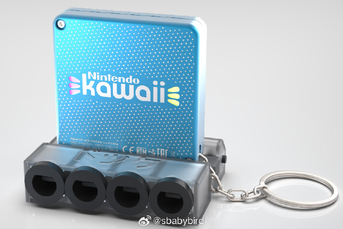
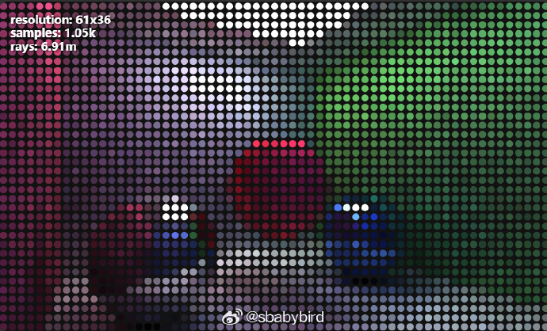
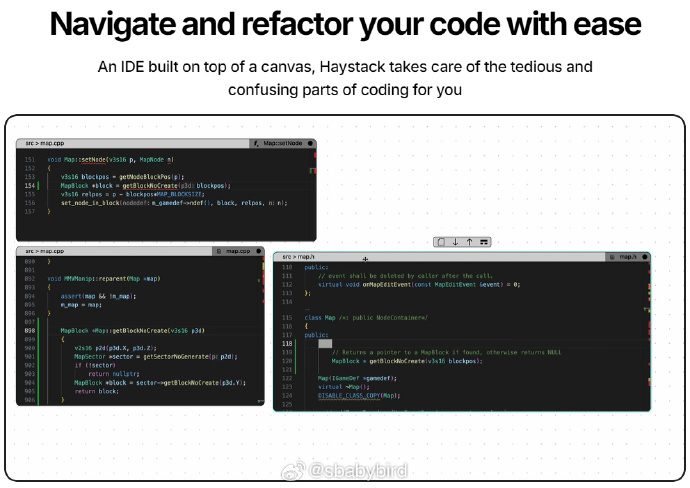
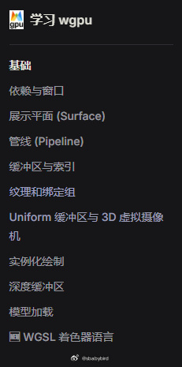

# 机器文摘 第 093 期

## 长文
### 可以挂在钥匙链上的 Wii 游戏机

[Kawaii](https://bitbuilt.net/forums/index.php?threads/kawaii.6474/)（意为“可爱”）是一个功能齐全的 Wii 游戏机，但是体积比任天堂发售的 Wii 游戏机缩小了数倍，还不到一个巴掌大小。

方案思路来自于一个叫做 GC Nano 的项目，不过做的更小，设计了更好的外壳和扩展。

主要手段，就是切割原有 Wii 游戏机的电路板，保留核心部件，重新设计外壳和扩展接口。

规格包括：

1. 60x60x16mm 的 CNC 铝制外壳（被动冷却），带有激光蚀刻艺术作品。
2. 类似 MagSafe 的 12 针磁性 pogo pin 连接器。
3. 带有 USB-C 电源输入、x4 GCC 控制器端口、复合/分量视频输出和立体声音频输出的底座。
4. 钥匙链环。

像 GC Nano 和 Short Stack 一样，Kawaii 完成后将完全开源。

### CSS 的 box-shadows 还能干啥

[box-shadows](https://dgerrells.com/blog/how-not-to-use-box-shadows)，一篇讲解前端技术的精品文章。

探讨了如何以创造性的方式使用 CSS 的 box-shadows，看看使用 box-shadows 都是有哪些限制，以及可以整出什么花活儿。

作者前端技术功底深厚，文中提供了多个有趣的效果展示 Demo。

除了 CSS 相关的技巧外，作者对于 JavaScript 代码的相关优化也颇有心得。

亮点如下：
1. 层叠多个 box shadows 可以创建深度视觉效果（3D 渲染）；
2. 使用 box shadows 实现光线追踪渲染；
3. 在线交互体验作者编写的 Demo；

### 设计就是抄袭

设计工作中，原创为主？还是临摹、抄袭、复制、山寨为主？

不同的人有不同的看法。

一些设计师认为保持作品的“原创性”是必须的，否则跟偷窃有何分别？

一些人则认为大量的“复制”、“山寨”才是设计工作的主流，是这些复制品让市场繁荣，让作品得以传承，更多人受益。

当然也有一些人格分裂者，复制别人的时候是“致敬”，但绝不允许别人复制自己的（乔布斯：没错！正是在下）。

[《设计工作的方式是复制》](https://matthewstrom.com/writing/copying/)一文对抄袭和设计的关系进行了探讨。

作者的观点是倾向于鼓励复制的，因为作者在开头就声明了本文可以随意转载、下载、重置、复制并发布。

文中主要讲了几个工业设计（主要是消费电子产品）历史上的有趣故事，借此讨论了“复制”这一看似不合理的行为是怎样成为设计的主要工作方式的。

有几个有趣的点：
1. 乔布斯当年从施乐实验室偷走了图形界面的创意，然后转头起诉微软抄袭苹果电脑的界面，回过味儿的施乐公司开始起诉苹果。这事儿后来比尔盖茨回忆说，就好像自己看上了邻居家里的电视机，进屋去偷的时候发现乔布斯已经把它搬走了。
2. 苹果公司后来甚至起诉三星公司，说自己拥有“圆角矩形”专利，不允许三星生产圆角的平板电脑，法院驳回了，但是三星也赔了不少钱。
3. 最牛的游戏程序员，约翰卡马克成功在 PC 上复刻了任天堂的超级马里奥3，首次实现了 PC 电脑上的卷轴动画游戏，后来老板希望申请专利，但是卡马克拒绝说：你要敢申请，我就敢辞职。（卡马克在我心目中是世界最牛程序员之一，另一个是 Linus）

### 业余无线电文化（美国）的历史

[《业余无线电文化的丰富历史》](https://thereader.mitpress.mit.edu/the-rich-history-of-ham-radio-culture/)由历史学家克里斯滕·哈林（Kristen Haring）撰写，深入探讨了业余无线电爱好者（通常称为“火腿”）的世界。

文章描绘了业余无线电文化（美国）的形成过程以及它的丰富多彩。

一些有趣的点：
1. 火腿们通过摩尔斯电码展示他们的技术身份，他们对这种编码的热爱源于FCC许可考试中对编码技能的重视，以及他们对如何将语言转化为电码的欣赏。电码操作者能够通过电码的“触感”识别彼此，这种“触感”几乎和指纹一样独特。
2. 一些火腿通过摩尔斯电码在公共场合进行秘密交流。例如，一个火腿描述了他如何在约会时与兄弟通过摩尔斯电码讨论他们的约会对象，而对方却浑然不觉。
3. 美国无线电中继联盟（ARRL）发布的“业余者的准则”强调了火腿应具备的特质，如绅士风度、忠诚、进步、友好、平衡和爱国。这些准则不仅为火腿们提供了行为模范，还通过大众媒体的广泛传播，成为公众对火腿形象的一种认知。

## 资源 
### 可以像架构图那样组织编辑窗口的编辑器

[haystackeditor](https://haystackeditor.com/)，一个很有意思的编辑器，可以在一个无限大的画布上摊开你要编辑的多个文件。

比起用分割窗口、TAB页来管理多个打开的文件，有一个很大的优势，就可以按照你的代码调用关系来摆放编辑窗口的大小和位置。

各个代码源文件的关系一目了然。

### wgpu 学习教程

WebGPU 是由 W3C GPU for the Web 社区组所发布的规范，目标是允许网页代码以高性能且安全可靠的方式访问 GPU 功能。它通过借鉴 Vulkan API，并将其转换为宿主硬件上使用的各式 API（如 DirectX、Metal、Vulkan）来实现这一目标。

[wgpu](https://github.com/gfx-rs/wgpu) 是基于 WebGPU API 规范的、跨平台的、安全的、纯 Rust 图形 API。它是 Firefox、Servo 和 Deno 中 WebGPU 整合的核心。

wgpu 不仅可以在 Web 环境运行，还可以在 macOS / iOS、Android、Window 和 Linux 等系统上原生运行。

[learn-wgpu](https://github.com/sotrh/learn-wgpu)是一套针对 wgpu 开发的教程，包括入门和进阶部分，热心网友翻译的 [learn-wgpu 中文版](https://jinleili.github.io/learn-wgpu-zh/)还增加了集成与调试的章节。

### 学习计算机知识的实体卡牌游戏

[card-game](https://punkx.org/unix-pipe-game/)，这个网站提供了一些可以自行下载打印的游戏卡牌，都是与计算机基础知识相关的桌游。

可以让父母跟孩子一起通过做游戏学习知识，寓教于乐，而且是桌游的感觉。

可以学习的知识包括：UNIX 管道、C 语言指针与数组、Python 编程等等。

### 从网页中“偷”按钮的设计

[Button Stealer](https://anatolyzenkov.com/stolen-buttons/button-stealer)，这个插件只干一件事，从你浏览的每一个网页里偷取按钮。

日积月累你会发现它积攒了一堆各式各样的按钮。

作者说了，这个功能没啥用，但是好像挺有趣。

插件不会收集用户信息，所有数据都保存在本地。 ​​​

## 订阅
这里会不定期分享我看到的有趣的内容（不一定是最新的，但是有意思），因为大部分都与机器有关，所以先叫它“机器文摘”吧。

Github仓库地址：https://github.com/sbabybird/MachineDigest

喜欢的朋友可以订阅关注：

- 通过微信公众号“从容地狂奔”订阅。

- 通过[竹白](https://zhubai.love/)进行邮件、微信小程序订阅。

