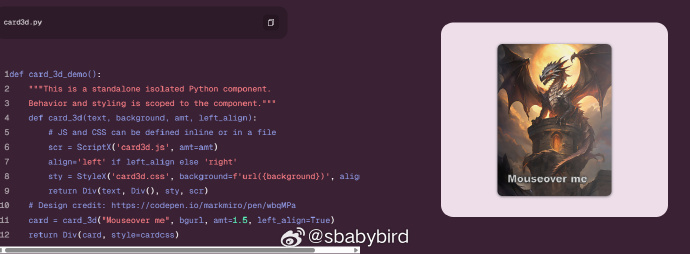
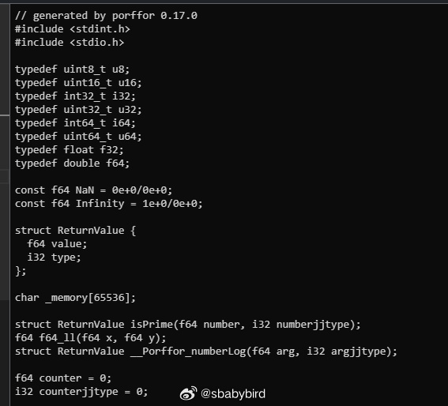
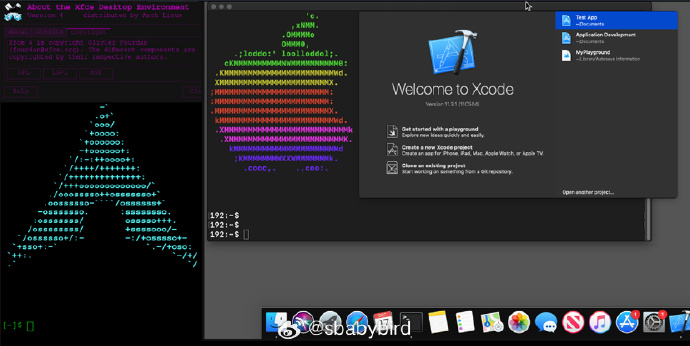
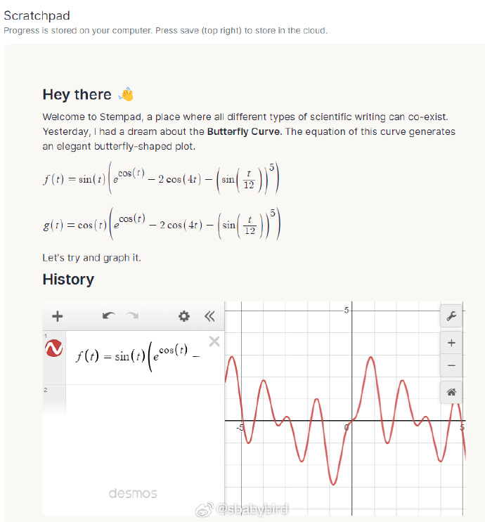

# 机器文摘 第 094 期

## 长文
### 用 C 重写一个 2D 游戏引擎

[high_impact](https://phoboslab.org/log/2024/08/high_impact)，是一个用 C 写的 2D 动作游戏引擎，很简洁但是很强大。

作者在这篇文章里记述了这个引擎的诞生历程。

与其他游戏引擎不同的是，这个引擎是先有了 JavaScript 版本，然后才做的 C 语言版本。

作者在文中不但回顾了 JavaScript 版本的开发始末，还详细讲解了 C 语言版本的实现思路，包括：渲染、碰撞、粒子系统等。

我十分认同作者的一句话：“我喜欢的游戏和技术都有一个特点，那就是他们很容易上手，但是不容易精通。”（作者在文中指 C 语言）

### 终端操作高级技巧

经常在 Linux 进行服务端编程或者运维操作的人员，离不了跟终端、命令行窗口打交道。

这篇[《终端操作高级技巧》](https://www.bitsand.cloud/posts/terminal-tips/)整理了若干条非常棒的操作技巧（秘籍），可以极大提升你的工作体验。

摘录部分如下：
1. 使用命令行编辑：输错长串的大段命令不要着急，无需重新输入，Ctrl+E 可以进入编辑界面，直接编辑你的大段命令。
2. 通过 tmux 脚本控制终端行为（可以完成一些自动化交互操作）。
3. fzf 模糊查找整合到命令行历史查找中，Ctrl + R 可以快速搜寻曾经执行过的命令。

### 计算机逆向工程大全

提到“逆向工程”大家首先想到的就是“破解”，事实上也是这样。

不过除了搞越狱、破解之外，学习逆向工程也是了解计算机底层原理的绝佳途径。

[《逆向工程》](https://0xinfection.github.io/reversing)这本电子书整理了一份十分详尽的学习手册。

内容涵盖了 x86、arm 等主流平台关于如何进行“逆向”的全部工作指南。

手册不仅介绍基础的原理知识，还整理了关于环境安装、配套的工具使用等方面的信息，适合边学边练

## 资源
### 纯 Python 写 Web 界面

[FastHTML](https://fastht.ml/)，一个好玩的项目，用纯 Python 开发现代网页应用。

不需要了解前端知识，只需能写 Python 代码，即可做出美观易用的网页程序。 ​​​

### 一个实验性质的 Js 引擎

[porffor](https://porffor.dev/)，一个从零实现的 JS 解释器。

Porffor 是一个独特的 JS 引擎/编译器/运行时，将 JS 代码提前编译为 WebAssembly 或原生代码。

目前该项目在 Github 开源，仅用于研究用途。

不过，从项目主页给出的测试数据来看，目前还不具备实用性，仅通过了 35% 的语法标准测试。

### 在容器里运行 MacOS

[Docker-OSX](https://github.com/sickcodes/Docker-OSX)，这个开源项目可以让你在 docker 里运行 MacOS 系统。

通过强大的虚拟机模拟器 QEMU 实现。 ​​​

### 科研写作专用编辑器

[stempad](https://www.stempad.io/editor)，一个专门用于科研写作的在线工具，浏览器访问直接使用，所有数据保存在本地。

特色是内嵌可视化公式编辑器以及公式图形绘制功能。 ​​​

## 订阅
这里会不定期分享我看到的有趣的内容（不一定是最新的，但是有意思），因为大部分都与机器有关，所以先叫它“机器文摘”吧。

Github仓库地址：https://github.com/sbabybird/MachineDigest

喜欢的朋友可以订阅关注：

- 通过微信公众号“从容地狂奔”订阅。

- 通过[竹白](https://zhubai.love/)进行邮件、微信小程序订阅。

