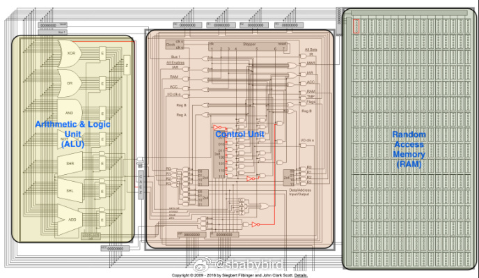
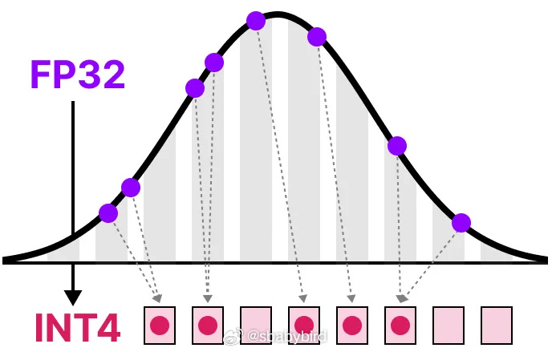
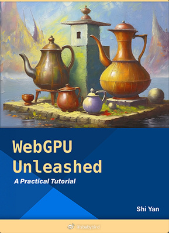

# 机器文摘 第 095 期

## 长文
### 不懂 CPU 原理？那就自己动手编程模拟一个

[《我不知道 CPU 是怎么工作的，于是我写程序模拟了一个》](https://djharper.dev/post/2019/05/21/i-dont-know-how-cpus-work-so-i-simulated-one-in-code/)

不懂 CPU 工作原理，看别人的解释视频和文章都不过瘾，干脆自己来吧，从底层模拟一个 CPU ，这下可以拿捏各种细节了。

不过等一下，作者并非真的不理解，实际上，早在 2013 年他就动手写过一个任天堂 GameBoy 模拟器。

只是作者认为当时的硬件肯定没有现在的计算机硬件这么攒劲，于是作者又犯了“绝不允许自己不知道引擎盖下的机器是如何工作的”综合征。

而且，与一般的模拟器不同（只是暴露了兼容指令集），这次作者在代码层面真正模拟了硬件电路级别的 CPU，包括 ALU 算逻运算单元、中断电路等。

文章记录了动手过程，包括一些踩坑花絮。

### 如何极快地构建任何东西

[《如何极快地构建任何东西》](https://learnhowtolearn.org/how-to-build-extremely-quickly/)，这是一篇教你提高做事（尤其是创造性劳动）效率的文章。

其核心理念只有一条：先完成，再完善。

也就是不要陷入到细节里。

你的构建进度条不是慢慢从左走到右，而是基于一个基础框架，反复迭代，以逐步增添细节的方式填满的。

展开来说：

1. 做任何事情先做提纲（框架、地基，都一个意思）。
2. 扫描你的框架，做更细一级的补充，循环此过程。
3. 在完成核心功能之前不要关注细节。

作者在文中以写作和编程进行了举例，几乎手把手教你了。

### AI 模型的“量化”是什么，它跟常说的“量化交易”有关系吗？

答案是：卡巴斯基和巴基斯坦的关系。

AI 模型的量化（Quantization）是一种在机器学习和人工智能领域中用于优化大型模型的技术。

这篇文章[《A Visual Guide to Quantization》](网页链接)解释了量化的基本概念和实现原理。

什么是量化？
量化是一种数据压缩技术，它用于减少模型参数所需的存储空间和计算资源。在机器学习模型中，参数通常以浮点数（一种可以表示小数的数值类型）的形式存储，这需要较多的内存和计算能力。量化通过将这些浮点数转换为更简单的数值格式（如整数），从而降低模型对计算资源的需求。

为什么要量化？
1. 硬件限制：大型语言模型（LLMs）通常包含数十亿参数，它们在消费级硬件上运行时会受到内存和处理能力的限制。
2. 效率提升：量化可以显著减少模型的大小，使其能够在更小、更慢的设备上运行，比如智能手机或嵌入式设备。
3. 成本降低：减少对高性能硬件的依赖可以降低部署和运行模型的成本。
4. 实时应用：在需要快速响应的应用场景中，量化可以加快模型的推理速度。

量化的技术依据：
1. 数值表示：在计算机中，数值通常以浮点数的形式表示，包括符号位、指数位和尾数位。量化则是将这些浮点数转换为更简单的格式，比如8位整数（INT8）。
2. 精度与范围：量化会牺牲一定的数值精度以换取更小的数值范围。例如，使用INT8量化时，数值的范围和精度都会比32位浮点数（FP32）小。

## 资源
### WebGPU 在线教程

[WebGPU Unleashed](https://shi-yan.github.io/webgpuunleashed/)，一本在线交互式电子书。

将教你使用 WebGPU 在 JavaScript 中进行图形编程，带你做好每一个练习，可在线运行。

### 70 岁奶奶编写的游戏

[HN ](https://news.ycombinator.com/item?id=41217109)上的一位网友放出了一个链接，是他 [70岁的奶奶刚学会编程做的文字游戏](https://grandmasword.com/)。

## 订阅
这里会不定期分享我看到的有趣的内容（不一定是最新的，但是有意思），因为大部分都与机器有关，所以先叫它“机器文摘”吧。

Github仓库地址：https://github.com/sbabybird/MachineDigest

喜欢的朋友可以订阅关注：

- 通过微信公众号“从容地狂奔”订阅。

- 通过[竹白](https://zhubai.love/)进行邮件、微信小程序订阅。

