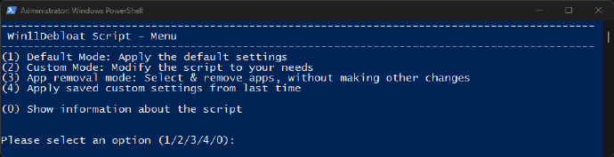

# 机器文摘 第 096 期

## 长文
### 激光麦克风

[《用激光窃听键盘输入》](https://www.wired.com/story/infrared-laser-microphone-keystroke-surveillance/)这篇文章讲述了一个利用红外激光技术进行窃听的故事。

在拉斯维加斯举行的 Defcon 安全会议上，著名黑客 Samy Kamkar 展示了他自己的DIY激光监视技术。他能够将一种肉眼看不见的红外激光对准远处的笔记本电脑，通过窗户检测计算机的振动，重建几乎每一个输入的字符。这种技术利用了敲击不同键盘键产生的微妙声学特性，即使没有看到键盘，只要黑客能够看到目标笔记本电脑上的任何相对反射的部分，也能工作。

实现这种神奇窃听效果的关键技术有三个：
1. 基于激光的音频输入：发射每秒频闪 40K 赫兹的激光光源，通过镜头接收反射光，使用传感器以 400K 赫兹进行采样，以便进行光电转换和频率分析。
2. 使用 iZotopeRX 软件进行噪声处理以获取想要的音频信息。
3. 使用开源软件 Keytap3 （基于 AI 的听声识别键位）将音频识别为按键信息。

ps：作者说，由于苹果笔记本有个反光良好的镜面 LOGO，所以针对苹果笔记本的窃听效果最好。

### 用 C 语言在 40 年前的老系统上进行编程是什么体验？

[《回到 CP/M 的 C 编程》](https://kevinboone.me/cpm-c.html)讲述了作者在一台真正的（物理上）CP/M 机器进行编程的经历。
 
C/PM ：（"Control Program for Microcomputers"的缩写），即“微机控制程序”。它是1970年代为 Intel 8080 微处理器开发的一个操作系统。

C/PM是早期微计算机操作系统的先驱之一，它为后来的操作系统，包括MS-DOS（微软磁盘操作系统），奠定了基础。

文中介绍了在不依赖现代环境的前提下，完全基于老式系统进行编程是何种体验：

1. 古老的编译器需要用户手动执行三次命令才能完成程序生成，包括编译 C 代码到 ASM 汇编、编译汇编、链接可执行程序；
2. 早期的 ANSI C 语法，函数及变量必须在块定义之前声明，否则无法编译（也就是说 `for(int i;;;)` 这种写法不行，必须得把 `int i` 这个定义提到前面去）；
3. int 类型和指针为 16 位，但 float 为 32 位，double 为 64 位（但要谨慎使用因为没有指令加速，计算非常慢）；
4. 极简的标准库、原始的内存管理等等。

看来当个 80 年代的程序员真的不容易。

### 嵌入在字体里的语法高亮

用技术挑战可能性的故事最让人欣赏。

这篇[《集成代码高亮的字体》](https://blog.glyphdrawing.club/font-with-built-in-syntax-highlighting/)的作者估计有强迫症吧。

为了给自己的博客增加手写 HTML、CSS 的能力（想要代码语法高亮，但是又不想引入 JS 库），不惜做了一个自带高亮效果的字体。

实现原理：
1. OpenType COLOR 表可以使得字体文件支持颜色。
2. OpenType 上下文替换技术可以让字体根据识别到的模式自动返回对应颜色。
3. 给 JS、HTML、CSS 等语言的关键字创建大量的“上下文替换规则”。
4. 在网页中加载该字体使用，即使输入的是纯文本，也会带有颜色高亮效果了。

## 资源
### 读写 json csv 等文本数据的工具

[dasel](https://github.com/TomWright/dasel)，一个可以对多种单文本数据文件读写的命令行工具。

支持 JSON, TOML, YAML, XML 和 CSV，而且可以方便地在这些格式之间进行转换。

用于需要在命令行批量对这些文本数据进行增删改查。 ​​​

### 基于大模型的开源 OCR 工具

[LLM-Aided OCR](https://github.com/Dicklesworthstone/llm_aided_ocr)，一个基于 LLM 的 OCR 扫描 PDF 开源工具 。

旨在通过利用多模态大语言模型（LLM）将原始的 OCR 扫描 PDF 文本转换成高准确度、格式正确且易于阅读的 Markdown 文档。

实现思路：首先将 PDF 文件转图像，进行 OCR 扫描处理提取文本，再利用本地 LLM 或 API（如 OpenAI、Anthropic）纠正 OCR 错误，最后转换成高准确度、高质量的 Markdown 文本。

### ImGUI 设计器

[ImRAD](https://github.com/tpecholt/imrad)，可视化设计制作 ImGUI 界面的工具。

### 通过口令认证在两台计算机上安全地迁移文件

[魔法虫洞](https://github.com/magic-wormhole/magic-wormhole)

安全地将东西从一台计算机移动到另一台计算机。

该软件包提供了一个库和一个名为 wormhole 的命令行工具，它可以将任意大小的文件和目录（或短文本）从一台计算机转移到另一台计算机。

两端通过使用相同的“虫洞代码”来识别：通常，发送者机生成密码，然后接收端通过输入这个密码建立连接

### 另一个传输工具

[destiny](https://github.com/LeastAuthority/destiny)，
可以在非局域网下，任何平台或设备之间传输文件。上传者分享传输码就可以下载，点对点加密，没有中心服务器，不需要注册，开箱即用。

### 一行命令优化 Windows 11 体验

[Win11Debloat](https://github.com/Raphire/Win11Debloat)，一个针对win11系统的优化脚本。

可以用来移除 Windows 预装的应用程序，禁用遥测，从 Windows 搜索中移除 Bing，以及执行各种其他更改来清理并改善您的 Windows 体验。这个脚本适用于 Windows 10 和 Windows 11。 ​​​

### 用安卓手机当电脑麦克风

[AudioSource](https://github.com/gdzx/audiosource)，你的电脑可能没有麦克风，需要的时候，又不想买一个麦克风，这时候就可以把你的 Android 当作麦克风来用。 ​​​

## 订阅
这里会不定期分享我看到的有趣的内容（不一定是最新的，但是有意思），因为大部分都与机器有关，所以先叫它“机器文摘”吧。

Github仓库地址：https://github.com/sbabybird/MachineDigest

喜欢的朋友可以订阅关注：

- 通过微信公众号“从容地狂奔”订阅。

- 通过[竹白](https://zhubai.love/)进行邮件、微信小程序订阅。

