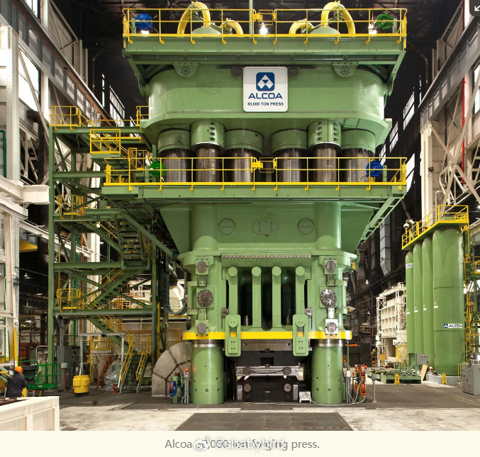
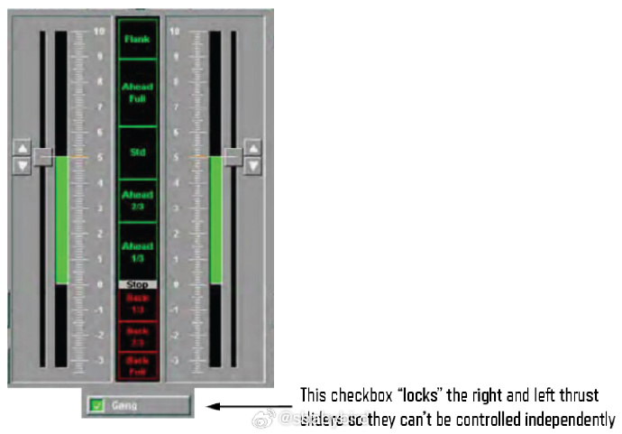
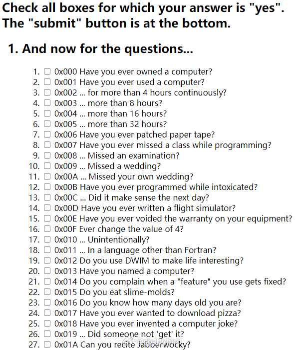
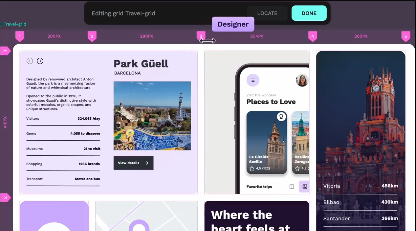
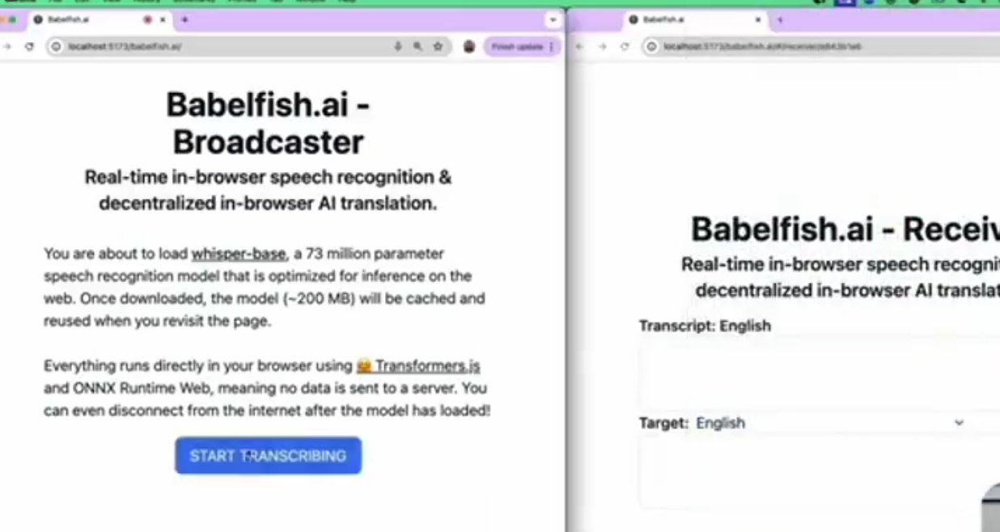
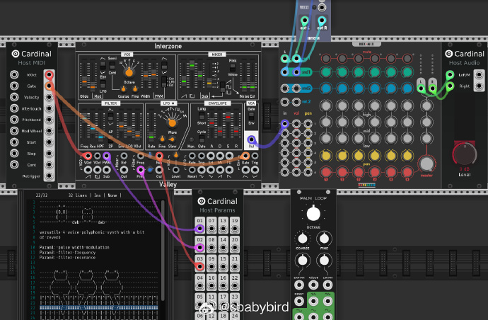

# 机器文摘 第 097 期

## 长文
### 五万吨液压机的故事 

[《怎样建造 50000 吨的锻造液压机》](https://www.construction-physics.com/p/how-to-build-a-50000-ton-forging)，此文看似介绍液压机的建造技术，实则回顾了大型锻造液压机的发展历史，以及引申分析了一些军事技术惠及民用的模式。

大型锻造液压机计划最初来自于美国，在上世纪 50 年代，出于对生产轻量化、高度集成的战斗机零件的需求，他们设计并建造了两台 50000 吨级的液压机。

虽然建造时间很长（大概花了 4 年），并且为此突破了很多技术层面的困难，很多零件的供应都是专门生产，甚至连零件的运输都专门设计了车辆。

但带来的好处是显而易见的，之前需要用铆钉连接的数百个飞机零件，现在只需要液压机挤压生产成为四五个大件即可，可靠性、空气动力等性能也得到了大幅提升。

这种冲压锻造技术后来还下放到民用领域，其生产的产品给普通人的生活带来了巨大方便。

这两台机器最终服役到 2018 年，被新建造的 60000 吨级机器所取代。

文末提到了一个有意思的点，那就是，目前世界上最大的液压机在中国（80000吨级），而且国外用的很多液压机的零部件和生产厂商也多为中国企业。

最后作者不得不感慨：
> 技术进步意味着建造以前从未建造过的东西，这通常意味着推动制造技术的界限向前发展。如果做不到这一点，你就有可能被这样做的人超越。

### 超级任天堂图形系统详解

超级任天堂（SFC），在北美又称 SNES，是任天堂公司在上世纪 90 年代发售的游戏机，是经典红白机（FC）的升级产品。

对比 FC，该机拥有强大的图形处理能力以及 16 位中央处理器，使得游戏体验得到了极大提升。

这里有一组文章，讲解了[超级任天堂游戏机的图形系统是如何工作的](https://fabiensanglard.net/snes_video/)。

文章深入探讨了SNES图形系统的技术细节，包括CRT的工作原理、SNES如何适应当时的电视标准，以及它如何创新地处理分辨率和信号输出。

作者对 90 年代基于 CRT 的显示技术了如指掌，还顺便解释了为什么美国 NTSC 制式的电视机刷新率为 59.94 这个奇怪的不整的数字（当时黑白转彩色时为了兼容以及偷懒选了一个毕竟奇葩的技术标准）。

### 潜艇触屏交互界面导致美国海军损失过亿

[《The U.S. Navy's $100M checkbox (2019)》](https://adrian3.com/blog/2019/2019-09-28-The-US-Navys-100-million-dollar-checkbox.php)，这是一个悲惨的故事，看完之后你会更加怀念物理按键时代。

同时更加痛恨现在由触摸屏构建的各种交互环境（包括各种汽车主机厂商令人讨厌的触摸屏交互）。

文章写于 2019 年，故事发生在 2017 年。

一艘美国海军驱逐舰与一艘利比亚油轮相撞，导致十名水手死亡，损失上亿美元。

而造成这一惨剧的罪魁祸首是触摸屏上的一个复选框（checkbox）。

虽然最终进行这种 UI 设计的设计师躲过了惩罚，但是本文作者不依不饶。

写了此文对整个事件进行详细分析，以说明糟糕的交互设计是如何一步一步酿成惨剧的。

### 上世纪 80 年代的“纯”黑客测试

[hacker-checklist](http://www.armory.com/tests/hacker.html)，这里有一份测试问卷，编写于上世纪 80 年代。

里面的问题展示了当时作为一个计算机黑客所应该具备的一些特质。

问卷展示了技术工作者的某种古典幽默，读起来让人忍俊不禁。 

## 资源 
### 开源版的 Figma

[Penpot](https://github.com/penpot/penpot)，是第一个开源的设计工具，用于设计和代码协作。设计师可以创建精美的设计、互动原型和大规模的设计系统，而开发者则能享受即用型代码，使他们的工作流程变得轻松快捷，且无需为交接烦恼。

### 在浏览器运行的语音识别工具

[Babelfish.ai](https://github.com/supabase-community/babelfish.ai)，一款基于AI的实时转录和翻译工具，可在浏览器中本地运行

基于 Huggingface Transformer.js 、Supabase Realtime 构建的，可以实时识别语音并将其转换为目标语言文本

适用于实时会议翻译、在线教育、多语言聊天等场景

特点:
1. 实时语音转录: 利用OpenAI Whisper模型，在浏览器中实现实时语音转录
2. 实时翻译: 使用Meta的NLLB-200模型，将转录后的文本实时翻译成 200 种语言

### 在线合成器

[Cardinal](https://cardinal.kx.studio/live)是一个免费且开源的虚拟模块化合成器插件， 提供 AudioUnit/CLAP/LV2/VST2/VST3 插件格式，并作为 FreeBSD、Linux、macOS、Windows 和 Web 的独立应用程序使用。

可以在线体验，喜欢模块化复古合成器的可以试试。 ​​​

## 订阅
这里会不定期分享我看到的有趣的内容（不一定是最新的，但是有意思），因为大部分都与机器有关，所以先叫它“机器文摘”吧。

Github仓库地址：https://github.com/sbabybird/MachineDigest

喜欢的朋友可以订阅关注：

- 通过微信公众号“从容地狂奔”订阅。

- 通过[竹白](https://zhubai.love/)进行邮件、微信小程序订阅。

