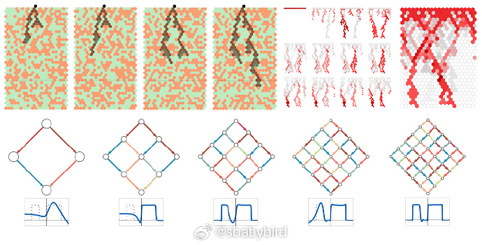
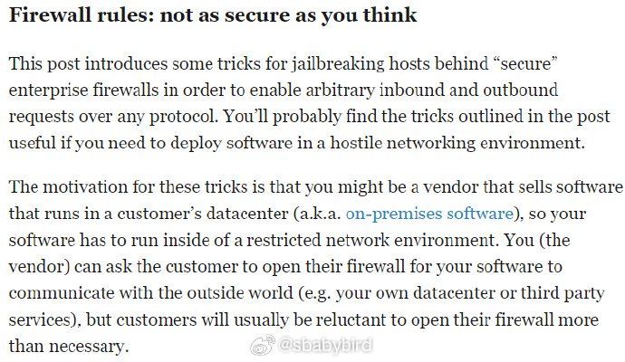
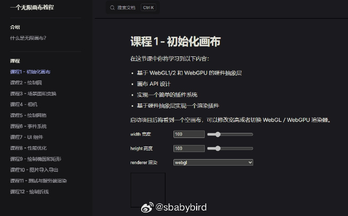
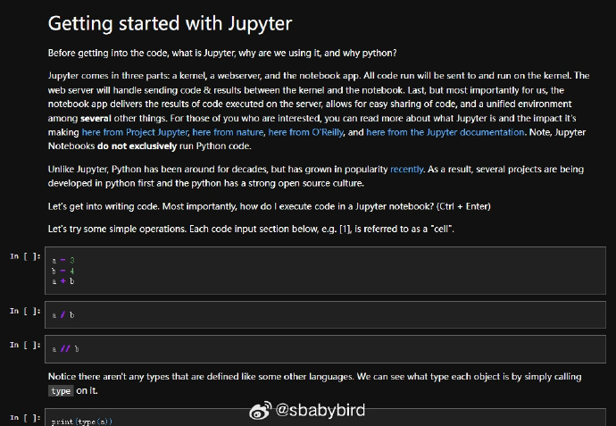
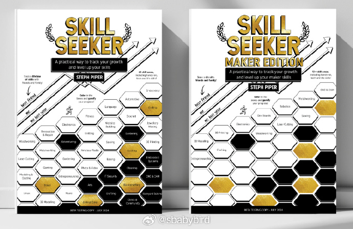
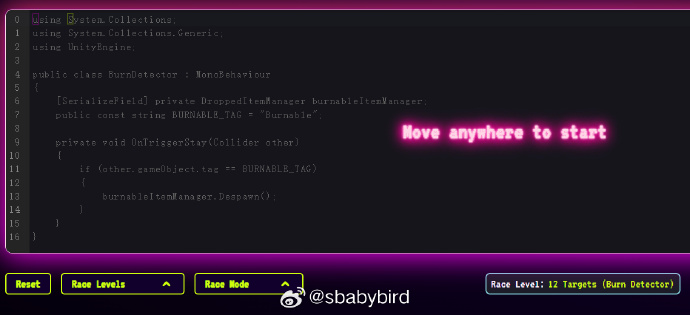

# 机器文摘 第 098 期

## 长文

### 探索机器学习的本质

尽管我们在工程层面上已经取得了巨大进展，但机器学习的基础原理仍然是一个谜。

[《机器学习中真正发生的事情：一些最小模型》](https://writings.stephenwolfram.com/2024/08/whats-really-going-on-in-machine-learning-some-minimal-models/)，一篇来自Stephen Wolfram的最新力作，深入探讨了机器学习的核心奥秘，并通过一系列极简模型揭示了机器学习背后的基本原理。

此文是对机器学习领域的一次深刻反思，不仅为技术人员提供了新的视角，也为对人工智能未来充满好奇的观察者提供了丰富的思考素材。

在文中，作者试图通过构建和讲解一些极简模型来揭开这层神秘的面纱。

文中展示了即使是最简单的模型也能复现机器学习中的复杂现象。

这些模型的简单性让我们更容易理解机器学习的本质。

> “我在这里尝试做的是尽可能深入挖掘——并且尽可能地简化事物。我将探索一些极简模型——这些模型，除了其他优点外，更适合于直观化展示。起初，我并不确信这些极简模型是否能够重现我们在机器学习中观察到的现象。但令人惊讶的是，它们似乎确实可以。”

### 防火墙背后的秘密：如何安全地“打破”规则

[《防火墙可能没你想的那么安全》](https://www.haskellforall.com/2024/08/firewall-rules-not-as-secure-as-you.html)，一篇非常有趣且实用的科技文章，可能会颠覆你对网络安全的一些基本看法。

作者向我们展示了如何在严格的企业防火墙下，依然能够安全地进行网络通信。

文中展示了一些技术，表明“如果同一个人或组织控制了连接的两端，那么通常任何防火墙规则都可能被绕过。”

> “一个常见的技巧是在客户的数据中心内部主机（即内部主机）创建一个外部主机（即你的数据中心）作为代理。这是非常有效的，因为客户无法控制代理和上游主机之间的流量。” 

> “SSH反向隧道允许内部机器（例如internal.example.com）通过外部机器（例如external.example.com）发起的出站TCP请求，保持TCP连接活跃，并监听外部机器上的EXTERNAL_PORT上的入站请求。”

> “corkscrew是一个非常简单的工具，它将SSH连接包装在HTTP连接中。这让我们可以将SSH流量伪装成HTTP流量（然后我们可以通过使用stunnel加密连接，进一步将其伪装成HTTPS流量）。” 

这意味着即使在严格的网络监控下，人们仍然有可能安全地传输数据。

### 一个无限画布教程

[一步步构建一个可用的无限画布](https://infinitecanvas.cc/zh/guide/what-is-an-infinite-canvas)。

> 什么是无限画布？
> infinitecanvas 对“无限”的描述如下：

> 高扩展性。用户可以以非线形的形式自由组织内容结构。
> 缩放。模拟真实世界中的“放大”纵览全局和“缩小”观察细节。
> 直接操作。提供对于基础图形的直观编辑能力，包括移动、成组、修改样式等。
> 实时协作。
> 你一定见过甚至使用过各种包含无限画布的应用，infinitecanvas 上就展示了从设计工具到创意画板在内的众多案例，其中不乏一些知名产品包括 Figma、Modyfi、rnote、tldraw、excalidraw等等。

> 作为一个前端，我对其中涉及到的渲染技术很感兴趣。尽管 tldraw、excalidraw 等普遍使用易用性更高的 Canvas2D / SVG 技术，但 JS 和 Rust 生态中也有很多编辑器、设计工具使用更底层的渲染技术对 2D 图形进行 GPU 加速，以获得更好的性能和体验：

> 因此在这个教程中，我希望实现以下特性：

> 使用 @antv/g-device-api 作为硬件抽象层，支持 WebGL1/2 和 WebGPU。
> 参考 mapbox 和 Figma，尝试使用 Tile-based 渲染。
> 使用 SDF 渲染圆、椭圆、矩形等。
> GPU 加速的文本和贝塞尔曲线渲染。
> 使用 rough.js 支持手绘风格。
> 使用 CRDT 支持协同 Yjs。

## 资源 
### 摩根大通的 Python 培训课程

[python-training](https://github.com/jpmorganchase/python-training)，此 Python 培训面向摩根大通业务分析师和交易员，以及精选客户。

本课程旨在介绍 Python 中的数值计算和数据可视化。

它不是一门完整的计算机科学或编程课程，主要面对没有正式编程背景的人。 ​​​

### 手工爱好者技能树

[MakerSkillTree](https://github.com/sjpiper145/MakerSkillTree)，一个包含制作者技能树和模板的存储库，供您制作自己的技能树。爱 DIY 的人可以收藏。

里面的技能清单都可以打印到 A4 纸上进行随时翻阅。

包括：汽车、钓鱼、盖房、锻造、铸造、音乐、摄影、缝纫等 20 种经典技能，以及科技技能、生活类技能各 20 种。

把这些技能学完之后估计比 手工耿+李子柒 还厉害。

### 用小游戏练习高效使用 vim

[vim-racer](https://vim-racer.com/)，这个网站教你快速地在 VIM 中进行跳转。

网站提供了一个小游戏，模拟了 VIM 的编辑环境，给出了若干个需要移动光标到那儿的目标。

你的任务就是快速定位光标过去，随便用什么方法。

结束后会告你你的得分，以及别人高手的得分。

可以在游戏之后查看网站给出的小 TIPS，练习更优雅快速的跳转方式。

## 观点
### “玩”是一种十分罕见的心理状态

来自微博：[@赵丹赵丹喵](https://weibo.com/1973422271/OvdPqcffQ)

从脑神经科学的角度看，“玩”是一种极其精细、罕见的心理状态，甚至很脆弱。任何一点竞争的动机或者情绪，都会压制住“玩”的感觉。

英文原文是，Neurologically speaking, play is a very fragile state. Any competing motivation or emotion will suppress play. 

这个「玩」的状态，其实也意味着创造力、高能量、热爱、快乐等等一系列的心理状态。所谓的单纯享受过程而不是追逐结果，在「做事」的时候因为「内心享受」收获回报。

热爱驱动而不是恐惧驱动，过程驱动而不是结果驱动，无限游戏而不是有限游戏，这个原理我已经懂了好几年了，可在做事，在写作，在创业的时候，一次又一次丢掉过程只问结果。今天听播客这句话直接击穿我，因为这个「纯粹的玩」的状态，从大脑的生理构成上来看，就是极其难以达到的。

「玩」的对立面就是「竞争心」。竞争心意味着追逐结果，想要赢而害怕输，追逐好而害怕坏，二元对立，好坏分离。这个竞争心，心理学里面叫“小我”，佛学里面叫“我执”。执心一起，贪心一生，纯粹的玩的状态就不复存在了。人就紧绷了，咬牙切齿了，患得患失了，不松弛不快乐不自洽了。

怎么能让自己时时刻刻都在「玩」呢？觉察，觉察，觉察，觉察身体，觉察心，觉察脑，觉察情绪和念头。observe yourself, only then you can be free.

## 订阅
这里会不定期分享我看到的有趣的内容（不一定是最新的，但是有意思），因为大部分都与机器有关，所以先叫它“机器文摘”吧。

Github仓库地址：https://github.com/sbabybird/MachineDigest

喜欢的朋友可以订阅关注：

- 通过微信公众号“从容地狂奔”订阅。

- 通过[竹白](https://zhubai.love/)进行邮件、微信小程序订阅。

