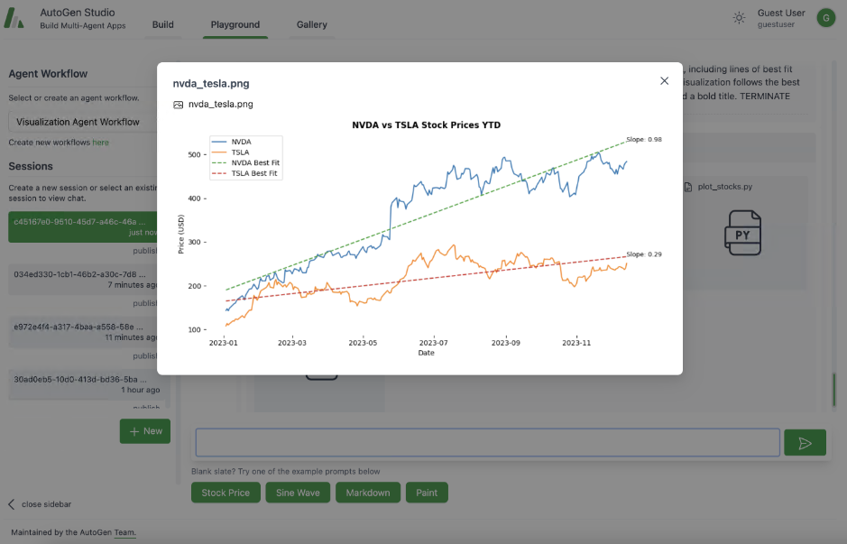

# 机器文摘 第 099 期

## 长文
### 创始人模式

Paul Graham 写了一篇非常精彩的文章[《创始人模式》](https://paulgraham.com/foundermode.html)，微博网友[@阑夕](https://weibo.com/1560906700/Ovi5A5w3m)对此进行了精简版翻译。

文章精彩，翻译亦精彩。

摘录部分内容如下：
> 这么说吧，世上有两种不同的模式来经营公司：创始人模式和管理人模式，在今天，即使是硅谷，也存在着某种潜在的共识，认为扩大规模就意味着转向管理人模式。

> 据我所知，还没有专门解释创始人模式的书被出版，商学院也不知其存在，所以我们能得到的，只有少数创始人自己过河时摸到的石头。不过，既然我们确定了想找什么，事情就好办多了，我希望再过几年，创始人模式也能像管理人模式一样为人熟知，何况现在其实已经能猜到其中的区别在哪。

> 是的，找来优秀的员工，让他们充分发挥，听上去非常有道理，但从一个个创始人的血泪教训来看，这种建议的潜台词就是：雇佣专业的骗子，让他们把公司掏空。

> 创始人意识到自己受到了来自两个方向的操纵：有人告诉他们必须像管理人一样经营公司，而当他们这么做了，又会受到来自被他们管理的员工的压力，他们会让创始人相信，在周围的人都不认同你的判断时，你就应该反思是不是自己错了。

> 比如，乔布斯就为他认为对苹果公司而言最重要的100个人专门组织过一次静修会议，而这100个人并不是按职位级别顺序选出来的，你能想象在一家普通公司需要多大的能力才能推进这样的事情吗？

## 资源 
### 现代与古典的结合：在 DOS 环境里用 JavaScript 写交互动画

[DOjS](https://github.com/SuperIlu/DOjS)，是一个 JavaScript 编程环境，适用于运行 MS-DOS、 FreeDOS 或任何基于 DOS 的 Windows（如 95、98、ME）的系统。它具有集成的编辑器、图形和声音输出、鼠标/键盘/摇杆输入等功能。

DOjS 的功能有点儿类似于 Processing（一个多媒体交互开发环境，有 Java 版本和 Javascript 版本）。

但特点是它确实可以在真正的 DOS 环境下运行，假如你有一台老掉牙的 386 电脑的话，不妨试试这个。

### 用 SQL 玩俄罗斯方块

[tetris-sql](https://github.com/nuno-faria/tetris-sql)，是一个利用 SQL 语言的图灵完备性来构建一个俄罗斯方块（Tetris）游戏。

实现原理：
1. 递归公共表表达式 (CTE)：使用 SQL 的递归 CTE 来创建游戏循环，模拟编程语言中的循环结构。
2. 输出处理：使用 RAISE NOTICE 命令在 PostgreSQL 中输出游戏状态，因为 SQL 标准查询不适用于实时渲染。
3. 输入处理：通过数据库表接收用户输入，游戏循环通过查询这个表来读取玩家操作。
4. 游戏状态管理：使用 SQL 表和数组存储游戏状态，如当前得分、游戏板、玩家操作等。
5. 游戏逻辑：包括方块的移动、旋转、碰撞检测和行消除等逻辑，都通过 SQL 查询和函数实现。
6. 渲染游戏：将游戏板和方块的状态转换为字符串，以在终端或命令行界面中显示。
7. 资源消耗：虽然 CPU 使用率低，但内存和磁盘使用量会随着游戏的进行而增加，因为 SQL 查询保留了中间数据。

SQL 不仅可以用于数据库操作，还能通过创新方法实现复杂的游戏逻辑和算法。

### 一个功能强大且高颜值的 Markdown 编辑器

[Plate](https://github.com/udecode/plate)，基于 React 的富文本编辑器框架，提供了 50+ 个插件直接开箱即用，可以无缝与你系统集成，同时还支持组件定制开发。

UI 响应式设计，支持深浅色主题。

### 微软 AutoGen 的用户界面

[AutoGen Studio](https://github.com/microsoft/autogen/tree/main/samples/apps/autogen-studio)，提供了一个可视化界面，用户可以通过拖放、点击的方式定义和修改智能体以及工作流程。
1. 定义和修改智能体：支持通过界面定义智能体的属性，包括技能、配置和工作流程。
2. 创建和管理会话：支持创建会话，与智能体进行交互，并查看结果，包括聊天历史记录、生成的文件和执行时间。
3. 添加技能：支持为智能体添加技能，以扩展其功能，比如生成图像、查找论文等。
4. 支持将会话发布到本地库。

### LLM 全栈应用框架

[AnythingLLM](https://github.com/Mintplex-Labs/anything-llm)，这是一个全栈应用程序，可以将任何文档、资源（如网址链接、音频、视频）或内容片段转换为上下文，以便任何大语言模型（LLM）在聊天期间作为参考使用。

此应用程序允许选择使用哪个LLM或向量数据库，同时支持多用户管理并设置不同权限。

AnythingLLM 将文档划分为称为 workspaces  (工作区)的对象。

工作区的功能类似于线程，同时增加了文档的容器化。

工作区可以共享文档，但工作区之间的内容不会互相干扰或污染，因此可以保持每个工作区的上下文清晰。

### nanite 渲染引擎基于 WebGPU 的实现

黑神话悟空的火爆让虚幻引擎 UE5 受到更广泛的关注，渲染组件 nanite 亦功不可没。

[nanite-webgpu](https://github.com/Scthe/nanite-webgpu)，是一个使用 WebGPU 在 Web 浏览器中的 Nanite 实现。

包括网格 LOD 层次结构、软件光栅化器。基于每个实例和每个网格进行剔除（在这两种情况下都是视锥体和遮挡剔除）。

支持纹理和逐顶点法线。

可以使用 Deno 离线工作。

### 开源 AI 语音工具箱

[Easy Voice Toolkit](https://github.com/Spr-Aachen/Easy-Voice-Toolkit)，包括音频处理、语音识别、语音转录、数据集制作和语音合成等多种音频工具，形成了一套完整语音模型训练的工作流。

各个工具均支持中文、英文和日文三种语言，提供 Windows 开箱即用的安装包，支持本地部署以及 Google Colab 云端部署。

## 订阅
这里会不定期分享我看到的有趣的内容（不一定是最新的，但是有意思），因为大部分都与机器有关，所以先叫它“机器文摘”吧。

Github仓库地址：https://github.com/sbabybird/MachineDigest

喜欢的朋友可以订阅关注：

- 通过微信公众号“从容地狂奔”订阅。

- 通过[竹白](https://zhubai.love/)进行邮件、微信小程序订阅。

