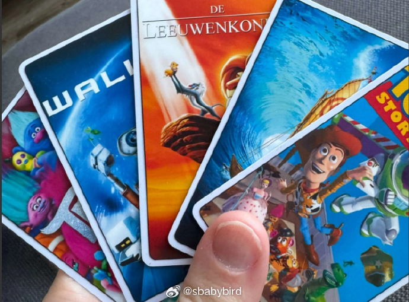

# 机器文摘 第 100 期
### 基于 NFC 的电影点播系统

HN 上一个很有爱的家长，写了一篇[《我是如何为我的孩子构建一个 NFC 电影库的》](https://simplyexplained.com/blog/how-i-built-an-nfc-movie-library-for-my-kids/)，记录了他的一个爱心创意。

为了让孩子们看电影方便，作者自己动手做了一个可以识别 NFC 卡片的电影播放系统，孩子们拿着实体卡放在读卡器上即可实现对应影片的播放。

之所以做这一一个系统，是因为作者感觉拿着遥控器在电视上选来选去，太缺乏仪式感了。

他想让孩子体验自己在童年时跟小伙伴一起挑选 VHS 录像带，并将其放入播放器的那种兴奋感觉。

但是现在像 VHS 这种老旧的播放系统早已被淘汰，于是作者一拍脑袋想到了这个新旧融合的点子。

作者使用了包括一个 ESP32 开发板在内的硬件组合，零件成本大约 25 欧元。

以及自己动手写了一些控制用的代码。

文章记录了整个制作过程，并开源了所用到的图纸和代码。

### Windows shell 推荐

除了 CMD.EXE、PowerShell 以及 WSL，在 Windows 使用命令行还有另外一种选择

[《我最推荐的 windows shell》](https://www.ii.com/git-bash-is-my-preferred-windows-shell/)，这篇文章是关于作者为什么喜欢在 Windows 系统中使用 Git Bash 作为命令行工具的个人体验分享。

Git Bash 是在 Win 系统中安装 Git 时自带的一个 shell，本意在方便用户以 bash 的习惯在 Win 下使用命令行。

作者在文中列举了一些 Win 平台下可用的命令行 shell，并详细介绍了 Git Bash 的特点，以及为什么最终选用它作为日常操作的 shell。

主要原因：
1. 喜欢用 Bash，有多年的使用习惯，和对大量常用命令的依赖（比如 less、awk、cat 等）。
2. 容易安装，随 Git 的安装就带着了。
3. 与 Win 资源管理器完美整合（带有右键菜单：Git Bash Here）。
4. 直接使用 Windows 本身的环境变量（这点儿与 WSL 不同）。
5. 原生支持 UTF-8 编码。

文中还分享了一些定制化技巧以及一些使用上的 tips ，值得收藏。

### 星系可视化

[Galaxy Visualization 星系可视化](https://github.com/Avicted/galaxy_visualization_raylib) 是一个的数据可视化任务项目，它通过蓝色展示100,000个真实星系和红色展示100,000个随机分布的星系，为我们提供了一个直观的宇宙结构视图。

这个项目是 [Åbo Akademi 大学 GPU 编程课程](https://studiehandboken.abo.fi/en/course/IT00CG19/19162?period=2024-2027) 的一部分，该课程专注于教授 CUDA 并行编程技术。

学生们面临的挑战是使用 CUDA 技术计算星系间的 100亿个角度，并验证这些星系的分布并非随机，这一任务需要他们利用超级计算机的GPU资源独立完成。

预期的计算时间仅为大约 3 秒，这不仅考验了学生对CUDA编程的掌握程度，也展示了高性能计算在处理大规模数据集时的潜力。

项目本身提供的是数据的可视化展示，而非课程作业的具体解决方案，它为学生提供了一个直观的参考，帮助他们更好地理解和探索星系分布的复杂性。

项目使用 [Raylib](https://www.raylib.com/) 作为渲染引擎。

### 面向高级语言（ JavaScript, Rust, C等）程序员的汇编语言入门指南

[《写给高级语言用户的汇编语言入门指南》](https://shikaan.github.io/assembly/x86/guide/2024/09/08/x86-64-introduction-hello.html)，
本文以，以“Hello, World!”程序为例，介绍了x86-64汇编语言的基础知识。逐步介绍了x86-64汇编语言的特点、指令结构、寄存器使用、数据存储、程序结构和系统调用。 ​​​

### 使用纯 C 语言构建 Android 应用

[rawdrawandroid](https://github.com/cnlohr/rawdrawandroid)，是一个开源安卓项目框架模板，提前配置好了使用 C 语言开发构建 Android App 的全部环境。

这种并非主流做法，作者提供此框架的目的也只是希望避开一些“必须”使用 Java 才能做的事情，证明只使用 C 语言也同样可以做到并且构建的成果占用资源低且效率高。

### 机器视觉入门教程

AI 界的 github [huggingface.co 出了一个关于机器视觉的教程](https://huggingface.co/learn/computer-vision-course/unit0/welcome/welcome)，从入门到实践，内容非常全面，也很有趣味性。

### 机器视觉开源工具

[supervision](https://github.com/roboflow/supervision)，GitHub 上一个开箱即用的计算机视觉工具，功能非常强大，可用于在图像或视频上绘制指定目标且它完全开源，已有 18.9k star。

### 用 Github 搭建个人博客的另一种方式

[https://www.tinymind.me](https://www.tinymind.me)，
授权你的 Github 账号，就可以用它来写你的个人博客和短想法，每条新日记都会立刻同步到你 Github 一个名为"tinymind-blog"的 repo 里。

这是一个开源产品、没有服务器，只授权公开 repo 的写权限，不会读取 private repo ，只要 Github 不倒闭，你的日记数据就不会丢失。

原理：
用 Github API 在你的目录下创建一个"tinymind-blog" repo
你的每次提交(blog/thoughts)，都会进行一次 commit ，数据被提交到这个 repo 。
读取最新的 blog/thoughts 数据，然后渲染在网页上。

### 一个远程桌面控制软件

[GameViewer](https://gv.163.com)，网易出品的远程控制软件，完全免费，支持 Windows 、macOS 、安卓、iPhone 、iPad 。

使用简单，打开就知道怎么操作。使用场景包括：远程协助、远程办公、远程游戏，具有超低延迟、流畅稳定、高清高帧、多点触控等特点。

### 计算机组成原理开源书籍

分享一本开源免费可在线阅读的书籍：《计算机体系结构基础》（第三版）。

由被誉为 “龙芯之父” 的胡伟武老师等一线科研人员编写，共十二章，涵盖指令系统结构、计算机硬件结构、CPU 微结构、并行处理结构、计算机性能分析等主要内容。

GitHub：https://github.com/foxsen/archbase
在线阅读：https://foxsen.github.io/archbase/index.html

本书可作为高等学校本科生教材，也适合研究生和计算机技术人员参考阅读。

### 关于创造价值
任何工作创造的价值，最终都会转化为刺激产生多巴胺的东西。

也就是满足人们的需求。

但最本质的需求还是多巴胺。

你从事高尚事业，看似与之无关，你只不过提供了中间过程罢了，最终还是一样。

脱口秀演员比较直接，刚讲完段子，观众就分泌了。

当然那些从事特殊职业的，可以更直接的让客人分泌。

所以，你想挣钱，得满足市场需求这不假，但琢磨来琢磨去，发现无非就是围绕怎样让人分泌多巴胺。

## 订阅
这里会不定期分享我看到的有趣的内容（不一定是最新的，但是有意思），因为大部分都与机器有关，所以先叫它“机器文摘”吧。

Github仓库地址：https://github.com/sbabybird/MachineDigest

喜欢的朋友可以订阅关注：

- 通过微信公众号“从容地狂奔”订阅。

- 通过[竹白](https://zhubai.love/)进行邮件、微信小程序订阅。

