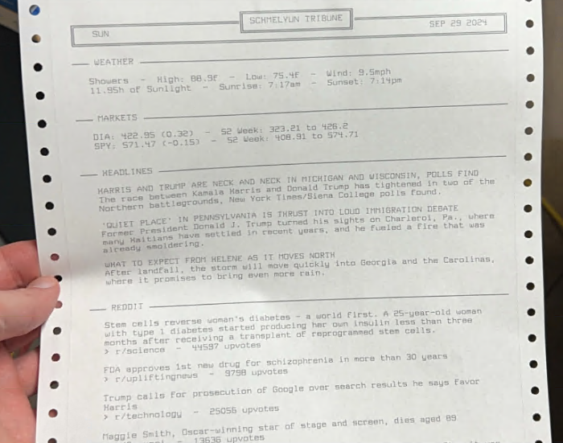
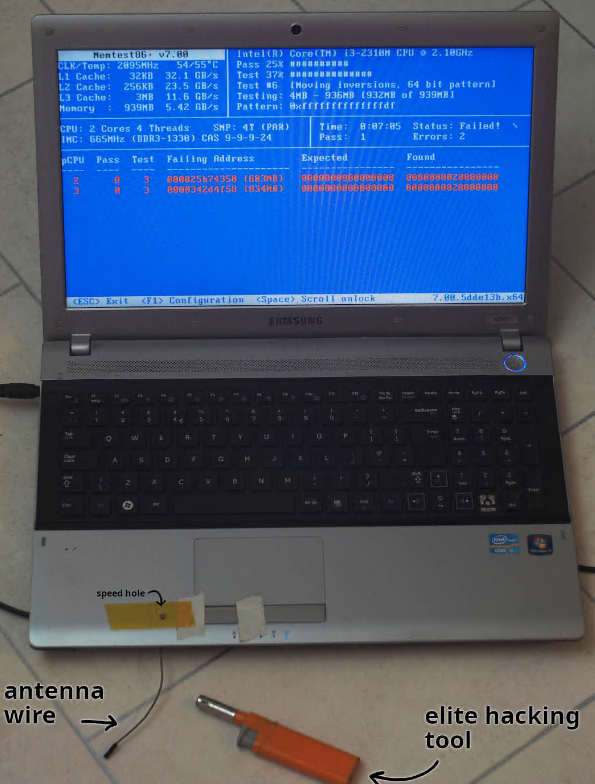
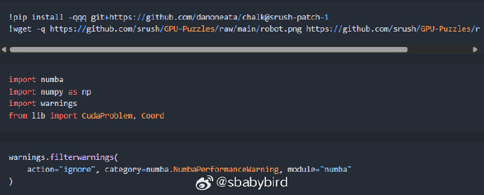
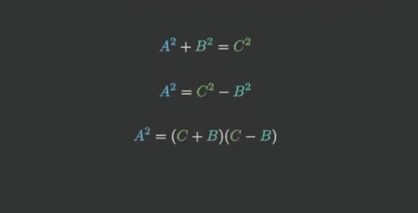
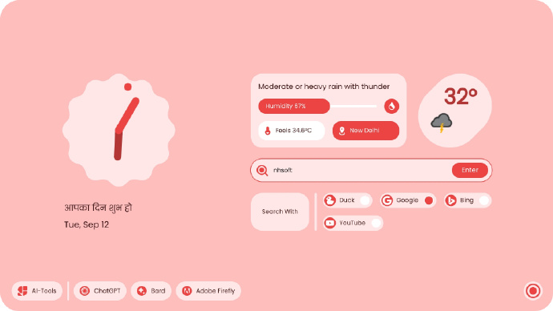

# 机器文摘 第 101 期
### 用点阵打印机给自己每天打一份日报

[《打印日报》](https://aschmelyun.com/blog/getting-my-daily-news-from-a-dot-matrix-printer/)，这篇文章讲述了作者如何利用点阵打印机来获取每日新闻的经历。

作者原本习惯于每天早上通过手机浏览新闻和社交媒体，了解外界发生的事情。

然而，碎片化信息的严重过载，使他决定减少屏幕使用时间。

尽管如此，他还是希望在早晨起床后能够及时获取信息。

为了实现这个目标，作者从eBay上购买了一台点阵打印机，并计划每天打印出一份定制的“日报”来阅读。

文章详细描述了他如何搭建这个系统：

#### 硬件配置
- **点阵打印机**：一台 Star NP-10 型号的打印机。
- **Raspberry Pi Zero W**：用于连接打印机并处理数据。
- **串口转USB适配器**：用于将打印机的串行端口转换为 USB 接口，方便连接。
- **电源**：为打印机和 Raspberry Pi 提供电力。

#### 数据内容
作者希望“日报”包含四个部分：
1. **天气**：提供当天的天气情况。
2. **股票**：展示股票市场的动态。
3. **新闻头条**：主要新闻的摘要。
4. **Reddit热门帖子**：Reddit上受欢迎的帖子。

他通过免费的公共API获取这些信息。

#### 自动化打印
作者通过设置定时任务，使得打印机每天早上8点左右自动打印出他的个性化“日报”。

效果比较令作者满意，这种有限的信息量，通过一张纸呈现的方式，比在网站和社交媒体应用上无休止地滚动浏览要好得多。

发挥一点儿创意，将旧技术与现代技术相结合，有时候可以创造出既有趣又实用的解决方案。

### 用一个打火机来获取 root 权限？

[《你能只用一个打火机获得root权限吗？》](https://www.da.vidbuchanan.co.uk/blog/dram-emfi.html)，文章探讨了通过硬件故障注入（EMFI）来实现黑客攻击的可能性。

要编写一个漏洞利用程序，首先需要一个漏洞。如果没有现成的漏洞，就需要创造性地使用故障注入技术。

注入可以采取多种形式，包括软件控制的数据损坏、电源故障、时钟故障、电磁脉冲、激光等。（我记得 Xbox360 游戏机的硬件破解就是针对 CPU 发送合适的电击脉冲，从而导致某些保护指令失效）

硬件故障注入通常需要专门的（且昂贵的）设备，因为需要在故障注入的时机和位置方面具有高度的精确性。

作者之前了解到使用压电点火器和电感器作为电磁故障注入（EMFI）的低成本工具，并成功利用DFA攻击了运行在Arduino上的AES软件实现。但作者并不满足于此，他想要利用更“真实”的目标。

作者选择了一台2011年生产的三星S3520笔记本电脑作为测试对象，配备有 Intel i3-2310M CPU和 1GB DDR3 RAM。

这台电脑足够新，可以运行轻量级的桌面Linux发行版（作者选择了Arch Linux），但又足够老旧，即使变砖也不会太担心。

他计划通过在这些数据传输引脚上注入故障来实现攻击（作者认为笔记本电脑中最易受物理攻击的部分是连接DRAM内存和系统其余部分的DDR总线。）。

*值得注意的是，作者应该是实现了这个目标，但是文章中并未介绍实施攻击的过程，仅仅提供了大概的思路（可能是出于安全性考虑）*

### CUDA 编程教程

[GPU-Puzzles](https://github.com/srush/GPU-Puzzles)，GPU 拼图，一套通过实践学习 CUDA 编程的教程。

课程采用 Python 笔记本的方式进行教学，可以下载自己的副本在具有 GPU 的环境中执行，也可直接使用在线的免费环境（如 Colab）进行执行。 ​​​

### 数学动画库

[Manim](https://github.com/ManimCommunity/manim)，一个可以用于创建数学动画的开源工具。

可以通过动画的方式精确的展示数学概念和过程。

支持生成各种数学图形和动画，几何图形变换、函数图像绘制、微积分概念演示等。

### 高颜值浏览器主页插件

[materialYouNewTab](https://github.com/XengShi/materialYouNewTab)，一款颜值颇高的浏览器主页插件，采用 Google Material You 的设计风格，提供了自定义搜索引擎、自定义快捷网站图标、主题切换等多种功能。

## 订阅
这里会不定期分享我看到的有趣的内容（不一定是最新的，但是有意思），因为大部分都与机器有关，所以先叫它“机器文摘”吧。

Github仓库地址：https://github.com/sbabybird/MachineDigest

喜欢的朋友可以订阅关注：

- 通过微信公众号“从容地狂奔”订阅。

- 通过[竹白](https://zhubai.love/)进行邮件、微信小程序订阅。

