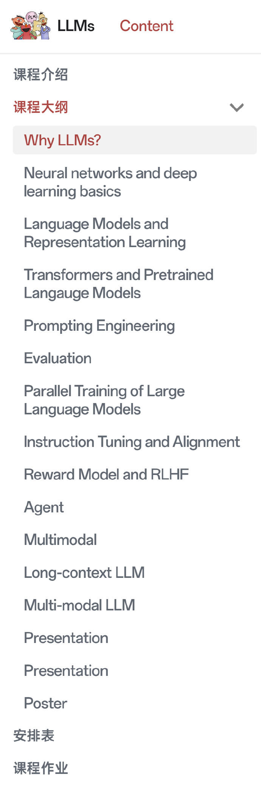
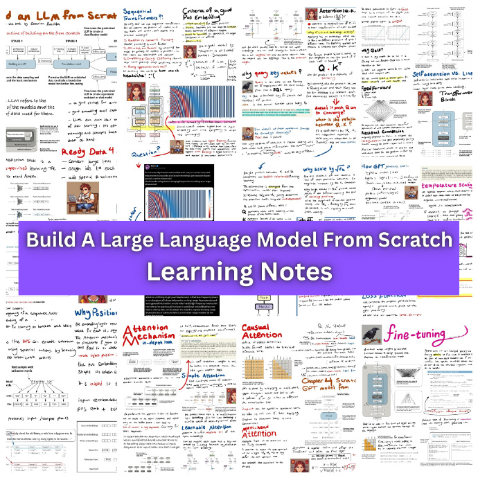
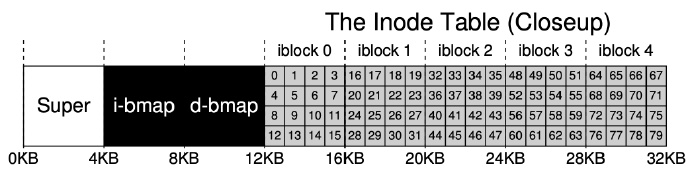
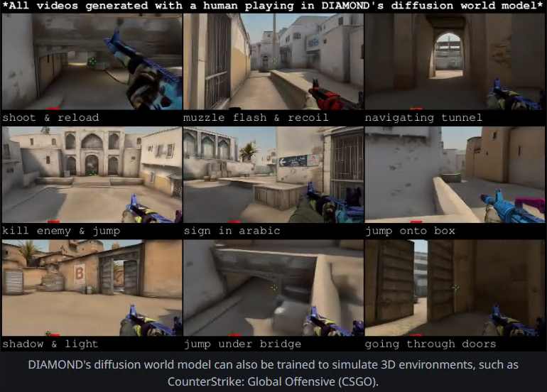
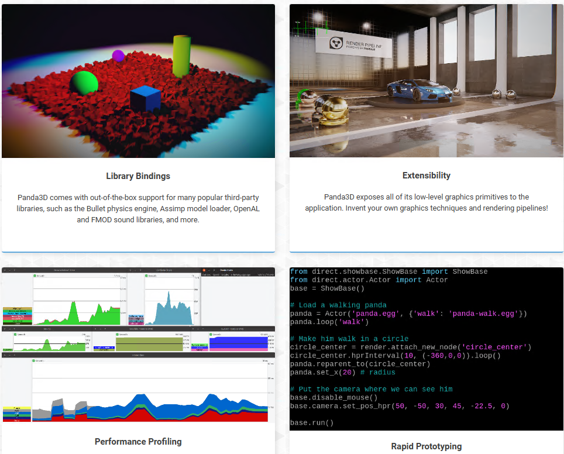
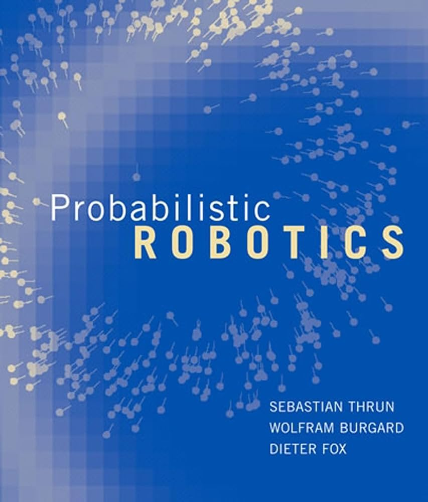
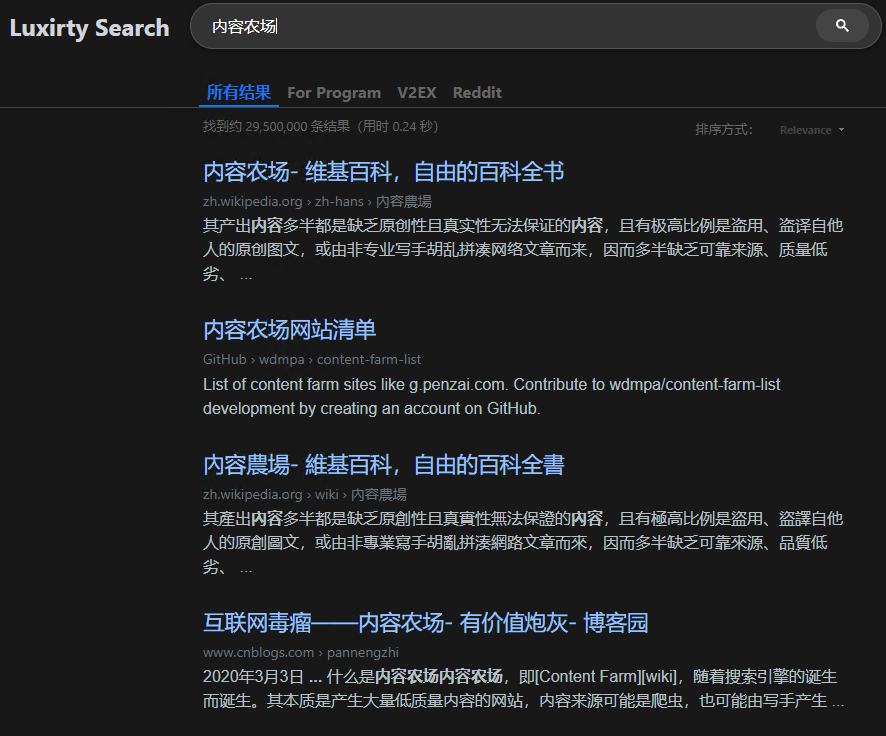
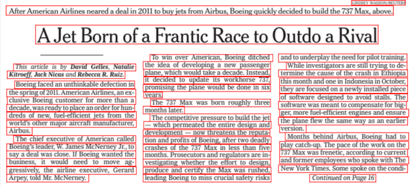
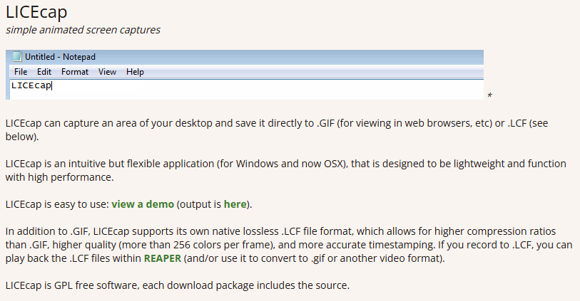

# 机器文摘 第 102 期
### 上海交通大学的大模型课程

LLM 大语言模型技术已经引发了技术革命，对自然语言处理、机器翻译、自动文本生成等领域产生了深远影响。

[这个来自上海交大的课程（号称国内首个 LLM 课程）](https://gair-nlp.github.io/cs2916/docs/intro/)，将帮助学生理解这一革命的本质、历史和未来发展，为他们在相关领域的工作做好准备。

每个章节都可以下载课件并给出了推荐阅读材料。

### 一份从中级到高级的 AI 学习路径

[ML Retreat](https://github.com/hesamsheikh/ml-retreat)，来自国外一名技术博主分享，记录了其在学习高级机器学习时的个人笔记和资源，涵盖了从基础到更高级主题的深入理解。

目前已分享如何从头构建大语言模型、LLM 幻觉深入研究以及 LLM 超越注意力机制等相关笔记。

### 实现一个 256KB 的迷你文件系统

[螺蛳壳里做道场：实现一个 256KB 的迷你文件系统](https://www.qtmuniao.com/2024/02/28/mini-filesystem/)，提供了一个迷你文件系统的实现示例，涵盖了文件系统的多个关键组成部分，包括数据结构、读写流程、目录组织和空闲空间管理。通过这个简单的模型，读者可以对文件系统的工作原理有一个直观的理解。

> 本文主要 “编译” 自书籍[《Operating Systems: Three Easy Pieces》](https://pages.cs.wisc.edu/~remzi/OSTEP/)第 40 章，这是一本非常深入浅出的书，推荐给所有对操作系统感到迷茫的同学。本文件系统基于一个非常小的硬盘空间，以数据结构和读写流程为主线，从零到一的推导出各个基本环节，可以帮你快速建立起对文件系统的直觉。

> 文件系统基本都是构建于块存储之上的。但当然，现在的一些分布式文件系统，如 JuiceFS，底层是基于对象存储的。但无论块存储还是对象存储，其本质都是按 “数据块” 进行寻址和数据交换的。

> 我们首先会探讨一个完整的文件系统在硬盘上的数据结构，也即布局；然后再通过打开关闭、读写流程将各个子模块串起来，从而完成对一个文件系统要点的覆盖。

### 开局一张图，剩下全靠编？

日内瓦大学等机构研究的强化学习智能体——[DIAMOND世界模型（World model）](https://diamond-wm.github.io/)，做到了。

这个项目验证了一种新的图形技术：不使用传统游戏渲染技术，而是通过模型预测，实时生成游戏的视频帧。

也就是说，用户通过鼠标键盘进行输入，模型便会根据用户的操作生成下一帧视频。

基本原理：
1. 扩散模型：核心模块，通过逆向学习噪声过程来生成高质量的视觉数据。输入过去的观察与动作数据，模型可以预测未来的画面、奖励和任务是否终止。
2. 奖励模型：使智能体能够评估其行为，并通过这些评估优化决策能力。奖励信号是强化学习系统中至关重要的一环，驱动智能体不断改进其策略。
3. 终止模型：该模型能帮助智能体识别任务何时结束，或者需要重新开始。例如在自动驾驶中，智能体需要知道自己何时到达目的地。

### Python 图形库

[Panda3D](https://github.com/panda3d/panda3d)，一个开源、跨平台的游戏引擎，专为开发实时 3D 图形应用程序而设计。它由迪士尼和卡内基梅隆大学共同开发，提供了丰富的功能和灵活的 API，使开发者能够快速构建复杂的 3D 应用程序和游戏。Panda3D 支持 Python 和 C++ 编程语言，适合不同层次的开发者使用。

### 机器人算法实践

[机器人算法实践](https://github.com/carlos-argueta/rse_prob_robotics)，基于《概率机器人学》书中的机器人算法在 [ROS 2](http://dev.ros2.fishros.com/doc/)（用于构建机器人的第二代机器人操作系统，其包含了大量的机器人相关软件库和工具集。） 上的实现，旨在通过 Python 和 C++ 代码，将书中的理论与现实世界中的机器人应用相结合，实现快速原型开发和深入理解。

### 开源搜索引擎

[Luxirty Search](https://github.com/KoriIku/luxirty-search)，基于 Google，屏蔽内容农场，具有无广告、无跟踪、干净、简洁，快等特点。

功能特性：

1. 内置内容农场屏蔽，包括 CSDN 等 SEO 站点和 Stack Overflow 中文翻译站。
2. 一键提升 GitHub、Stack Overflow、V2EX、博客园搜索权重，无需手动输入 site:。
3. 一键搜索 v2ex、Raddit。
4. 内置广告屏蔽、跟踪链接移除。

### 高性能开源 OCR 工具

[Surya](https://github.com/VikParuchuri/surya)，超强的开源 OCR 工具，新版本使用了新的架构，性能优于当前的SoTA开源模型 Table Transformer。

功能特性：

1. 识别表格行、列和单元格和具体的字符。
2. 识别复杂的布局（标题、图像等等）和旋转的表格。
3. 支持包括中文在内的90多种语言。
4. 可在本地运行，提供API。

### 极简 GIF 录制工具

[LICEcap](https://www.cockos.com/licecap)，一个十分简洁的 GIF 录制工具，软件体积仅几百 KB，录制生成的 GIF 品质优异，生成的文件体积也很小。支持 Windows 和 Mac 平台。

## 订阅
这里会不定期分享我看到的有趣的内容（不一定是最新的，但是有意思），因为大部分都与机器有关，所以先叫它“机器文摘”吧。

Github仓库地址：https://github.com/sbabybird/MachineDigest

喜欢的朋友可以订阅关注：

- 通过微信公众号“从容地狂奔”订阅。

- 通过[竹白](https://zhubai.love/)进行邮件、微信小程序订阅。

