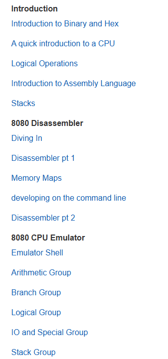

# 机器文摘 第 103 期

### 制作一个带全息图像的窗户

一扇透明的窗户在特定光线下能展现出隐藏的图像，甚至3D全息图？

文章[《Hiding Images in Plain Sight: The Physics Of Magic Windows》](https://mattferraro.dev/posts/caustics-engineering)讲述了如何制作一个具有魔力的透明亚克力窗户。

这个窗户在正常情况下看起来是完全透明的，但当你用手电筒照射或在阳光下时，它能形成图像或3D全息图。

实现这个魔法背后的物理原理是光的折射和一种称为“焦散”的现象。

焦散是当光线照射到透明物体时形成的明亮光斑。

即使是物体表面微小的不平整也能形成强大的透镜效果，产生强烈的焦散图案。

作者通过精确控制亚克力表面的形状（通过控制表面的凹凸），使得折射的光线能够形成焦散图像。他将这个过程比作传统的凸透镜，通过调整透镜的曲率来控制光线的汇聚或发散，从而影响图像的亮度。

作者在文中详细介绍了如何通过数学建模和计算来设计这样的窗户。首先，他将问题公式化，然后通过迭代方法逐步求解。

使用类似于计算流体动力学的方法，通过定义一个“速度势”来模拟光线压力的分布，并通过求解泊松方程来找到所需的表面形状。

文末提供了相关代码和设计文件。

### 使用 Pytorch 从零开始构建大型语言模型

[《LLM from scratch with Pytorch》](https://medium.com/@msouza.os/llm-from-scratch-with-pytorch-9f21808c6319)，作者 Matheus Oliveira De Souza，介绍了如何使用 Pytorch 从零开始构建大型语言模型（LLM）。

文章先解释了生成模型和LLM的基本概念，然后逐步介绍了模型的各个组成部分，包括Tokenization、Embedding层、Transformer架构以及Attention机制。

作者分享了自己使用 Pytorch 实现 Medium 文章生成器的经历，包括数据集准备、模型训练和测试。

文章还探讨了使用预训练的 GPT-2 嵌入层来加速训练过程。

### 基于编程的物理教程

[十分钟物理](https://matthias-research.github.io/pages/tenMinutePhysics/index.html)，教你用 JavaScript 模拟物理现象，如火焰、弹球碰撞、欧拉流体等很多内容。

每则教程配有详细的笔记、代码、demo和教学视频。 ​​​

### 教你如何编写游戏模拟器

[Emulator 101](http://www.emulator101.com/)，该教程以C语言为基础，适合想要深入了解CPU工作原理的学习者。

教程指导读者一步步编写一个模拟 Space Invaders 游戏的 8080 CPU 仿真器，通过实际操作帮助理解 CPU 的工作原理和汇编语言。

除了基础的编程知识，还涵盖了二进制和十六进制的介绍、CPU的快速入门、逻辑操作、汇编语言、堆栈等内容。此外，还提供了针对不同平台（如Mac OS X、iOS）的模拟器移植指南。

### 效果极好的 TTS(文本合成语音)

[F5-TTS](https://github.com/SWivid/F5-TTS)

1. 零样本声音克隆，生成的语音自然且富有表现力
2. 推理实时率达到0.15，优于现有基于扩散的TTS模型
3. 支持控制语音速度，并保持声音自然
4. 支持无缝在不同语言/方言间平滑过渡

### 一款开源免费的远程会话管理工具

[1Remote](https://github.com/1Remote/1Remote)，能够让你在任何时候快速开启一个远程会话，支持微软远程桌面(RDP)、VNC、SSH、Telnet、SFTP, FTP, RemoteApp 等协议。

具有如下特性：

- 多协议支持：支持 RDP, SSH, VNC, Telnet, (S)FTP, RemoteApp 等协议，颇为全面；
- 快速启动：可通过 Alt + M 快速启动远程会话，支持拼音检索汉字；
- 多显示器支持：提供了出色的 RDP 多显示器远程管理体验；
- 细节配置：可以为每个连接设置 标签、图标、连接前后执行脚本等；
- 界面定制：支持多语言和多主题切换，还可以根据个人喜好调整界面布局；
- 可自定义启动器，在 sFTP、VNC 等协议中，用自己喜欢的程序来替换内置程序；
- 开箱即用： Exe 版本下载解包即可，不需要执行任何安装操作。

### 一个全能离线 OCR 桌面工具

[eSearch](https://github.com/xushengfeng/eSearch)，截屏 离线OCR 搜索翻译 以图搜图 贴图 录屏 万向滚动截屏 屏幕翻译 。

作者自荐：> eSearch 是Information-portal的:electron:重写版(顺便加了亿些功能)
> 主要是想在 Linux 上(win 和 mac 上也能用)实现锤子大爆炸或小米传送门这样的屏幕搜索功能，当然也是一款方便的截屏软件。
> 经过数次版本迭代，eSearch 的功能愈加丰富
> 即拥有 截屏+OCR+搜索+翻译+贴图+屏幕翻译+以图搜图+滚动截屏+录屏

### 开源虚拟数字人 

[Virtualwife](https://github.com/yakami129/VirtualWife)，是一个创新的虚拟数字人项目，专注于开发具有 AI 的虚拟角色。

角色设计用于在B站等直播平台上进行互动，提供娱乐和信息。

通过集成先进的 AI 技术，如自然语言处理和机器学习，Virtualwife 的角色能理解和响应用户输入，提供更加自然和智能的交流体验。

Virtualwife 基于 OpenAI 等 AI 研究机构的技术增强虚拟角色的能力。

> VirtualWife是一个虚拟数字人项目，项目还处于孵化阶段，有很多需要优化的地方，作者想打造一个拥有自己“灵魂”的虚拟数字人，你可以像朋友一样和她相识，作者希望虚拟数字人融入人类生活，作为恋爱导师，心理咨询师，解决人类的情感需求。

## 订阅
这里会不定期分享我看到的有趣的内容（不一定是最新的，但是有意思），因为大部分都与机器有关，所以先叫它“机器文摘”吧。

Github仓库地址：https://github.com/sbabybird/MachineDigest

喜欢的朋友可以订阅关注：

- 通过微信公众号“从容地狂奔”订阅。

- 通过[竹白](https://zhubai.love/)进行邮件、微信小程序订阅。

