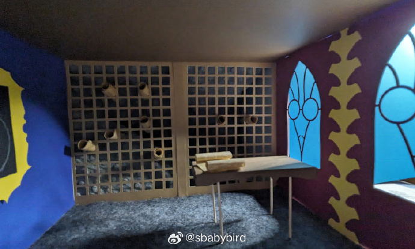
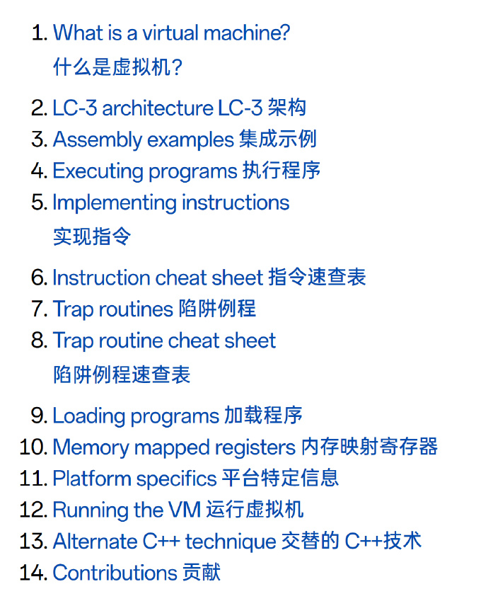
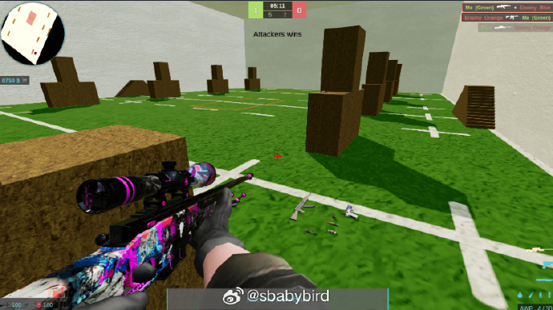
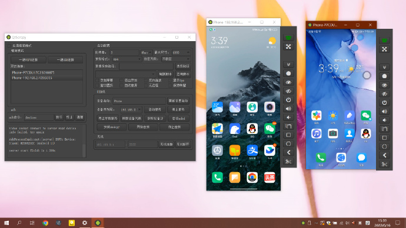
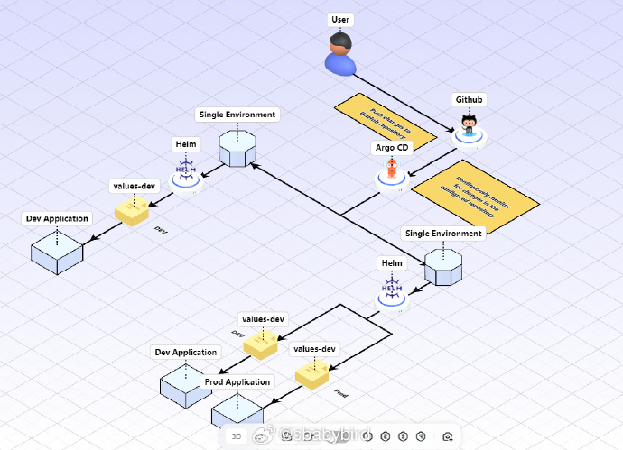
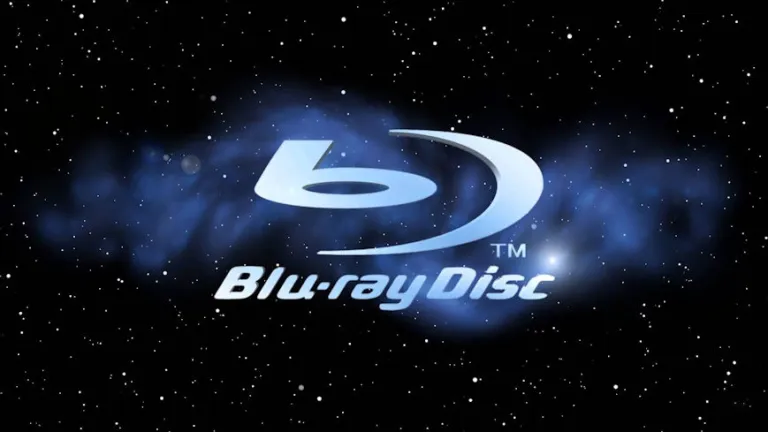
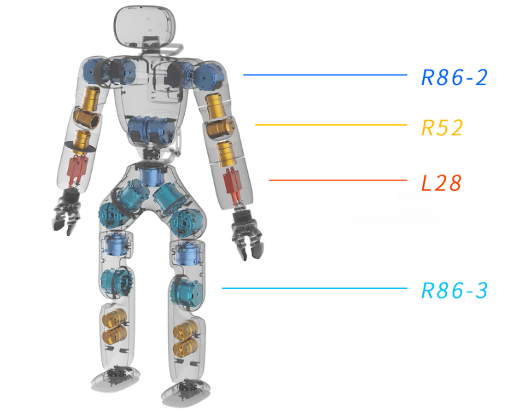
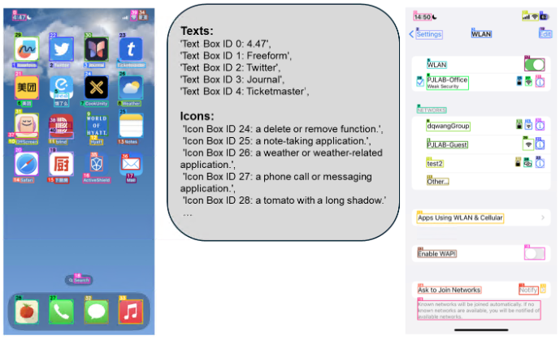
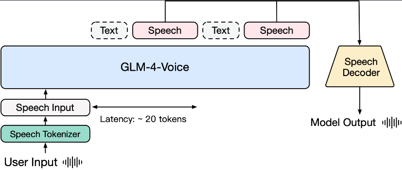
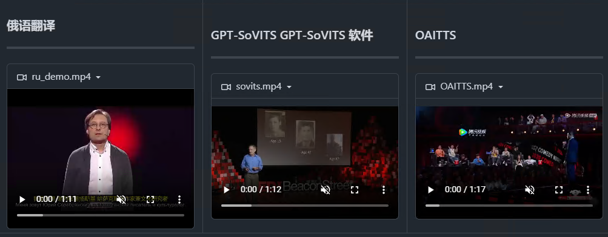

# 机器文摘 第 104 期
### 基于比 Unreal 更 Real 的“游戏引擎”制作游戏

在游戏界，Unreal Engine 是许多开发者的得力助手，能够制作出十分逼真的游戏场景。

但是看多了也会腻。

于是，有位开发者决定[用“Real Engine”——也就是他的双手和一堆材料——来打造一个 Real 游戏](https://novalis.org/blog/2024-10-18-building-a-game-with-the-real-engine.html)。

此游戏的开发，不建模、不编写 shader，而是直接动手做模型，拍照，然后像拼图一样在游戏里拼出他的世界。

在这个过程中，作者遇到了不少挑战，比如光线泄漏、视觉设计问题，还有材质选择的纠结。

虽然原型只花了几天时间，但他很快意识到，完成整个游戏可能需要他余生的所有周末。

作者在文中也解释了为什么他没有选择 Blender 或 AI 生成艺术，因为他想要的是独一无二的真实感（全部来自实拍！）。

他甚至自制了一个基于 Raspberry Pi 的相机系统，用来拍摄那些精心制作的模型，确保每个细节都能在游戏中完美呈现。

手工侠坚持不用现成的模型家具和3D打印件，因为他不想让游戏看起来像是宜家的样板间。

他用定格技术制作动画，虽然他承认自己的作品和专业动画师还有差距，但至少游戏作品不会让人在第一关就猜到结局。

作者乐观预计在2025年或2026年发布他的游戏“High Mountain Abbey”。

### 编写属于你自己的虚拟机

[Write your Own Virtual Machine](https://www.jmeiners.com/lc3-vm/)，本文指导读者如何编写自己的虚拟机（VM），以运行汇编语言程序。文章提供了一个关于虚拟机的全面介绍，包括其定义、LC-3架构、汇编示例、执行程序、实现指令集、陷阱例程等。最终代码仅约250行C语言。学习要求读者具备基本的C/C++和二进制算术知识。

### 开源反恐精英游戏

[Counter-Strike](https://github.com/solcloud/Counter-Strike)，项目提供编译好的客户端可执行文件，以及后端服务代码。

运行联网游戏需要自行搭建服务。 ​​​

### 手机投屏电脑工具

[QtScrcpy](https://github.com/barry-ran/QtScrcpy)，支持通过 USB 或 WIFI 一键连接 Android 设备到电脑，实现屏幕显示和控制，无需 root 权限。

提供了丰富功能，包括实时屏幕显示、键鼠控制、屏幕录制、截图、批量操作、文件传输、剪贴板同步等。

支持 GNU/Linux、Windows 和 macOS 主流平台，提供高性能、高质量、低延迟和快速启动的使用体验。

### 架构图，但是 3D 的

[icraft](https://icraft.gantcloud.com/)，一个绘制 3D 架构图的工具。

iCraft Editor 是一款免费的3D架构图绘制工具，用来绘制3D架构图，采用真实3D场景展现架构图、网络拓扑图、其他3D结构图，绘制AWS|GCP|Azure|AliCloud架构图，将您的AWS|GCP|Azure|AliCloud环境可视化为等距架构图, 可旋转视角、嵌套子场景，帮助您轻松绘制出色的3D架构图

iCraft Editor的主要特点：

1. 可免费在线使用
2. 真3D场景，可自由切换视角
3. 可嵌套子场景
4. 可编辑动画

### PGS 字幕格式详解

蓝光里面有个叫 PGS（Presentation Graphic Stream）的字幕格式，是以图片形式存储的字幕，扩展名一般为 .SUP。播放器在播放的时候就是跟着时间轴读取图片然后渲染到画面上。

这个格式的技术信息，资料较少，这篇文章解析了 PGS 的技术规格。

相关开源仓库：
- https://github.com/Sec-ant/BDSupReader
- https://github.com/mjuhasz/BDSup2Sub
- https://github.com/xwlcn/BDSupSubPlus
- https://github.com/wswartzendruber/PGS4NET

### 开源人形机器人

[智元机器人](https://www.zhiyuan-robot.com/DOCS)，稚晖君创业研发的：智元人形机器人，全套资料全球开源，包括设计图纸和代码。

灵犀X1全身包含29个关节（R86-2*9、R86-3*6、R52*10、L28*4）和2个夹爪，支持扩展头部3自由度。

开发资料包括：BOM清单、整机图纸、装机SOP等。

从硬件上来看，该机器人使用了一台 i7-13620H 迷你主机作为计算中枢，使用一台 glient MT2500A 有线路由器作为网络中枢。

有趣的是，在物料清单上，有些电子料和成品套件还给出了淘宝链接（上链接！）。

### 解析屏幕界面交互的工具

[OmniParser](https://github.com/microsoft/OmniParser)，微软开源的一款可以解析和识别屏幕上可交互图标的工具，它能准确的识别出用户界面中的可交互图标，在解析方面优于 GPT-4V。

功能特性：
- 双重识别能力，能找出界面上所有可以点击的地方，具备语义理解能力，能理解按钮或图标的具体功能
- 可以作为插件，与Phi-3.5-V、 Llama-3.2-V以及其他模型结合使用
- 支持结构化输出，除了识别屏幕上的元素，还能将这些元素转换成结构化的数据

### 端到端情感语音对话模型

[GLM-4.Voice](https://github.com/THUDM/GLM-4-Voice)，智谱开源的情感语音模型，一款端到端语音模型，能情感共鸣、支持打断、多语言多方言支持。

功能特性：
- 情感表达和情感共鸣：可以模拟不同的情感和语调，高兴、悲伤、生气、害怕等情绪，会用合适的情绪语气回复
- 调节语速：可以要求 ta 快点说 or 慢点说
- 随时打断：可以根据实时的指令，调整语音输出的内容、风格和情感，支持更灵活的对话互动
- 多语言、多方言支持：目前支持中英文语音以及中国各地方言，擅长粤语、重庆话、北京话

### 开源视频翻译工具

[VideoLingo](https://github.com/Huanshere/VideoLingo)，是一站式视频翻译本地化配音工具，旨在生成 Netflix 级别的高质量字幕，告别生硬机翻，告别多行字幕，还能加上高质量的配音，让全世界的知识能够跨越语言的障碍共享。通过直观的 Streamlit 网页界面，只需点击两下就能完成从视频链接到内嵌高质量双语字幕甚至带上配音的整个流程，轻松创建 Netflix 品质的本地化视频。

功能特性：
- 🎥 使用 yt-dlp 从 Youtube 链接下载视频
- 🎙️ 使用 WhisperX 进行单词级时间轴字幕识别
- 📝 使用 NLP 和 GPT 根据句意进行字幕分割
- 📚 GPT 总结提取术语知识库，上下文连贯翻译
- 🔄 三步直译、反思、意译，媲美字幕组精翻效果
- ✅ 按照 Netflix 标准检查单行长度，绝无双行字幕
- 🗣️ 使用 GPT-SoVITS 等方法对齐配音
- 🚀 整合包一键启动，在 streamlit 中一键出片
- 📝 详细记录每步操作日志，支持随时中断和恢复进度
- 🌐 全面的多语言支持，轻松实现跨语言视频本地化

VideoLingo 提供 一键简易包 和 源码安装 两种本地安装方式。

## 订阅
这里会不定期分享我看到的有趣的内容（不一定是最新的，但是有意思），因为大部分都与机器有关，所以先叫它“机器文摘”吧。

Github仓库地址：https://github.com/sbabybird/MachineDigest

喜欢的朋友可以订阅关注：

- 通过微信公众号“从容地狂奔”订阅。

- 通过[竹白](https://zhubai.love/)进行邮件、微信小程序订阅。

