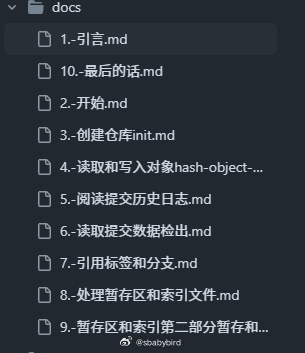
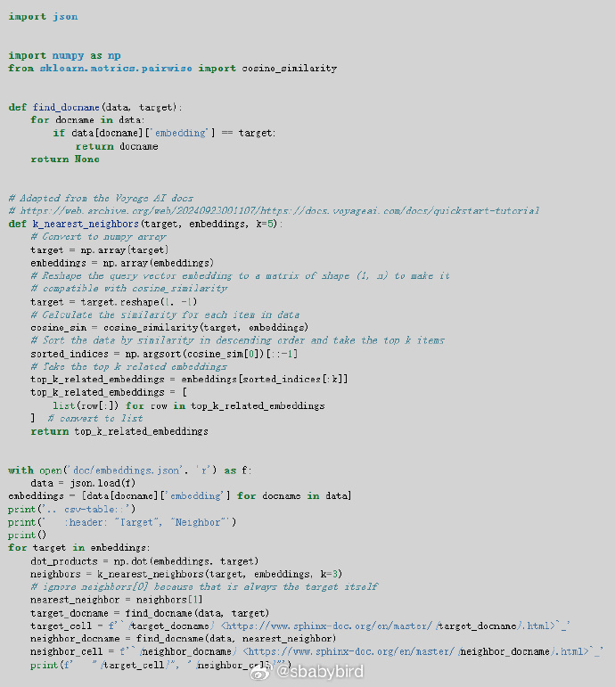
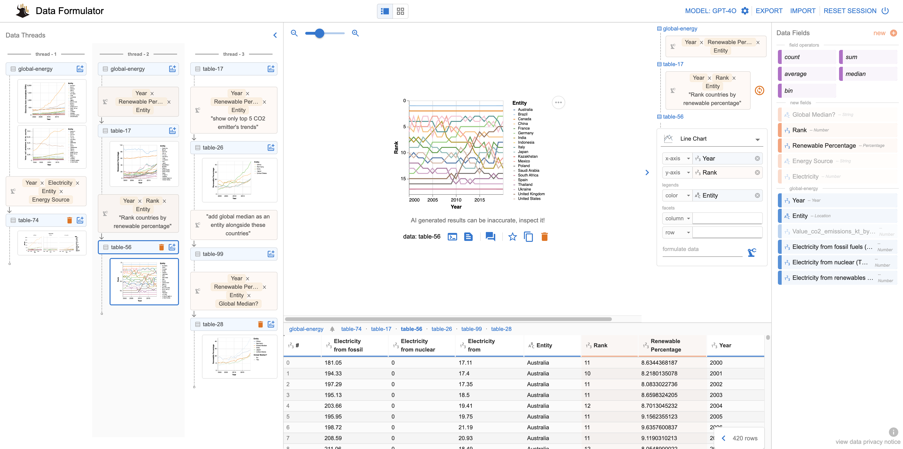
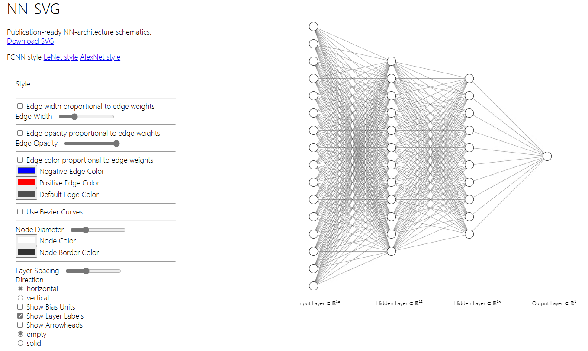
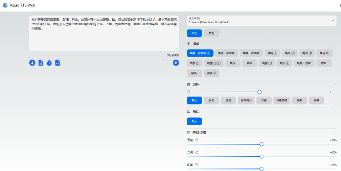

# 机器文摘 第 105 期
### 手写一个 Git 版本控制系统

[自己动手写 Git](https://github.com/hanyujie2002/wyag-zh)。

> 本文旨在从基础开始，深入解释 Git 版本控制系统。这听起来并不简单，过去的尝试往往效果不佳。但有一个简单的方法：要理解 Git 的内部机制，只需从头实现一个 Git。

> 这不是开玩笑，也并不复杂：如果你仔细阅读这篇文章并编写代码（或者直接 下载代码 压缩包——但我强烈建议你自己动手写代码），你将得到一个名为 wyag 的程序，它实现了 Git 的基本功能：init、add、rm、status、commit、log……而且与 Git 本身兼容，甚至可以说最后添加关于提交部分的记录是由 wyag 本身而不是 Git 创建的 （链接）。所有这一切仅需 988 行简单的 Python 代码。

> 那么，Git 真的有那么复杂吗？我认为复杂性是个误解。确实，Git 是一个功能丰富的大型程序，但其核心其实非常简单，表面上的复杂性往往源于其深奥之处（而且 Git 被比作墨西哥卷饼 的讨论可能也没有帮助）。实际上，让 Git 令人困惑的，正是它核心模型的极简与强大。核心的简单性与丰富的应用之间的结合，常常让人难以理解，因为需要一定的思维跳跃才能从基本的简单性中推导出各种应用。

> 通过实现 Git，我们将能更清晰地认识其基本原理。

### 自然语言处理中的 Embedding 是什么？

Embedding 直译过来是嵌入，但实际上这个技术的主要作用是将文本进行向量化（给文本提取多维度特征，用于判断文本之间的关系远近）。

[《嵌入被低估了》](网页链接)，这篇文章讨论了机器学习（ML）技术中的嵌入技术对技术写作领域可能产生的影响。

文章介绍了如何使用嵌入技术，以及它们是如何工作的。例如，使用 Gemini 服务提供商的 API 来生成嵌入向量的结果。

嵌入技术将文本映射到一个多维空间中，每个维度代表一个特征。通过比较两个嵌入在这个多维空间中的距离，可以确定两个文本在语义上的接近程度。

作者进行了一个实验，通过 Sphinx 扩展为每个文档生成嵌入，并将结果存储在 embeddings.json 文件中。然后，使用线性代数方法找到每个文档的最近邻，即与当前页面相关的推荐页面。

实验表明，嵌入技术可能为我们维护文档的能力带来数量级上的提升。

### 基于自然语言的数据可视化

[data-formulator](https://github.com/microsoft/data-formulator)，微软开源的一个数据可视化AI工具项目：data-formulator，支持用户界面交互和自然语言输入结合的方式，进行数据转换并创建可视化效果。

能处理图片和混乱文本，专业分析师和普通用户都能用。

特点：
1. 结合了拖拽操作和自然语言输入，不用写代码；
2. 可以自动理解数据关系，智能推荐合适的图表类型，能自动转换和清理数据，可以处理复杂的数据计算；
3. 可以调整图表样式，支持迭代式修改，可以基于现有图表继续优化；
4. 支持多种图表类型，能处理图片和混乱文本，自动生成数据转换的代码；

### 专门绘制神经网络的绘图工具

[NN-SVG](https://github.com/alexlenail/NN-SVG)，一个参数化生成神经网络（NN）架构图的工具，能帮助科研人员快速画出学术级别的示意图，支持一键导出SVG格式。

节点层数、数量、颜色、大小等各类属性，都可以自定义设置。支持绘制多种神经网络图，比如：

1. 全连接神经网络（FCNN）；
2. 卷积神经网络（CNN）；
3. 深度神经网络，参考 AlexNet 论文的风格；

### 纸质文档数字化存档工具

[paperless-ngx](https://github.com/paperless-ngx/paperless-ngxpaperless-ngx)，一个基于 Django 的文档管理系统，可将纸质文档转换成可搜索的在线存档。不同于普通的扫描仪将实体书变为难以检索的图片或 PDF 格式，它通过文档扫描器实现电子化，转化为易于检索的格式。

### 免费在线文本转语音

[Azure TTS Web](https://tts.femoon.top/cn)，支持一次最多转换2000字，生成的声音非常真实、自然，有男性、女性的角色可选，情绪可匹配亲切、愉悦、兴奋、抱歉等。 ​​​

### transformer 可视化

[transformer-explainer](https://poloclub.github.io/transformer-explainer/)。
> Transformers 彻底改变了机器学习，但它们的内部工作原理对许多人来说仍然模糊不清。我们推出了 Transformer Explainer，这是一个互动可视化工具，旨在帮助非专业人士通过 GPT-2 模型了解 Transformers。我们的工具通过整合模型概览并在数学操作和模型结构的不同抽象层次之间平滑过渡，帮助用户理解复杂的 Transformer 概念。
> 它在用户的浏览器中本地运行一个实时 GPT-2 实例，让用户能够输入自己的内容，并实时观察 Transformer 的内部组件和参数如何协同工作来预测下一个词元。该工具无需安装或特殊硬件，从而扩大了大众对现代生成式 AI 技术的教育途径。

## 订阅
这里会不定期分享我看到的有趣的内容（不一定是最新的，但是有意思），因为大部分都与机器有关，所以先叫它“机器文摘”吧。

Github仓库地址：https://github.com/sbabybird/MachineDigest

喜欢的朋友可以订阅关注：

- 通过微信公众号“从容地狂奔”订阅。

- 通过[竹白](https://zhubai.love/)进行邮件、微信小程序订阅。

