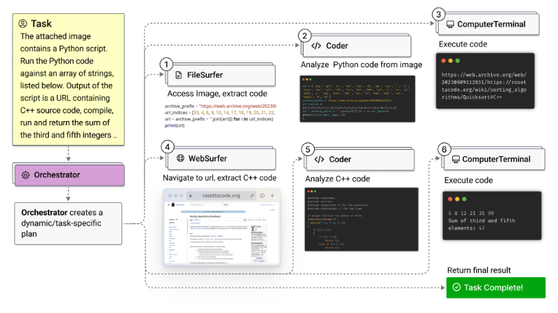
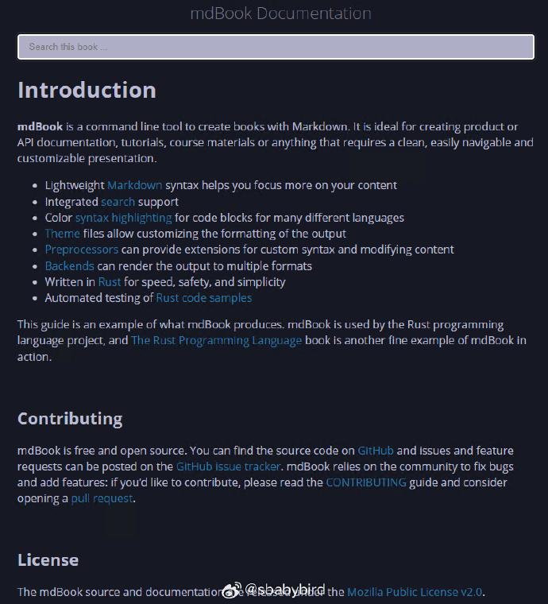
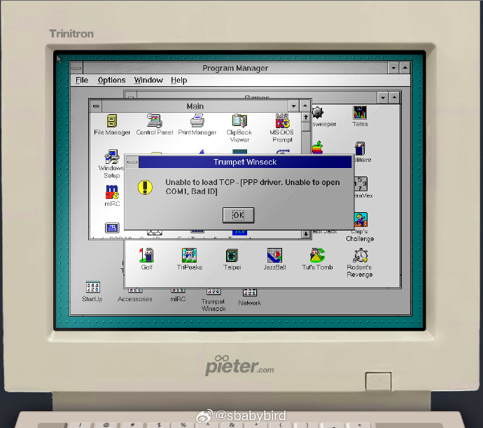
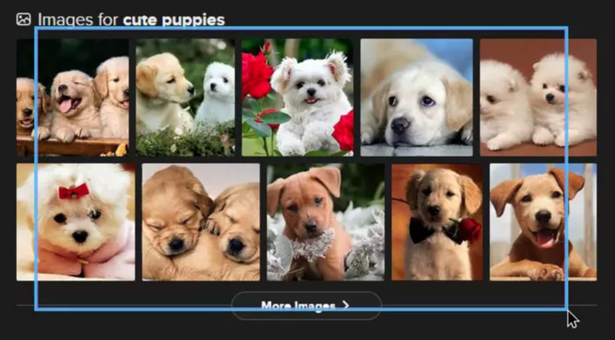
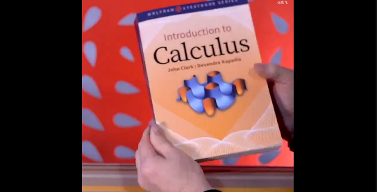
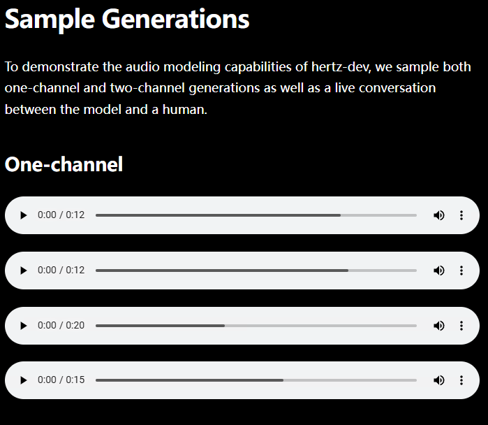
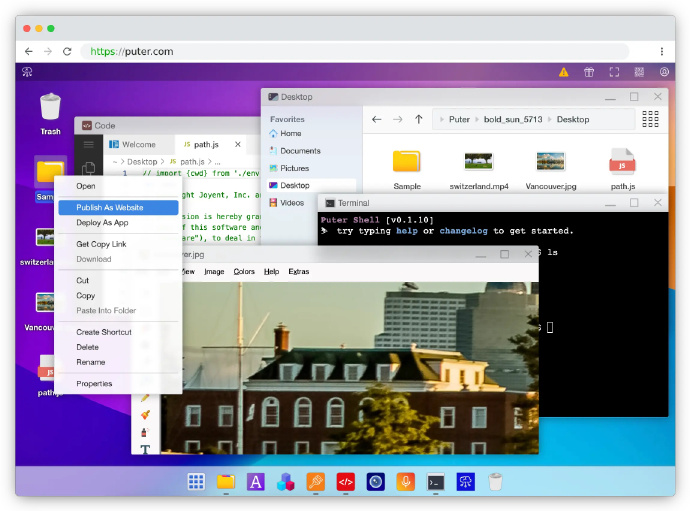
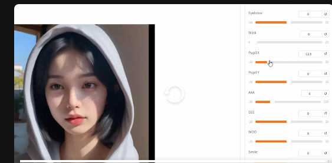

# 机器文摘 第 106 期
### 入侵 EA 的 7 亿个在线账号

著名游戏公司 EA，最近有研究人员发现可以通过一些“特殊手段”窃取其在线账号里的个人数字资产。

利用所发现的漏洞，可以将别人账号下的游戏数据挪到自己账号下。

作者后来将情况反馈给了 EA，现在已经被修复（据作者说这项工作 EA 拖了好几个月时间）。

[《黑客入侵 7 亿个 Electronic Arts 帐户》](https://battleda.sh/blog/ea-account-takeover)记录了整个探索发现的过程。

大意如下：

1. 在EA的开发者环境中，一个安全研究员发现了一些不应该被公开的API文档。通过这些文档，他发现了一个关键的API接口，允许修改用户的身份标识（persona）信息。
2. 他发现可以利用一个特定的API接口（/identity/pids/{pidId}/personas/{personaId}），通过PUT请求来更新任何用户的persona信息，包括用户名、状态和账户ID。
3. 研究员测试了这个API接口，成功将自己的Steam账户与另一个EA账户关联，然后断开，证明了API端点的控制能力。
4. 他进一步发现，通过将其他用户的persona移动到自己的账户下，理论上可以完全控制那个账户，包括用户名和游戏数据。

### 3D视频游戏中阴影技术的发展历程

[《经典的 3D 电子游戏阴影技术》](https://30fps.net/pages/videogame-shadows/)，探讨了 3D 视频游戏中阴影技术的发展历程和不同实现方法。

在现实世界中，单一光源下的阴影并不会因为重叠而变暗，但在游戏里，情况就不同了。

在3D游戏中，阴影不仅仅是为了增加真实感，它们还影响着游戏的性能和视觉效果。

文章介绍了几种不同的阴影技术，比如在角色脚下画一个简单的暗色圆盘（Blob阴影），或者在角色上方渲染一个阴影纹理（平面阴影）。

这些技术可以让阴影看起来更自然，但也需要在性能和视觉效果之间找到平衡。

还有一些更高级的技术，比如阴影贴图和模板阴影，这些技术可以让阴影在不同表面上看起来更加真实。

但这些技术也有它们的问题，可能会出现一些视觉错误，或者需要大量的计算资源。

随着技术的发展，现代游戏开始使用更复杂的阴影技术，比如光线追踪阴影，这种技术可以模拟出更真实的光影效果，但也需要更多的计算能力。

有时候，为了游戏的其他方面，比如性能或者艺术风格，开发者可能会选择不使用阴影，或者使用简化的阴影效果。

### 微软发布的“多智能体”系统

最近基于大模型的“智能体”技术大火，其核心是基于大模型对于自然语言理解和逻辑推理能力，使得计算机可以自主地做一些稍微复杂的事务。

比如今年新出的高端智能手机大部分都带有基于“智能体”技术的智能助理，比之前 siri 级别的对话助手要强大一些，可以根据语音输入做出复杂任务：如去外卖app帮你下单点一杯咖啡。

这其中的技术原理基本上就是让大模型基于一些预定规则，扮演具有特定能力的“角色”，分工配合完成任务。

微软发布的类似贾维斯的通用多代理系统： [Magentic-One](https://www.microsoft.com/en-us/research/articles/magentic-one-a-generalist-multi-agent-system-for-solving-complex-tasks/) 采用了一个名为 Orchestrator 的首席代理来指导其他四个代理完成任务。

这些代理分别是 WebSurfer（操作 Chromium 浏览器）、FileSurfer（读取本地文件）、Coder（编写和执行 Python 代码）和 ComputerTerminal（执行程序和安装新的编程库）。

能够在不修改其核心功能或架构的情况下，在多个挑战性的代理基准上实现竞争性能。

系统基于 AutoGen 开源框架构建，这使得系统具有模块化和灵活性，并且支持代理的即插即用设计。

### Makrdown 电子书工具

[mdBook](https://rust-lang.github.io/mdBook/) 是一个命令行工具，用于使用 Markdown 创建书籍。它非常适合创建产品或 API 文档、教程、课程材料或任何需要干净、易于导航和可自定义的演示文稿的内容。

特性如下：
1. 轻量级 Markdown 语法可帮助你更专注于内容
2. 集成 搜索 支持
3. 为许多不同语言的代码块提供颜色语法高亮显示
4. 主题 文件允许自定义输出的格式
5. 预处理器 可以为自定义语法和修改内容提供扩展
6. 后端 可以将输出渲染为多种格式
7. 用 Rust 编写，实现速度、安全性和简单性

### 网页里的复古电脑

[pieter](https://pieter.com/) 是一个运行在网页里的 windows3.1 环境，页面同时模拟了复古计算机的外观（有点儿像上世纪八九十年代的电脑）。让你完全沉浸在老系统的环境里。 ​​​

### 语音一体化处理工具

[Voice-Pro](https://github.com/abus-aikorea/voice-pro)，一款基于 Gradio Web UI 的语音识别、翻译和TTS的语音一体化处理工具，支持实时转录、翻译，一键安装。

特点：
1. 提供YouTube下载器、噪音去除、字幕、翻译和TTS的集成环境
2. 支持100种语言的语音识别和字幕创建，可翻译成100多种语言并通过TTS生成语音，可调整TTS语音速度、音量和音调
3. 原始视频的背景音乐和音效在多语言视频中保持不变
4. 支持批量处理

### GPU 加速的屏幕截图

[Cleave](https://github.com/Exotik850/cleave)，是一个Rust写的轻量级、GPU加速的截图工具。

使用Rust和WGPU构建，提供流畅的性能和最小的资源占用。主要特点包括GPU加速渲染、交互式屏幕区域选择、键盘控制、直接复制到剪贴板、支持高DPI显示和实时视觉反馈。 ​​​

### 在线生成练字字帖

[超级字帖](https://www.zivip.com/)，字帖生成网站，可以生成汉字（1-6年级的都有）、拼音、英文、数字等六大类字帖。

### 微积分电子书

微积分知识，对于AI也很重要了。

计算损失“梯度”，反向传播，都要用到微积分。

不过高校学习的高数课本都太枯燥难学了，如果业余时间想复习一下，看课本有些看不进去。

Wolfram（就是那个做出著名数学软件 Mathematica 的公司） 发布了一本免费电子教科书[《微积分导论》](https://wolfram-media.com/products/introduction-to-calculus/)。

这本电子书介绍了微积分的基本概念及其应用，涵盖了微积分 1 的所有内容以及部分微积分 2 的内容。

书中首先介绍函数和极限，然后是微分学，接着转向积分学，并简要讨论微分方程。

最后提供了基于 AP 微积分 AB 课程的样本考试的完整解答。

与书中涵盖的主题相关的视频、练习题、习题和测验，都可以在互动的 Wolfram U 课程[《微积分导论》](https://wolframcloud.com/obj/online-courses/introduction-to-calculus/what-is-calculus.html)中找到。

### 专为音频对话开发的会话音频开源模型

[Hertz-dev](https://github.com/Standard-Intelligence/hertz-dev)，是由 Standard Intelligence 公司开发的首个会话音频开源模型。hertz-dev 是一个全双工、仅支持音频的 Transformer 基础模型。

它的主要功能是用于生成对话音频，也就是模拟人类对话的语音生成。支持全双工音频，它可以同时接收和生成音频，就像电话或实时对话一样，不需要等待说完一句话才能回复。

Hertz-dev 拥有85亿参数，基于2千万小时的高质量音频数据训练，支持单声道和全双工生成选项。模型因使用了真实世界会话音频的超大数据集，能表现人类语音特征，如停顿和情感语调。

### 开源个人云电脑

[Puter](https://github.com/HeyPuter/puter)，一款开源免费且可一键部署个人云电脑的工具。提供了丰富的功能、极致速度体验，并且可高度个性化定制，打造专属个人云端操作系统。

具有如下特性：

- 一站式个人云平台，所有文件、应用和游戏都可以安全保存，随时随地访问；
- 可作为 Dropbox、Google Drive、OneDrive 等传统网盘的升级替代，提供更强大的功能；
- 支持构建和发布网站、Web 应用程序和游戏，是开发者的得力助手；
- 提供完整的远程桌面环境，可用作服务器和工作站；
- 支持自行托管，数据完全自主可控，充分保护隐私安全；
- 支持多种部署方式，提供 Docker 一键部署方式；
- 界面设计简洁美观，操作流畅，轻松上手使用。

### 一个可以更改人物表情的工具

[AdvancedLivePortrait-WebUI](https://github.com/jhj0517/AdvancedLivePortrait-WebUI)，可以让照片中的人物眨眼、挑眉、嘟嘴，可以用它制作表情包、视频后期制作等。

特性如下：
1. 可以精确调整，比如单独控制眼睛、眉毛或嘴型
2. 支持批量处理
3. 基于Gradio的Web界面工具，可实时预览

## 订阅
这里会不定期分享我看到的有趣的内容（不一定是最新的，但是有意思），因为大部分都与机器有关，所以先叫它“机器文摘”吧。

Github仓库地址：https://github.com/sbabybird/MachineDigest

喜欢的朋友可以订阅关注：

- 通过微信公众号“从容地狂奔”订阅。

- 通过[竹白](https://zhubai.love/)进行邮件、微信小程序订阅。

