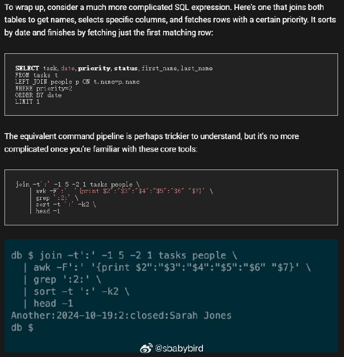
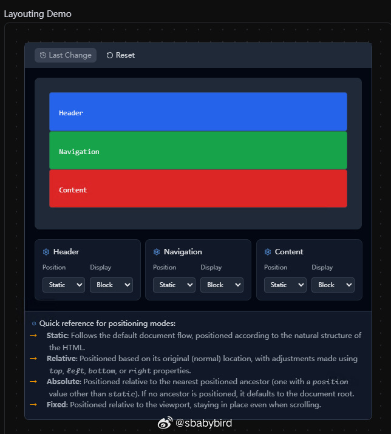
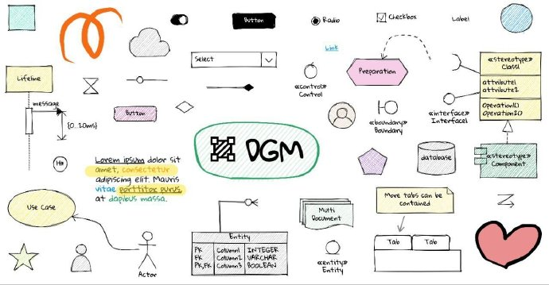
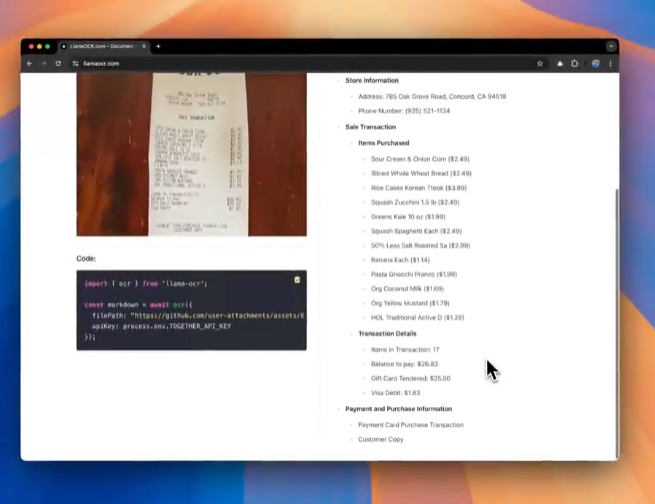

# 机器文摘 第 107 期
### 用Linux自带命令做一个数据库

[用Linux自带命令做一个数据库](https://www.howtogeek.com/build-a-database-with-powerful-linux-built-in-tools/)。

本文向读者揭示了Linux文本文件处理的奥秘，展示了如何将普通的文本文件转变为一个功能完备的数据库。

全部工具所使用的都是 Linux 内置的命令工具，包括对文本文件进行搜索（grep）、提取（cut）、复杂处理（awk）、排序（sort）、分页（head和tail）以及合并（join）等操作命令。

作者通过构建一个简单的待办事项应用数据库的例子，逐步引导读者如何使用这些工具。

内容包括：
1. 如何创建表（以DSV格式的平面文件）
2. 如何插入新数据
3. 如何查询整个表，如何仅选择特定的列，以及如何根据条件过滤行。
4. 如何对结果进行排序和分页，以及如何实现表之间的关联。

作者最终将一个复杂的SQL查询转换为一系列Linux命令行操作，展示了Linux工具的强大能力，也证明了即使在没有传统数据库管理系统的情况下，也能够实现高效的数据管理和查询。

### 写一个 8 位单片机模拟器，但是用 LaTeX ？！

[avremu](https://gitlab.brokenpipe.de/stettberger/avremu/tree/master)。

LaTeX 是一个排版系统（写学术论文离不了）。但底层的 TeX 系统是一个强大的宏处理器。

事实上，TeX 是一种图灵完备的编程语言。TeX 可以计算任何可计算的东西（可计算性是理论计算机科学中的一个概念，因为计算机也不是啥都能计算，比如著名的“停机问题”就搞不定，不过这扯远了）。

图灵完备意味着，Tex 可以给任何编程语言编写合适的解释器（理论上）。

于是就有蛋疼之人挑战了一把，用 Tex 宏编写了一个 8 位单片机的模拟器（见上述链接）。

链接里是一个 git 仓库，里面存放了完整的代码。据作者说，他这个模拟器在自己的笔记本电脑上，可以运行达到 2.5KHz。

配图为作者使用该模拟器运行 44 个小时生成。

### 浏览器是如何渲染网页的

[探索浏览器的渲染过程](https://abhisaha.com/blog/exploring-browser-rendering-process/)，一篇很不错的科普文章，讲述了从键入 URL 地址到你能看到网页内容期间发生了什么事情。

比较有特点的是，这篇文章在网页里嵌入了交互式的演示动画，充分展示了浏览器所做工作的具体细节。 ​​​

### 免费冥想音效网站

[Sound Box](https://soundbox.fun/) 是一款专业的免费在线情境音效平台，提供多种自然环境音效以及白噪音，帮助用户打造完美的声音空间。无论是为了专注工作、放松心情，还是助眠解压，都能找到最适合的声音组合。

除了免费之外，这个网站还有以下特点：
1. 丰富的声音库 
   - 精选优质环境音效：雨声、海浪、鸟鸣、虫鸣等自然声音 
   - 白噪音与环境音：咖啡厅、火焰、风声等氛围音效 
   - 每个音效都经过专业处理，确保最佳音质 
2. 专业混音功能 
   - 支持多声道混音，可同时播放多个音效 
   - 独立音量控制，精确调节每个声道 
   - 智能音量平滑过渡，避免突兀变化

### 开源数字人智能对话系统

[Linly-Talker ](https://github.com/Kedreamix/Linly-Talker) 是一个将大型语言模型与视觉模型相结合的智能 A 系统。

它集成了各种技术，例如 Whisper、Linly、微软语音服务和 SadTalker 会说话的生成系统。

该系统部署在 Gradio(一个基于 Python 的 Web 应用快速开发框架) 上，允许用户通过提供图像与 A1助手进行交谈。

用户可以根据自己的喜好进行自由的对话或内容生成。

### 开源画布框架

[DGM.js](https://github.com/dgmjs/dgmjs)，具有智能形状的开源无限画布，支持智能图形、实时协作、多页面、手绘风格以及导出为图片和 JSON 功能。

制作网页版绘图（架构图、草图、界面原型）工具。

### 开源在线电子表格

[IronCalc](https://www.ironcalc.com/)一款开源电子表格引擎，它能在浏览器中打开，并可以集成到 SaaS 产品和 Web 应用中，甚至能直接嵌入到博客帖子中。

主要特性如下：

- 轻量化：用 Rust 编写并在浏览器中运行，无需服务器支持，快速轻量。
- 兼容性：支持各种类似Excel 的函数，能处理大部分 Excel 公式。
- 开源：在 MIT/Apache 2.0 许可证下可用，允许集成到项目中，根据需求定制。
- 可扩展性：支持无 UI 运行，也可嵌入 Python 和 JavaScript 中，灵活适应不同开发需求。
- 协作功能：任何人都能在线使用并轻松共享电子表格。

### 多智能体人格模拟

[TinyTroupe](https://github.com/microsoft/TinyTroupe)，微软推出的一个由 LLM 驱动的多智能体人格模拟工具。

其最大的特点是可以模拟具有特定性格、兴趣和目标的虚拟人物。

通过调用 LLM 语言模型，它能够生成逼真的人物行为和互动场景。

可应用在：广告、软件测试、产品和项目管理等工作场景中，提供接近真实的数据模拟。

### 轻量 OCR 工具

[llama-ocr](https://www.npmjs.com/package/llama-ocr)，核心是调用 LLama3.2 的模型能力，实现 OCR 功能，输入图像（本地或网络），输出markdown格式文本。

## 订阅
这里会不定期分享我看到的有趣的内容（不一定是最新的，但是有意思），因为大部分都与机器有关，所以先叫它“机器文摘”吧。

Github仓库地址：https://github.com/sbabybird/MachineDigest

喜欢的朋友可以订阅关注：

- 通过微信公众号“从容地狂奔”订阅。

- 通过[竹白](https://zhubai.love/)进行邮件、微信小程序订阅。

