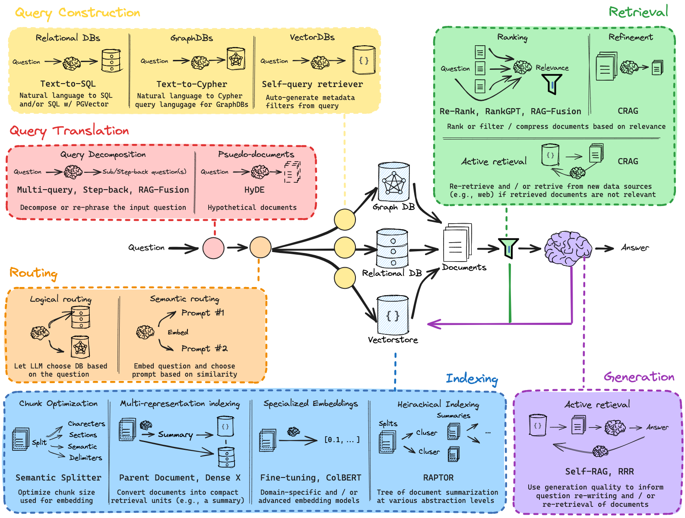
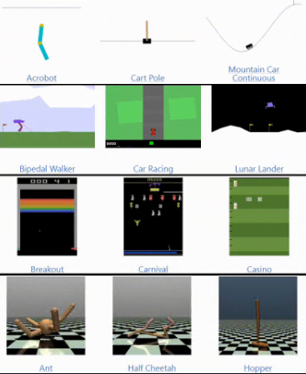
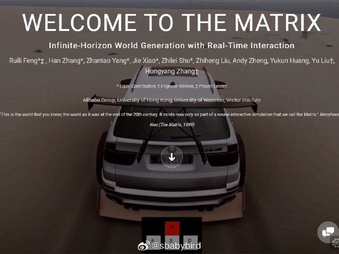
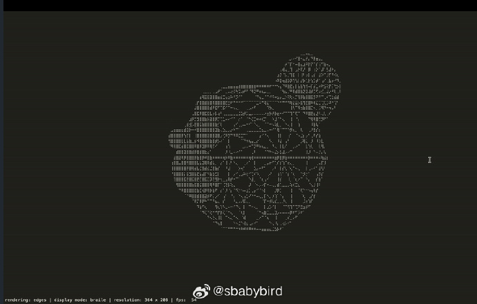
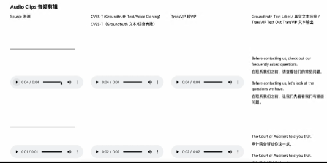

# 机器文摘 第 108 期
### 计算机除了数字的，还有模拟的

基于二进制的数字计算机流行，使得人们往往忽略了还有其他范式的计算机，实际上还有模拟的和量子的。

随着数字计算接近摩尔定律的极限，模拟计算提供了一种可替代的可能性。

模拟计算特别适合于动态系统建模和神经形态人工智能应用，比数字计算更节能，面对网络威胁时也更安全。

[The Analog Thing](https://the-analog-thing.org/)（简称THAT）是一个高质量、低成本、开源且非盈利的尖端模拟计算机项目。

旨在提供一个能够快速、并行、高效地模拟动态系统的平台。

它将实践操作与数学理论相结合，自然融入设计和工程实践，如试错探索和使用比例模型。THAT不仅有助于理解现状（是什么的模型），还能帮助实现理想状态（应该是什么的模型）。

THAT设计精巧，使用少量计算元件就能实现广泛的模拟计算应用。包括5个积分器、4个求和器、2个比较器、主从端口、8个系数电位器、2个乘法器、面板仪表和混合端口等。

使用THAT，你可以模拟包括市场经济、疾病传播与控制、人口动态、化学反应、机械系统以及各种数学吸引子在内的动态系统。

THAT还提供了学习微积分、模拟电路和控制工程的机会。模拟计算与变化率和数量积累紧密相关，提供了一种实践微积分的方法。通过操作放大器构建的计算元件，用户可以直观地理解模拟电路。在自适应控制系统中，模拟计算提供了控制工程的实践入门。

不过值得注意的是，这款产品并非开源，其硬件成品需要付费购买，定价在 450 - 500 欧元。

### 构建自己的 RAG 应用

RAG（搜索增强生成）是当下最热的基于 LLM （大语言模型）的应用技术，市面上也充斥着大量的相关开源项目。

[bRAG-langchain](https://github.com/bRAGAI/bRAG-langchain)，是一个帮助你学习 RAG 技术构建自己应用的开源项目，提供了从基础环境配置到高级应用架构的一系列教程。

教程内容基于 jupyter-notebook 构建，可以边实践边学习。

正如项目介绍中所说：构建 RAG 应用所需要了解的一切，都在这里。

### 强化学习算法集

[DRL-Pytorch](https://github.com/XinJingHao/DRL-Pytorch)，最全面的深度强化学习算法 PyTorch 实现合集，整合了 13 种主流强化学习算法。

包括从入门级的Q-learning到高阶的SAC、TD3等，每个算法都配有详细文档、完整训练曲线和论文引用。

项目还提供了丰富的学习资源推荐，包括环境配置、经典书籍、在线课程和重要论文等。

### 基于 AI 的实时世界场景生成

[“The Matrix”](https://thematrix1999.github.io/)是一个前沿的实时、高分辨率、无限地平线的世界模拟系统。

项目名称和灵感来源于1999年的电影《The Matrix》（国内译为：黑客帝国），旨在通过AI技术创造一个逼真的、沉浸式的互动世界，模糊现实与幻觉之间的界限。

其核心原理是：基于用户输入的视角控制信息，用 AI 实时生成视频帧画面。

AI 模型的视频生成能力学习自很多大型游戏的渲染结果。

技术特点
- 帧级精度：用户交互响应达到电影中的水平。
- AAA级视觉效果：提供接近现实的沉浸式场景。
- 无限生成能力：超越当前视频模型的限制，支持无尽探索。
- 
### 基于控制台的 3D 模型查看工具

[Terminal3d](https://github.com/liam-ilan/terminal3d)，是一款用于在终端控制台中查看 3d .obj 文件的工具。

特性：
1. 读取 .obj 文件并将其呈现到终端。
2. 使用 盲文 （⡟） 和 块 （▛） 字符进行渲染。
3. 在线框和顶点模式之间进行选择。
4. 支持鼠标控制场景相机。 ​​​

### 端到端实时语音翻译系统

[TransVIP](https://github.com/nethermanpro/transvip)，上海交大和微软开源的一款端到端的语音到语音翻译系统，它可以保持原声特征、保持源语音和目标语音时长同步。

它的声音特点和说话的节奏感保持的非常不错，比较自然流畅，时长控制的也比较精确，很适合做视频配音、跨语言直播或实时语音翻译。

特点：
- 直接从源语音到目标语音，无需中间步骤，处理延迟低
- 源语音和目标语音时长保持一致，可以避免口型不同步问题

## 订阅
这里会不定期分享我看到的有趣的内容（不一定是最新的，但是有意思），因为大部分都与机器有关，所以先叫它“机器文摘”吧。

Github仓库地址：https://github.com/sbabybird/MachineDigest

喜欢的朋友可以订阅关注：

- 通过微信公众号“从容地狂奔”订阅。

- 通过[竹白](https://zhubai.love/)进行邮件、微信小程序订阅。

