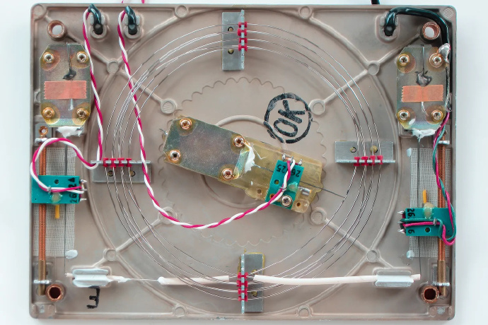
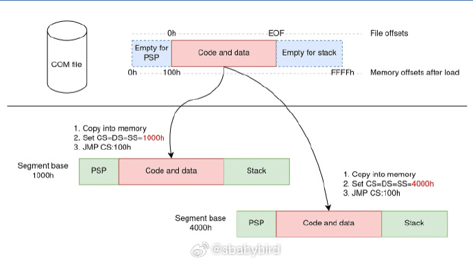
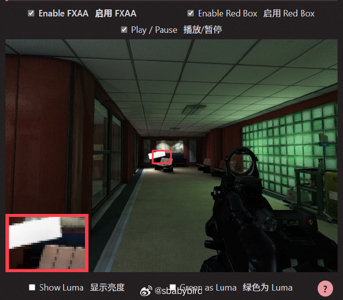
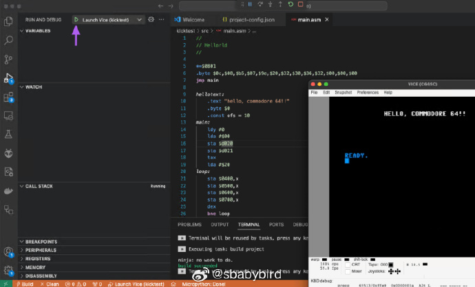
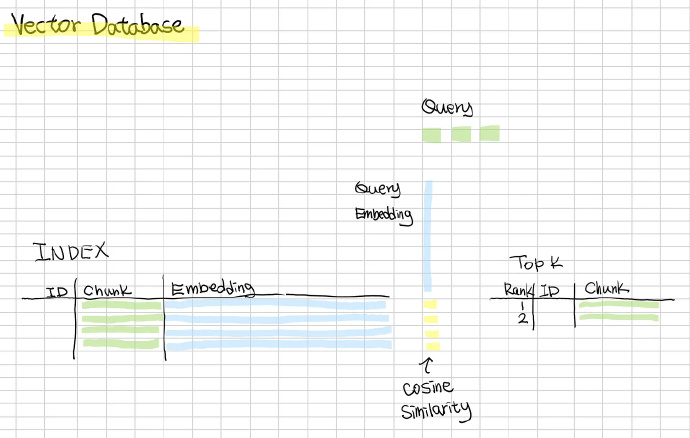
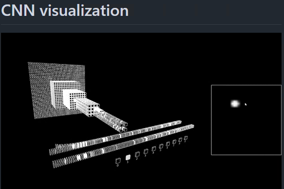
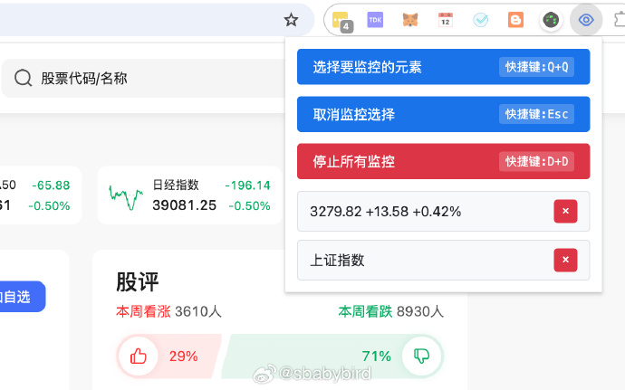
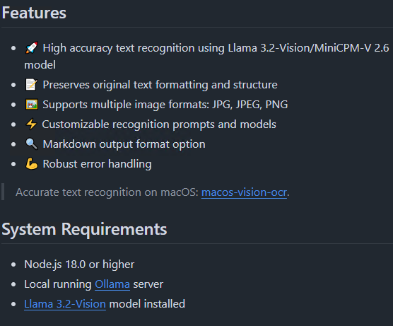
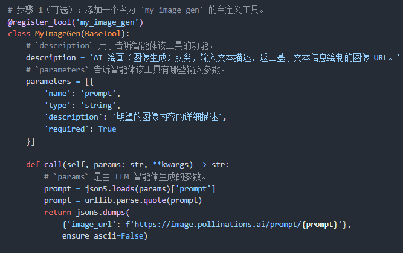
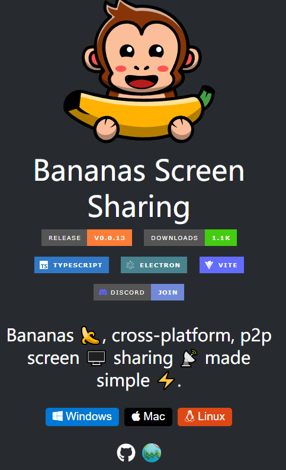

# 机器文摘 第 109 期
### 计算机内存的一些历史

[被遗忘的内存历史](https://lcamtuf.substack.com/p/memory-the-forgotten-history)，文章详细介绍了了从继电器到真空管、动态存储器，再到磁介质存储的发展，强调了内存在个人计算发展中的重要性，并探讨了各种存储技术的优势与局限。 ​​​

### DOS 内存模型的一些知识

[重新审视 DOS 内存模型](https://blogsystem5.substack.com/p/dos-memory-models)，探讨了DOS操作系统如何克服x86实模式下内存限制的各种技巧，特别是那个时代编译可执行程序所需要了解的不同“内存模型”。

作者先是带大家回顾了 8086（也就是 DOS 主要面向的 CPU） 的内存访问架构（段地址：偏移地址），然后分别分析了几种在 DOS 下常见的可执行文件封装格式（COM、EXE）。

> COM文件是最简单的可执行文件格式，它们包含原始机器代码，可以放置在几乎任何内存位置并执行，无需任何后处理。COM文件利用8086的分段架构，总是加载到任何段的100h偏移处，所有内存地址必须相对于这个偏移。

> 为了解决COM文件的限制，微软为DOS设计了另一种可执行文件格式：EXE文件。与COM文件相比，EXE文件有内部结构，不受64KB限制，可以包含更大的代码和数据块。EXE文件包含多个段，并将代码和数据分布在它们之间。

文章在最后解释了旧编译器中常见的内存模型，包括 Tiny、Small、Compact、Medium、Large 和 Huge 模型，每种模型都有其特定的指针使用方式和内存布局。

### 游戏画面的抗锯齿技术详解

[AAA - Analytical Anti-Aliasing](https://blog.frost.kiwi/analytical-anti-aliasing/)，这篇文章来自Frost Kiwi的博客，主要讨论了抗锯齿技术，特别是分析性抗锯齿（Analytical Anti-Aliasing，简称AAA）。

文章详细介绍了从简单的超采样抗锯齿（SSAA）到基于理论的SMAA，再到使用机器学习的DLAA等多种抗锯齿技术，以及它们如何以不同的方法实现相同的目标：消除图像中的锯齿效应。

文章通过WebGL示例展示了如何实现抗锯齿技术。

作者提供了详细的代码示例，包括顶点着色器、片段着色器和JavaScript代码，这些代码可以在WebGL画布上绘制一个移动的圆，并展示不同抗锯齿技术的效果。

### 使用 vscode 为 commodore64 开发应用程序

commodore64（在文中简称C64）是上世纪 80 年代十分风靡的一款 8 位个人电脑。

在二十一世纪的今天，也有很多复古电脑爱好者，为其开发应用程序。（YouTube上有个 8BitGuy 是我见过的最热衷此事的，好像还做了发售的游戏，*[同时在 B 站也有他的频道:The 8-Bit Guy](https://space.bilibili.com/556805805)*）

[Programming the C64 with Visual Studio Code](https://retrogamecoders.com/c64-visual-studio-code/)一文介绍了怎样在vscode这个目前最流行的现代编辑器上通过安装插件的方式为 C64 开发应用程序。

主要用到了一个名为 [VS64](https://marketplace.visualstudio.com/items?itemName=rosc.vs64) 的插件，该插件在不安装额外工具链的情况下即可支持使用 BASIC 语言为 C64 开发程序。

如使用 C、6502汇编进行开发，还需安装配套的编译和调试工具。

### 用 excel 做一个向量数据库

向量数据库最近大火，主要是受 LLM 火爆的影响，在执行 RAG 相关任务时，向量数据库是必备的数据存储和语义检索基础。

想要深入理解其原理，这里有一个项目，作者[用 excel 实现了一个向量数据库原型](https://aibyhand.substack.com/p/building-a-vector-database-in-excel)，主要用于展示其背后的技术原理。

### 一个视频看明白卷积神经网络（CNN）的运行机制

这是目前为止我看过的关于卷积神经网络运作最清晰、最容易理解的视频，使用可视化语言 Processing 制作，清晰地展现下述过程：

1. 输入图像的像素被卷积层处理；
2. 特征图被池化层处理；
3. 特征图被全连接层处理；

视频项目的源码在：https://github.com/okdalto/CNN-visualization

### 监控网页任意元素并显示在 title 中

[Title Mirror](https://chromewebstore.google.com/detail/title-mirror/mkffplgaiikhbnihpedpmgkkpemmlohf) 一个有意思的插件，把网页中任意元素内容投射在网页title区域。

可以用来进行股市盯盘、球赛比分关注等摸鱼活动。 

### 使用 Ollama 支持的视觉模型（llama 3.2-vision/minicpm-v 等）实现图片 OCR

[Ollama-OCR](https://github.com/bytefer/ollama-ocr)，使用 Llama 3.2-Vision/ minicpm-v 等 Ollama 支持的视觉模型，进行 OCR 识别。

主要特性：
- 保留原始文本格式和结构
- 支持多种图像格式：JPG、JPEG、PNG
- 可自定义的识别提示词和模型
- 支持输出 Markdown 格式文档

### 阿里开源的 agent 框架

阿里开源了一个基于Qwen2.0的agent框架：[Qwen-Agent](https://github.com/QwenLM/Qwen-Agent)，具有指令遵循、工具使用、任务规划和记忆能力。

你可以用它来构建各种能执行复杂任务的AI代理，它可以调用工具，计算器、搜索引擎，可以处理长文档等，你可以构建比如，浏览器助手、代码解释器、自定义助手等。

### 基于 WebRTC 技术的屏幕共享工具

[Bananas Screen Sharing](https://getbananas.net/)，开源跨平台屏幕共享工具，基于 WebRTC 技术，实现点对点的安全连接。无需注册或配置，用户只需生成链接并分享即可开始使用。

## 订阅
这里会不定期分享我看到的有趣的内容（不一定是最新的，但是有意思），因为大部分都与机器有关，所以先叫它“机器文摘”吧。

Github仓库地址：https://github.com/sbabybird/MachineDigest

喜欢的朋友可以订阅关注：

- 通过微信公众号“从容地狂奔”订阅。

- 通过[竹白](https://zhubai.love/)进行邮件、微信小程序订阅。

