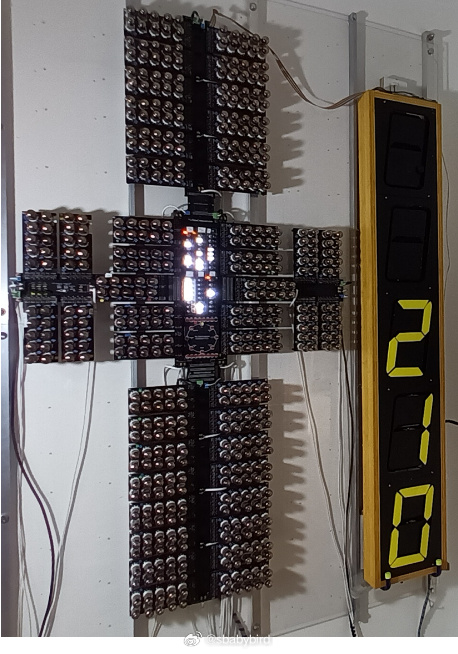
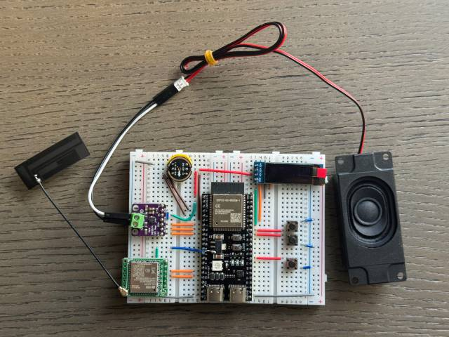
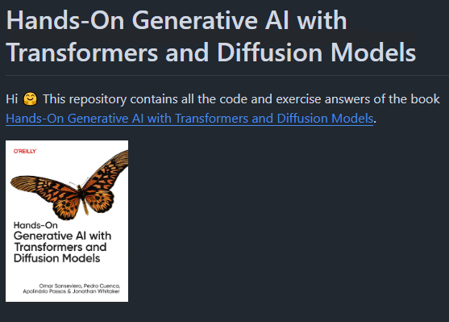

# 机器文摘 第 110 期
### 物理遮挡摄像头并非多此一举

多年的担心还是发生了，近日有安全人员公布了一个开源工具仓库。

里面提供的相关工具包可以将 thinkpad x230 笔记本的摄像头 LED 关闭，并偷偷进行视频录制。

开源仓库地址在：https://github.com/xairy/lights-out
记录有演讲细节的pdf：https://docs.google.com/presentation/d/1NSS2frdiyRVr-5vIjAU-2wf_agzpdiMR1DvVhz2eDwc/edit#slide=id.g3003eb4ed53_5_160

具体技术原理：

- ThinkPad X230（以及同一时代的其他一些笔记本电脑）上使用的网络摄像头基于 Ricoh R5U8710 USB 相机控制器。该控制器将其固件的一部分（SROM 部分）存储在位于网络摄像头板上的 SPI 闪存芯片上。控制器还允许通过 USB 重新刷新 SPI 芯片的内容。
- X230 网络摄像头板上的 LED 连接到 R5U8710 控制器的 GPIO B1 引脚。GPIO B 端口映射到 R5U8710 内部基于 8051 的 CPU 的 XDATA 内存空间中的 0x80 地址。因此，更改该地址的值会更改 LED 的状态。无论网络摄像头当前是否正在流式传输视频，这都有效。
- 库中提供的工具允许使用 USB 控制的所谓“通用植入物”将自定义固件刷入网络摄像头板上的 SPI 芯片。此植入程序允许将受控数据写入任意地址（在 XDATA 内存空间内）并调用任意地址（在 CODE 内存空间内;与从偏移量 0xb000 开始的 XDATA 别名）。

看来联想后来给 thinkpad 笔记本摄像头都加入了物理遮挡开关的行为并非多次一举，恐怕是早就知道了这种技术漏洞了吧。

### 用上世纪五十年代的真空管“攒”一个“电脑”

电子计算机在最开始使用的主要电子元件就是真空管（又称电子管），为了验证这个事情，[The Tube Computer](https://www.thetubecomputer.com/)一文作者亲自用回收的老真空管制作了一个放在家里占满了一面墙的 8 位计算机。

这台计算机采用更现代的 8bit 设计，真空管全部采用上世纪五十年代生产的老管子（估计是拆机件）。

运转起来既发光又发热，可以给整个房间供暖。

这个项目启动的初衷是作者希望让自己的孙子能够真正的“看见”电子计算机的运行。

真是一个爱动手、能动手的老极客啊。

### 可以 DIY 的 开源 AI 聊天机器人

[小智 AI 聊天机器人](https://github.com/78/xiaozhi-esp32)，基于 ESP32+SenseVoice+Qwen72B 的开源 AI 硬件项目。

支持 Wi-Fi 配网和 4G 通信，具备离线语音唤醒、5种语言识别、声纹识别、流式对话等功能。

可自定义角色设定和提示词，支持对话记忆，适合AI硬件开发学习者使用。

提供免开发环境固件和详细教程。

所有材料均可在淘宝上买到，我试着下单凑齐了零件（没买 4G 通信模块），共花费 90 元（含邮费）。

### 又一个开源知识图谱平台

[knowledge-graph-studio](https://github.com/whyhow-ai/knowledge-graph-studio)，一个开源的知识图谱构建和管理平台，专为RAG应用设计。支持基于规则的实体解析、模块化图谱构建、灵活的数据接入等功能。基于NoSQL数据库构建，提供API优先的设计理念和SDK支持，可用于构建动态的图谱驱动AI工作流，适用于实验性和大规模应用场景。

### 复制当前网页为 Markdown 格式的插件

[Web2MD 浏览器插件](https://github.com/AnswerDotAI/web2md-ext)：一个简单实用的 Chrome 扩展工具，通过快捷键 Ctrl+Shift+O 可以一键将当前网页内容转换为 Markdown 格式并自动复制到剪贴板，支持自定义快捷键，提高文档处理效率。

### 生成式 AI 学习资源

[GenAI Book](https://github.com/genaibook/genaibook)，《Hands-On Generative AI with Transformers and Diffusion Models》一书的配套资源库，包含完整的代码示例和练习答案。涵盖了生成式AI的核心内容，从Transformers到扩散模型，从语言模型到图像生成，并包含实践应用案例。适合想要系统学习生成式AI的开发者使用.

## 订阅
这里会不定期分享我看到的有趣的内容（不一定是最新的，但是有意思），因为大部分都与机器有关，所以先叫它“机器文摘”吧。

Github仓库地址：https://github.com/sbabybird/MachineDigest

喜欢的朋友可以订阅关注：

- 通过微信公众号“从容地狂奔”订阅。

- 通过[竹白](https://zhubai.love/)进行邮件、微信小程序订阅。

