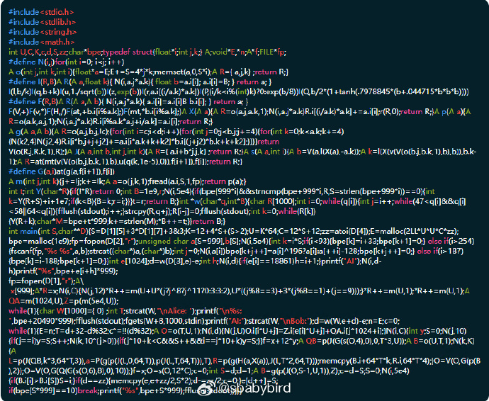
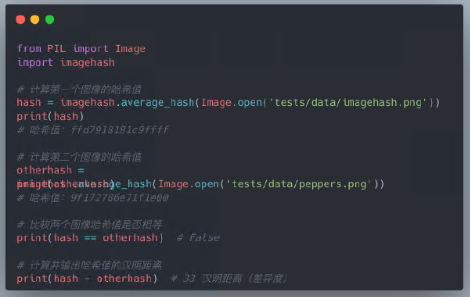
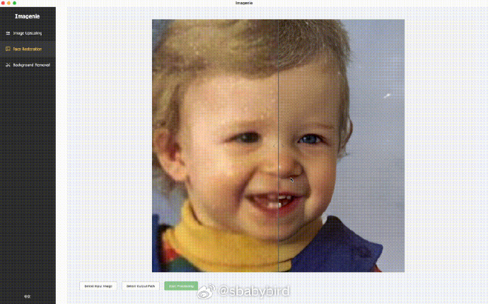
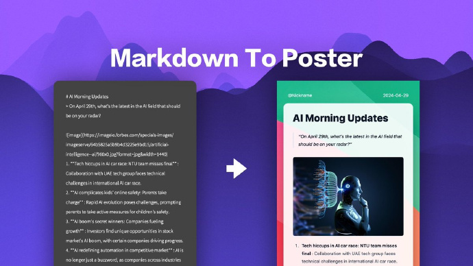
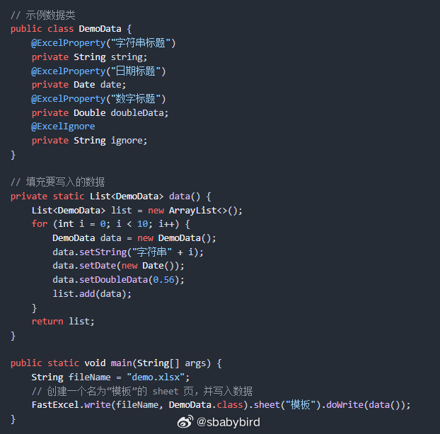
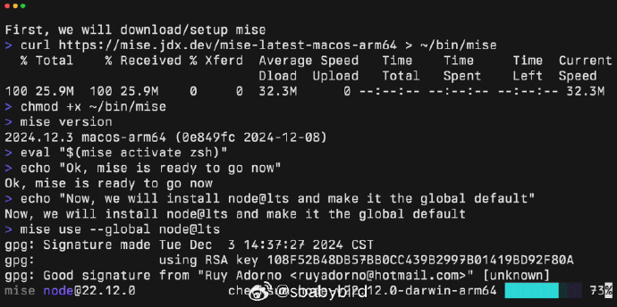
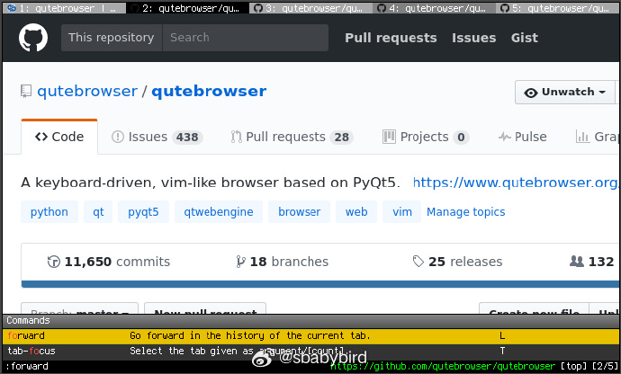
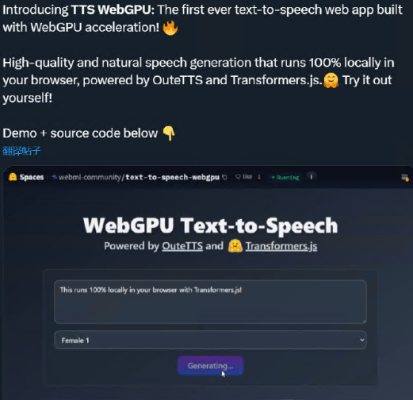

# 机器文摘 第 111 期
### 用不到 3000 个字节的 C 代码，实现一个 chatGPT

[用大约3000字节的C语言代码实现l了个类似于ChatGPT的程序](https://nicholas.carlini.com/writing/2023/chat-gpt-2-in-c.html)，基于 GPT-2 模型。

GPT-2是一个开源的自然语言处理模型，虽然它的能力远不及后来的 GPT-4（ChatGPT使用的模型），但它非常适合学习和理解 LLM 的工作原理，基于 GPT-2 你可以自己动手实现一个完全可用的聊天模型。

这个 C 程序主要包括：

- 基础矩阵数学库：由于神经网络本质上是矩阵运算，作者首先创建了一个极简的矩阵库，包括矩阵与常数的运算和矩阵间的运算。
- 快速矩阵乘法：作者实现了一个基础的矩阵乘法算法，并对其进行了优化，使其能够更快地运行。
- 神经网络层：为了构建一个变换器（transformer），作者定义了一些特殊的神经网络层，包括GELU激活函数和层归一化（LayerNorm）。
- 变换器架构：在600字节的代码中，作者实现了变换器模型，这是GPT-2的核心。
- 字节对编码（Byte pair encoding, BPE）：为了处理词汇表中单词的无限性，GPT-2使用BPE将单词分解为“词片”。作者描述了如何在C语言中实现BPE。
- 权重加载：加载神经网络的实际权重也是必要的步骤，作者解释了如何从磁盘读取这些权重。
- BPE词汇表加载：为了执行BPE，作者需要从磁盘加载BPE词汇表，这个过程涉及到一些复杂的UTF-8编码处理。

### 基于哈希值识别相似图像

[imagehash](https://github.com/JohannesBuchner/imagehash)，该项目的算法不同于传统的加密哈希算法（如 MD5、SHA-1），它专注于图像内容的相似度分析，对有细微不同的图片可生成相似的哈希值，用于计算图片相似度，支持平均哈希、感知哈希、差分哈希等算法，适用于快速识别版权图片等场景。

### 完全本地运行的跨平台图像处理应用

[Imagenie](https://github.com/zhongweili/imagenie)。

核心功能：人像修复、超分辨率放大、背景移除。

技术原理：本地运行 AI 模型进行图像处理，基于 tauri 框架，本地使用 rust 语言开发核心功能，兼顾性能与跨平台。

应用特点：AI 驱动：每个功能都是由 AI 模型本地化推理实现，完全本地运行，不必担心照片上传到 web。

### 将 Markdown 文本 转换为美观的图片海报

[Markdown-to-Image](https://github.com/gcui-art/markdown-to-image)，开源的 Markdown 转图片工具。
- 直接将Markdown 格式的内容渲染成适合社交媒体分享的图片。
- 可以选择内置的模板，也可以自己设计模板样式
- 自带 9 种主题（比如不同的背景、配色风格）
- 输出的图片可以直接复制，也可以转成 HTML 代码，粘贴到文章、邮件或编辑器里
- 支持一键部署到你自己的服务器

### 开源 excel 电子表格操作库（Java）

[FastExcel](https://github.com/CodePhiliaX/fastexcel)，由easyexcel(已停止维护)作者最新推出的新版本， 快速、简洁、解决大文件内存溢出的java处理Excel工具。

>
    1. 完全兼容 EasyExcel，平滑过渡
    FastExcel 完全兼容原 EasyExcel 的所有功能和特性。这意味着现有使用 EasyExcel 的项目，可以毫无障碍地迁移到 FastExcel。您只需简单地更换包名和 Maven 依赖，即可完成升级，无需担心任何兼容性问题。

    2. 高性能表现，卓越体验
    正如其名，FastExcel 在性能上有了显著的提升。通过对底层算法的优化和内存管理的改进，FastExcel 能够更加高效地处理大规模的 Excel 数据，大幅降低了内存消耗和处理时间。

    3. 免费开源，MIT 协议
    我们承诺，FastExcel 将始终免费开源，并采用最开放的 MIT 协议。这为开发者和企业提供了极大的自由度和灵活性，可以在任何商业化场景中自由使用 FastExcel，无需担心版权和授权问题。

    4. 功能创新，超越自我
    FastExcel 不仅继承了 EasyExcel 的所有功能，还在此基础上进行了许多创新和改进。在 1.0.0 版本中，我们新增了以下实用功能：

    读取 Excel 指定行数：您可以根据需求，只读取感兴趣的部分数据，提高了数据处理的效率。
    Excel 转换为 PDF：直接将 Excel 文件转换为 PDF，满足多样化的文档输出需求。

### 一个工具解决管理开发环境版本的所有问题

[Mise](https://mise.jdx.dev/about.html)是一个开发环境版本管理工具，作用类似于 pyenv、nvm等，但是更全面。

可以管理多种语言的开发环境包括不限于 node、python、cmake、terraform等。

安装和管理 Node、Python 或 Terraform 等开发工具/运行时，既简化了这些工具的安装，又允许您指定要在不同项目中使用这些工具的哪个版本。 Mise 支持 数百 种开发工具。

同时 Mise 也是一个任务运行程序，可用于在开发人员之间共享项目中的常见任务，并简化文件更改时运行任务等操作。

### 基于纯键盘操作的浏览器

[qutebrowser](https://www.qutebrowser.org/)是一个以键盘为中心的开源浏览器（基于 Python 和 Qt）。

具有最小化的 GUI 界面，使用与 Vim 编辑器相同的快捷键操作方式进行交互，让人沉浸在网页内容浏览之中。

浏览器的制作灵感来自于 vimperator 插件，该插件允许用户使用 Vim 编辑器的快捷键操作浏览器（chrome 和 edge 浏览器版本的插件为 vimium）。

### 使用 WebGPU 加速构建的文本转语音 Web 应用程序

[TTS WebGPU](https://github.com/huggingface/transformers.js-examples/tree/main/text-to-speech-webgpu)，第一个使用 WebGPU 加速构建的文本转语音 Web 应用程序。

由 OuteTTS 和 Transformers.js 提供支持的高质量自然语音生成，100% 在浏览器中本地运行。

## 订阅
这里会不定期分享我看到的有趣的内容（不一定是最新的，但是有意思），因为大部分都与机器有关，所以先叫它“机器文摘”吧。

Github仓库地址：https://github.com/sbabybird/MachineDigest

喜欢的朋友可以订阅关注：

- 通过微信公众号“从容地狂奔”订阅。

- 通过[竹白](https://zhubai.love/)进行邮件、微信小程序订阅。

