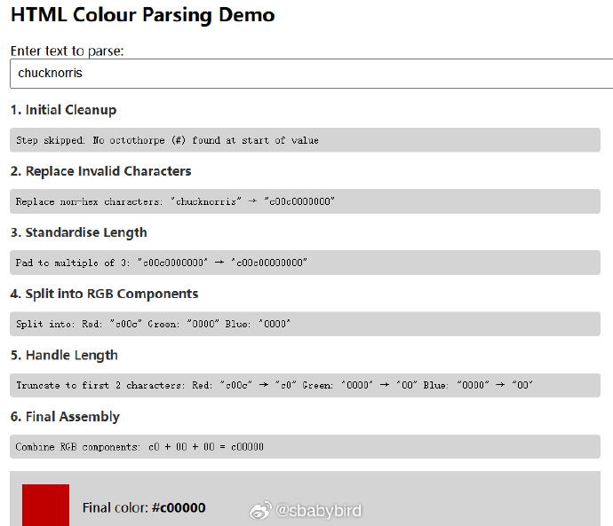
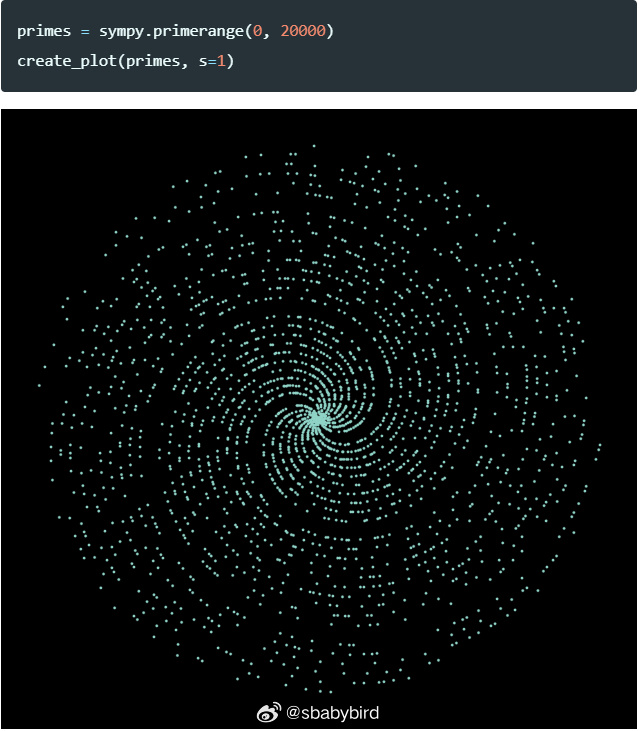
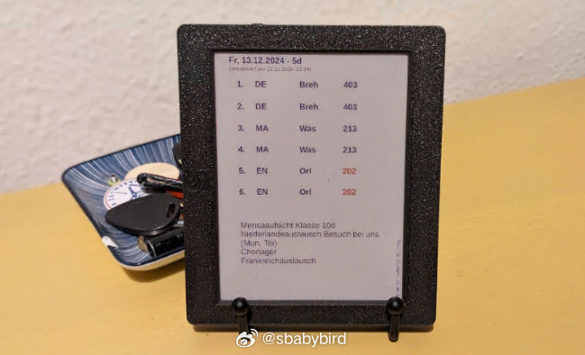
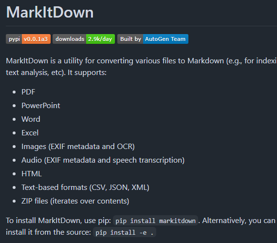
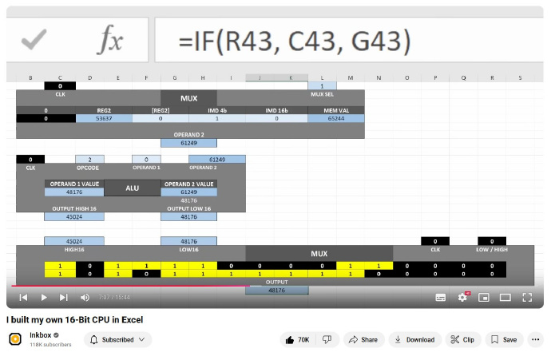
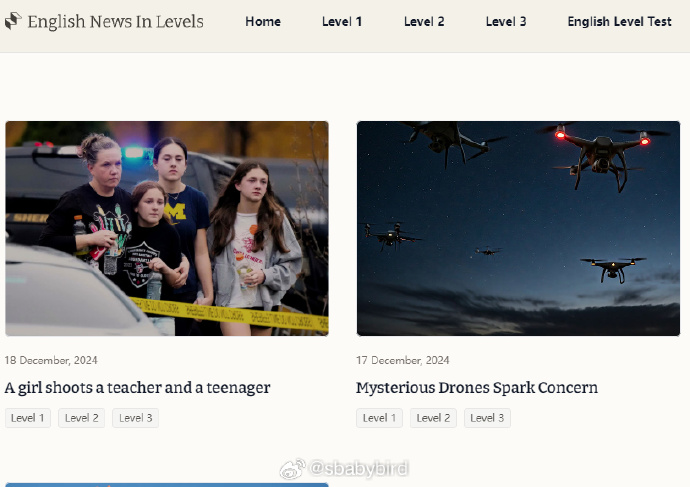
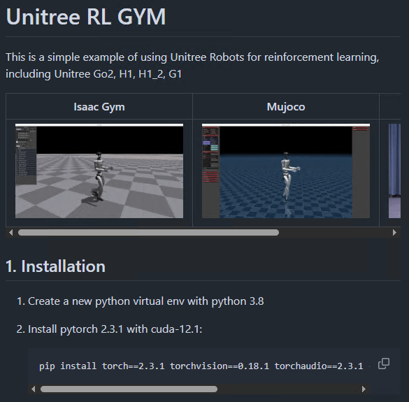
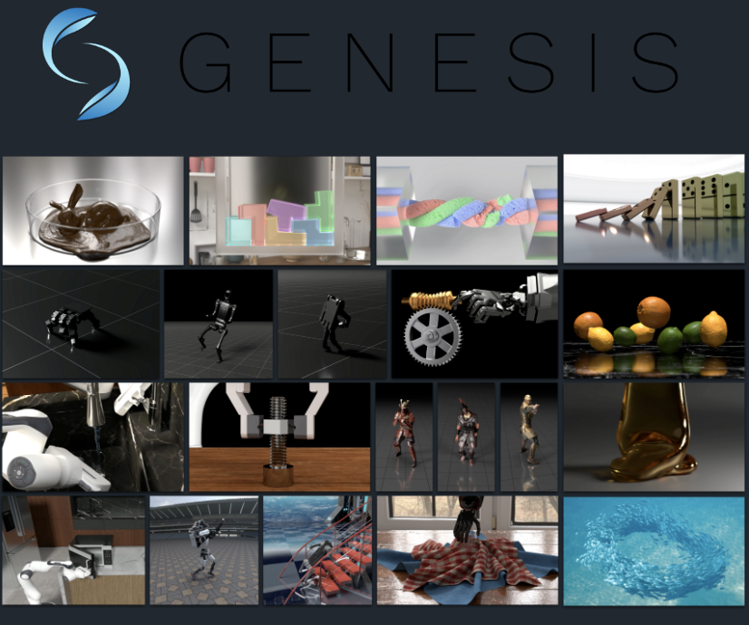

# 机器文摘 第 112 期
### XBox 360 游戏机的破解原理

由于当年微软在发布 xbox 游戏机初代时安全方面做的不足，导致该机器很快被破解，后来虽然微软发布了 6 次修补程序，也无济于事（每次补丁都在数周内被破解）。

所以xbox 360 游戏机在发布时做足了安全方面的工作，也确实很难破解，无法运行任何未通过“微软签名”认证的程序。一度被认为是不可破解的游戏机。

然而在该机发布的 6 年后，还是有聪明的黑客，通过“硬件”手段，找到了破解方法。

这篇[《xbox360硬件安全漏洞研究》](https://github.com/kooscode/srgh-matrix-trinity/blob/main/README.md)记录了详细的实现原理。

基本原理概括如下：
xbox 360 启动时加载引导程序，此时它会比对程序是否被签名过。

既然是“比对”那就有相应的指令：memcmp。

在cpu旁边等着，在它执行签名认证的 memcmp 指令的那一刻，给它的 reset 引脚发射一个大约 10 纳秒的脉冲信号，让它哆嗦一下，发生了硬件故障但不至于死机。此时这条指令就会返回 0x00，也就是说无论比对是否成功，都会认为成功。

基于此，你就可以让游戏机加载并运行你的未签名的程序了。

### 给 HTML 的元素设置一个不存在的颜色

在 HTML 的元素属性里有个 Color 属性，可以设置元素颜色，支持 `#000000` HEX 色值以及颜色名的方式（比如 black、white、green 等）指定颜色。

如果你设置了一个奇怪的名称给 Color，浏览器也会试图解析它，比如：``，会显示红色的字体。

[《我最喜欢的颜色是 chucknorris 红》](http://t.cn/A6msThEe)探讨了在 HTML 中设置文本颜色的一种非常规方法，并解释了为什么浏览器会把 chucknorris 解析为红色。

文章详细解释了浏览器如何处理无效的颜色值，包括：
- 清理：移除颜色值前的 #。
- 替换无效字符：非十六进制字符被替换为 0。
- 标准化长度：不足部分补 0。
- 分割成红绿蓝三部分。
- 处理长度：过长的组件会被截断，过短的会被补足。
- 最终组合：将处理后的红绿蓝值组合成最终的颜色。

按照上面的规则chucknorris最终被浏览器解析为红色。

### 为什么使用极坐标绘制质数图案呈现出一个星系

将多个质数按极坐标绘制出来时，如果数量足够多，其图案将呈现出螺旋状，就像一个星系。

[这篇文章](https://jaketae.github.io/study/prime-spirals/)进行了一些分析。

事实上，呈现出螺旋状与质数无关，即使绘制所有正整数也会呈现类似效果。

此文从数学的角度，解释了呈现螺旋的原因。 

### 自制一个显示课程表的电子墨水屏
​​​

[在电子墨水屏上显示网站内容](https://mfasold.net/blog/displaying-website-content-on-an-e-ink-display/)，本文介绍了一个将学校课程表自动显示在电子墨水屏上的项目。

作者选用了搭载 ESP32 微控制器的 Inkplate 6COLOR 设备，通过 MicroPython 编程实现。

项目通过 Playwright 进行网页抓取，Pillow 库处理图像，再利用 Werkzeug 搭建简易服务器发布图像。

最终，通过 Arduino 库在电子墨水屏上显示处理后的课程表图像，实现低功耗、定时更新。这个DIY项目不仅提高了家庭日常效率，还展示了如何将网络内容自动化展示在电子设备上。

关键技术点：
1. **电子墨水屏技术**：电子墨水屏以其低功耗和类似纸张的阅读体验而闻名，适合长时间显示静态内容，如课程表。

2. **微控制器编程**：通过Arduino或MicroPython对ESP32微控制器进行编程，实现设备控制和网络通信。

3. **网络抓取（Web Scraping）**：使用Playwright等工具模拟浏览器操作，从网站上提取所需数据，即使网站有登录限制。

4. **图像处理**：利用Pillow库对抓取的网页内容进行颜色量化和尺寸调整，以适配电子墨水屏的显示要求。

5. **实时时钟（RTC）**：使用RTC模块设置设备定时唤醒，更新显示内容，然后再次进入深度睡眠模式以节省电力。

6. **Wi-Fi通信**：ESP32微控制器的Wi-Fi功能用于从互联网获取数据，实现远程内容更新。

7. **Docker容器化**：将应用及其依赖打包进Docker容器，简化部署和维护，适用于多种云服务和虚拟私有服务器。

### 将各种文件转换为 Markdown

[markitdown](http://github.com/microsoft/markitdown)，微软发布的一个开源工具，用于将各种文件转换为 Markdown 格式。

支持：
- PDF（.pdf）
- PowerPoint （.pptx）
- Word （.docx）
- Excel (.xlsx)
- 图像（EXIF 元数据和 OCR）
- 音频（EXIF 元数据和语音转录）
- HTML（维基百科等的特殊处理）
- 各种其他基于文本的格式（csv、json、xml 等）

### excel CPU 

[excelCPU](https://github.com/InkboxSoftware/excelCPU), 一个用 Excel 表格实现的 CPU 模拟器，可以在 Excel 中模拟 CPU 的运行过程，包括指令集、寄存器、内存、堆栈等。

项目包括CPU.xlsx、ROM.xlsx、InstructionSet.xlsx等文件，以及一个Python编译器用于将Excel-ASM16语言编写的程序编译成Excel可以理解的格式。

用户可以通过修改Excel工作表中的值来控制CPU，执行程序，并观察CPU的运行状态。

项目提供了详细的指令集和操作说明，允许用户深入了解和实践基于Excel的计算和编程。

### 一个帮助提升英语水平的新闻网站

[englishnewsinlevels.com](https://englishnewsinlevels.com)，一个帮助提升英语水平的新闻网站，提供了不同难度的新闻，分为三个级别：1级、2级、3级。

1级：适合初学者，使用简单的词汇和句子，新闻内容简单易懂。

2级：适合中级水平，使用更多的词汇和句子，新闻内容更丰富。

3级：适合高级水平，使用更复杂的词汇和句子，新闻内容更深入。

- 每篇新闻配备优质音频和重点词汇注释
- 文章难度分级精确，循序渐进
- 阅读后有理解测验，帮助巩固学习
- 个人词汇本功能，可收藏和复习生词
- 自动统计学习数据：已掌握词汇量、阅读文章数、连续学习天数等
- 支持下载 PDF，方便离线阅读
- 界面简洁无广告，专注于学习体验

### 几句话就能生成可调节的音效音频

[sounds-effect](https://tiktokvoice.net/en/sounds-effect)

应用场景场景：
- 🎮 生成游戏开发中音效，比如：击打，乐器，环境声音等；
- 🍀 白噪音视频和音频中的背景音，比如：下雨，打雷，风吹声等；
- 💡 创意视频和广告中的特殊声音，比如：飞碟降落，塞车疾驰，宇宙飞行等； ​​​

### 机器人训练源码

[Unitree RL GYM](https://github.com/unitreerobotics/unitree_rl_gym)，Unitree 宇树科技开源了其机器人训练的所有源代码，包括了 强化学习（RL）训练代码、从模拟到模拟（Sim-to-Sim） 和 从模拟到现实（Sim-to-Real） 的源代码。

该项目可以帮助开发者或研究人员在虚拟环境中模拟和训练机器人，然后把训练结果转移到机器人上。是宇树科技Unitree H1、H1-2 和 G1 机器人已经验证过的技术。

### 专为通用 AI 训练而设计的物理模拟平台

[Genesis](https://github.com/Genesis-Embodied-AI/Genesis)，生成式物理引擎，可以生成基于真实物理的4D动态世界，面向机器人和物理AI的通用模拟平台。

四个主要能力：
1. 物理引擎：可以模拟现实世界的各种物理现象，包括刚体、关节体、液体、气体、可变形物体、薄壳物体和颗粒材料等，这些物理现象可以在统一框架下相互作用

2. 机器人仿真平台：轻量级、超快速、Python化、用户友好

3. 渲染系统：可生成照片级真实的画面

4. 生成式数据引擎：可以根据文字描述自动生成各类数据

*这里未来可能诞生奴役人类的 The Matix。*

## 订阅
这里会不定期分享我看到的有趣的内容（不一定是最新的，但是有意思），因为大部分都与机器有关，所以先叫它“机器文摘”吧。

Github仓库地址：https://github.com/sbabybird/MachineDigest

喜欢的朋友可以订阅关注：

- 通过微信公众号“从容地狂奔”订阅。

- 通过[竹白](https://zhubai.love/)进行邮件、微信小程序订阅。

