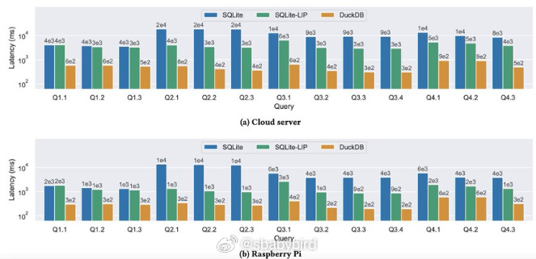
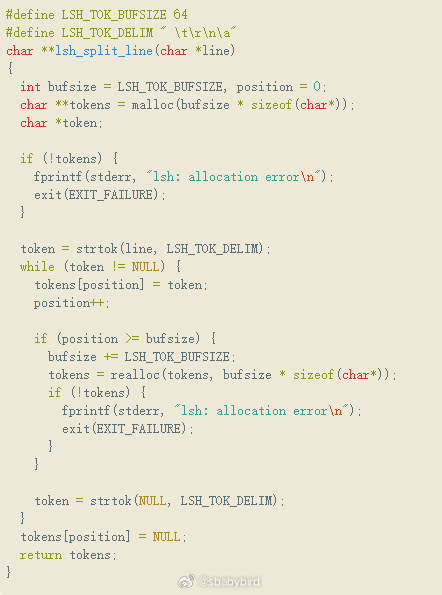
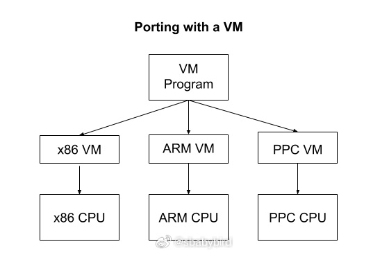
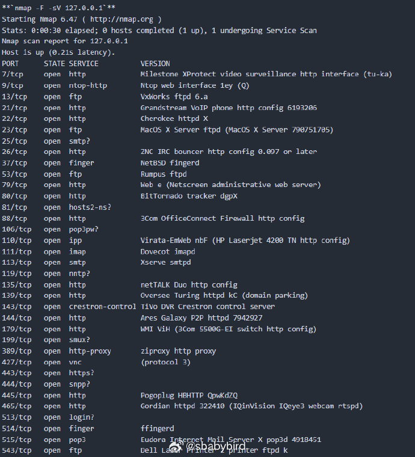
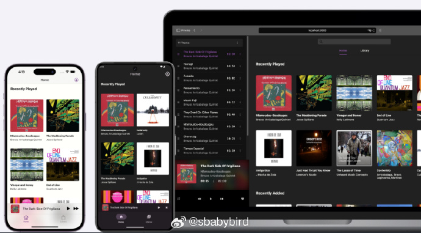

# 机器文摘 第 113 期
### 用 ESP32 做一个无人机 

[一个使用 ESP32 制作廉价无人机的项目](https://www.digikey.cn/zh/maker/projects/a-step-by-step-guide-to-build-a-low-cost-drone-using-esp32/8afccd0690574bcebfa0d2ad6fd0a391)

教人们如何使用 ESP32 微控制器构建一个低成本的无人机。

ESP32是一款功能强大的低成本微控制器，广泛用于物联网(IoT)项目和嵌入式系统。它具有Wi-Fi和蓝牙功能，适合用于需要无线连接的项目。

项目特点：
- Wi-Fi控制：可以通过智能手机控制。
- MPU6050 IMU：用于稳定性控制。
- 一体化PCB：不需要任何3D打印部件。
- 易于升级：可以通过外部模块添加定位保持或高度保持等额外功能。
- 小尺寸和轻量级。
- 内置电池充电器。
- 内置USB接口：用于编程和调试。
- 支持Android和iOS应用。
- 开源。

基于 Espressif 的 ESP-drone 固件，使用 ESP-IDF 4.4.5 版本编写。可以通过提供的[GitHub仓库](https://github.com/Circuit-Digest/ESP-Drone)从头开始构建固件，或者如果不想麻烦，可以直接刷入提供的二进制文件。

### 将 SQLite 性能提升 10 倍

[这篇深入探讨SQLite数据库性能优化](https://avi.im/blag/2024/sqlite-past-present-future/)的文章，详细阐述了如何通过引入布隆过滤器这一创新技术，显著提升了SQLite在处理分析查询时的速度，实现了高达10倍的性能飞跃。

文章不仅回顾了SQLite的发展历程，还深入分析了数据库连接操作的内部机制，并探讨了优化数据库查询的策略，最终展示了这一改进如何在SQLite v3.38.0版本中得到实际应用。

### 教程 - 用 C 语言写 Shell

[用 C 语言编写一个 Shell](https://brennan.io/2015/01/16/write-a-shell-in-c/)，这篇教程带领读者用 C 语言实现一个简易的 shell，对于希望进阶的程序员来说，实现一个自己的 shell 有助于更深入地了解操作系统、shell 等概念以及底层技术。

### 教程 - 用 C 语言写虚拟机

[编写您自己的虚拟机](https://www.jmeiners.com/lc3-vm/)，这是一份手把手教授读者进行虚拟机编写的教程。

跟随教程可以实现一个可以运行汇编程序的真正 VM，可以运行一些自己编写的游戏。

成品只有大概 250 行 C 代码，但作者讲的比较细，文档量比代码量大多了。 ​​​

### 一个脑洞清奇的网络安全项目

[Portspoof](https://github.com/drk1wi/portspoof)，这个项目在安全防护方面主打一个逆向思维，你不是扫我端口开没开吗？老子把 65536 个端口全打开了（伪装），慢慢扫吧。

这个安全工具的逻辑是：通过使所有 TCP 端口始终处于开放状态，以及模拟服务响应，增加攻击者对系统进行侦察的难度。

核心功能
- 端口欺骗：Portspoof 使所有 65535 个 TCP 端口都显示为开放状态。当攻击者尝试连接到任何端口时，Portspoof 会返回 SYN+ACK，而不是告知端口是关闭或被过滤的。
- 服务模拟：Portspoof 拥有一个庞大的动态服务签名数据库，用于生成虚假的服务标识（banners），以欺骗扫描器。这使得攻击者难以确定哪些端口真正在使用服务。

攻击者估计一脸宋小宝：玩儿呐？

### 构建自己的音乐流媒体中心

爱收藏音乐的 NAS 佬又有可以折腾的项目了。

[Black Candy](https://github.com/blackcandy-org/blackcandy)是一个开源自托管音乐流媒体服务器。适合那些希望拥有个人音乐库并能够自托管音乐流媒体服务的用户。通过 Black Candy，用户可以轻松地管理和播放自己的音乐收藏，同时享受自托管带来的隐私和控制优势。

主要功能特性：
- 音乐流媒体：作为一个自托管的音乐流媒体服务器，用户可以播放存储在服务器上的音乐。
- 移动应用：提供了移动应用，可在各大应用商店下载。

项目目前还在积极开发中，可能还不太稳定。

### 全平台网页收藏工具

[Hoarder](https://github.com/hoarder-app/hoarder) 是一个自托管的、能够保存书签、笔记、图片和 PDF 文件的平台，并且具有基于人工智能的自动标记和全文搜索功能。

这个项目的开发者在日常生活中经常在手机上浏览 Reddit、Twitter 和 Hacker News，发现有趣的内容（文章、工具等）想要保存以便在电脑前阅读。最初使用 Pocket 作为稍后阅读的应用，但后来对自托管产生了兴趣，希望构建一个自托管的解决方案。

主要功能特性：
书签管理：可以保存链接、简单的笔记、图片和 PDF 文件。
自动获取：自动获取链接的标题、描述和图片。
分类整理：将书签分类到不同的列表中。
全文搜索：对存储的所有内容进行全文搜索。
AI自动标记：使用 AI（如 chatgpt）进行自动标记，支持使用本地模型。
OCR技术：从图片中提取文本。
浏览器插件：提供 Chrome 和 Firefox 插件，方便快速书签保存。
移动应用：提供 iOS 和 Android 应用。
RSS订阅：自动从 RSS 订阅中保存内容。
REST API：提供 REST API 接口。
页面归档：使用 [monolith](https://github.com/Y2Z/monolith) 进行全页面归档，防止链接失效，自动使用 youtube-dl 归档视频。

“去我的收藏夹吃灰”又多了一个工具。

## 订阅
这里会不定期分享我看到的有趣的内容（不一定是最新的，但是有意思），因为大部分都与机器有关，所以先叫它“机器文摘”吧。

Github仓库地址：https://github.com/sbabybird/MachineDigest

喜欢的朋友可以订阅关注：

- 通过微信公众号“从容地狂奔”订阅。

- 通过[竹白](https://zhubai.love/)进行邮件、微信小程序订阅。

