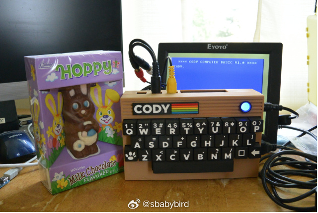
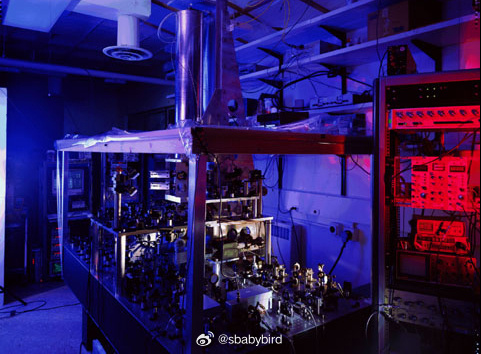
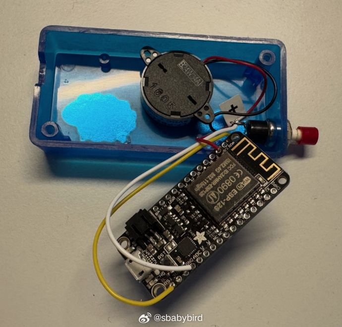
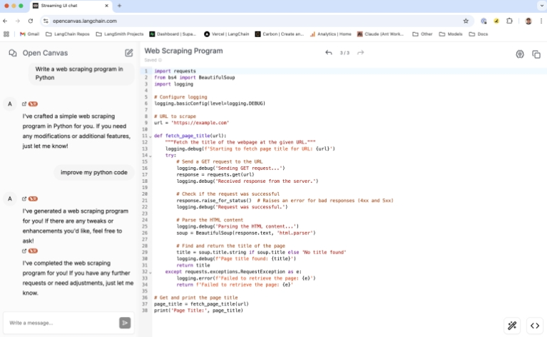
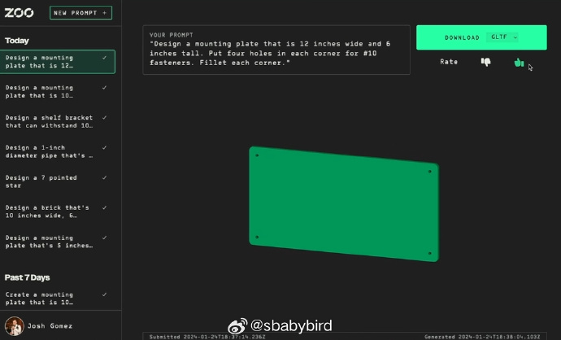
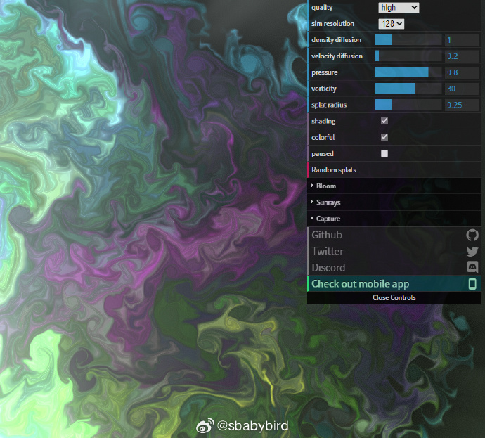
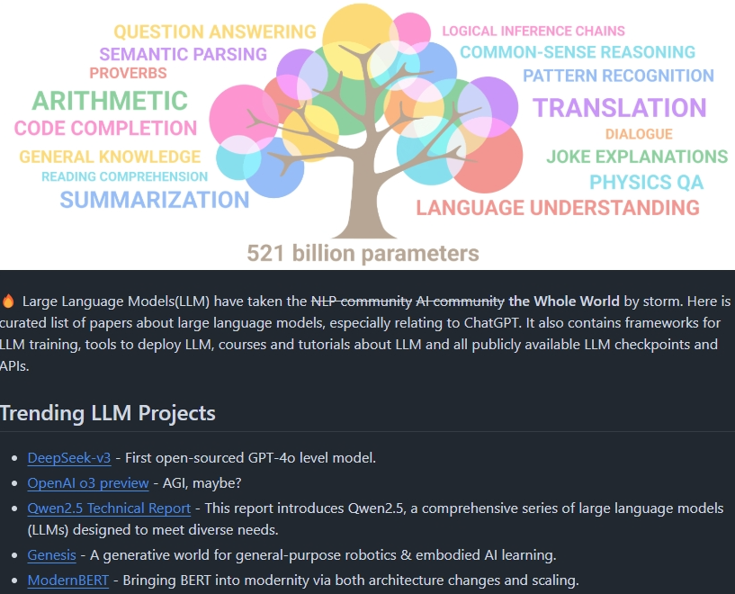

# 机器文摘 第 114 期
### 跟孩子一起制作一个 8bit 个人电脑吧

[Cody Computer](https://www.codycomputer.org/)，是一个 DIY 项目，灵感来自于20世纪80年代康懋达（Commodore）家用电脑（但并不兼容它）。

Cody Computer 围绕 Western Design Center 的 65C02 和 65C22 微处理器以及 Parallax Propeller 微控制器构建。

它并不是要与现代电脑或旧电脑的新版本竞争，而是作为一个简单、有趣、可能还有点教育意义的项目。

项目使用 KiCad 设计电子部分，使用 OpenSCAD 和 Inkscape 开发机械部件，所有设计文件和软件均在 GPLv3 许可证下发布。

功能特性
- 易于组装：基于现代65C02、65C22 和 P8X32A 构建。
- 3D打印部件：包括机械部件和键盘，以及定制的3D打印键帽套装。
- Cody BASIC：启动时进入 "Cody BASIC" 环境，支持使用 64tass 进行汇编语言交叉开发。
- 视频：160x200 NTSC 视频图形，灵感来自 VIC-II 的多色模式。
- 音频：实现 Commodore SID 功能的有限子集。
- 端口：包括扩展/卡带端口、两个缓冲UART和Atari风格的操纵杆连接器。

### 绕过 Windows 11（版本 24H2）上的 BitLocker 加密

[这篇文章](https://noinitrd.github.io/Memory-Dump-UEFI/)是关于如何绕过 Windows 11（版本 24H2）上的 BitLocker 加密。

作者通过使用自己开发的工具 Memory-Dump-UEFI 从内存中提取完整的卷加密密钥（FVEK）来实现这一目标。

如果攻击者能够物理接触设备，他们可能会通过突然重启计算机并转储最近运行的 Windows 实例的 RAM 来获取访问权限。捕获的内存可以被分析以定位敏感信息，如 FVEK 密钥。这种技术并非万无一失，因为一旦断电，RAM 中的内容会迅速退化。

步骤 1：创建可启动的 USB 设备

为了完成这一步，你需要一个大于目标系统 RAM 容量的 USB 存储设备。作者提供了一个名为 flashimage.sh 的脚本来简化这个过程。

步骤 2：突然重启目标系统

这可以通过多种方式完成，但目标是最小化计算机完全断电的时间。作者在 Windows 加载但登录屏幕尚未出现之前重启系统时，找到了 FVEK 密钥。

步骤 3：从 USB 设备启动

立即从 USB 设备启动 Memory-Dump-UEFI。你将到达 UEFI shell，在那里你可以找到并执行 app.efi。这个过程的时间取决于正在转储的 RAM 量和 USB 设备的速度。

步骤 4：分析转储

- 设置：应用程序可能会产生几个转储文件，这是由于 FAT32 文件系统对文件大小有 4GB 的限制。作者提供了一个名为 concatDumps.py 的脚本，可以将几个转储文件按时间顺序合并为一个。
- 池标签：池标签是 4 个字符长的标识符，指示 Windows 内核内存池的位置。这些池由 Windows 内核分配，是寻找敏感信息的好地方。
- FVEK 密钥恢复：作者在 dFVE 池标签下找到了 FVEK 密钥，这表明是由 dumpfve.sys 分配的内存，与 BitLocker 驱动器加密的完整卷加密崩溃转储过滤器有关。

在获得密钥后，需要在密钥前加上使用的算法。然后，将密钥转储到文件中，并使用 dislocker 工具套件来解锁 BitLocker 保护的分区。

### 1 秒为什么是 1 秒？

[到底什么是 1 秒？](https://www.johndcook.com/blog/2024/12/29/what-exactly-is-a-second/)，一篇关于 1 秒为什么是 1 秒，以及现代人是如何对其进行精确定义的科普文。

文章从Unix时间的微妙不准确性聊起，引出了对秒定义的深入讨论。他解释了为何地球自转的逐渐减慢促使科学家们在1967年重新定义秒，将其与铯原子的辐射周期挂钩，而非依赖于地球的自转。

这种定义的转变，不仅保证了时间测量的精确性，也体现了科学对恒定标准的不懈追求。

通过这篇文章，我们得以一窥秒背后的科学奥秘，以及它如何与我们的日常生活和科技进步紧密相连。

### 做一个蜂鸣器，提醒自己不要久坐

[我最喜欢的人体工学](https://blog.jacobvosmaer.nl/0036-beeper/)，作者介绍了他自创的一个名为 "The Beeper"（蜂鸣器）的 DIY 设备，这个设备帮助他解决了长时间坐在电脑前工作导致的身体疼痛问题。

"The Beeper" 由三个部分组成：硬件、运行在硬件上的固件，以及在工作电脑上运行的软件。如果作者的电脑屏幕解锁时间过长，"The Beeper" 会开始发出蜂鸣声，因为设备放置在远离书桌的地方，所以他必须起身去关闭它，从而解决了长时间静坐的问题。

硬件方面，"The Beeper" 被安装在一个小型的 ABS 塑料外壳中，内部包括一个  ESP8266 开发板、一个瞬时开关和一个压电蜂鸣器。蜂鸣器被粘在外壳上。

在作者的笔记本电脑上运行的软件是经过多年调整，已经符合了作者的工作习惯。软件通过 macOS LaunchAgent 自动启动，每 20 分钟检查一次是否应该发出蜂鸣声，如果是，则激活 "The Beeper"。但如果作者的屏幕被锁定，或者他正在使用外接显示器，或者正在进行 Zoom 会议，软件则不会发出蜂鸣声。

### OpenAI Canvas 开源版本

[Open Canvas](https://github.com/langchain-ai/open-canvas)，是一个开源 Web 应用程序，用于与代理协作更好地编写文档。它的灵感来自OpenAI 的“Canvas” ，但是完全开源。

不仅支持 Claude、Gemini、ChatGPT 等主流 LLM，还支持本地 Ollama 模型，同时内置记忆功能，更好记住我们的使用习惯与风格。

主要特性如下：
- 内置记忆 Agents：自动生成反馈和记忆，存储样式规则和用户见解；
- 快捷操作：可自定义提示词，在不同对话中使用，提供常见的写作和编码等任务提示词；
- 兼容多种格式：支持代码和 Markdown 等多种格式，同时可自由切换；
- 实时渲染：在编辑 Markdown 可实时预览渲染效果；
- 版本控制：所有内容都有版本记录，可以自由查看历史版本。

### AI 在 CAD 领域的一种尝试

[text-to-cad](https://zoo.dev/text-to-cad)。

Text-to-CAD 是一个开源提示界面，用于通过文本提示生成 CAD 文件。生成可以导入到您选择的 CAD 程序中的模型。 ​​​

### 基于 webgl 的流体力学模拟

[Fluid-Simulation](https://paveldogreat.github.io/WebGL-Fluid-Simulation/)，是一个基于 WebGL 的流体力学模拟项目，可以
在网页中模拟流体运动，用户通过鼠标交互，项目同时提供了一个可在手机上运行的移动版本。 ​​​

### 基于 WebRTC 的去中心化匿名聊天浏览器插件

[WebChat](https://github.com/molvqingtai/WebChat)，在任何网站上，无需注册，一键开启与他人聊天，利用 WebRTC 端到端加密，所有聊天数据保存到本地，安全隐私。

在任何网站上，无需注册，一键开启与他人聊天，利用 WebRTC 端到端加密，所有聊天数据保存到本地，安全隐私。

### 大模型导航资源

[Awesome-LLM](https://github.com/Hannibal046/Awesome-LLM)，里面收集了几乎全部的模型，具有里程碑意义的论文，排行榜，测试集，训练框架，部署，应用，书籍等。

## 订阅
这里会不定期分享我看到的有趣的内容（不一定是最新的，但是有意思），因为大部分都与机器有关，所以先叫它“机器文摘”吧。

Github仓库地址：https://github.com/sbabybird/MachineDigest

喜欢的朋友可以订阅关注：

- 通过微信公众号“从容地狂奔”订阅。

- 通过[竹白](https://zhubai.love/)进行邮件、微信小程序订阅。

