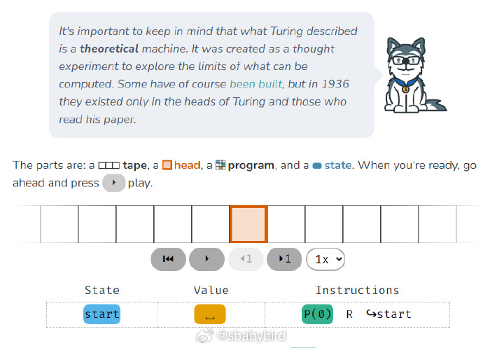
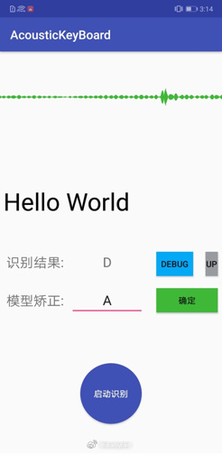
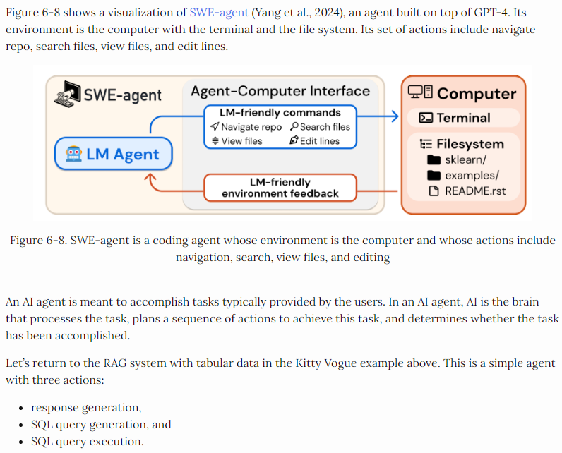
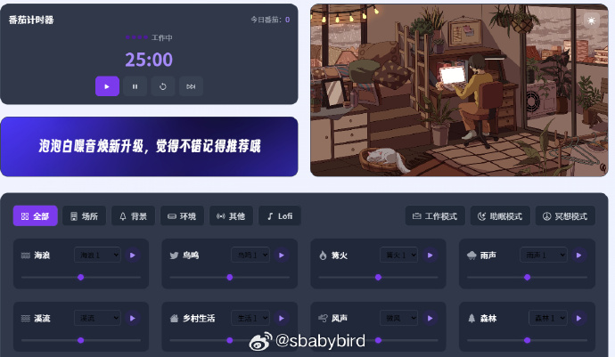
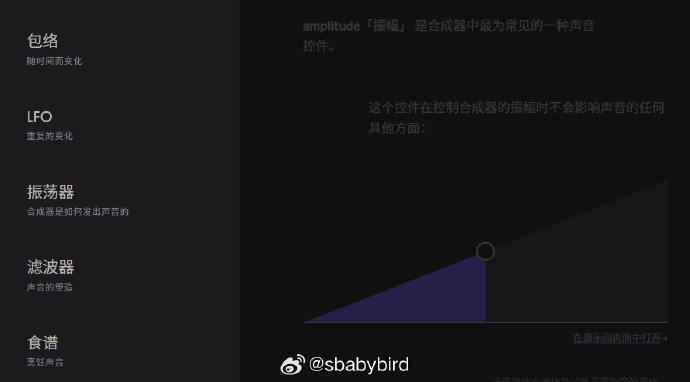
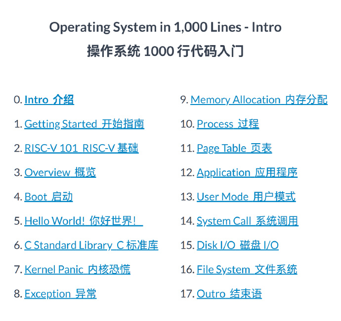
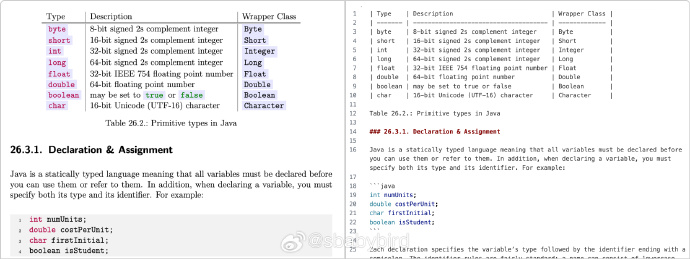
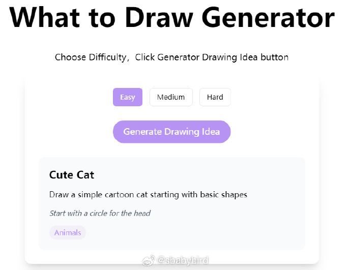
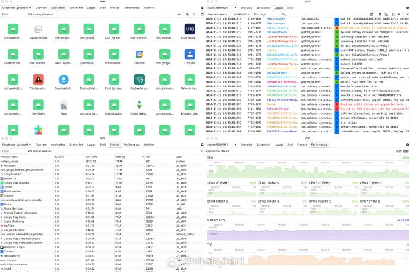
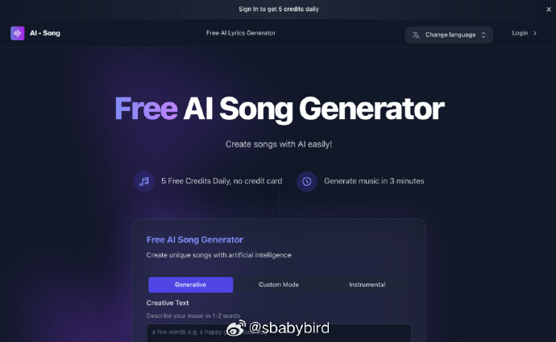

# 机器文摘 第 115 期

### 图灵机原理介绍

这是一篇交互型文章：https://samwho.dev/turing-machines/

文章内容是对图灵机(现代计算机的理论原型)的介绍。

图灵机尽管设计简单，只有四个部件和五条指令，但事实证明它能够执行任何可能的计算，为现代计算机奠定了理论基础。

文章内嵌入了很有趣的图灵机交互控件，可以跟随作者一边学习知识概念，一边体验计算的魅力。

### 做一个能听懂键盘敲击键位的「玩具」

基于声学信号处理及深度学习的键盘敲击识别系统。

[AcousticKeyBoard](https://github.com/ZhuoZhuoCrayon/AcousticKeyBoard-Web) 源自一个想法「做一个听懂键盘敲击键位的玩具？」，用于学习信号处理 / 深度学习 / 安卓 / Django。 ​​​

基本原理：
- 按键敲击最高世界记录约为 800 / min，平均每 75 ms 敲击一次键盘，即按键重叠发生在 3,600 的 silence 片段。
- 单人敲击键盘场景下，Hit 片段不会重合，并且不同按键所处位置、形状有所区别，Hit 具有可识别特征。
- 空格与其他按键形状不同，敲击声已明显不同。
- 不同按键周围的固体环境有差异，声音信号基于固体传导，在峰段存在差异。

### 关于 AI 智能体（Agents）的详细介绍

 ，文章深入介绍了 AI Agents 的核心概念、关键组成部分以及实践经验，包括如下内容：

- AI Agents 的详细介绍：一个能感知环境并采取行动的智能系统；
- Agents 两大核心能力支柱：工具集（知识增强、能力扩展、操作能力）和规划能力（执行、反思、纠错）；
- Agents 三大失败模式：规划失败、工具失败和效率问题。

### 一个免费白噪音网站

[泡泡白噪音](https://www.ppbzy.com/)：提升专注与放松的一站式白噪音平台

🌟 产品亮点
1️⃣ 丰富的白噪音选择
提供上百种高质量的白噪音场景，包括自然环境、城市氛围和独特的声音素材：
☕ 咖啡厅背景声、火车行驶声、飞机白噪音
🌊 雨声、海浪声、森林风声等自然白噪音
🎵 Lofi 音乐与轻柔旋律，适合舒缓放松
2️⃣ 白噪音组合与收藏功能
支持多个白噪音的自由组合，每个音源都可以单独调整音量，随心定制属于你的专属音效！
比如同时播放「咖啡厅」+「下雨声」+「键盘敲击声」，打造最适合你的工作氛围。
收藏功能：将喜欢的白噪音组合一键保存，随时快速切换。
3️⃣ 场景模式，一键开启 + 放松视频
根据不同需求设计了 3 大场景模式：
工作模式：提升注意力，适合学习、写作和编码。
助眠模式：舒缓身心，帮助快速入睡。
冥想模式：沉浸在自然的声音中，平静你的心灵。
放松场景视频：提供沉浸式动画场景切换（如雨夜中的温馨小屋），增强沉浸感。
4️⃣ 定时功能
设置播放时长，白噪音将在指定时间后自动关闭，让你放心工作、学习或入睡，无需手动操作。
5️⃣ 音质选择功能
支持多种音质选择，从高音质到低音质，满足不同设备和网络环境需求。
6️⃣ 内置番茄钟功能
集成了 番茄计时器，帮助你专注工作或学习，同时享受喜欢的白噪音。
7️⃣ 背景主题切换
可根据个人喜好选择背景主题（白天、夜晚等），增加沉浸感，贴合当下的情绪与状态。
8️⃣ 无干扰体验
简洁的设计，无广告，无注册，无干扰，让你专注于自己想做的事。

### 音乐合成器知识学习

[音乐合成器入门](https://learningsynths.ableton.com/zh-Hans)，这是一个在线交互站点，可以一边学习合成器的基础知识一边上手体验。

网站也支持 MIDI 键盘输入，跟着教程捏出自己独有的音色之后还可以来一段现场演奏。 ​​​

之前还出过一个姊妹篇：[在线学习编曲](https://learningmusic.ableton.com/zh-Hans/)。

### 透明背景视频生成

[TransPixar](https://github.com/wileewang/TransPixar), 是由 Adobe 和香港科大开源的一款可以生成透明视频的项目，它可以生成包含烟雾、反射、水滴等透明元素的视频，看起来非常真实、更自然。

这给比如电影特效制作、游戏画面渲染、虚拟现实创作提供了更多的便利性。

### 操作系统教程

[用大概1000行代码，从零开始构建一个小型的操作系统](https://operating-system-in-1000-lines.vercel.app/en)。

这个教程详细介绍了构建一个小型操作系统的过程，包括实现基本的上下文切换、分页、用户模式、命令行Shell、磁盘设备驱动程序以及文件的读写操作。尽管这些听起来很复杂，但整个操作系统的代码量仅为 1000 行。

### 用视觉模型将 PDF 转换为 Markdown 格式

[zerox](https://github.com/getomni-ai/zerox)，一个基于视觉模型的 OCR 工具，因为其在识别过程中调用了大模型的能力，所以对于带有特殊布局、表格、图表的文档转换效果要高于普通 OCR 文字识别程序。 ​​​

### 绘画点子生成器

[画点儿啥](https://whattodraw.art/)，解决想画画但是又不知道画点儿啥的问题。

这个网站可以随机生成一些绘画主意，可以在线作画，然后将你的结果提交与全网进行比对得分。 ​​​

###  安卓设备调试界面工具

[aya](https://github.com/liriliri/aya)，是一个用于简化对安卓设备操作控制的桌面应用程序，可以看作是 ADB 的图形用户界面。

主要特性：
- 内置 ADB，安装即用，无需任何额外的复杂操作。
- 按类别分为多个面板，包括应用程序管理、性能监控、流程管理等。
- 图形用户界面，一键操作，无需输入任何命令。

### 免费AI歌曲生成器 Free AI Song Generator

网址：https://ai-song.ai/

输入歌词，AI 会根据歌词生成一首歌曲，自动完成谱曲、编曲、演唱全部内容，可以选择不同的风格和情感。

### 关于 AI 对编程行业影响的不负责任推测
经过几天的 AI 大模型 Agent 发展现状的研究，我感觉未来属于有想象力的、能吹牛逼讲故事的人（可能过去也是一直属于这种人）。

要说之前吹牛逼的人还需要忽悠真人帮他实现梦想，实现起来有点儿难度之外，现在直接有无限个 AI 机器人任劳任怨地帮你实现梦想。

对着 AI 讲故事，然后它们把故事实现，这是未来的主要商业模式（看看抖音的扣子平台，已经涌现出大量的这样的产品了）。

未来的编程方式也会完全改变，当今的高级语言不会再有人使用，或者就像汇编语言那样只在特殊场景才被特殊群体使用。

取而代之的编程语言就是自然语言，由 AI 模型将自然语言解析成为计算机语言。

软件架构将产生巨大颠覆，现在所谓的代码复用、可扩展性、可伸缩性在新的 AI 架构下将不再作为重点目标，AI 编程的时候可以完全无视这些，需要代码就随时生成，统统写死，一次性地运行也将成为一种经济型策略。

## 订阅
这里会不定期分享我看到的有趣的内容（不一定是最新的，但是有意思），因为大部分都与机器有关，所以先叫它“机器文摘”吧。

Github仓库地址：https://github.com/sbabybird/MachineDigest

喜欢的朋友可以订阅关注：

- 通过微信公众号“从容地狂奔”订阅。

- 通过[竹白](https://zhubai.love/)进行邮件、微信小程序订阅。

