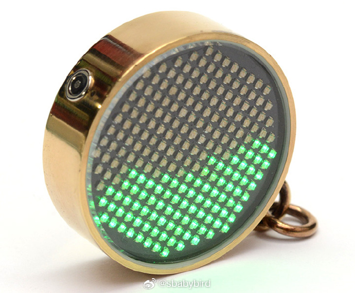
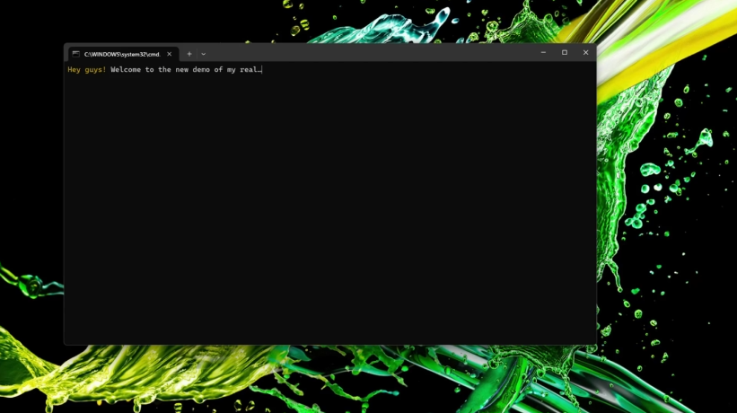
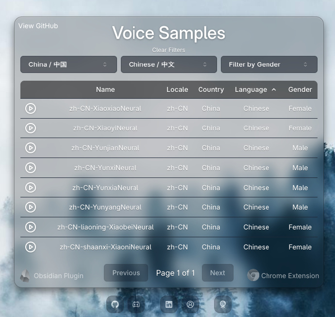
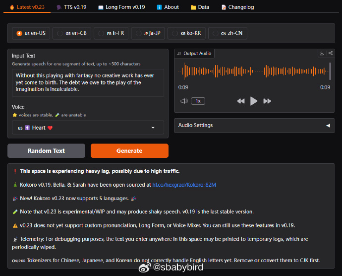
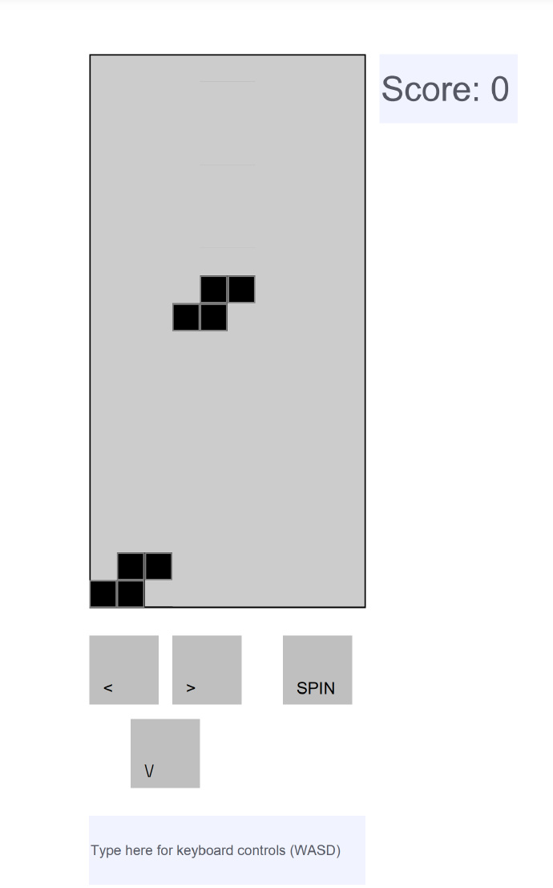
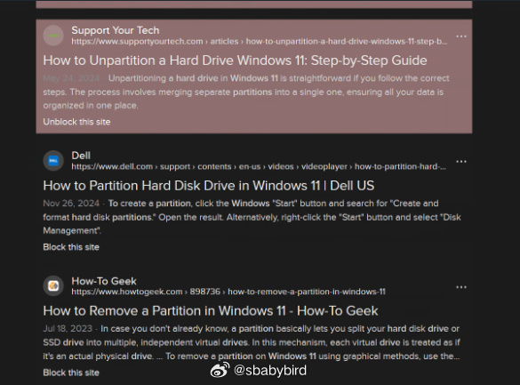
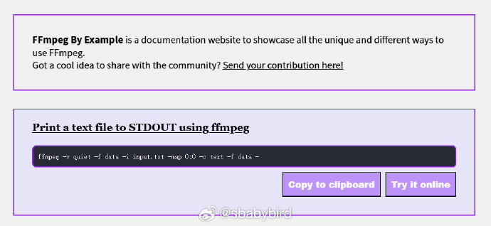
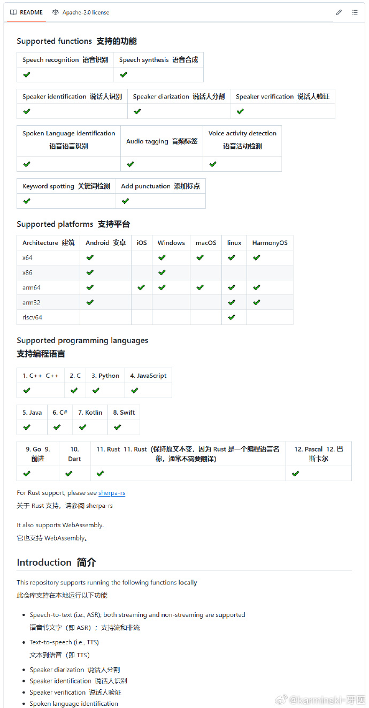

# 机器文摘 第 116 期
### 展开说说关于编程的未来
这几天思考了关于未来编程方式变革。

当前这种使用“专属高级程序语言”编程的方式将像之前“纸带打孔编程”那样逐渐消失，取而代之的是使用自然语言进行“编程”。

码农这个职业可能不复存在，但是编程的工作仍然需求旺盛，只是形式变了、工具变了、工作场景也变了，对“程序员”的要求也变了。

技术的核心目标无非是提升生产力和生产效率，改善人类的生活水平，信息科技也无非是通过数字化、信息化手段来实现这个目标。

之前是那种高级语言编程实现，现在跳过了“编码”过程，直接以一种前所未有的交互方式来创造“软件”。

既然创造方式改变了，那么必定会带来其他的改变，我能想到以下几点：
1. 软件的量必然膨胀，构建软件的成本变得十分低廉，生产软件的速度也呈指数级增长，一切能用软件的地方都得用上软件。
2. 软件的架构可能改变，之前编程还需要照顾人类的阅读，现在无所谓了，变量命名、代码复用、模块化、扩展性，实现方式变了，比起精心设计的可复用模块，可能每次都实时生成代码更经济。
3. 编程的职业可能泛化，软件创造被拉下高科技的神坛，人人都能编程，人人都能创造软件。

那会诞生哪些公司机会呢？
1. 提供新型的工具，帮助人人创造软件（各种 ai 创业公司都在做，以提供新型编程工具、环境为主要产品）。
2. 利用新型的工具，满足之前没有被服务到位的需求（之前可能因为软件建设太昂贵），就像拼多多那样（目前字节的扣子平台有点儿这个意思）。
3. 培训，教人学习和使用这些工具，当然了，是面向未来的“新型程序员”。

### 2025.1版AI Agent工具全景图： 从入门到进阶的12个关键工具
*来自微博[@爱可可-爱生活](https://weibo.com/u/1402400261)*

1. 入门首选： PydanticAI
- 特点：类型安全 + FastAPI风格
- 优势：模型通用性强，上手门槛低

2. 团队协作利器： CrewAI
- 主打多智能体协同
- 适合复杂项目开发

3. 可视化开发神器： n8n
- 提供数百种集成选项
- 所见即所得的工作流构建

4-6. 企业级开发三剑客：
- AutoGen(微软)： 开源框架，专注多智能体
- Smolagents(HF)： 简码开发，环境兼容性强  
- Phidata： 智能体记忆管理，文档完善

7-9. 进阶开发工具链：
- AgentOps： DevOps全流程支持
- Vercel AI SDK： 与AI-SDK完美集成 
- Rig(Rust)： 新手友好的智能体开发工具

10-12. 特色应用工具：
- Eliza： 跨渠道智能交互
- LangGraph： 基于LangChain的高级应用
- Memó： 个性化交互增强工具

核心价值：这套工具链涵盖了从入门到专业的全周期开发需求，既有低代码平台助力快速起步，也有专业框架支撑进阶开发。新手可以逐步尝试，专业开发者也能找到趁手工具。

建议：
1. 建议先从可视化工具入手
2. 逐步过渡到代码开发
3. 根据项目需求选择合适工具
4. 关注工具间的协同效应

无论你是初学者还是专家，这12个工具都值得收藏。

### 流体模拟吊坠

[流体模拟吊坠](https://mitxela.com/projects/fluid-pendant)，这篇文章详细介绍了作者制作的一款流体模拟吊坠（Fluid Simulation Pendant）的全过程。

吊坠是一件手工制作的珠宝，运行实时的FLIP流体模拟。外壳镀金，显示屏由手表玻璃保护。

流体模拟基于Matthias Müller的工作，特别是他的[“Ten Minute Physics”](https://matthias-research.github.io/pages/tenMinutePhysics/index.html)网站上的“[如何编写FLIP水模拟器](https://matthias-research.github.io/pages/tenMinutePhysics/18-flip.html)”教程。

作者在项目中并没有直接移植，而是根据教程重新实现的。

组成吊坠的硬件包括STM32L432KC（ARM Cortex-M4带FPU，超频至100MHz）、ADXL362超低功耗加速度计、MCP73832锂电充电控制器、TPS7A02稳压器（极低功耗）和TPS3839监控器。所有这些组件都集成在一个四层0.8mm的PCB上。

### 只有56个字节的贪吃蛇游戏

[snake](https://github.com/donno2048/snake)，不是 56Kb，而是只有 56 字节。 ​​​

### 高性能语音转文本工具

[RealtimeSTT](https://github.com/KoljaB/RealtimeSTT)，一个强大高效、低延迟的语音转文本工具。

简单易用，支持开始和停止说话的状态监测，支持指定唤醒词触发工作，实时进行将语音转换为文本。

可以在 Windows、macOS 以及 Linux 系统上安装使用，同时支持 CUDA 进行 GPU 加速。

### 白嫖微软 Edge 在线文本转语音服务

[openai-edge-tts](https://github.com/travisvn/openai-edge-tts)，利用微软 Edge 的在线语音服务，提供免费的文本转语音功能，且可以像使用 OpenAI 的语音一样使用该 API。

同时，支持多种音频格式，如 mp3、aac、flac、wav 等，可自由调节播放速度，以及有多种语音和语言选择。

可通过 Docker 一键部署方式，快速体验。

### 轻量级文本转语音模型

[Kokoro TTS](https://kokorotts.online)，一个只有 82M 参数的文本合成语音模型。

有着极高的生成速度和非常自然的发音效果。

支持中文，但特长是美式发音和英式发音的英语，适合生成英文配音。

Kokoro TTS 基于 Apache 2.0 许可开源。

### 轻量级大模型
*来自微博[@karminski-牙医](https://weibo.com/u/2169039837)*

> 搜索引擎&爬虫工程师的工具链感觉现在全面面临洗牌了。以前靠SVM来分类，靠 TF-IDF 来抽关键词，trie-tree 来过滤敏感词，基于文本密度算法来抽正文，靠余弦相似度等相似度算法来消重。
> 现在，大模型能全面取代这些传统NLP做法了。

> 我现在抽正文就在用 reader-lm-1.5b，这个模型能把 html 转 markdown，然后再消息队列塞给下游模型用定义好的Agent来分类，提取关键词和摘要。最后入库之前RAG检索做消重。尤其是文本内容的对抗进化没那么快，现在打不过LLM（比如写点抽象的东西来规避过滤，LLM能轻松认出来，但是基于敏感词的 trie-tree 效果就很差）。所以LLM除了耗资源几乎无缺点了。

> reader-lm-1.5b 地址：huggingface.co/jinaai/reader-lm-1.5b
> 这个模型小到不用量化，纯CPU都能跑得飞起。

### 一个在纯pdf文件里运行的俄罗斯方块

生成pdf的代码： github.com/ThomasRinsma/pdftris

演示地址：th0mas.nl/downloads/pdftris.pdf

实际上运行需要依赖现代桌面浏览器中的 PDF 引擎（PDFium 和 PDF.js）,也就是在浏览器中打开这个pdf文件，如果用普通的pdf程序如sumatrapdf打开这个pdf文件是没法运行的。

当然这也意味着pdf的安全风险。

### 屏蔽搜索结果的垃圾内容

现在互联网搜索引擎搜索出的内容，由 AI 制造的垃圾内容越来越多，[BadWebsiteBlocklist](https://github.com/popcar2/BadWebsiteBlocklist)，这里提供了一份黑名单，借助 [uBlackList](https://iorate.github.io/ublacklist/docs)浏览器插件，可以有效屏蔽搜索结果中这些垃圾内容。 ​​​

### ffmpeg 命令在线参考

[https://ffmpegbyexample.com/](https://ffmpegbyexample.com/) 这个网站可以查看 ffmpeg 的全部命令参数以及使用方式，网站列举了几十种常见转换任务的命令行示例。

### 检测视频中人眼视线的模型

[Moondream](https://huggingface.co/vikhyatk/moondream2/tree/main) 是一个 非常强大而且小巧的视觉模型。

0.5B  INT4 版本甚至只有 400M

支持结构化 OCR 输出、图片描述、物体检测和位置标注

最近更是更新了 视线检测，给一段视频就可以看到视频中每个人的视线

这个很适合用来恶搞和意图检测

Comfyui 插件也已经上线，显存占用为 6G

### STT/TTS框架

[sherpa-onnx](https://github.com/k2-fsa/sherpa-onnx)，这个框架可以语音转文字，文字转语音，说话人识别，说话人验证，语言识别，音频标签，关键词检测，添加标点符号等等功能。
支持架构也非常广泛，从 x86 到 arm 到 risc-v。主流编程语言也全部支持。

## 订阅
这里会不定期分享我看到的有趣的内容（不一定是最新的，但是有意思），因为大部分都与机器有关，所以先叫它“机器文摘”吧。

Github仓库地址：https://github.com/sbabybird/MachineDigest

喜欢的朋友可以订阅关注：

- 通过微信公众号“从容地狂奔”订阅。

- 通过[竹白](https://zhubai.love/)进行邮件、微信小程序订阅。

