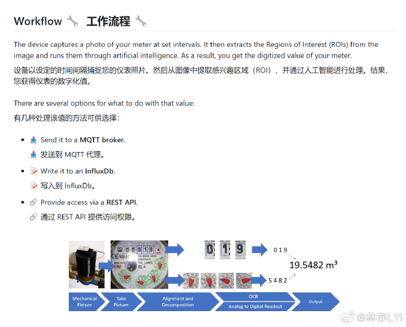
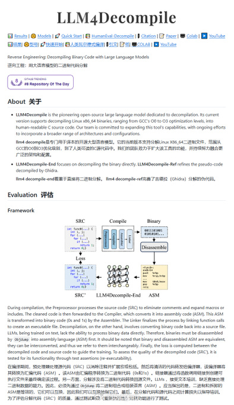
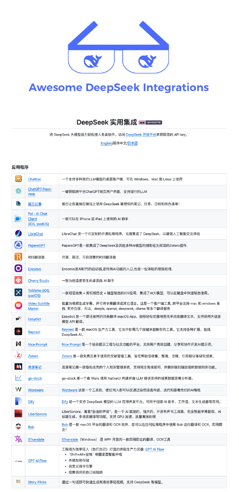
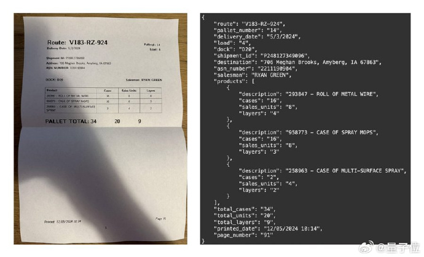
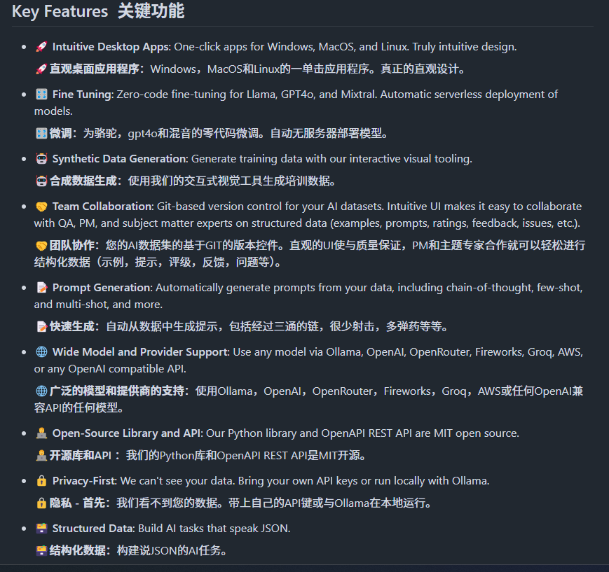
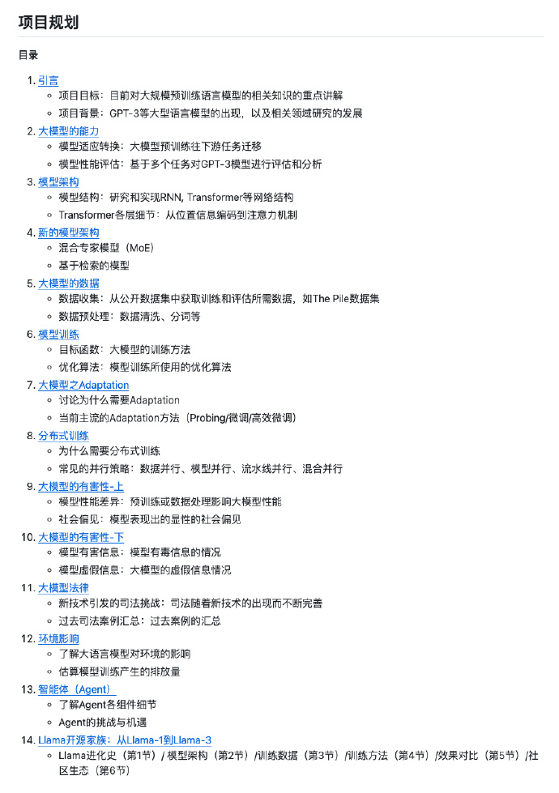
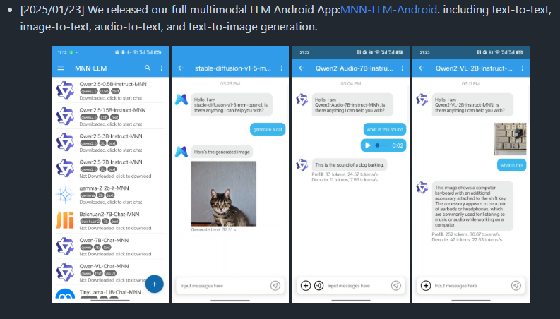
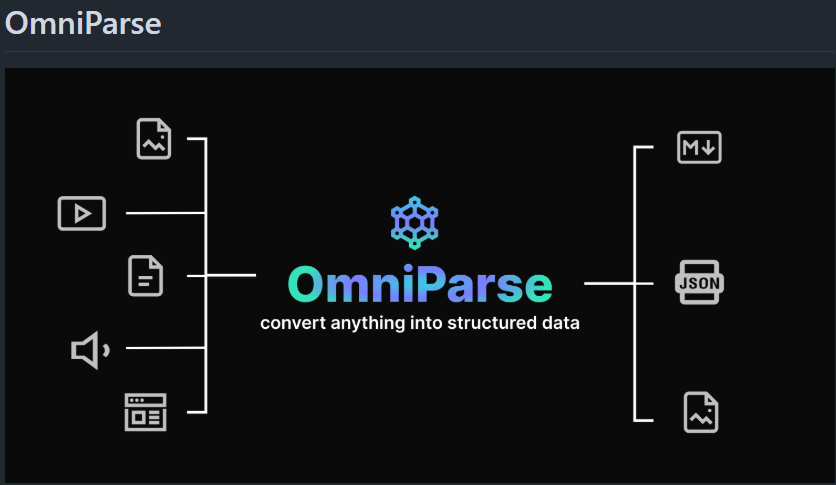

# 机器文摘 第 117 期

### 使用 ESP32-CAM 将旧的水、电、燃气等计量单元连接到数字世界

人工智能无处不在，从语音到图像识别。尽管大多数 AI 系统都依靠强大的处理器或云计算，但边缘计算通过利用现代处理器的功能使 AI 更接近最终用户。

[ESP32-CAM](https://github.com/jomjol/AI-on-the-edge-device)，项目展示了使用 ESP32 （一种低成本，具有AI功能的设备）来数字化模拟仪表（无论是水，气或电力）数字化的边缘计算。

通过负担得起的硬件和简单的说明，您可以将任何标准仪表变成智能设备。

关键特性：
- 🔗Tensorflow Lite（Tflite）集成- 包括易于使用的包装器。
- 📸内联图像处理（特征检测，对齐，ROI提取）。
- 💡小型且负担得起的设备（3 x 4.5 x 2cm³，小于10欧元）。
- 📷集成相机和照明。
- 🌐用于管理和控制的Web界面。
- 🔄用于直接通过Web接口更新的OTA接口。
- 🏠与 Home Assistant 的完全集成。
- 📡 MQTT协议支持。
- 📥可用于数据访问的REST API 。

### 专业逆向工程大模型

[LLM4Decompile](https://github.com/albertan017/LLM4Decompile)，这个模型可以将 x86_64二进制程序反编译为 C 代码，模型大小从 1.3B 到 22B 都有，22B 如果 Q4 量化的话只有 10G左右，Q8 大概 22G。好一点的显卡就能本地用了 ​​​。

### Awesome DeepSeek Integration

DeepSeek 最近很火，这个仓库收集了[一份支持 DeepSeek 大模型的各类软件列表](https://github.com/deepseek-ai/awesome-deepseek-integration)，来自 DeepSeek 官方团队收集整理，涵盖了应用程序、AI Agent 框架、RAG 框架、即时通讯插件、浏览器插件、VS Code 插件等等。在这份列表上面，我们能快速找到那些已支持 DeepSeek 的应用、框架、插件，并按需选择使用。

### 方便微调视觉语言模型的工具

[Maestro](https://github.com/roboflow/maestro)，这个工具把PaliGemma 2、Florence-2、Qwen2.5-VL的微调流程，打包成“开箱即用”的方案，而且还支持CLI和Python API，甚至在Colab上也能跑。不用考虑各种繁琐的配置、数据加载、训练循环和复现问题，用户只需专注于模型调优的核心部分。

### 如何用 DeepSeek-R1 蒸馏出属于你自己的大模型？

[Kiln](https://github.com/Kiln-AI/Kiln)，一个新的 fune-tune 框架，可以在 1 小时内让DeepSeek-R1蒸馏出属于你自己的小模型，整个过程是全自动的，不需要编写代码或者手动调节，仅需定义你的数据集即可。

项目支持跨平台桌面应用，无论是 Windows、Mac、Linux，均可下载安装包即开即用。

### 大规模预训练语言模型的教程

[《大模型基础》](https://github.com/datawhalechina/so-large-lm)，一文了解大模型基础知识。

基于斯坦福大学和李宏毅的课程，并结合开源贡献者的补充和最新研究进展，旨在为读者提供深入的理论知识和实践方法。

内容涵盖了模型架构、数据收集、模型训练、智能体，以及模型在安全、环境和法律方面的应用等。

### 在手机端离线运行 LLM 大模型

[MnnLlmApp](https://github.com/alibaba/MNN)，基于 MNN-LLM 框架的 Android 手机应用，阿里开源项目，支持各类 LLM 在手机上离线运行，支持多种多模态任务，文本生成文本、图像生成文本、音频转文本以及文本生成图像。

在安卓平台上，MNN-LLM的CPU性能优秀，预填充速度较 llama.cpp 提高了 8.6 倍，较 fastllm 提升了 20.5倍，解码速度分别快了2.3倍、8.9倍

支持多种模型，Qwen、Gemma、Llama（涵盖TinyLlama与MobileLLM）、Baichuan、Yi、DeepSeek、InternLM、Phi、ReaderLM、Smolm等

完全在设备本地运行。

### 非结构化数据转换工具

[omniparse](https://github.com/adithya-s-k/omniparse)，一个可以把各种非结构化数据转为结构化数据的工具：OmniParse，本地运行，支持约20种文件格式。

支持文档、表格、图像、视频、音频、网页等，能提取表格、识别图片内容、转录音视频、爬取网页，把数据转成高结构化Markdown 格式。

适合需要批量处理各种数据并用于AI应用的场景，目前支持Linux系统。

## 订阅
这里会不定期分享我看到的有趣的内容（不一定是最新的，但是有意思），因为大部分都与机器有关，所以先叫它“机器文摘”吧。

Github仓库地址：https://github.com/sbabybird/MachineDigest

喜欢的朋友可以订阅关注：

- 通过微信公众号“从容地狂奔”订阅。

- 通过[竹白](https://zhubai.love/)进行邮件、微信小程序订阅。

