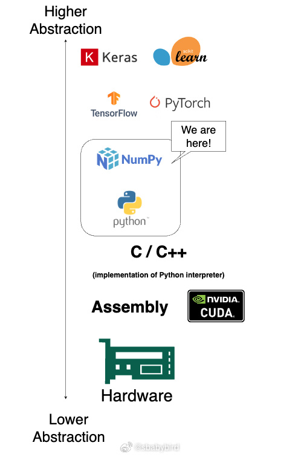
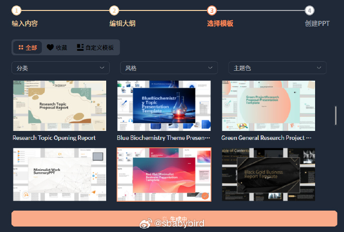
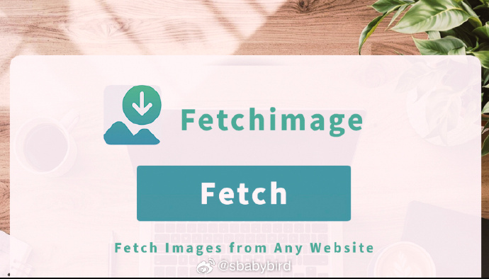
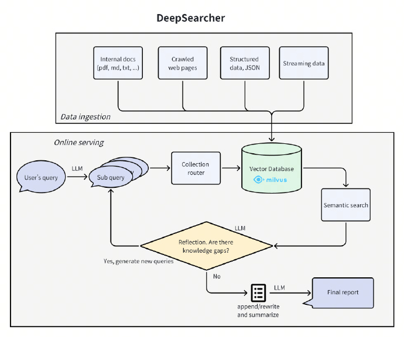
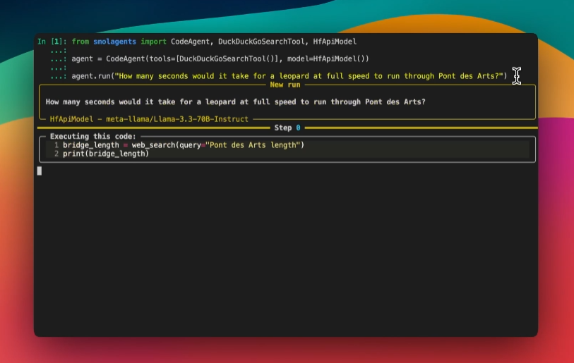
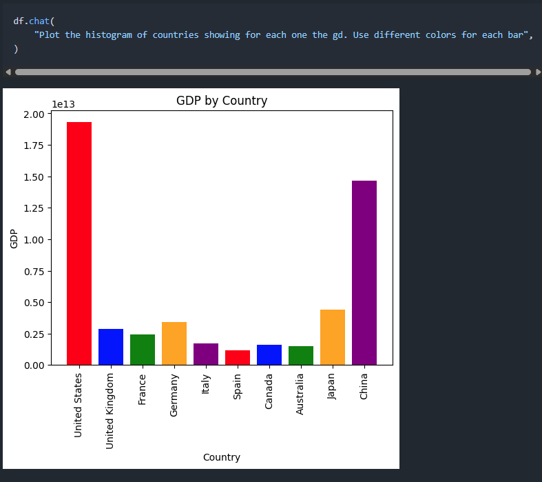
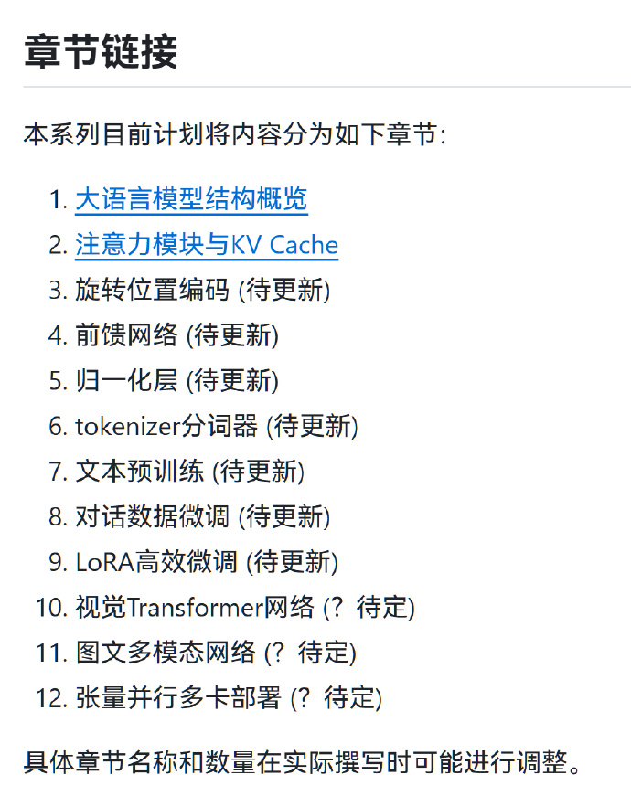
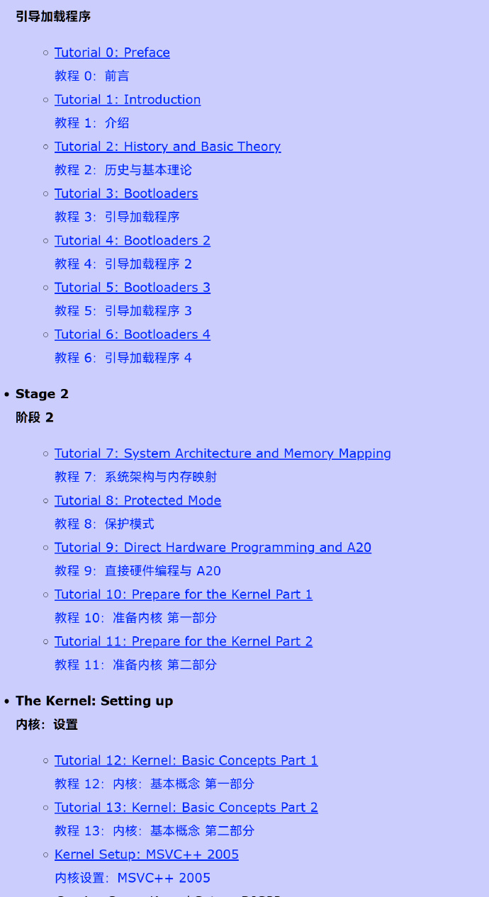

# 机器文摘 第 118 期
### 从零开始构建一个深度学习库

这篇文章[《How I Built a Deep Learning Library from Scratch Using Only Python, NumPy & Math》](https://www.henrypan.com/blog/2025-02-06-ml-by-hand/)由 Henry Pan 撰写，详细介绍了他如何仅使用 Python 和 NumPy 从零开始构建一个深度学习库——ML by Hand。

该库的目的是为了帮助学习者深入理解深度学习模型和库的构建原理，而不是为了替代现有的高效库如 PyTorch 或 TensorFlow。

Henry Pan 开始这个项目的动机是出于对如何从数学公式出发构建深度学习模型的好奇心。

他希望通过这个项目，从第一原理（微积分和线性代数）出发，将这些原理以最原始的形式表达在代码中。

该项目的灵感来源于 Andrej Karpathy 的 Micrograd 项目，最初只是想创建一个自动求导引擎，但最终发展成为一个完整的机器学习库。

通过这篇文章，读者可以深入了解如何从零开始构建一个深度学习库，以及在构建过程中需要考虑的各种技术和设计问题。

### 98 版电视剧水浒传的官方网站

[水浒传官网长啥样 - 探究央视 98 版水浒传网址](https://1link.fun/i/98-quSrAu73_WS/)，本文通过一段抖音视频，引出了对央视98版《水浒传》官网的探究。

视频中提到的网址存在错误，正确的网址应为http://www.chinapages.com/shuihu

这个网址曾属于中国黄页（China Pages），由马云于1995年创立，旨在将中国企业介绍给全世界。

通过互联网档案馆（Wayback Machine），作者找到了该网址在1998年5月9日的快照，网页设计具有浓厚的年代感。

该网站一直存活到2001年6月6日，之后变为404状态。这段历史不仅展示了互联网发展的早期阶段，也反映了中国互联网产业的起步。

### AI 生成 PPT

[aipptmaker](https://aipptmaker.ai/create)，一个通过 AI 在线制作 PPT 的工具。

- 无需安装，登录后即可在线使用；
- 无需切换，在一个工具上就可以完成全部任务；

### 批量提取网页图片

[FetchImage](https://chromewebstore.google.com/detail/fetchimage/oecdebfgcmkgdfepfacnfhmkhjgbafde) 是一款让网页图片提取变得极致简单的 Chrome 扩展程序。

无论是设计灵感收集、内容创作，还是日常图片整理，FetchImage 都能帮助您快速、高效地完成任务。

主要功能:
- ✅ 一键提取：从任何网页瞬间提取所有图片。
- ✅ 尺寸筛选：轻松筛选符合需求的图片大小。
- ✅ 批量下载：支持一键批量保存图片。
- ✅ 隐私至上：所有操作均在本地执行，绝不收集任何数据。

支持网站：Instagram、X（原 Twitter）、Pinterest、Facebook、Google 图片等主流平台。

### Deep Research 开源版

[DeepSearcher](https://github.com/zilliztech/deep-searcher)，结合了大模型和向量数据库，为个人/企业知识管理、智能问答、信息搜索等场景提供高度准确的答案和全面分析。

支持本地文件导入，以及网络数据爬取等文档加载，支持 DeepSeek、OpenAI 等大模型。

### 抱抱脸（Hugging Face）团队推出的智能体（agent）库

[smolagents](https://github.com/huggingface/smolagents) 是由 Hugging Face 团队开发的一个轻量级库，旨在帮助开发者快速构建和部署智能代理（agents）。

该项目的核心目标是通过简洁的设计和强大的功能，使开发者能够轻松创建能够执行复杂任务的代理，这些任务包括调用工具、编写代码以及协调其他代理的工作。

主要特性：
- 简洁性：smolagents 的设计非常简洁，核心逻辑集中在 agents.py 文件中，易于上手和定制。
- 代码代理：支持 CodeAgent，这是一种能够通过编写 Python 代码来执行操作的代理。与传统的基于文本的代理相比，代码代理在执行复杂任务时更加高效。
- 模型无关性：支持多种语言模型（LLM），包括本地的 transformers 模型、OpenAI、Anthropic 等提供的模型，以及通过 LiteLLM 集成的 100 多种模型。
- 工具无关性：支持多种工具，包括 LangChain、Anthropic 的 MCP，甚至可以将 Hugging Face 的 Hub Space 作为工具使用。
- 模态无关性：支持文本、图像、视频甚至音频输入，适用于多种应用场景。
- 安全性：提供沙盒环境（通过 E2B）来安全地执行代码，防止对系统造成潜在风险。

### 用自然语言和数据对话

[PandaAI](https://github.com/sinaptik-ai/pandas-ai)是一个Python平台，可以轻松以自然语言向您的数据提出问题。

它可以帮助非技术用户以更自然的方式与数据进行交互，并帮助技术用户在处理数据时节省时间和精力。

将该库依赖到自己项目中，只需几行代码，轻松实现数据读取，并能通过对话方式向数据进行提问。

比如查询数据，做数据分析，甚至还可以直接为我们生成趋势图。目前已支持 SQL、CSV、Parquet 等数据存储格式。

如果开发人员开放一个可视化界面，产品或销售就能直接做数据分析，再也不用导出数据并生成表格。

### 连载教程“从零开始理解大语言模型”

https://github.com/KaihuaTang/All-you-need-to-know-about-LLM  

本系列教程的目的是让读者可以在基础的pytorch上，不依赖任何其他现成的外部库，从零开始理解并实现一个大语言模型的所有组成部分，以及训练微调代码，因此读者仅需python，pytorch和最基础深度学习背景知识即可。

可以先收藏，~~反正收藏了就等于学会了~~。

### 一个经典的操作系统开发教程（2008 年的）

http://www.brokenthorn.com/Resources/OSDevIndex.html

面向初学者，一步步开发一个操作系统。用到的语言是 C 语言和 x86 汇编语言

## 订阅
这里会不定期分享我看到的有趣的内容（不一定是最新的，但是有意思），因为大部分都与机器有关，所以先叫它“机器文摘”吧。

Github仓库地址：https://github.com/sbabybird/MachineDigest

喜欢的朋友可以订阅关注：

- 通过微信公众号“从容地狂奔”订阅。

- 通过[竹白](https://zhubai.love/)进行邮件、微信小程序订阅。

