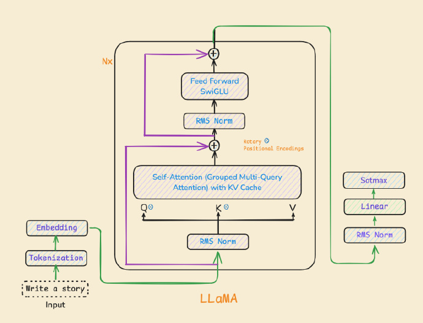
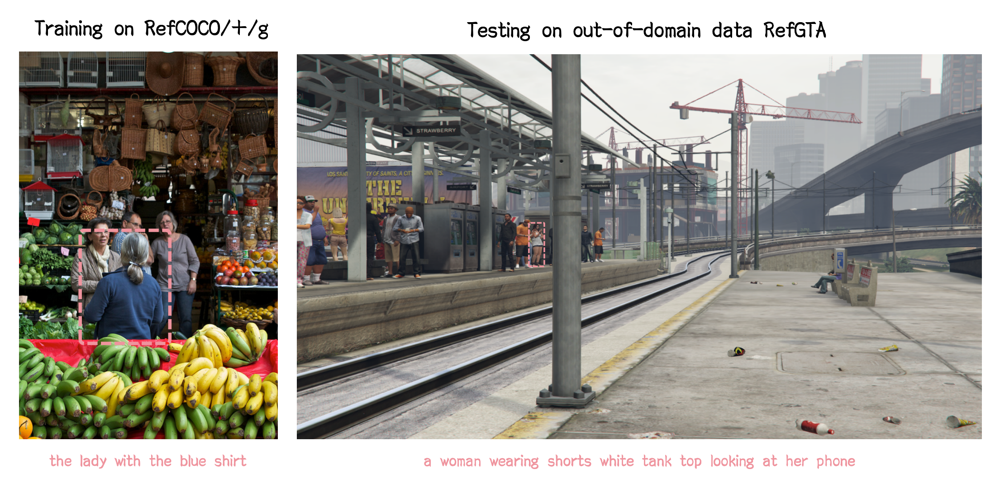
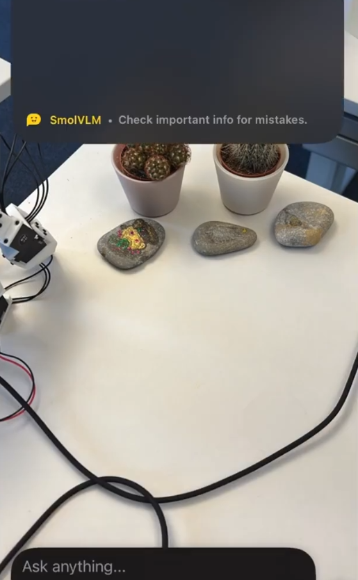
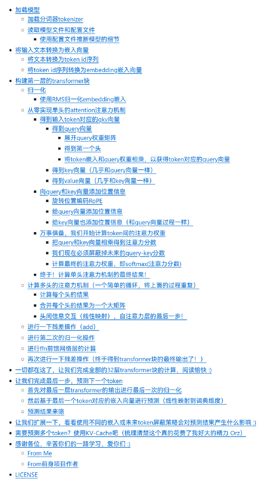
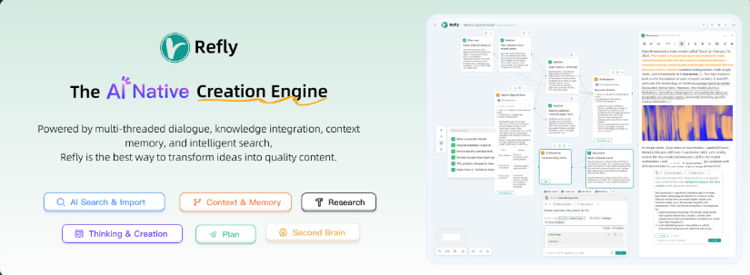
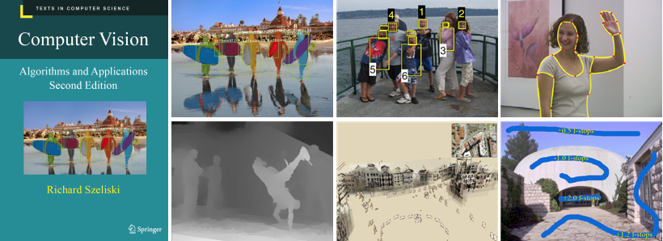
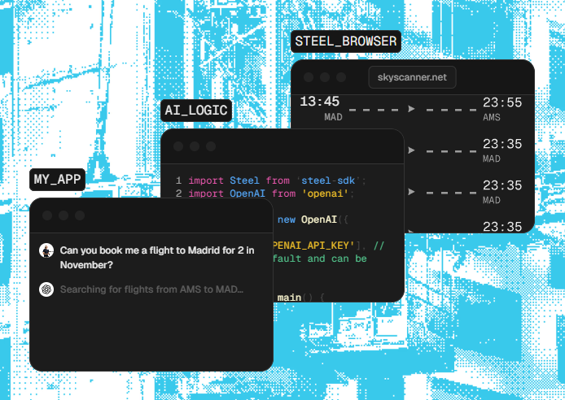
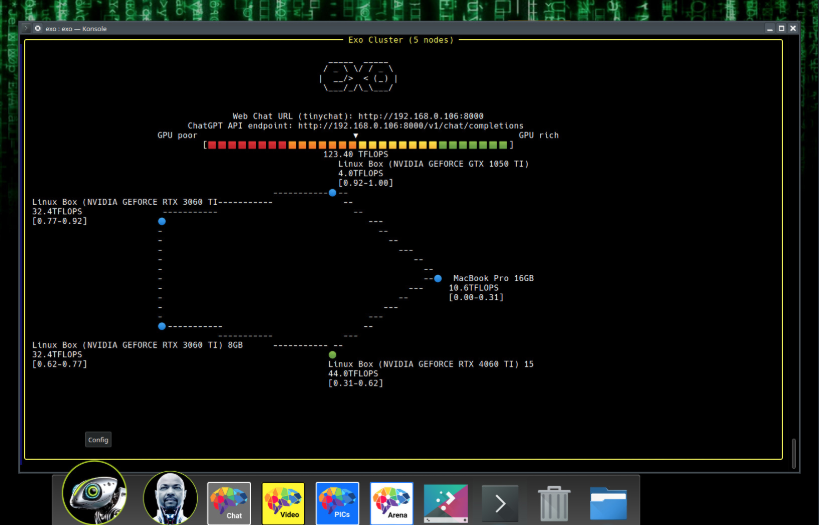

# 机器文摘 第 119 期
### 用纯 JAX 实现 LLaMA3 模型

JAX 是一个由 Google 开发的 Python 库，它结合了 NumPy 的易用性 和 自动微分、即时编译 (JIT) 以及 在加速器（GPU/TPU）上运行的能力。 

阅读这篇[《用纯 JAX 实现 LLaMA3 模型》](https://saurabhalone.com/blogs/llama3/web)，可以深入了解 JAX 在构建高效深度学习模型中的优势，以及如何从零开始实现一个现代语言模型。文章强调了 JAX 的纯函数特性、JIT 编译等优势，并提供了完整的代码实现，适合有一定 Python 和 Transformer 基础的读者学习。

### 一个稳定有良好泛化能力的R1风格视觉语言模型

[VLM-R1](https://github.com/om-ai-lab/VLM-R1)，把DeepSeek的R1方法用到了视觉上模型上，增强了模型稳定性和泛化能力。

基于Qwen2.5-VL 构建，能同时处理图像和文本输入，特别强化了对图像中特定目标的定位能力。

擅长指代表达类理解，比如"这个红色的杯子在哪里"这样的问题，并在图像中定位目标。

### 可以在端侧运行的视觉模型

[Smolvlm2](https://huggingface.co/blog/smolvlm2)，这个视觉模型非常小，提供了 256M, 500M, 2.2B 三个版本。

500M 版本就能装在 iPhone 上流畅运行。

模型能识别物体，并且可以给出一定的问题回答（打开冰箱识别牛奶在哪里），还能对视频做总结。

### 深入挖掘llama3的从零实现(中英文版)

[一篇关于从零实现LLaMA3模型的详细教程](https://github.com/therealoliver/Deepdive-llama3-from-scratch)，也是基于 naklecha/llama3-from-scratch 的增强版本。在原项目的基础上进行了全面的改进和优化，旨在帮助大家更轻松地理解和掌握llama3模型的实现原理以及详细的推理流程。

教程里涉及的代码均有中文注释。

### 开源 AI Agent 引擎

[ReflyAI](https://github.com/refly-ai/refly)，可视化构建你自己的 AI 工作流，比 dify 轻量一些。

### 电子书《计算机视觉：算法与应用》

[Computer Vision: Algorithms and Applications](https://szeliski.org/Book/)，这本书是计算机视觉领域的经典教材，涵盖了从基础到高级的多种算法和技术。全书内容丰富，涉及图像形成、处理、特征检测、模型拟合、深度学习、识别等多个方面。

除了书籍下载，页面上还提供了一些拿本书当教材的大学课程主页，可以下载课件。

### 可本地部署的 PDF 文件处理工具合集

[Stirling-PDF](https://github.com/Frooodle/Stirling-PDF)，一款强大的本地网页版 PDF 文件处理工具，可 Docker 部署。

提供了丰富的 PDF 文件操作功能，包括拆分、合并、格式转换、内容排列、添加图片、旋转、压缩等。

其安全私密性非常高，所有文件和 PDF 操作都是在客户端进行，或者仅在服务器内存中临时处理，任务完成后即刻删除。

一旦用户下载了文件，该文件就会从服务器上删除。

### 给 AI Agent 用的浏览器自动化工具

[Steel](https://github.com/steel-dev/steel-browser)，这个工具可以让大模型直接操作浏览器，从而实现完全的浏览器AI自动化。

### 快速搭建你自己的 AI 集群

[exo](https://github.com/exo-explore/exo)，一个可帮你在家快速搭建 AI 集群的开源项目，支持将现有设备统一到一个功能强大的GPU中，支持 iPhone，iPad，Android，Mac，Nvidia，树莓派等等几乎所有设备。

在项目部署成功后，一旦有新设备联网，即可接入使用，充当 AI 算力集群的一部分。

### 开源倒计时工具

[Catime](https://github.com/vladelaina/Catime)，一款简洁的 Windows 倒计时工具，支持番茄时钟功能，具有透明界面和丰富的自定义选项。

功能特性：
- 倒计时、正计时、时钟显示
- 超时动作：通知、锁屏、关机等
- 界面：透明、点击穿透、自由调整、自定义颜色 ​​​

## 订阅
这里会不定期分享我看到的有趣的内容（不一定是最新的，但是有意思），因为大部分都与机器有关，所以先叫它“机器文摘”吧。

Github仓库地址：https://github.com/sbabybird/MachineDigest

喜欢的朋友可以订阅关注：

- 通过微信公众号“从容地狂奔”订阅。

