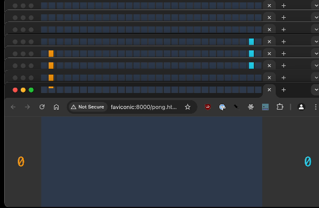
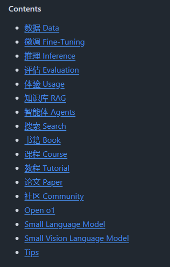
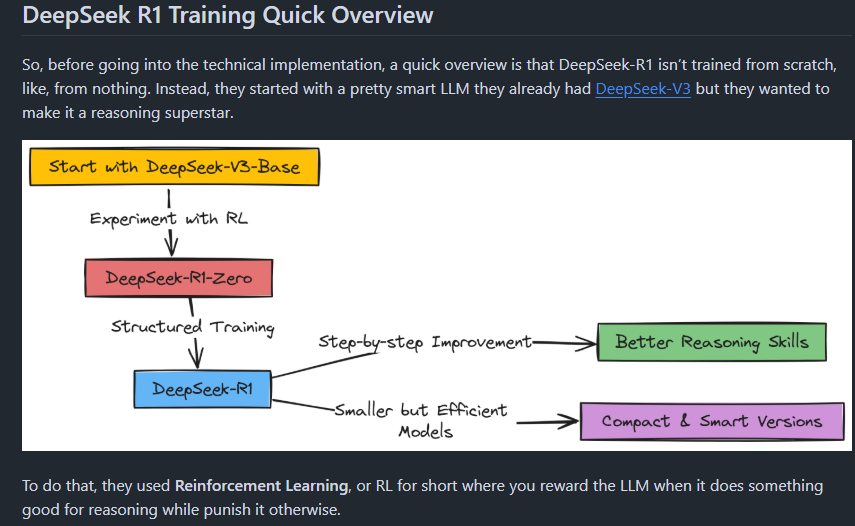
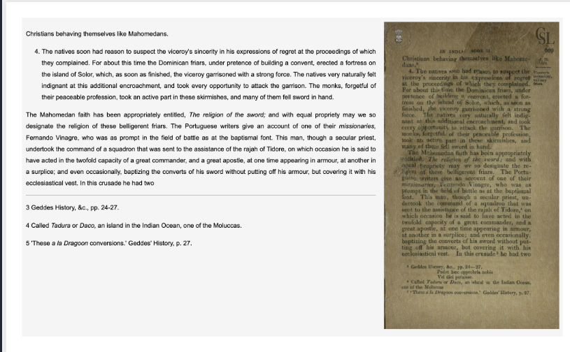
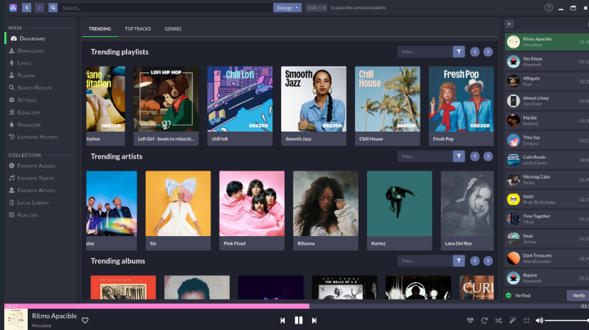
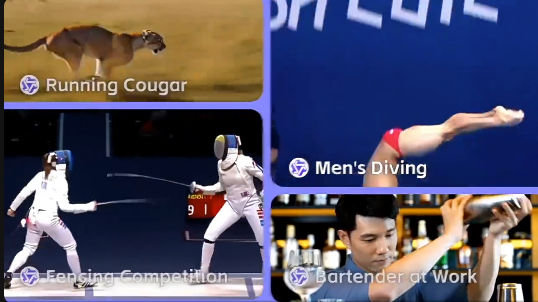
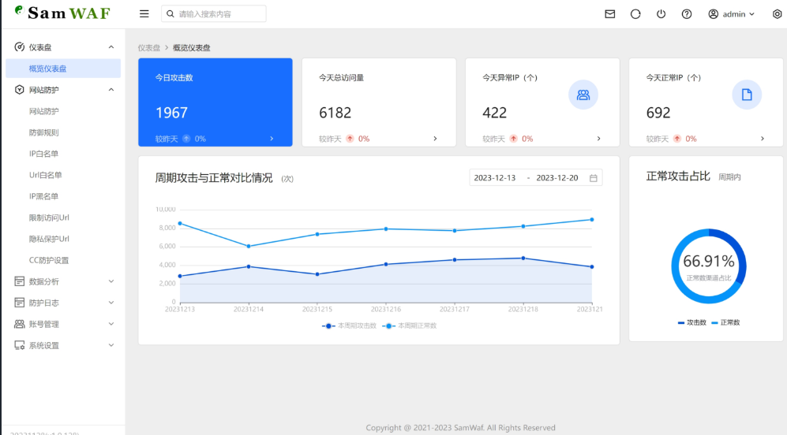
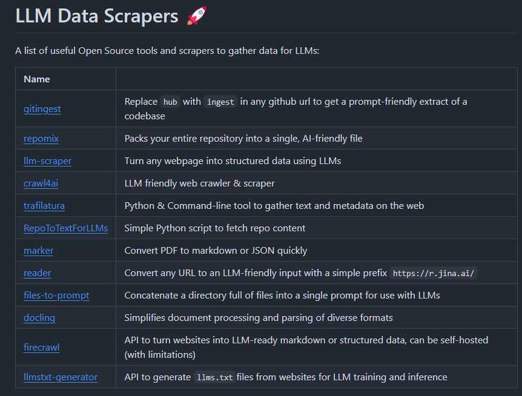
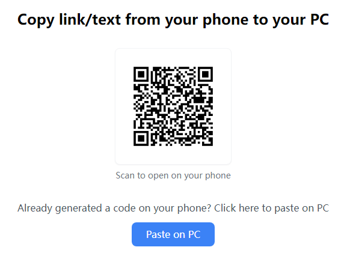

# 机器文摘 第 120 期

### 用240个浏览器标签页中运行经典弹球游戏

[Pong 的奇特实验](https://eieio.games/blog/running-pong-in-240-browser-tabs)，这篇文章介绍了一个有趣的项目，利用浏览器标签页运行《Pong》游戏。

作者通过在8x30网格排列的240个浏览器标签页中运行经典游戏Pong，探索了一种创新的浏览器标签页使用方式。

受朋友[Tru的项目（Flappy Favi）](https://mewtru.com/flappyfavi)启发，作者解决了如何创建标签页网格、在后台标签页中更新收藏夹图标以及标签页之间的同步通信等挑战。

通过使用AppleScript、Web Workers和Broadcast Channels等工具，作者实现了在主画布和标签栏之间的平滑动画和交互。

最终效果是Pong游戏中的球和球拍能够在前景窗口和标签栏之间无缝移动。

### 全世界最好的大语言模型资源汇总

[AI资源合集](https://github.com/WangRongsheng/awesome-LLM-resourses)，这个项目整理了500（还在持续更新中）多个资源，包括从数据到论文，教程等一应俱全。

### 从零实现 DeepSeek R1

[train-deepseek-r1](https://github.com/FareedKhan-dev/train-deepseek-r1)，GitHub 上一个从零实现 DeepSeek R1 训练过程的开源项目。通过手绘流程图和代码解析，让复杂的 AI 训练变得易懂。

详细展示了 DeepSeek R1 的训练流程，从基础模型开始，通过强化学习、监督微调等阶段，最终构建出具有卓越推理能力的语言模型。

项目包含了：

- 使用手绘流程图详解 DeepSeek R1 架构
- 完整实现 GRPO 算法训练 R1 Zero 初始版本
- 通过 SFT 解决 R1 Zero 的混乱推理和语言混合问题
- 基于推理导向的强化学习优化模型能力
- 使用小型基础模型，让本地训练和实验成为可能
- 包含奖励函数、拒绝采样等关键技术实现细节

### 高性能 OCR 模型

[olmOCR](https://github.com/allenai/olmocr)，一款开源的高性能 OCR 模型，专门用于将 PDF 和文档图像转换为清晰、结构化的纯文本。模型足够小，可以在本地运行。

基于 Qwen2-VL-7B-Instruct 构建。它通过在多样化数据集上微调，并结合高效的推理引擎，实现了低成本、高质量的文本提取。

olmOCR 的优势在于其性能卓越，能够处理复杂布局的文档；

输出为 Markdown 格式，便于解析；

### 免费音乐播放器

[nuclear](https://github.com/nukeop/nuclear)，GitHub 上一款专注于免费流媒体资源的桌面音乐播放器。

从互联网的各个角落拉取免费的音乐资源，并提供了一个美观、强大的播放界面。

主要特性：
- 搜索和播放YouTube上的音乐功能
- 专辑搜索功能，查看专辑, 基于艺术家和曲目名称的自动歌曲查询
- 歌曲队列，可以作为播放列表导出。
- 加载保存的播放列表 (储存在json格式文件中)。
- 带评论的最新出版歌曲 - 专辑和音轨。
- 按照音乐流派浏览。
- 音乐电台模式 (自动排查类似的曲目)。
- 无限制的下载 (基于youtube提供的服务)。
- 实时歌词展示。
- 将喜欢的歌曲添加到你的喜爱曲目列表中。
- 在本地库文件中听歌。

提供 Windows、macOS 和 Linux 安装包，可直接开箱即用。

### 一站式 AI 数字人系统

[AigcPanel](https://github.com/modstart-lib/aigcpanel)，支持视频合成、声音合成、声音克隆，简化本地模型管理、一键导入和使用 AI 模型。

主要特性：
- 支持视频数字人合成，支持视频画面和声音换口型匹配
- 支持语音合成、语音克隆，多种声音参数可设置
- 支持多模型导入、一键启动、模型设置、模型日志查看
- 支持国际化，支持简体中文、英语等
- 支持多种模型一键启动包，如 CosyVoice、MuseTalk、LatentSync、Wav2Lip 等

### 阿里的视频生成模型

[Wan2.1](https://github.com/Wan-Video/Wan2.1)，阿里开源的视频生成模型，超过了现有开源模型和商业方案，支持消费级GPU运行

支持文本生成视频、图像生成视频、视频编辑、文本生成图像及视频生成音频

支持生成包含中英文文本的视频内容

其在复杂运动动态生成、物理场景模拟、以及文本渲染上表现优秀

3D VAE架构，可处理任意长度的1080P视频，并保持时序信息

### 一款开源的轻量级 Web 应用防火墙

[SamWaf](https://github.com/samwafgo/SamWaf)，一款完全开源的轻量级 Web 应用防火墙，支持私有化部署，提供 Bot 检测、URL 白名单、CC 防护、自定义防护规则等功能，适用于小型企业、工作室和个人网站。

### 关于数据收集的开源实用工具

[LLM Data Scrapers](https://github.com/patrickloeber/llm-data-scrapers)，一份整理了关于数据收集的开源实用工具和抓取数据列表。

涵盖了从不同来源，如代码库、网页和 PDF 文档等，提取数据的多种方法，并将数据转换为 LLMs 可以处理的格式。

除此之外，还提供了相关的数据和更多的实用工具列表。

### 云粘贴

[remote-paste](https://toolsonline.app/remote-paste)，一个实验性的工具，这个网站可以让你迅速将内容在手机和电脑之间复制粘贴。

> 作者介绍：有无数次，我想把手机上的一个链接，或者一段文本拷贝到电脑上，我都需要打开一个类似于社交软件的东西；然后在手机上发送到某个窗口，然后在电脑上打开。

> 有的朋友会推荐我说，用微信输入法等工具，但是对于没有使用该输入法的人依然会有很长的操作路径

> 于是我开发了一个网站，操作路径如下，文字看起来有点长但是使用起来我很轻松。

- 用户打开网站
- 用手机扫码二维码在手机上打开
- 把手机上的 link/text 复制到文本框，点击生成
- 生成之后的页面会生成一个长度为四位的code，用户在电脑上输入对应的四位code之后即可复制。

## 订阅
这里会不定期分享我看到的有趣的内容（不一定是最新的，但是有意思），因为大部分都与机器有关，所以先叫它“机器文摘”吧。

Github仓库地址：https://github.com/sbabybird/MachineDigest

喜欢的朋友可以订阅关注：

- 通过微信公众号“从容地狂奔”订阅。

