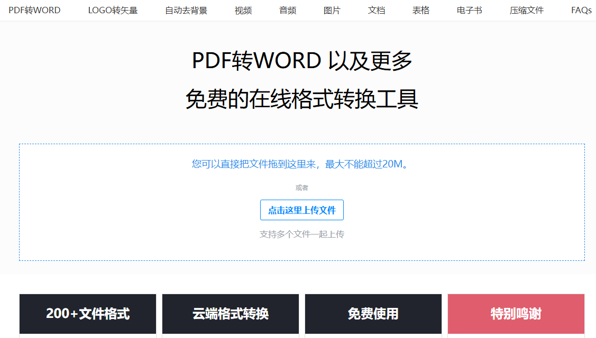

# 机器文摘 第 121 期
### 永不落伍的技能

[《故障排除：永不落伍的技能》](https://www.autodidacts.io/troubleshooting/)，本文探讨了故障排除（troubleshooting）作为一种核心技能的重要性，并详细介绍了如何提升这一技能。

故障排除是系统性地确定系统中不期望行为的原因并加以修复的过程，它在多个领域中都具有普遍适用性。

文章通过一系列具体的步骤和策略，如“后退一步”“确保你在调整正确的琴弦”“确定流程”“观察症状”“隔离问题”等，指导读者如何更有效地进行故障排除。

此外，作者还讨论了如何通过缩短反馈循环、减少噪声、记录问题等方式提高效率，并指出故障排除能力可以通过实践和反思得到提升。

### intel arc 显卡也能跑 deepseek-r1 满血版大模型了

[使用 IPEX-LLM 在 Intel GPU 运行 llama.cpp Portable Zip](https://github.com/intel/ipex-llm/blob/main/docs/mddocs/Quickstart/llamacpp_portable_zip_gpu_quickstart.zh-CN.md)，本指南演示如何使用 llama.cpp portable zip 通过 ipex-llm 在 Intel GPU 上直接免安装运行。

使用最新版 llama.cpp Portable Zip 可以在 Xeon 上通过1到2张 Arc A770 GPU 运行 DeepSeek-R1-671B-Q4_K_M ​​​

### 本地化智能学习助手 

[WiseMindAI](https://wisemind-ai.com/)，是一款融合了 AI 功能的本地知识库产品。创建知识库并总结📑、与知识库对话💬、生成知识卡片📏，全都能轻松搞定！

如果你使用过 ima、Cherry Studio，应该会喜欢 WiseMindAI，它就像是 ima + Cherry Studio 的本地化升级版，功能更强大，使用也更安心～

数据完全本地化，支持文档总结、对话、笔记、海报、10+个AI大模型等收起。

[作者还写了一篇文章带你快速掌握WiseMindAI](https://mp.weixin.qq.com/s/FmvGxFPKNjhAwD7M2OTaHw)

### 关于大模型的电子书

[LLMForEverybody](https://luhengshiwo.github.io/LLMForEverybody/)

### 在线文件格式转换平台

[alltoall](https://www.alltoall.net)，最全类型的在线文件转换平台，免费、快速，支持200+文件格式的转换、压缩、AI抠图等。虽然对文件大小有一定限制，但日常使用足够了。

### 一款 AI 语音增强与转换工具 

[MicDrop](https://xiaohu.ai/c/ai-23cc23/micdrop-ai-5ec77392-9592-4925-80ff-d5cbbe7ecdc5)，一款 AI 语音增强与转换工具，可以将你的歌声实时转换成录影棚级别的质量

✅ 实时变声，无需后期处理 🎙️
✅ 将你的声音变成各种声音，创作独特音效 🎷🎻
✅ AI 自动和声，让你的作品更饱满 🎼
✅ 一键提升录音质量，适用于直播、播客、电影配音 🎬
✅ 免版税声音库，可自由商用 💰

你只用手机录了一段歌声，MicDrop 可以让它听起来像是在录音棚里录制的专业配音！

它可与所有主流数字音频工作站（DAW）兼容，支持 AU 和 VST3 插件格式。

### 本地化的 AI 桌面应用

[Klee](https://github.com/signerlabs/klee-client)，这款应用内置 RAG 知识库和 Markdown 笔记支持，让我们能在本地运行开源大模型，完全离线使用且零数据收集，保护隐私安全。

主要特性：

- 可下载并在桌面运行开源 LLM 模型
- 完全离线使用，零数据收集，保障隐私安全
- 内置 Markdown 笔记功能，便于记录和整理思路
- 支持文件和文件夹知识库，建立个性化 AI 助手
- 基于 Ollama 和 LlamaIndex 构建，运行快速高效

提供各平台安装包，直接下载安装即可使用，也支持从源码构建安装。

### 开源音乐生成模型

[YUE](https://github.com/smthemex/ComfyUI_YuE)，香港科技大学开源的音乐模型，可以作为著名AI音乐应用suno的平替。

这个模型专为音乐生成而设计，专门用于将歌词转换为完整歌曲 （lyrics2song）。

它可以生成一首完整的歌曲，持续几分钟，其中包括朗朗上口的音轨和伴奏音轨。

YuE 能够对不同的流派/语言/声乐技巧进行建模，无论是流行乐，是是重金属。

同时，也可以生成人声，包括中文、英文、韩文、日文等等。

可以作为视频模型的配音来用。

### 又一款语音自然的 TTS 模型

[Llasa](https://huggingface.co/collections/HKUSTAudio/llasa-679b87dbd06ac556cc0e0f44)，一款基于Llama的TTS系统。

它通过扩展训练时间和推理时间计算，提高了语音合成的自然度、韵律准确性和情感表达能力

生成效果自然流畅富有感情，开心、悲伤等情感表现的比较自然，适合做有声读物或语音助手

它用了一个Xcodec2语音分词器，把语音分解成一个个小的标记，使计算机更容易处理语音，这些标记不仅能表示语音的内容，还能保留语音的情感和音色信息

核心在于其单一Transformer架构和规模化训练/推理策略，结合Xcodec2语音分词器，使其能生成更自然、更富有表现力的语音

有1B、3B、8B三个版本，支持中英文

### 每天根据新闻生成语音博客

[hacker-news](https://hacker-news.agi.li/)，一个基于 AI 的 Hacker News 中文播客项目，每天自动抓取 Hacker News 热门文章，通过 AI 生成中文总结并转换为播客内容。

主要特性
- 🤖 自动抓取 Hacker News 每日热门文章
- 🎯 使用 AI 智能总结文章内容和评论
- 🎙️ 通过 Edge TTS 生成中文播报
- 📱 支持网页和播客 App 收听
- 🔄 每日自动更新
- 📝 提供文章摘要和完整播报文本
技术栈
- Next.js 应用框架
- Cloudflare Workers 部署和运行环境
- Edge TTS 语音合成
- OpenAI API 内容生成
- Tailwind CSS 样式处理
- shadcn UI 组件库

我试听了一下，感觉效果很棒，有很大潜力啊，以后每个人都可以设置自己的个性化主播和电台。

### AI驱动的电子表格

[Probly](https://github.com/PragmaticMachineLearning/probly)，一款AI驱动的电子表格应用：Probly，它结合了电子表格功能、Python数据分析和AI的能力，所有操作都在浏览器内完成，

具备全功能的电子表格能力，支持各种公式

可以直接在浏览器中运行Python代码

支持数据可视化，可以根据数据创建图表和可视化效果

内置AI提供智能建议和自动化分析，可以用自然语言提问题，比如“帮我预测下个月的销售额”，或“找出哪些客户最有可能流失”，它会自动分析数据并给出答案，还能生成图表和可视化报告

数据分析全部在浏览器本地完成

## 订阅
这里会不定期分享我看到的有趣的内容（不一定是最新的，但是有意思），因为大部分都与机器有关，所以先叫它“机器文摘”吧。

Github仓库地址：https://github.com/sbabybird/MachineDigest

喜欢的朋友可以订阅关注：

- 通过微信公众号“从容地狂奔”订阅。

