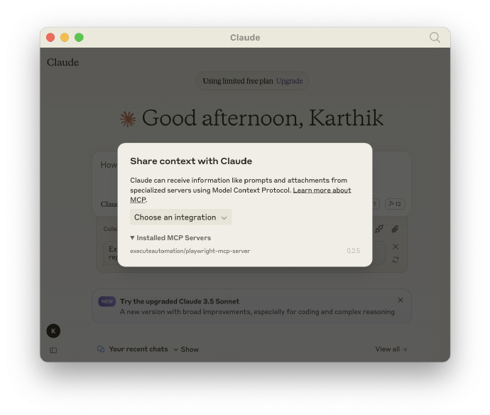

# 机器文摘 第 122 期
### 被勒索软件加密的文件有破解可能吗？

[用 GPU 解密被勒索软件加密的文件](https://tinyhack.com/2025/03/13/decrypting-encrypted-files-from-akira-ransomware-linux-esxi-variant-2024-using-a-bunch-of-gpus/)，作者最近帮助一家公司从 Akira 勒索软件中恢复了数据，而无需支付赎金。为此专门写了一篇博客，分享他是如何做到的，以及完整的源代码。

这篇文章深入探讨了如何利用 GPU 破解 Akira 勒索软件（Linux/ESXI 2024 变种）加密的文件，无需支付赎金。文章首先介绍了 Akira 勒索软件的背景，指出该变种使用当前时间（纳秒）作为种子进行加密，且每个文件都有唯一的密钥。作者通过分析恶意软件的代码和加密原理，发现可以通过暴力破解时间戳来恢复文件。

文章详细描述了暴力破解的可行性、实施步骤以及相关代码和工具的使用。作者还分享了如何获取明文样本、测量服务器速度、划分工作负载、租用 GPU 等实用信息。此外，文章还提供了恢复文件的具体步骤，包括获取时间戳、密文和明文，以及如何运行暴力破解和解密工具。

作者在文中强调了这一过程的复杂性和挑战性，同时也分享了成功恢复文件的经验和教训。

文章最后指出，虽然大多数勒索软件情况下无法在没有密钥的情况下恢复数据，但有时通过深入研究和分析，仍有可能找到解决方案。

### 大模型核心概念科普文：Token 是什么?

[Token 是什么?](https://mp.weixin.qq.com/s/SXT2wuM0sox34PRrqWWAzw)

1. Token（标记）

定义：文本处理的基本单位，1个中文≈1 Token，1英文≈0.3 Token
作用：模型通过Token处理文本，直接影响上下文长度计算
2. 上下文长度（Context Window）

定义：单次推理可处理的输入+输出Token总量上限（如DeepSeek为64K≈6万字）
特点：
多轮对话需拼接历史记录，超出限制时触发"上下文截断"（丢弃早期内容）
实际使用中服务端自动截断，用户感知为模型"遗忘"早期对话
3. 最大输出长度

定义：单次生成内容的最大Token数（如DeepSeek为8K≈8000字）
输入限制：上下文长度 - 最大输出长度 = 最大输入限制（如64K-8K=56K）
典型场景策略

短输入长输出：输入1K时最多输出63K（需质量检测）
长输入短输出：输入60K文档时最多输出4K摘要
多轮对话管理：通过截断保留最新内容（如累计64K时新输入5K，则丢弃最早5K）
技术原理

受三大因素限制：
位置编码范围（如RoPE、ALiBi）
自注意力机制计算复杂度
KV Cache显存占用与序列长度正相关
厂商对比

OpenAI GPT-4：上下文128K，输出4K
Anthropic Claude 3：上下文200K，输出4K
DeepSeek：上下文64K，输出8K
使用建议

长文本生成需分段请求
关键信息尽量放在对话后期
敏感场景主动设置max_tokens参数
重要内容建议本地存储避免依赖模型记忆
（注：文中数据以DeepSeek模型为例，不同厂商参数存在差异）

### 智能体设计引擎 

[Parlant](https://github.com/emcie-co/parlant)，这是一款对话式 AI 引擎，它利用行为指南、运行时监督等，让开发人员能够控制面向用户的 AI Agent。

来源：[@karminski-牙医](https://weibo.com/2169039837/PisZ1trIm)。

> 相信大家都打过移动客服，客服会根据你按的数字键进入下一个对话。这个工具的功能类似，你可以预设用户的提问，然后针对每个提问场景来编写功能，比如是RAG查询还是调用函数去给客户订票等等。

> 估计企业客户会对这个框架比较感兴趣，用来搭建自己的智能客服。

### 像素级精度复制任何UI界面 

[Same dev](http://Same.dev)，宣称可以以像素级精度复制任何用户界面（UI），只需提供网页 URL、截图或设计文件（如 Figma），即可生成对应的代码，确保视觉效果与原始界面高度一致。

通过 AI 驱动，网页链接 将 UI 转化为可运行的代码，支持多种前端技术栈。

支持的框架包括 HTML/CSS、React、Tailwind CSS 等

### 为大模型提供浏览器自动化能力的工具

[Playwright MCP Server](https://github.com/executeautomation/mcp-playwright)，通过模型上下文协议（MCP）服务器，让 LLM 可以与网页交互、截取屏幕截图、在真实浏览器环境中执行 JavaScript，实现智能 AI 网页浏览和操作。

主要功能：

- 为 Claude 等 LLM 提供浏览器自动化能力
- 支持与网页交互、表单填写和导航操作
- 能够截取网页截图，帮助 AI 理解网页内容
- 支持在浏览器环境中执行 JavaScript 代码
- 集成 Smithery 和 mcp-get 等工具，简化安装配置

### 让大模型操作 Blender 自动建模的工具 

[BlenderMCP](https://github.com/ahujasid/blender-mcp)，一个通过 MCP 实现 Claude 直接操控 Blender 的开源项目：BlenderMCP。

只需简单的提示词，即可让 Claude 控制 Blender 自动进行 3D 建模、场景创建和模型操作，实现 AI 辅助 3D 内容的创作。

主要功能：

- 双向通信：Claude AI 可直接与 Blender 进行实时交互和控制
- 对象操作：创建、修改、删除 Blender 中的 3D 对象
- 材质控制：应用和修改材质与颜色属性
- 场景检查：获取当前 Blender 场景的详细信息
- 代码执行：从 Claude 在 Blender 中运行 Python 代码

提供简单的安装步骤，需先安装 uv 包管理器，然后将插件添加到 Blender 中，并在 Claude 设置中配置 MCP 服务。

然后输入："创建一个低面数地牢场景，里面有一条龙守卫着一锅金子"，Claude 就能直接控制 Blender 创建完整的 3D 场景。

### 一个开源的 MCP 客户端工具

[Open MCP Client](https://github.com/CopilotKit/open-mcp-client)，能让我们轻松地在任何应用中与 MCP 服务器进行交互的客户端，只需从 Composio 获取一个 URL 即可快速连接。

主要特性：

- 基于网页的 MCP 客户端，可直接在浏览器中使用；
- 开源客户端库，可轻松集成到任何应用程序中；
- 使用 CopilotKit 构建客户端和交互层；
- 集成 LangChain LangGraph ReAct 智能体协调 MCP 调用；
- 仅需 40 行代码即可实现 MCP 服务器的连接功能。

感兴趣的可以部署在 Vercel 平台上，或者直接访问给出体验链接，也可以选择集成到自己的应用中使用。

### LLM 微调教程

[Fine-tuning Guide](https://docs.unsloth.ai/get-started/fine-tuning-guide)，一个指南来教您如何正确地微调 LLM！

主要内容：
- 选择正确的参数和训练方法
- RL、GRPO、DPO 和 CPT
- 数据准备、过度拟合和评估
- 使用 Unsloth 进行训练并在 vLLM、Ollama、Open WebUI 上部署

### 网易云音乐无损解析开源工具

[Netease_url](https://github.com/Suxiaoqinx/Netease_url)，只需复制粘贴歌曲链接，即可解析各种音质，包括超清母带、沉浸环绕声等高质量音质，并可打包下载歌曲文件、封面图以及歌词等。

主要功能：

- 支持多种音质解析，从标准到超清母带全覆盖；
- 提供 GUI 模式和 API 模式两种使用方式；
- 自动打包封面图和歌词，一次下载全部资源；
- 可通过命令行参数自定义音质和解析方式。

## 订阅
这里会不定期分享我看到的有趣的内容（不一定是最新的，但是有意思），因为大部分都与机器有关，所以先叫它“机器文摘”吧。

Github仓库地址：https://github.com/sbabybird/MachineDigest

喜欢的朋友可以订阅关注：

- 通过微信公众号“从容地狂奔”订阅。

