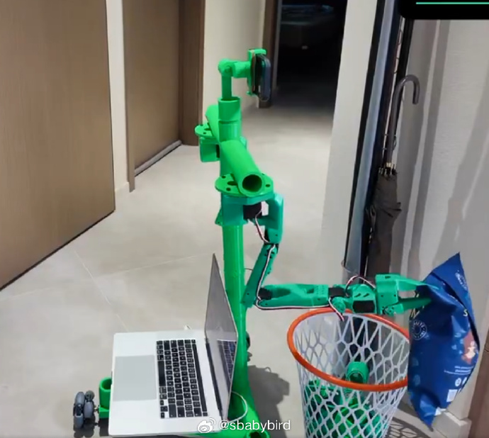
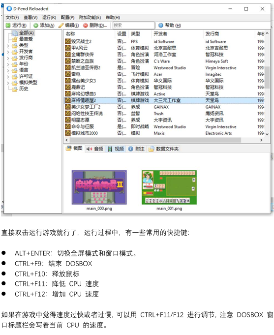
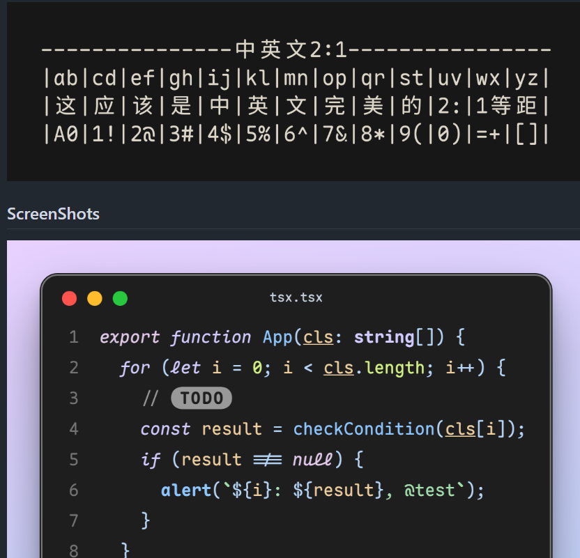
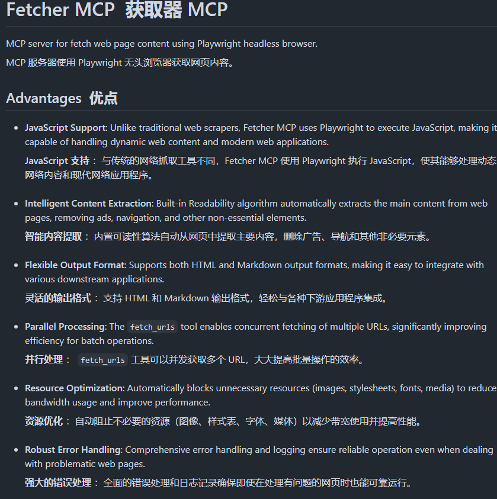
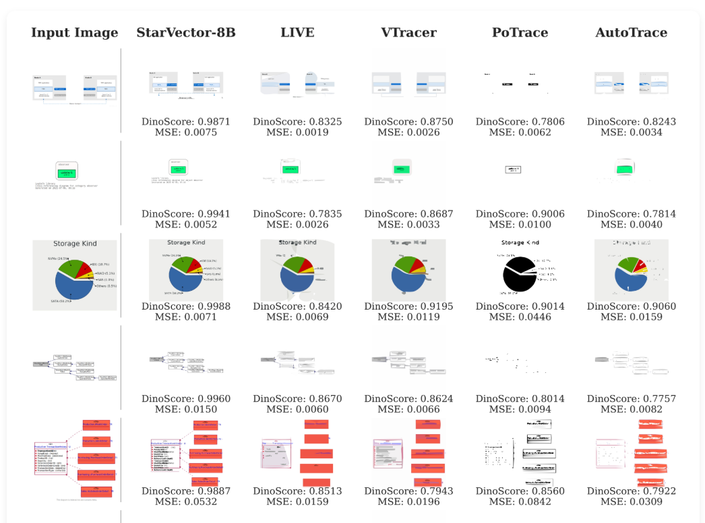
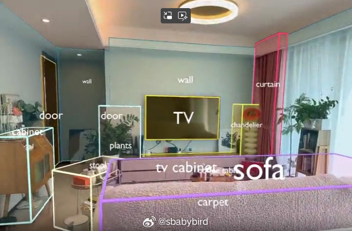
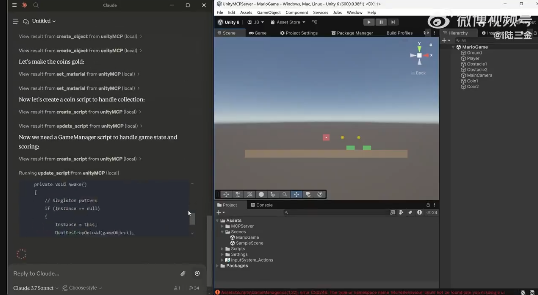
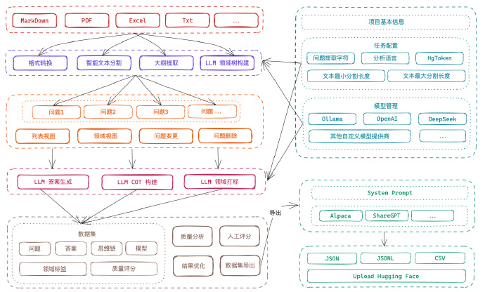

# 机器文摘 第 123 期
### 一个 开源 低成本(~¥2000) “人形”机器人 

[Bambot](https://github.com/timqian/bambot)，是一个开源项目，旨在以廉价的硬件拼装出可用的“人形”机器人。

我看了项目视频，虽然距离“人形”还有不少差距，但是从可用性上来说，还是有一些东西的，主要是价格便宜，全部硬件加起来不超过 300 美元。

### 绝版游戏保护工程

[preserve-cd](https://github.com/skywind3000/preserve-cd)，该项目不仅收集了 64+ 款几乎绝版的精品 DOS 游戏，还有 100+ 款上手简单但超级耐玩的 Windows 和 Flash 小游戏。

> 今天互联网上的内容，由于各种原因，正在以越来越快的速度消失，而新一代网民们，却并没有备份和记录的习惯及意识。不远的将来，会有一天，当你特别想找一个东西却搜尽互联网都找不到时就来麻烦了，本项目立足于将这样的损失最小化。

此外，该项目还有一个兄弟项目[绝版软件保护工程](https://github.com/skywind3000/preserve-iso)，收录了很多“历史上”经典的开发环境相关工具及套件。

### 开源圆角等宽字体（适合编程）

[Maple Mono](https://github.com/subframe7536/maple-font)：开源圆角等宽字体，中英文宽度完美2:1，细粒度的自定义选项 。

字体作者说：
> 市面上有这么多优秀的等宽字体，经由专业的设计师设计，看起来整洁美观。但是，当他真正把它们作为主要字体用来写代码时，他发现其中很多的字体总有一些地方让他不太满意，例如：
 - JetBrains Mono 虽然字形设计精炼、排版整齐划一，但是风格有些死板。
 - Fira Code 虽然有丰富的连字，但是缺少斜体，自动生成的斜体角度过大。
 - Victor Mono 虽然具有手写风格的斜体，但是其稍显夸张的风格让他有些难以接受。
 - Sarasa Gothic 虽然中英文 2:1 等宽，但是英文部分过于狭窄，阅读体验不太好。
 - 很少有等宽字体设计有圆角。
 - 很少有等宽字体对 Nerd-Font 和中文优先支持。
> 因此，他制作了这一款字形整洁、拥有手写风格的斜体、细粒度自定义配置、内置 Nerd-Font、中英文 2:1 等宽的字体，用于提升自己的工作效率，希望它也能对其他人有所帮助。

### 执行网页数据抓取的 MCP Server

[fetcher-mcp](https://github.com/jae-jae/fetcher-mcp)，一个基于Playwright无头浏览器的网页内容抓取MCP server项目。

支持JavaScript，用Playwright执行JavaScript，能处理动态网页内容和现代网页应用

内置Readability算法，可自动提取网页主要内容，去除广告、导航等非核心元素

可并行处理，支持HTML和Markdown输出

可自动屏蔽不必要的资源，图片、样式表、字体、媒体等。

[MCP 是什么，可以看这篇文章](https://onevcat.com/2025/02/mcp/)：MCP (Model Context Protocol，模型上下文协议) 是由 Anthropic 在 2024 年底推出的一种开放协议，它通过提供一种标准化的接口，旨在通过标准化的接口实现大语言模型 (LLM) 与外部数据源及工具的无缝集成。

### 专门矢量作图的 AI 模型 

[StarVector](https://github.com/joanrod/star-vector)， 是一个专为 SVG 向量图形生成 设计的基础模型，其目标是：

用大模型（VLM）从图像或文本中理解语义结构，并自动生成标准可编辑的 SVG代码，适用于图标、技术图、LOGO、表情等。

也就是将 SVG 矢量图的生成转化为“代码生成任务”，支持从图像或文本生成高质量 SVG 文件。

StarVector 使用多模态架构来处理图像和文本。

执行图像到 SVG（或图像矢量化）时，图像被投影到视觉标记中，并生成 SVG 代码。

执行文本到 SVG 时，模型仅接收文本指令（不提供图像），并创建一个新的 SVG。

### 用于激光点云矢量化的大模型

[SpatialLM](https://huggingface.co/manycore-research/SpatialLM-Llama-1B) 是一种 3D 大型语言模型，旨在处理 3D 点云数据并生成结构化的 3D 场景理解输出。

这些输出包括建筑元素，如墙壁、门、窗户和定向物体边界框及其语义类别。

与以前需要专门设备进行数据收集的方法不同，SpatialLM 可以处理来自各种来源的点云，例如单目视频序列、RGBD 图像和 LiDAR 传感器。

这种多模态架构有效地弥合了非结构化 3D 几何数据和结构化 3D 表示之间的差距，提供了高级语义理解。

它增强了空间推理能力，适用于具象机器人、自主导航和其他复杂的 3D 场景分析任务中的应用。

### 控制 Unity 游戏引擎的 MCP Server 也来了

继 [blender-mcp](https://github.com/ahujasid/blender-mcp) 之后，果然也有人做出了[Unity MCP](https://github.com/justinpbarnett/unity-mcp)，通过 LLM 对话来控制 Unity 去设计游戏。

Unity MCP Server 提供了 Unity（通过 C#）与 Python 服务器之间的双向通信通道，支持：

- 资产管理：以编程方式创建、导入和操作 Unity 资产。
- 场景控制：管理场景、对象及其属性。
- 材质编辑：修改材质及其属性。
- 脚本集成：查看、创建和更新 Unity 脚本。
- 编辑器自动化：控制 Unity 编辑器功能，如撤销、重做、播放和构建。

项目适合希望利用LLMs来增强其 Unity 项目或自动化重复任务的开发者。

### 大模型微调数据集创建工具

[Easy DataSet](https://github.com/ConardLi/easy-dataset)，提供了直观的界面，上传文件，智能分割内容，生成问题，并为模型微调生成高质量的训练数据。

此外，还支持导出 Alpaca、JSON 等多种格式数据集，同时兼容所有遵循 OpenAI 格式的 LLM API。

提供 Windows、MacOS 和 Linux 安装包下载，开箱即用，也支持 Docker 部署和 NPM 安装。

## 订阅
这里会不定期分享我看到的有趣的内容（不一定是最新的，但是有意思），因为大部分都与机器有关，所以先叫它“机器文摘”吧。

Github仓库地址：https://github.com/sbabybird/MachineDigest

喜欢的朋友可以订阅关注：

- 通过微信公众号“从容地狂奔”订阅。

