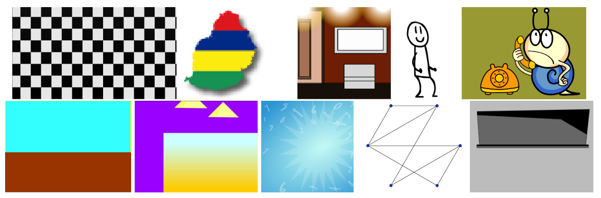

# 机器文摘 第 124 期
### MCP 是什么？

最近 MCP 协议实在是太火了，它到底是什么？与智能体、LLM 到底是什么关系？

[MCP（模型上下文协议）：5 分钟简单解释](https://read.highgrowthengineer.com/p/mcps-simply-explained)，MCP，即模型上下文协议 ，本文将为您简化 MCP 的含义，向您展示如何使用它来提高工作效率，并解释其幕后工作原理。

简而言之，MCP 是一种可以让 LLM 大语言模型更轻松地与外部工具集成的方式。

默认情况下，当您与 Claude、ChatGPT 或 Cursor IDE 对话时，如果您要求它“从 Sentry 中提取最新错误并修复它们”，它将不知道您在说什么。同样，它也不知道如何做以下任何事情：

- 阅读 PM 提供的 PRD 并编写符合要求的测试
- 在 Slack 中阅读 #alerts 频道中的消息并进行调试
- 为你发现需要重构的一些代码创建 JIRA 票证

MCP 可让您完成所有这些工作。这是工程师可以遵循的标准协议，以向公众展示这些工具。

有两个关键组成部分：
- MCP 服务器： Sentry、Slack、JIRA、Gmail 等提供商围绕遵循 MCP 协议的 API 设置适配器 。任何工程师也可以开源自己的服务器！
- MCP 客户端： 您使用的各种客户端和应用程序（如 Cursor）知道如何使用“MCP 协议”进行通信。

### MCP 编程极速入门中文教程

[MCP-Chinese-Started-Guide](http://github.com/liaokongVFX/MCP-Chinese-Getting-Started-Guide)，这有一份关于 MCP 的中文教程，作者一步步讲解了如何从开发 MCP 服务器，到调试 MCP 服务器，再到结合 
 DeepSeek + Cline 构建图文生成实例。

> 模型上下文协议（MCP）是一个创新的开源协议，它重新定义了大语言模型（LLM）与外部世界的互动方式。MCP 提供了一种标准化方法，使任意大语音模型能够轻松连接各种数据源和工具，实现信息的无缝访问和处理。MCP 就像是 AI 应用程序的 USB-C 接口，为 AI 模型提供了一种标准化的方式来连接不同的数据源和工具。

### 知识库增强语言模型

[KBLaM](https://github.com/microsoft/KBLaM)，是微软最新推出的一种利用外部知识进行增强的新方法。与检索增强生成（RAG）不同，KBLaM 消除了外部检索模块；与上下文学习不同，它的计算开销与 KB 大小成线性关系，而不是二次关系。

KBLaM 相当于给AI配了个"活字典"，解决了LLM高效整合外部知识的问题。

KBLaM可以随时更新，不用重新训练。它把外部知识转换成连续的键值向量对，直接嵌入到模型的注意力层中，从而实现隐式检索，当知识库更新时，只需要更新对应的键值对即可，无需重新训练整个模型。

这种方法比RAG更直接，不需要外部检索；比上下文学习更高效，可以处理更多知识；比微调更灵活，可以随时更新知识。

### 在线绘图板，但是可以做动画

[ Inscribed](https://inscribed.app/)，可生成动画的在线绘图板。

功能特点:

- 🎨 由 Excalidraw 驱动的交互式绘图画布
- ⌨️ 支持键盘快捷键
- 📏 可自定义文档尺寸
- 🖼️ 图片导入和处理
- 🔤 集成 Google 字体
- 🎭 演示模式支持
- 📤 支持导出 GIF 动画
- 💾 数据导出/导入功能
- 🔗 支持通过 Gist 托管的 iframe 嵌入

### 开源音乐生成模型

[Di♪♪Rhythm(中文名：谛韵）](https://github.com/ASLP-lab/DiffRhythm)，是第一个能够创作完整歌曲的开源基于扩散的音乐生成模型。

速度确实快，用base模型20s就能生成出来1m35s的音乐，需要16g显存。

以后写歌更方便了。 ​​​

### 开源 B 站历史记录管理工具

[BilibiliHistoryFetcher](https://github.com/2977094657/BilibiliHistoryFetcher)，这是一个B站历史记录管理工具，解决了B站历史记录只能保存最近几个月、无法复杂筛选、没有数据分析等痛点。它使用Python开发，采用SQLite数据库存储，支持视频下载、数据分析、AI摘要等功能

获取b站历史记录，保存到本地数据库，可下载对应视频及时存档，生成详细的年度总结，自动化任务部署到服务器实现自动同步，以及自动发送日志邮件。

### AI 直接生成二进制可执行文件

[ByteCraft](https://github.com/SamsungSAILMontreal/ByteCraft)，我们已经见多了AI生成文字、图像、视频，这个项目不太一样，是让AI直接生成可执行的二进制文件。

ByteCraft，是通过在 4 个 GPU 上对 7B 参数的LLM（Qwen2.5）进行微调，以 32K 的生成上下文长度训练了 4 个月，以生成基于文本描述的视频游戏和动画的二进制文件。

> 想象一下这样一个世界：你可以编写一个描述你想要的视频游戏或动画的提示，然后生成一个功能齐全的可执行文件。我们通过训练一个模型来生成视频游戏和动画的字节，首次尝试实现这个疯狂的目标！

###  阿里巴巴集团统一实验室制作的数字人模型

[LHM](https://lingtengqiu.github.io/LHM/)，一个能从单张图像几秒钟重建出可动画化的3D数字人模型，支持实时渲染、姿态控制。

一张照片几秒钟创建出一个3D数字人，这个数字人可以做各种动作，效果看起来逼真，衣服、头发、面部等细节保持的很好。

## 订阅
这里会不定期分享我看到的有趣的内容（不一定是最新的，但是有意思），因为大部分都与机器有关，所以先叫它“机器文摘”吧。

Github仓库地址：https://github.com/sbabybird/MachineDigest

喜欢的朋友可以订阅关注：

- 通过微信公众号“从容地狂奔”订阅。

