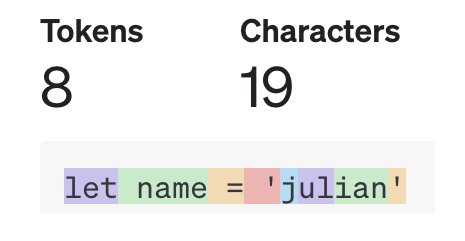
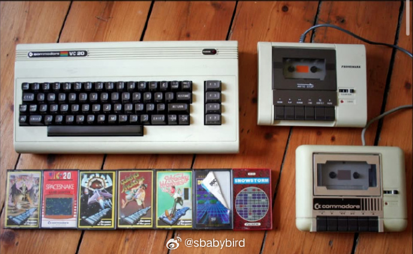
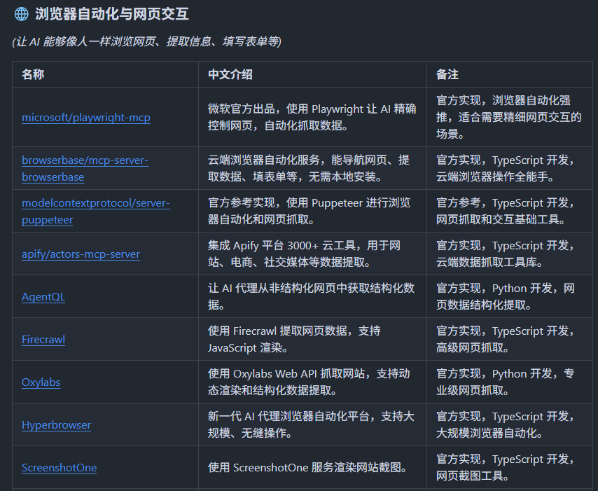
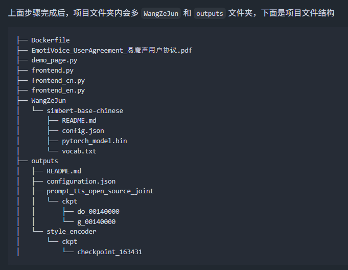
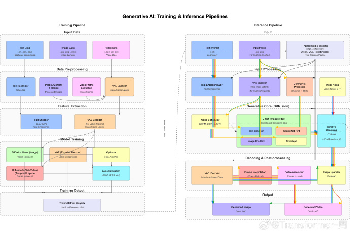
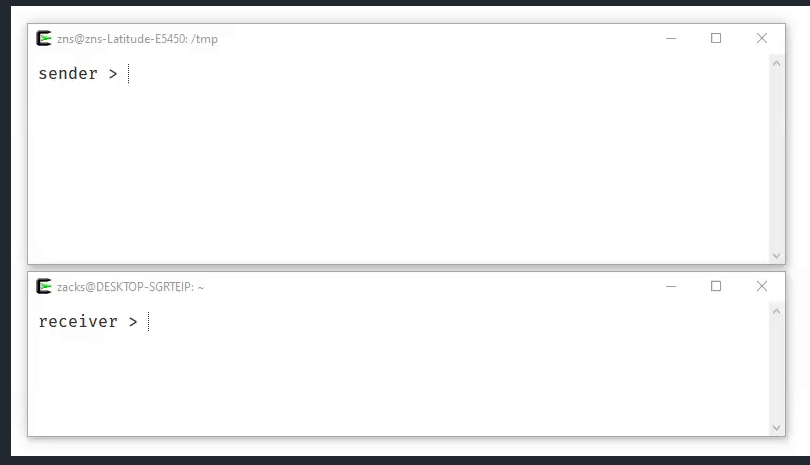
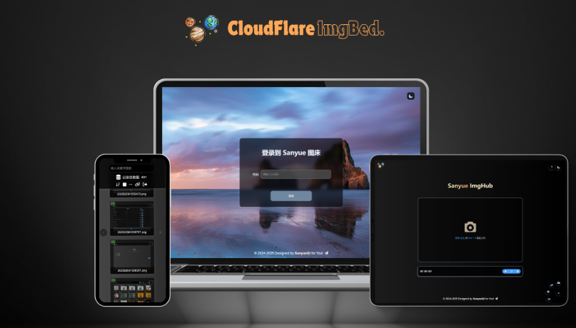
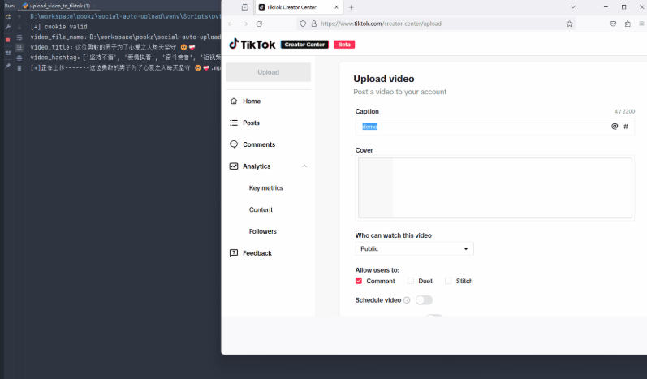
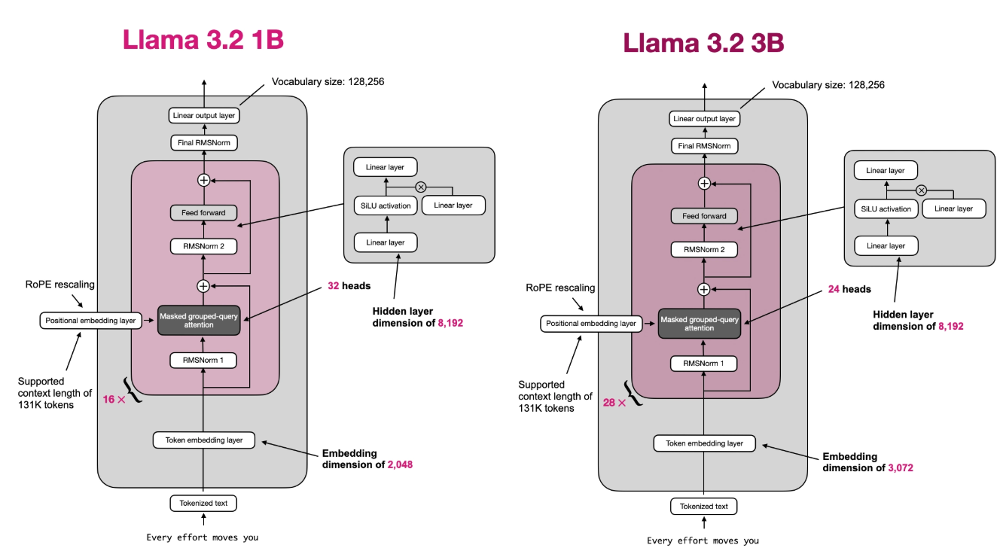

# 机器文摘 第 125 期
### 如何实现一个分词器

[如何实现一个分词器](https://juejin.cn/post/7397701403378155530)，本文详细介绍了如何实现一个分词器，并探讨了其在自然语言处理和代码补全中的应用。

通过理解BPE算法的原理和实现过程，我们不仅能够创建自定义的分词器，还能更好地适配和优化大语言模型的使用。

本文提供的分词器实现方案不仅适用于代码补全工具，还可以扩展到其他需要文本处理的领域。

### 当广播电台成了“软件商店”：1980年代的科技魔法

[通过广播下载游戏](https://newslttrs.com/yes-in-the-1980s-we-downloaded-games-from-the-radio)，这篇文章讲述了1980年代英国的一项令人难以置信的技术现象。

1980年代的某个深夜，英国的无线电波中突然响起一阵刺耳的尖叫——这不是恐怖电影配乐，而是一群孩子屏住呼吸等待的“魔法咒语”。他们把磁带机对准收音机，按下录音键，然后祈祷这段噪音能在明天变成一场太空射击游戏。

这是真的。

当时英国正经历家庭电脑革命，但问题是：市面上的ZX Spectrum、Commodore 64、BBC Micro彼此完全不兼容，软件像巴尔干半岛一样割裂。BBC电台的《The Chip Shop》节目组急中生智，从荷兰广播公司NOS引进了BASICODE——一种能让不同电脑“听懂同一种语言”的跨平台代码。用户只需先装一个“翻译器”，就能把广播里的噪音转化为程序。

想象一下：深夜电台开始播放“嘟嘟声”，你用磁带录下来，插进录音机连上电脑，几分钟后屏幕上蹦出一个文字冒险游戏。虽然没有图形，但当像素文字告诉你“你发现了藏宝图！”时，那种心跳至今让老玩家怀念。

> 当互联网让软件分发变成瞬间的事，BASICODE的尖叫渐渐消失在电波里。今天，当我在Facebook看到有人质疑这段历史时，才意识到：我们这一代人的童年，已经成了下一代人眼中的“科幻故事”。

> 在没有App Store的年代，我们用噪音编织了整个数字世界。

### MCP 中文资源合集

[Awesome-MCP-ZH](https://github.com/yzfly/Awesome-MCP-ZH)，是一个关于MCP的中文资源合集，涵盖了MCP的基础知识、客户端、服务器以及相关工具和教程，旨在帮助中文用户快速上手MCP。

### 网易开源的 TTS 语音合成项目

[EmotiVoice](https://github.com/netease-youdao/EmotiVoice)，是网易有道开源的多语言、多声音和提示控制的文本到语音（TTS）系统。

支持英语和中文，提供超过2000种声音，支持基于提示生成带有不同情感（如开心、悲伤、愤怒等）的语音。

具备情感合成、语音克隆等功能，提供Web界面和OpenAl兼容的API，方便用户使用和开发者集成，适合用在语音助手、有声读物等多种场景。

### 帮你自动画架构图的 AI

[halomate](https://halomate.ai/)，一款收费 AI 绘图产品，可以根据文字生成图像，有别于其他文生图模型，这款产品能够根据文字描述帮助用户生成软件产品架构图、思维导图等专业图形。

### 开源跨设备文件共享工具

[croc](https://github.com/schollz/croc)，一款跨设备文件分享的开源免费工具，无需在同一网络下，允许任意两台电脑之间传输文件或文件夹，不限制大小，并提供端到端加密，更安全更快速地分享。

支持多文件传输，以及中断后的断点续传功能。

支持 Windows、Linux 和 macOS 一键安装使用。

### 基于 CloudFlare Pages 的开源免费文件托管解决方案

在写文章或教程时，我们经常需要插入大量的图片和文件，往往需要一个稳定且不限大小的图床。

[CloudFlare ImgBed](https://github.com/MarSeventh/CloudFlare-ImgBed)，一个基于 CloudFlare Pages 的开源免费文件托管解决方案，可作为图床、文件床、网盘。

提供上传、管理、读取、删除等全链路功能，并支持鉴权、目录、图片审查、随机图等各项特性。

主要特性：

- 支持多种存储渠道（Telegram Bot、Cloudflare R2、S3 等）与多种上传方式
- 支持目录功能、上传认证、图片审查、防滥用与 IP 黑名单
- 提供丰富 API 接口，包含上传 API 与随机图 API
- 可自定义网站外观、背景、图床名称、Logo 等界面元素
- 完全基于 Cloudflare 免费额度，无需额外购买服务器和域名

### 自媒体平台自动化工具

[social-auto-upload](https://github.com/dreammis/social-auto-upload)，可以自动化发布视频到自媒体平台。

支持抖音、小红书、视频号、tiktok、youtube、bilibili等

支持定时上传和计划任务上传

### 从零开始的 Llama 3.2

想学习开源项目，自己撸一遍才能知其所以然。

[llama-3.2-from-scratch](https://huggingface.co/rasbt/llama-3.2-from-scratch)，这个huggingface项目介绍了一个从零开始实现的 PyTorch 版本的 Llama 3.2 文本模型，代码简洁易懂，适合学习和研究。

它提供了详细的使用指南，包括模型设置、权重下载、文本生成等步骤。 ​​​

## 订阅
这里会不定期分享我看到的有趣的内容（不一定是最新的，但是有意思），因为大部分都与机器有关，所以先叫它“机器文摘”吧。

Github仓库地址：https://github.com/sbabybird/MachineDigest

喜欢的朋友可以订阅关注：

- 通过微信公众号“从容地狂奔”订阅。

