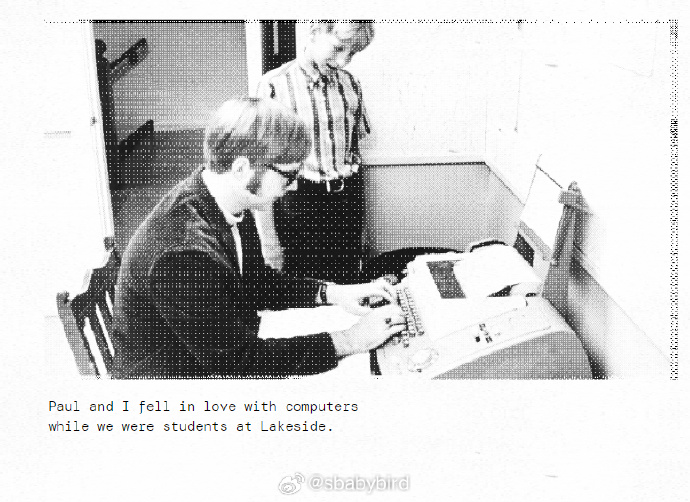
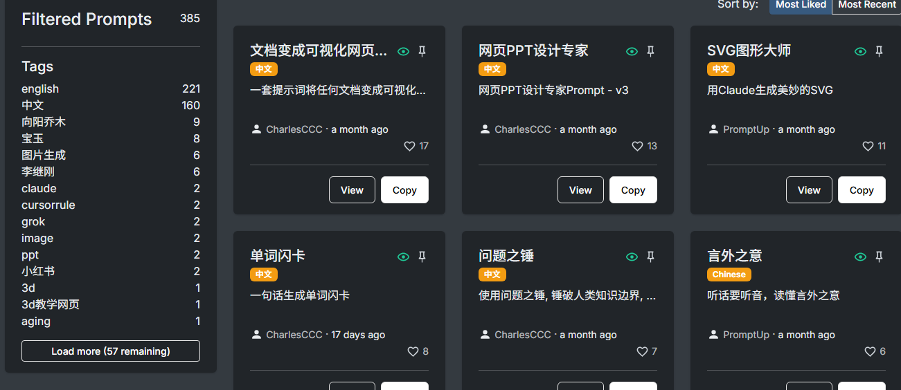
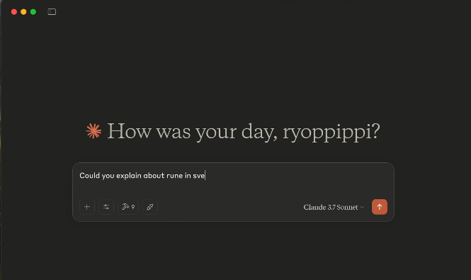
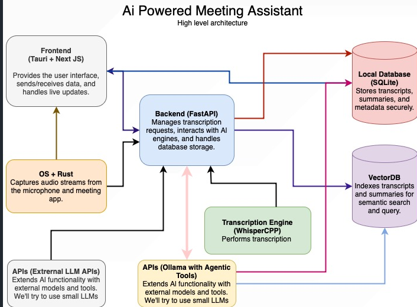
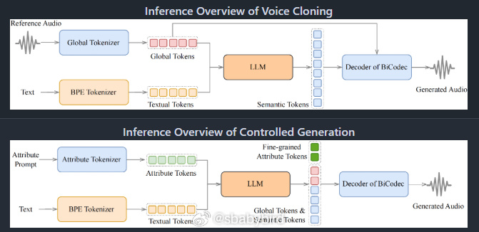
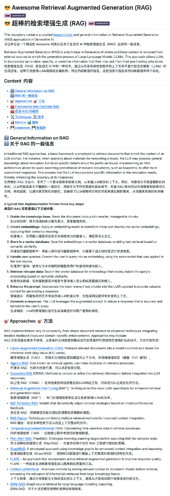
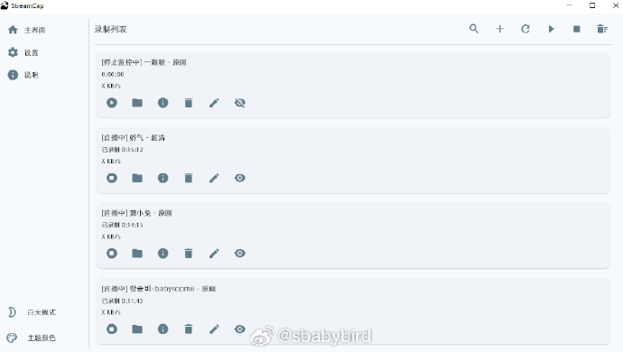
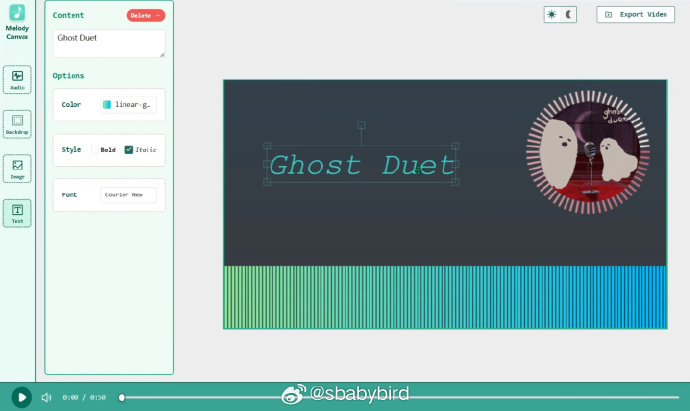

# 机器文摘 第 126 期
### 比尔盖茨眼里的微软 50 年

[微软50周年的回忆](https://www.gatesnotes.com/meet-bill/source-code/reader/microsoft-original-source-code)，今年是微软诞生50周年，比尔盖茨写了这篇回忆文章，介绍了他怎么会创立这家公司，文末给出了微软第一个产品 Altair BASIC 的源码下载。 ​​​

这篇文章回顾了比尔盖茨在成长过程中遇到的几位对他影响深远的老师，并详细描述了这些老师如何通过独特的教学方式和对他的信任，塑造了他的思维方式和未来成就。

值得一提的是，这篇文章的排版颇具复古计算机风格。

### 提示词分享网站

[promptup](https://promptup.net/)，这个网站汇集了市面上很多AI大佬写的非常优秀的提示词案例，比如：
1. 如何将文档变成可视化网页的提示词；
2. SVG图形大师，如何使用 Claude 生成美妙的SVG 图；
3. 还有网页设计PPT大师的提示词，生成漂亮的网页 PPT；
4. 如何一句话生成好看的单词闪卡的提示词；
5. 去除 AI 味 Prompt。

### 将网站内容转换为 MCP 服务器

[sitemcp](https://github.com/ryoppippi/sitemcp), 它能一键抓取整个网站内容并将其转化为 MCP 服务器，再搭配 Claude 等 MCP 客户端，就能直接对网站内容进行对话提问。

主要功能：

- 支持一次性抓取整个网站，并缓存到本地
- 可设置并发数提高抓取速度
- 支持多种工具命名策略，便于 AI 客户端调用
- 提供路径匹配功能，可选择性抓取特定页面
- 支持内容选择器，确保提取页面中最有价值的内容

可通过命令行一键安装使用，并无缝集成到各种 MCP 客户端。

### 开源 AI 会议助手

[metting-minutes](https://github.com/Zackriya-Solutions/meeting-minutes)，它能实时捕获会议音频、进行转录并生成摘要，无需服务器所有处理在本地完成，确保数据隐私安全。

主要功能：

- 实时捕获麦克风和系统音频
- 使用本地 Whisper 模型进行即时语音转录
- 支持多种 LLM 提供商，包括 Anthropic、Groq 和 Ollama
- 完全本地处理，无需外部服务器，保护隐私

提供 Windows、macOS 系统安装包，下载即可使用。

### 零样本复刻任意人声

[Spark-TTS](https://github.com/SparkAudio/Spark-TTS)  基于 Qwen2.5 架构直出语音编码，零样本复刻任意人声，中英文混合生成丝滑无界。无需专业设备/海量数据，即刻生成媲美真人的多语言语音。 ​​​

### Awesome-RAG

[Awesome-RAG](https://github.com/Danielskry/Awesome-RAG)，GitHub 上一份精心整理的检索增强生成（RAG）技术资源集合。

这份列表系统整理了 RAG 相关的理论知识、实现方法、开发框架、关键技术以及评估指标等内容。

从基本原理到高级技术详解，再到实现步骤，有助于我们更好学习与使用 RAG。

### 多平台直播流自动录制工具

[StreamCap](https://github.com/ihmily/StreamCap)，一个基于FFmpeg的直播流录制客户端，可录制覆盖 40+ 国内外主流直播平台。

主要特性：
- 系统支持：Windows 11/10 | macOS 12+ (x86/ARM)
- 功能支持：支持批量录制、循环监控、定时监控、消息推送以及自动转码
- 画质支持：蓝光、超清、高清、标清、流畅
- 支持的保存格式：MP4、TS、FLV、MKV、MOV、MP3、WAV、M4A

已支持平台：
- 国内平台（30+）：抖音、快手、虎牙、斗鱼、B站、小红书、YY、映客、Acfun、Blued、京东、淘宝
- 海外平台（10+）：TikTok、Twitch、PandTV、Soop、Twitcasting、CHZZK、Shopee、Youtube、LiveMe、Flextv、Popkontv、Bigo

### 音频可视化画布

[melody-canvas](https://github.com/RylanBot/melody-canvas)，开源音频可视化前端库。

功能特性：
- 💕 音频可视化
   - 基于 Web Audio API，实现音频分析算法
   - 支持多种类型元素的创建，提供灵活的自定义选项
- 💕 画布编辑
   - 使用 FabricJS 库，实现可拖拽编辑器
   - 支持图片和文本的添加，方便组合搭配
- 💕 视频导出
   - 使用基于 WebCodecs API 的 WebAV 库，实现在浏览器环境下加工视频
   - 支持视频在渲染的过程中，继续调整其它内容

## 订阅
这里会不定期分享我看到的有趣的内容（不一定是最新的，但是有意思），因为大部分都与机器有关，所以先叫它“机器文摘”吧。

Github仓库地址：https://github.com/sbabybird/MachineDigest

喜欢的朋友可以订阅关注：

- 通过微信公众号“从容地狂奔”订阅。

