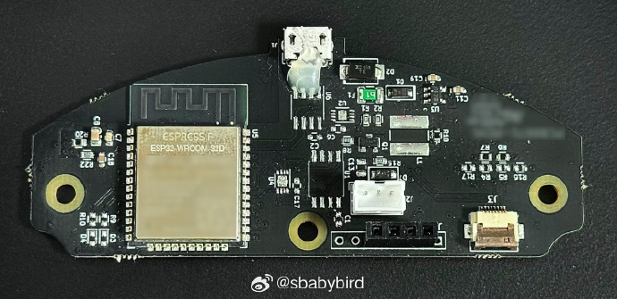
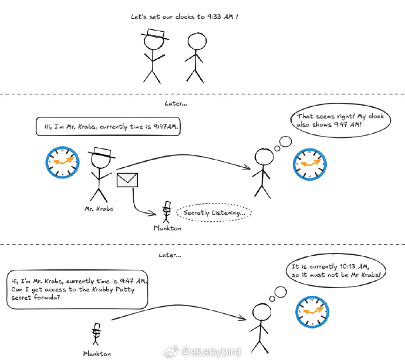
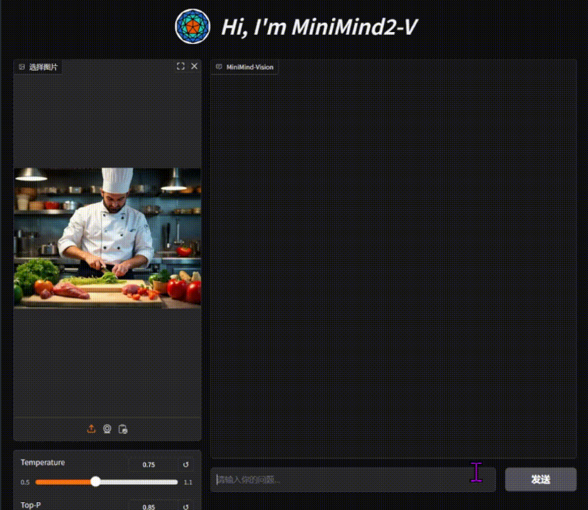
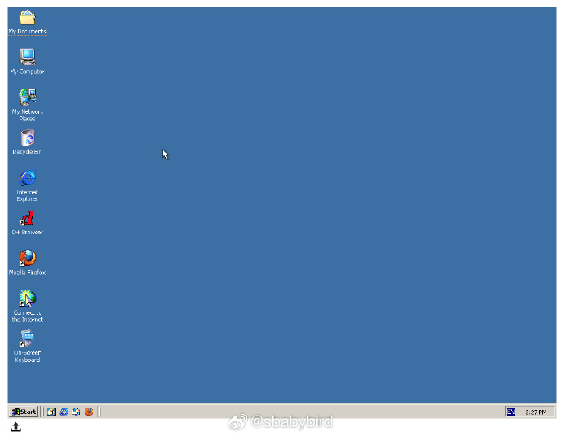
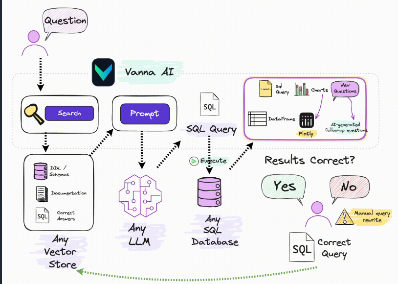
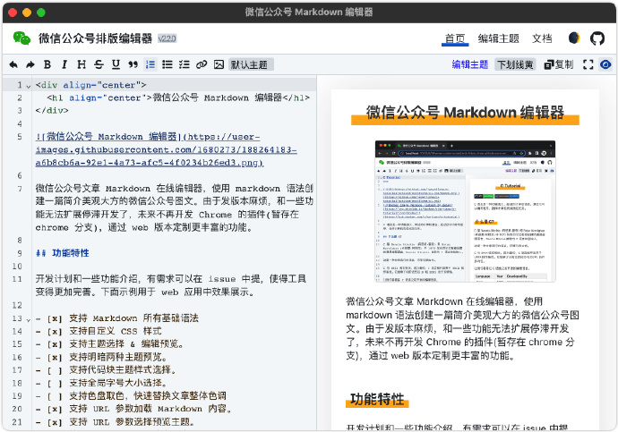
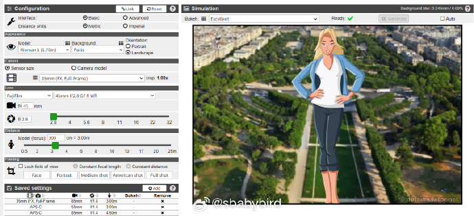

# 机器文摘 第 127 期
### 破解一个智能家居设备

[《破解一个智能家居设备》](https://jmswrnr.com/blog/hacking-a-smart-home-device)，这篇文章讲述了一位技术爱好者如何通过逆向工程破解了一款基于ESP32的智能家居设备（空气净化器），并将其成功集成到Home Assistant智能家居系统中的故事。

作者对家中所有设备都希望通过Home Assistant进行统一控制，但一款昂贵的空气净化器只能通过其官方App操作，并且依赖云端服务。为了实现本地化控制，作者决定对设备进行逆向工程。

1. **分析设备通信**：  
   作者通过抓包发现设备与云端服务器通过UDP协议通信，且数据经过加密。进一步分析表明，设备使用了自定义协议，而非标准的DTLS。

2. **硬件拆解与固件提取**：  
   作者拆解设备，发现其核心是ESP32芯片。通过串口连接和固件转储，作者提取了设备的存储数据和应用逻辑。

3. **破解加密协议**：  
   通过分析固件和网络数据包，作者发现设备使用了ECDH密钥交换和AES加密。他成功破解了加密逻辑，并实现了中间人攻击（MITM），能够解密设备与云端的通信。

4. **构建本地服务器**：  
   作者搭建了一个本地服务器，模拟云端服务，将设备的控制逻辑完全本地化。通过MQTT协议，他将设备与Home Assistant连接，实现了远程控制。

5. **最终实现**：  
   设备成功集成到Home Assistant中，作者可以通过自动化规则（如空气质量监测）控制空气净化器。

### 一次性密码（OTPs）的工作原理

[《一次性密码的工作原理》](https://blog.dogac.dev/how-do-one-time-passwords-work/)，这篇文章深入浅出地讲解了一次性密码（OTPs）的工作原理，特别是HOTP（基于HMAC的一次性密码）和TOTP（基于时间的一次性密码），并分享了作者从零开始实现这些算法的经验。

作者对一次性密码（如Google Authenticator中的6位数字代码）的神秘性感到好奇，决定深入研究其背后的机制。

文章通过通俗易懂的方式解释了HOTP和TOTP的原理，并展示了如何从零开始实现它们。

1. **OTPs的基本概念**：
   - OTPs是一次性密码，通常用于双因素认证（2FA），比传统密码更安全，因为它们只能使用一次或在有限时间内有效。
   - 与传统密码不同，OTPs是动态的，减少了密码被重复使用（重放攻击）的风险。

2. **HOTP和TOTP的区别**：
   - **HOTP**：基于一个递增的计数器生成密码。每次生成密码后，计数器加一。
   - **TOTP**：基于当前时间生成密码，通常每30秒更新一次。这种方法利用了现代设备的时间同步技术（如NTP），使得密码生成更加方便和安全。

3. **密码生成的算法**：
   - 作者详细解释了如何使用HMAC（基于哈希的消息认证码）来生成密码。HMAC结合了一个秘密密钥和一个计数器（或时间戳）来生成动态密码。
   - TOTP实际上是HOTP的一个变种，它将当前时间作为计数器的输入。

4. **作者的实现过程**：
   - 作者分享了自己如何从零开始实现HOTP和TOTP，并发布了一个演示应用来验证和展示这些算法的工作原理。
   - 他强调了理解这些算法背后的数学和逻辑的重要性，并展示了如何通过简单的步骤生成安全的一次性密码。
  
### 开源的多模态视觉模型

[MiniMind-V](https://github.com/jingyaogong/minimind-v)，是一款可以从零开始训练多模态视觉模型的开源项目。

它提供详细的训练流程，仅用1.3块钱成本 + 1小时！即可训练出26M参数的超小多模态视觉语言模型，支持识图与对话。

MiniMind-V 26M 参数的超轻量设计，提供从数据处理到指令微调的全流程代码。

功能特性：
- 超轻量模型：仅 26M 参数（0.026B），约为 GPT-3 的 1/7000，单卡 3090 即可训练。
- 多模态能力：支持单图和多图输入，结合文本进行对话。
- 全流程开源：包含数据处理、预训练、SFT 和推理完整代码，支持数据集清洗和自定义配置。
- 跨模态对齐：采用简单线性变换，将 CLIP 的 768 维视觉 token 对齐到 LLM 空间。
- 易用接口：提供 OpenAI 兼容 API，可接入 FastGPT、OpenWebUI 等。

### 浏览器中运行 Linux 或其他操作系统

[jslinux](https://www.bellard.org/jslinux/)，是一个运行在网页中的虚拟机，可以让你在浏览器中运行老式操作系统，包括 win2000、dos、linux等。

### 面向 SQL 生成和 RDBMS 的 RAG 框架

[vanna](https://github.com/vanna-ai/vanna)，这个 RAG 框架支持很多 RDBMS 包括 PostgreSQL，MySQL，Apache Hive，ClickHouse，Snowflake，Oracle，Microsoft SQL Server，BigQuery，SQLite，DuckDB 等等，并且可以自动获取数据库库表结构。

它还有自我学习功能，正确的问题到 SQL 的对应关系被存储起来，可以使未来的结果更加准确。

### 微信公众号 Markdown 编辑器

[wxpm](https://github.com/jaywcjlove/wxmp)，开源免费的 Mardown 编辑器，支持 Markdown 所有基础语法、自定义 CSS 样式、多种主题选择、实时编辑预览以及色盘取色等等功能。

提供 Docker 快速部署在线使用，轻松创建出一篇简洁美观大方的微信公众号图文。

### 相机镜头景深效果在线模拟

[dofsimulator](https://dofsimulator.net/en/)，这个工具可是太棒了，可以在线模拟各品牌相机镜头的景深效果，直接调整光圈、拍照距离、镜头焦段，实时预览景深效果。 ​​​

## 订阅
这里会不定期分享我看到的有趣的内容（不一定是最新的，但是有意思），因为大部分都与机器有关，所以先叫它“机器文摘”吧。

Github仓库地址：https://github.com/sbabybird/MachineDigest

喜欢的朋友可以订阅关注：

- 通过微信公众号“从容地狂奔”订阅。

