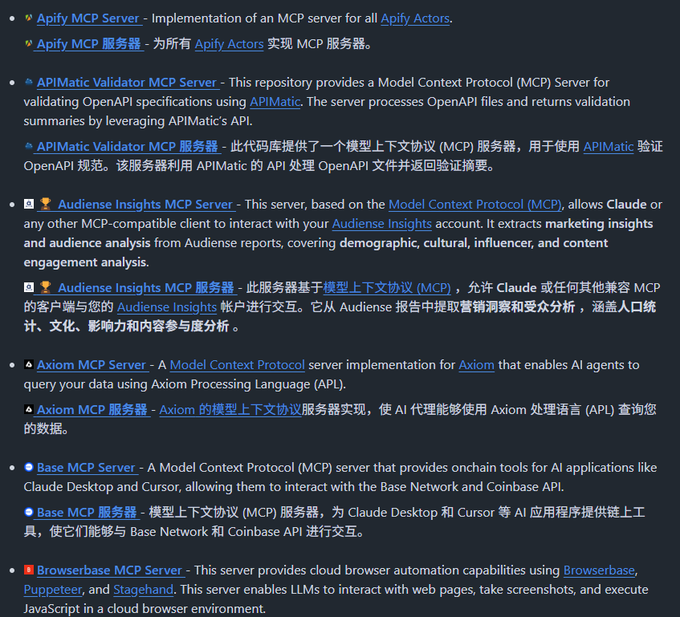
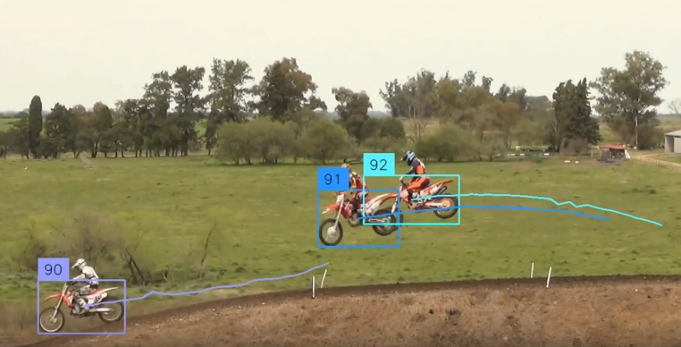
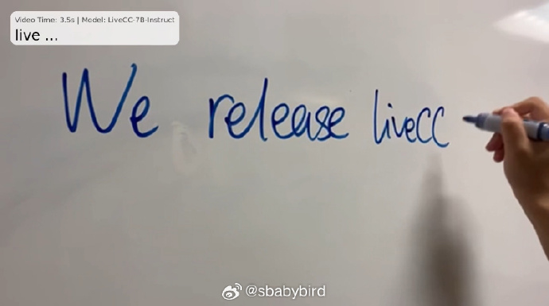
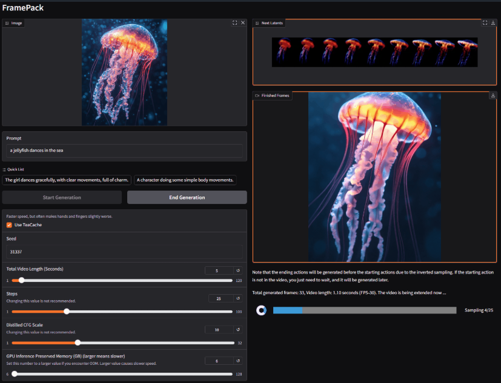
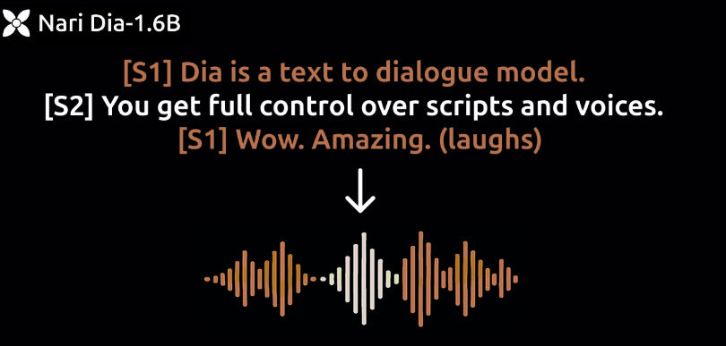
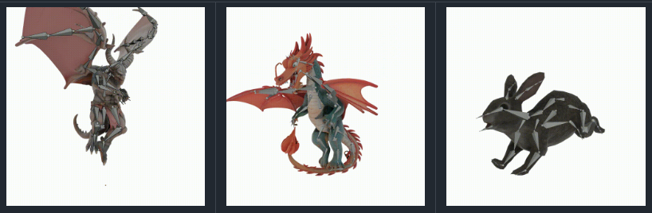
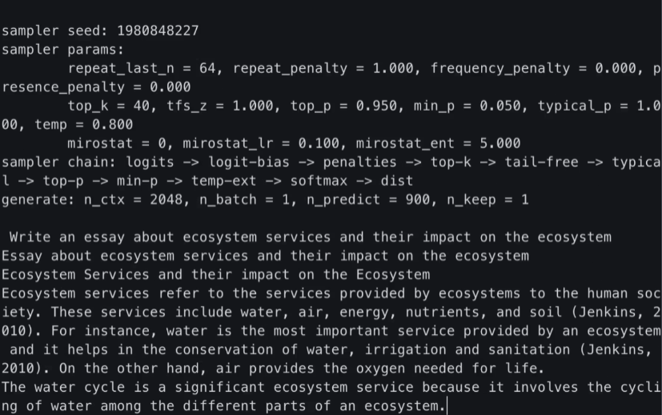
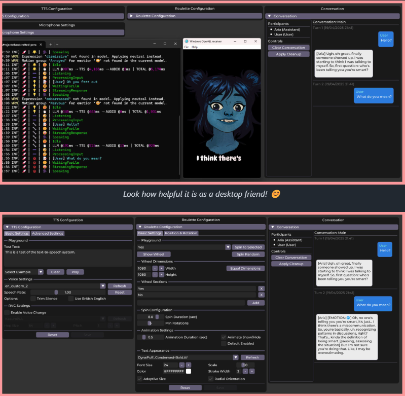

# 机器文摘 第 128 期

### 用 Docker 快速搭建 MCP 服务器

[MCP Containers](https://github.com/metorial/mcp-containers) 将数百个常用 MCP 服务器打包成即用即取的 Docker 镜像，直接一键部署各种 AI 能力扩展的 MCP 工具。

主要特性：
- 一键部署体验，通过简单的 Docker 命令即可使用任何 MCP 服务器
- 自动更新机制，服务器镜像每日更新，始终与源仓库同步
- 安全隔离环境，各服务器在独立容器中运行互不干扰
- 支持数百种 MCP 服务器，从网络搜索、浏览器控制到各类 API 集成
- 丰富的文档和使用指南，帮助快速上手

只需拉取需要的 Docker 镜像即可，同时每一个 MCP 服务器都有详细的使用教程。

### 性能强大的目标跟踪库

[trackers](https://github.com/roboflow/trackers)，是一个统一的库，提供领先的多目标跟踪算法的全新实现。其模块化设计让您可以轻松替换跟踪器，并将其与来自各种库（例如 inference 、 ultralytics 或 transformers 的目标检测器集成。

虽然 repo 介绍里面没有写这个算法的最大跟总量，但是演示视频里面跟踪鸡蛋的场景最大有标记为 269 的鸡蛋，也就是说它至少可以动态跟踪200+目标。

### 桌面宠物猫

[BongoCat](https://github.com/ayangweb/BongoCat)，在电脑上显示一个可爱的猫咪，跟随着你敲打的键盘和移动的鼠标进行互动，工作累了困了可玩下解压。

提供 Windows、macOS 和 Linux 系统安装包，可直接开箱即用。

### 利用多模态大模型实时分析视频流

[LiveCC](https://showlab.github.io/livecc/)，能实时分析视频的模型，基于Qwen2-VL-7B后训练，能实时分析出视频的内容，速度快效果好。

从演示效果上来看，十分厉害的样子。

能够直接读出演讲者在白板上实时手写的单词。

观看球赛视频能够做到及时解说当前战况。

### 性能强大的视频生成框架

[FramePack](https://github.com/lllyasviel/FramePack)，是一个渐进式生成视频的下一帧（下一帧部分）预测神经网络结构。

FramePack 将输入上下文压缩为恒定长度，以便生成工作量不受视频长度的影响。

即使在笔记本电脑 GPU 上，FramePack 也可以使用 13B 模型处理大量帧。

FramePack 可以使用更大的批量大小进行训练，类似于图像扩散训练的批量大小。

使用 13B 模型生成 1 分钟视频（60 秒），30fps（1800 帧），最低所需的 GPU 内存为 6GB。

官方只提供了windows构建版本，下载后使用 update.bat 进行更新，使用 run.bat 运行。框架会直接从HuggingFace 上下载模型

### 小巧又逼真的语音生成模型

[Dia-1.6B](https://github.com/nari-labs/dia)，一款超逼真的文本转语音生成模型，号称超越 ElevenLabs 和 Sesame。

仅仅只有 1.6B 参数，能直接从文本生成高度逼真的对话，还支持控制情感和语调，甚至可以生成笑声、咳嗽等非语言声音。

主要特性：
- 通过 [S1] 和 [S2] 标签控制生成多角色对话；
- 支持生成笑声、清嗓子、叹息等非语言表达；
- 提供声音克隆功能，可复制特定声音风格；
- 实时生成，A4000 GPU 上约 40 tokens/s。

提供 Gradio UI 界面，操作简单易上手，同时还可以在 Hugging Face 上在线体验。

### AI 生成骨骼

[UniRig](https://github.com/VAST-AI-Research/UniRig)，自动为3D模型生成骨骼，比此前的方法精度大幅提升，不仅能生成人物骨骼，也能生成各种动物的骨骼。

AI生成3D模型，AI再生成3D骨骼，再通过骨骼生成动作，3D影视和游戏会有比较可控的落地方案。

### 微软开源基于 CPU 推理框架

[BitNet.cpp](https://github.com/microsoft/BitNet)，可直接在 CPU 上运行 1-bit 模型推理（如 BitNet b1.58）。

提供多种优化内核，支持在 CPU 上实现快速无损推理，使模型速度提升 1.37-6.17 倍，同时能耗降低高达 82.2%，可在单 CPU 上运行 100B 规模模型。

官方提供了 2B 参数模型可直接使用，支持多种 Hugging Face 上的 1-bit 模型。

同时提供完整的示例代码和详细的使用指南，适用于 Windows、Linux 和 macOS 系统。

### 基于 Live2D 的 AI 虚拟助手 

[Persona Engine](https://github.com/fagenorn/handcrafted-persona-engine)，AI 虚拟助手项目，结合了大语言模型，Live2D，自动语音识别，文本转语音，实时语音克隆。

达到了直接跟虚拟人物对话的能力，可以直接集成到 OBS 里面做AI虚拟主播。

## 订阅
这里会不定期分享我看到的有趣的内容（不一定是最新的，但是有意思），因为大部分都与机器有关，所以先叫它“机器文摘”吧。

Github仓库地址：https://github.com/sbabybird/MachineDigest

喜欢的朋友可以订阅关注：

- 通过微信公众号“从容地狂奔”订阅。

