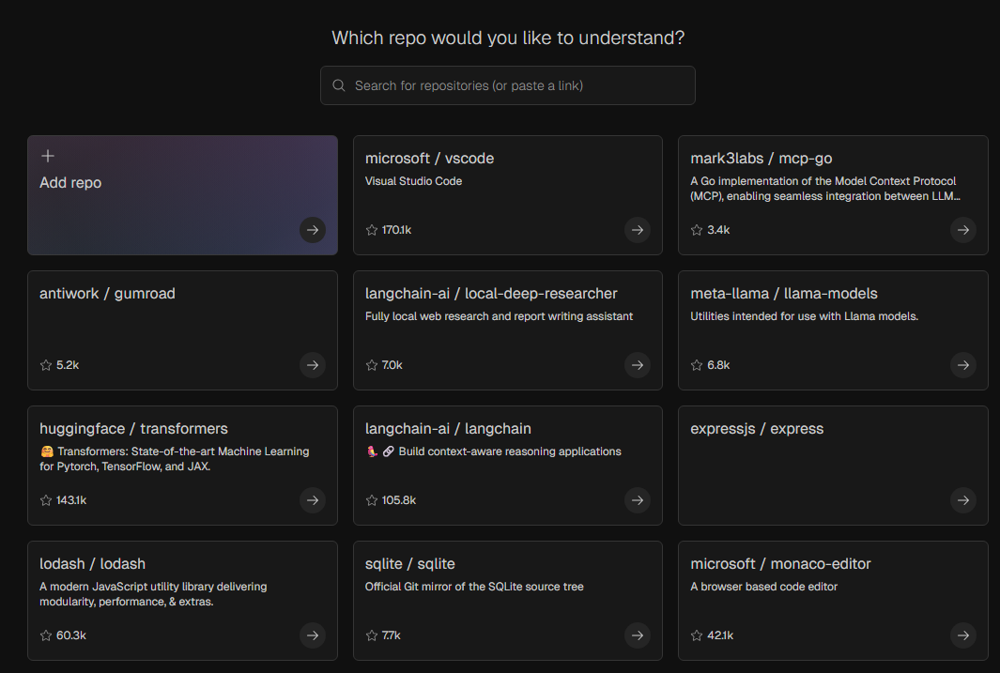
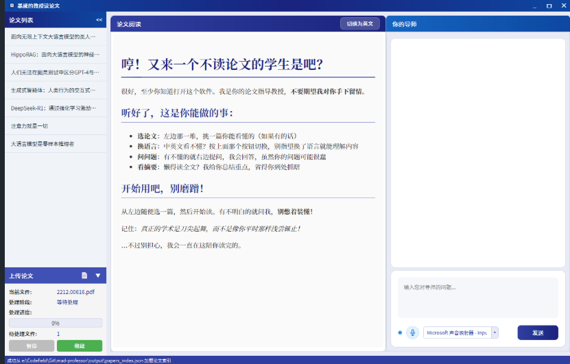
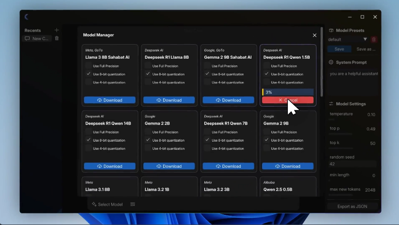
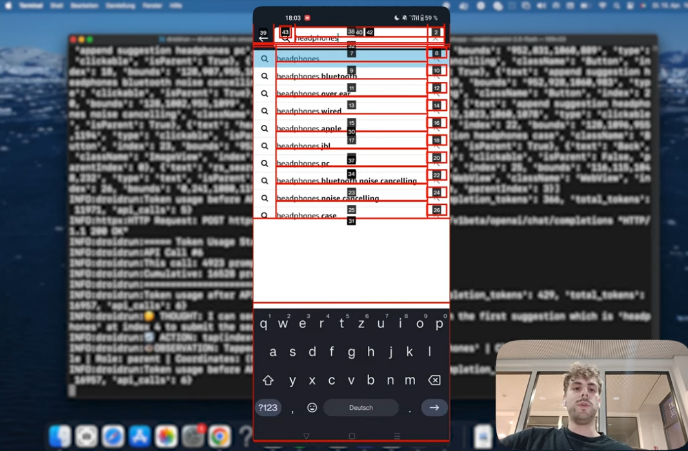

# 机器文摘 第 129 期
### 一个涵盖所有 GitHub 代码库的免费百科全书

[DeepWiki](https://deepwiki.com/)，本周最火项目，将任何公共 GitHub 代码库的 URL 替换为“ https:// deepwiki. com/org/repo ”即可获得类似维基百科的精准库描述。

可一键将任意代码库转换成详细易懂的知识库文档并与之对话  DeepWiki 通过分析 GitHub 公共代码库的代码、README 和配置文件，然后会自动自动生成一个详细的、易读的文档、交互式图表，并有一个对话式 AI 助手。

一共索引了 3 万个库，40 亿行代码。

[这里有一个油猴脚本，可以让你在浏览 Github 仓库页面的时候直接一键跳转到对应的 Deepwiki 页](https://greasyfork.org/zh-CN/scripts/534213-github-to-deepwiki)：https://greasyfork.org/zh-CN/scripts/534213-github-to-deepwiki

### 8 个超实用的 AI 音乐生成工具

1. [Soundraw](https://soundraw.io)，支持高度自定义的AI音乐生成平台，可调整节奏和旋律，支持多种风格和音乐流派选择。
2. [Mubert](https://mubert.com/render/moods)，操作简单，支持快速生成多种风格的背景音乐。
3. [Beatoven](https://www.beatoven.ai)，输入文本即可快速生成符合场景需求的音乐，每次可生成多段1分钟左右的音频。
4. [Soundful](https://soundful.com)，擅长生成冥想和放松类音乐，能生成超过5分钟的冥想音频，非常适合制作长时背景音乐。
5. [Loudly](https://www.loudly.com)，文本转音乐功能，能生成30秒音乐，支持风格融合。
6. [Aiva](https://www.aiva.ai)，集成专业编辑工具和海量素材库的平台，提供数百种预设风格。
7. [Stable Audio](https://stability.ai/stable-audio)，支持生成45秒的高质量音频，支持二次创作功能。
8. [Splash Music](https://www.splashmusic.com)，在线合成自然音效和背景音的平台，提供在线使用版本，无需下载。

### 学术论文阅读工具

[mad-professor](https://github.com/LYiHub/mad-professor-public)，集PDF处理、AI翻译、RAG检索、AI问答及语音聊天于一体。

导入PDF后它会自动提取、翻译和结构化论文内容，并且支持中英文对照阅读

支持AI智能问答，分屏界面，左侧论文右侧AI问答，可以语音提问和TTS语音回答

mad-professor 被赋予了个性角色，回答问题时会带有教授的性格和情感特点，支持更换不同的教授人设/声音

### 轻量级 LLM 离线运行工具

[Kolosal AI](https://github.com/Genta-Technology/Kolosal)，让大语言模型在本地设备上轻松运行。

主要特点：
1. 仅需约20MB的编译体积，适合边缘设备；
2. 支持 AVX2 CPU、AMD和 NVIDIA GPU，硬件适配广泛；
3. 支持多种流行模型，如 Mistral、LLaMA、Qwen 等。

### Android 自动化工具

[DroidRun](https://github.com/droidrun/droidrun)，用 AI 操作手机。

通过自然语言直接控制 Android 设备，比如说 “打开设置查看电池用量” 这样的简单指令，AI 就能自动帮我们完成，就像有个助手在替我们操作手机一样方便。

主要功能：

- 使用自然语言命令控制 Android 设备，无需编程知识
- 支持多种大模型（OpenAI、Anthropic、Gemini）作为决策大脑
- 简单易用的命令行界面，一行命令就能完成复杂操作
- 提供 Python API 接口，方便开发者集成自定义功能
- 支持截图分析，让 AI 能"看到"手机屏幕内容
- 轻松实现 UI 测试、日常任务自动化等功能

安装配置简单，通过 USB 或 ADB 即可连接操控，特别适合需要自动化手机操作和测试的开发者与个人。

## 订阅
这里会不定期分享我看到的有趣的内容（不一定是最新的，但是有意思），因为大部分都与机器有关，所以先叫它“机器文摘”吧。

Github仓库地址：https://github.com/sbabybird/MachineDigest

喜欢的朋友可以订阅关注：

- 通过微信公众号“从容地狂奔”订阅。

