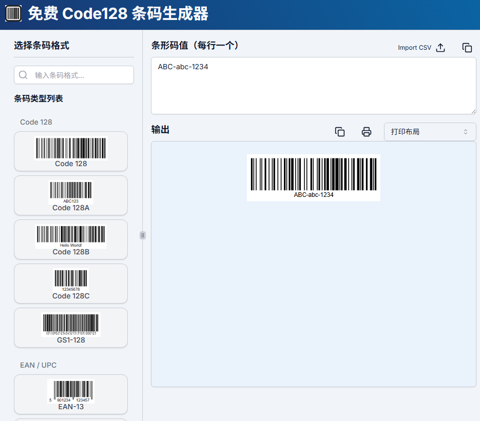

# 机器文摘 第 130 期
### 用微信聊天记录创造数字分身

[WeClone](https://github.com/xming521/WeClone)，用自己的微信聊天记录训练LLM，搞一个自己的数字分身，支持微信语音克隆。

支持绑定到微信、QQ、Telegram、企微、飞书机器人等，作为个人助手，忙的时候应付简单社交比较实用。

项目仓库里包含了从聊天数据导出、预处理、模型训练以及部署的全流程。

项目默认使用 Qwen2.5-7B-Instruct 模型，LoRA 方法对 sft 阶段微调，大约需要 16GB 显存。也可以使用 LLaMA Factory 支持的其他模型和方法。

### 计算部署大模型所需资源的工具

[vram-calculator](https://apxml.com/tools/vram-calculator)，一个计算大模型推理和训练所占内存的在线工具。

工具的特点是比较精准，且可调整很多细节参数，能够比较精准预测你最终所需的资源。

能计算 MoE 的模型，会算不同的 attention 机制，支持修改 batch size、seq length 和并发数。 ​​​

### 开源 cursor 平替

[Void](https://github.com/voideditor/void)，像 cursor 一样基于 vscode 开发的基于 AI 的智能 IDE 环境。

支持在项目工程中直接使用 AI Agent 进行编码、调试等任务的执行。

可以对接任意大模型 LLM，包括云端服务或本地部署服务。

### 速度极快的语音识别模型 

[Parakeet TDT 0.6B V2](https://huggingface.co/nvidia/parakeet-tdt-0.6b-v2)，英伟达开源的一个语音识别模型，发布后迅速登顶 OpenASR 榜单。

能够在 1 秒内实现高质量转录 60 分钟的音频，而且参数仅仅 0.6B，轻松击败了所有主流闭源模型。

不过目前仅支持识别英文，采用的是 CC-BY-4.0 开源许可，允许商业使用。

### 条形码在线生成 

[Barcode Maker](https://barcode-maker.com)，一个免费、开源的在线条码生成工具，支持多种一维条码和二维码格式的实时批量生成。无需注册，没有数量限制，并且支持多种格式下载。

支持 Code 128、EAN/UPC、Code 39、ITF、MSI Plessey、Pharmacode、Codabar 等一维码，以及 QR Code、Data Matrix、PDF417、Aztec Code 等二维码

支持 PNG、JPG、GIF、SVG 格式下载，批量生成时会打包为 ZIP 文件。

完全响应式设计，适用于电脑、平板和智能手机。

### 操作excel的 mcp 服务

[excel-mcp-server](https://github.com/haris-musa/excel-mcp-server)，允许 AI 操作 Excel 文件，且无需安装 Microsoft Excel。

支持使用 AI Agent 创建、读取和修改 Excel 工作簿。

- 📊 创建和修改 Excel 工作簿
- 📝 读取和写入数据
- 🎨 应用格式和样式
- 📈 创建图表和可视化
- 📊 生成数据透视表
- 🔄 管理工作表和区域

## 订阅
这里会不定期分享我看到的有趣的内容（不一定是最新的，但是有意思），因为大部分都与机器有关，所以先叫它“机器文摘”吧。

Github仓库地址：https://github.com/sbabybird/MachineDigest

喜欢的朋友可以订阅关注：

- 通过微信公众号“从容地狂奔”订阅。

