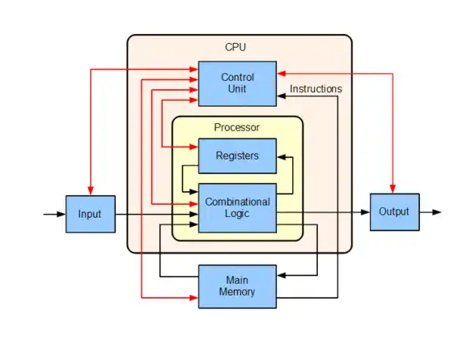
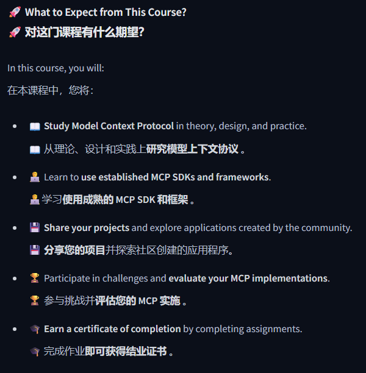
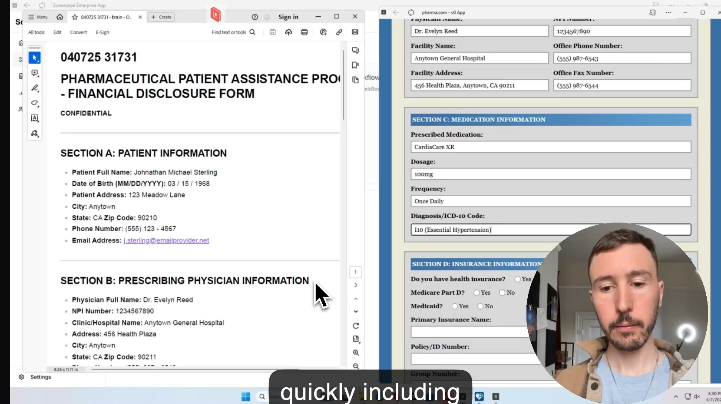
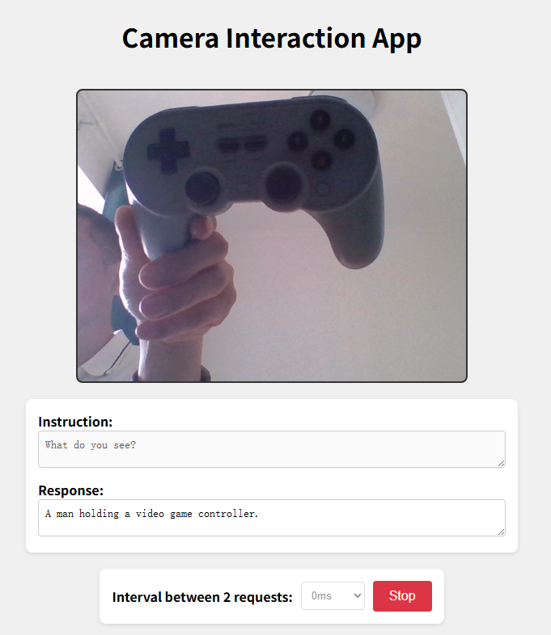
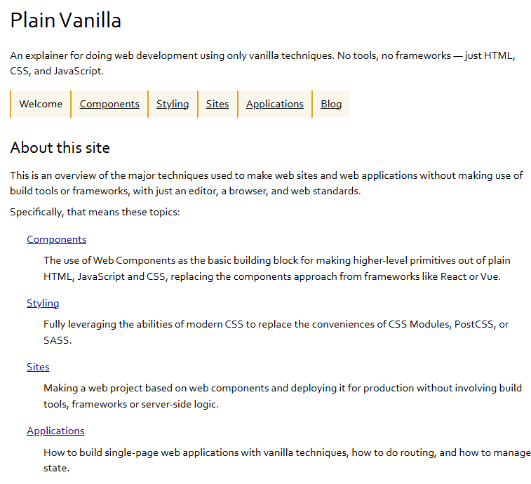
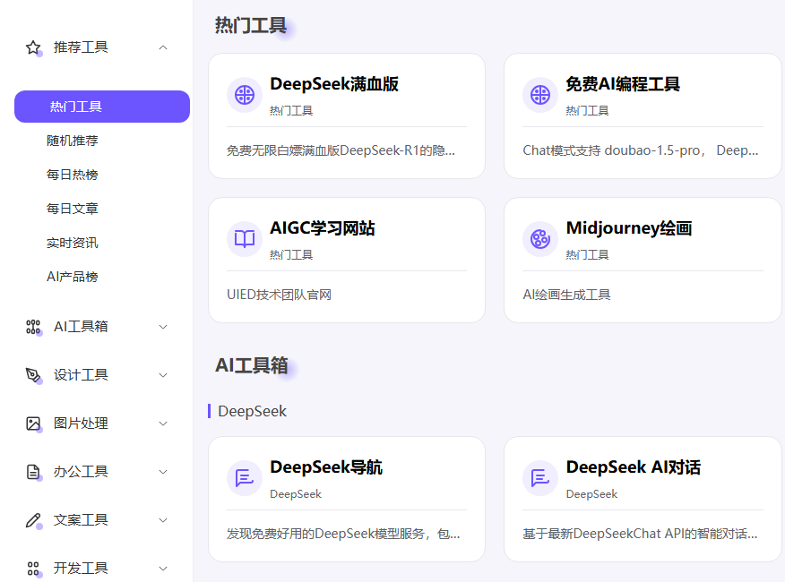

# 机器文摘 第 131 期
### 你的代码是如何在CPU里执行的？

[程序在 CPU 中的运行过程](https://chessman7.substack.com/p/how-your-code-runs-the-journey-of)，中央处理器 (CPU) 是强大的引擎，驱动着从简单计算到复杂模拟的一切任务。理解它的架构和执行流程不仅仅是学术兴趣，更是任何深入编程或计算机科学人士的必修课。

这篇博文旨在通过探索 CPU 的架构和执行流程，并用一个实际的代码示例来解释这些概念，从而解释 CPU 的内部工作原理。

详细讲解了 CPU 的主要组成部分：控制单元（CU）负责协调指令的获取、解码和执行；算术逻辑单元（ALU）执行算术和逻辑运算；寄存器临时存储数据和指令；内存包括 RAM、ROM 和缓存；组合逻辑负责处理输入信号并输出结果。

重点介绍了 CPU 操作围绕的取指 - 译码 - 执行循环：取指阶段，CPU 根据程序计数器（PC）从内存中获取指令；译码阶段，确定指令的操作码和操作数；执行阶段，执行指令指定的操作，可能涉及 ALU 或寄存器和内存间的数据移动；最后将结果写回寄存器或内存。

以一个简单的 C 程序为例，展示了程序从编写到运行的整个过程：编译阶段，C 代码被编译为对象文件，再与库链接成可执行文件；加载阶段，加载器将可执行文件从硬盘加载到内存；执行阶段，CPU 从内存中获取、解码和执行指令；输出阶段，程序通过 printf 函数将结果输出到屏幕。同时介绍了程序运行中涉及的内存段、操作系统、硬盘和主板等组件的作用。

### huggingface官方出的 mcp 教学课程

[《模型上下文协议（MCP）课程》](https://huggingface.co/mcp-course)，将指导您理解、使用和构建尖端 AI 应用，这些应用将基于最新的 MCP 标准，利用外部数据和工具。这门免费课程旨在帮助您从 MCP 领域的初学者成长为经验丰富的实践者。

课程内容：
- 基础单元 ：从理论上学习 MCP 概念。
- 用例分配 ：将学到的概念应用于现实世界的问题。
- 合作 ：采用 Hugging Face 及其合作伙伴的最新 MCP 实施和工具。

### 开源自动化 AI 工具

[Terminator](https://github.com/mediar-ai/terminator)，旨在使用类似 Playwright 的 API 与 Windows 上的原生 GUI 应用程序交互，例如解析网站。

通过利用操作系统级的辅助功能 API，Terminator 的 AI 代理速度比基于视觉的方法更快、更可靠，并且可以与后台应用程序交互。

对比传统 OCR 自动化工具，有如下的特点：

- 速度特别快，比传统方法快很多倍；
- 即使软件窗口被遮挡或在后台，也能操作；
- 非常稳定，不容易因为界面变化而失效。

### SmolVLM webgpu 版本

[smolvlm-realtime-webgpu](https://huggingface.co/spaces/webml-community/smolvlm-realtime-webgpu)，这个模型可以识别视频中的物体，识别率相当不错，模型大小只有500M。

现在出了 webgpu 版本，可以直接在网页中运行，实时监测视频流里的物品。

### 一键把电子书变成有声书 

[Book2TTS](https://b2t.pingfury.top/)，一键把电子书变成有声书 

亮点：
- 支持上传 EPUB、PDF 等格式
- 可选择不同语音合成模型，如 Edge-TTS / OpenAI / ElevenLabs 等
- 多语言支持，包括中文神经音色
- 支持 RSS 订阅
- 自动分页，可自由选择章节生成
- 可下载音频或直接发布
- 界面简洁、操作直观，适合播客、有声读物、学习场景使用

### 纯原生 Web 技术教程

[Plain Vanilla](https://plainvanillaweb.com/index.html)一个介绍纯 Vanilla web 技术的合集教程，使用原生的 HTML、CSS 和 JavaScript 进行网页和 Web 应用开发，摒弃复杂的框架和构建工具。

主要内容：

- 无框架、无构建工具
-  Web Components - 替代 Vue/React
- 现代 CSS - 不用 PostCSS / SASS
- 部署与优化 ​​​

### 一个免费的在线工具箱

[UIED Tools](https://uiedtool.com/)，是由 [UIED技术团队](https://fsuied.com/) 设计开发的在线工具平台。

网站汇聚大量在线即开即用的工具，包括 AI、设计、图片处理、办公等。

## 订阅
这里会不定期分享我看到的有趣的内容（不一定是最新的，但是有意思），因为大部分都与机器有关，所以先叫它“机器文摘”吧。

Github仓库地址：https://github.com/sbabybird/MachineDigest

喜欢的朋友可以订阅关注：

- 通过微信公众号“从容地狂奔”订阅。

