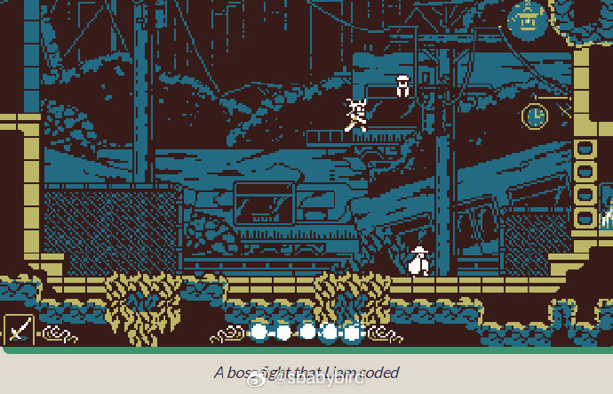
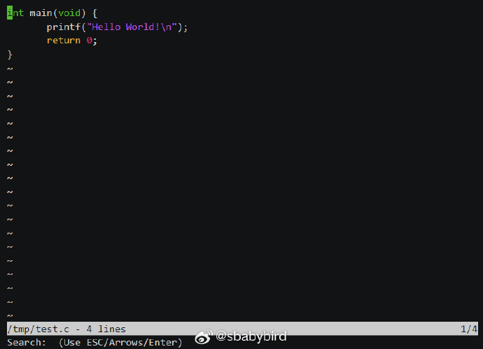
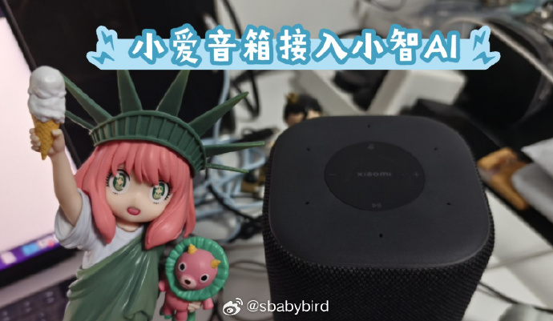
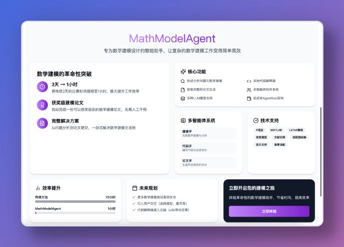
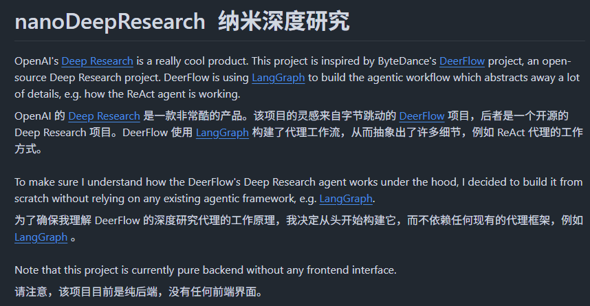
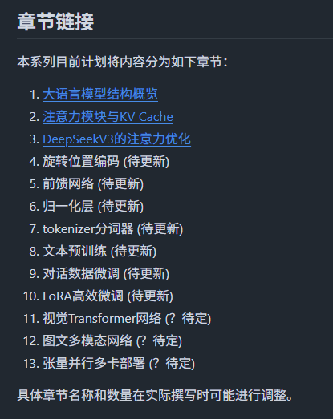
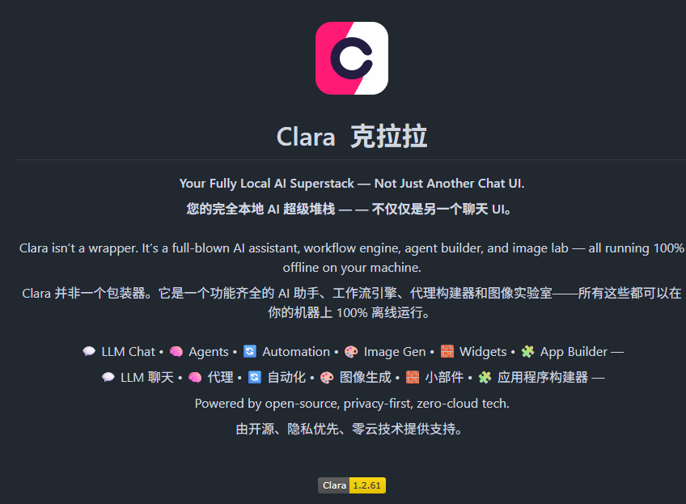
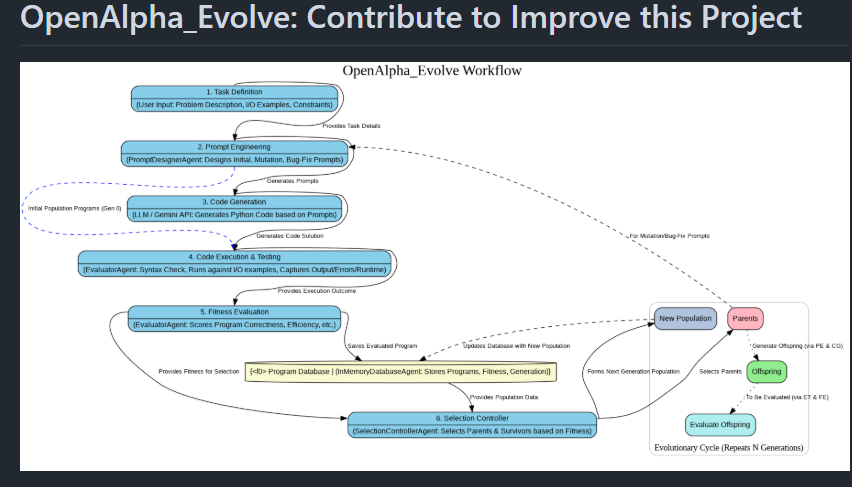

# 机器文摘 第 132 期
### 开发游戏但不使用任何引擎

这篇[《在 2025 年制作游戏》](https://noelberry.ca/posts/making_games_in_2025)来自一位开发了 20 年游戏的从业者  Noel Berry 。

文中分享了他自己制作游戏的流程和所使用的工具。尽管很多人认为不用大型商业游戏引擎就很难做游戏，但 Noel 认为对于其制作的游戏类型，不需要大型引擎的 90% 的功能，且大型引擎的默认功能实现往往不能满足其需求，最终项目还是会变成主要使用自己工具和系统，而引擎只是提供一些界面和渲染功能，所以 Noel 选择不使用大型游戏引擎，而是自己编写特定用途的小工具来制作游戏，这样更有趣，也能够掌控开发流程，方便快速找到问题并解决，不用担心引擎的更新或商业决策影响自己的游戏。

主要工具：
- 编程语言：C# 
- 窗口管理、渲染、输入、音频：SDL3
- 操作系统：Noel 提到自己已不再使用 Windows 进行游戏开发（仅用于测试），因为其更倾向于使用开源、跨平台的工具和库，而且觉得 Windows 越来越令人沮丧，Linux 则能更快速优雅地满足其编程游戏的需求。

### 不到 1000 行代码写一个带语法高亮的编辑器

[kilo](https://github.com/antirez/kilo)，不依赖任何库，用不到 1k 行 C 代码写一个可以在 VT100 兼容终端中运行的编辑器。支持快捷键操作、语法高亮和内容查询。 ​​​

### 将小爱音箱接入小智语音助手

[open-xiaoai](https://github.com/idootop/open-xiaoai)，开源项目让小爱音箱「听见你的声音」。

MiGPT 的增强版本，小爱音箱刷机后，获取系统+硬件控制权，接管小爱音箱的耳朵（麦克风）和嘴巴（扬声器）。

功能特性：
- 支持自定义小爱音箱唤醒词（离线部署 + 中英文）
- 支持定制多个唤醒词服务，不同唤醒词之间互不干扰
- 不影响小爱音箱的任何原有功能，支持随时切换回原系统
- 支持接入 Gemini Live API 和 OpenAI Realtime API 等多模态大模型
- 支持接入小智 AI 等语音助手，超低延时、超流畅的对话体验，支持连续对话，任意打断
- 支持自定义消息回复，方便对接其他 LLM、AI Workflow（Dify、扣子）、AI Agent 等服务

### 自动完成数学建模全流程的强大 AI 助手

[MathModelAgent](https://github.com/jihe520/MathModelAgent)，内置多个智能体分别负责不同环节，如代码手（带有反思模块，本地代码解释器）、论文手、建模手等，实现全自动分析问题、建模、编写代码、纠错生成一份格式完整的论文。

主要特性：

- 自动分析问题、数学建模、编写代码、纠错和撰写论文；
- 本地代码解释器，确保代码可执行性；
- 生成格式完善的建模论文，直接可用；
- 多 Agent 协作：代码 Agent、论文 Agent 分工合作；
- 支持多种 LLM 模型，每个 Agent 可单独设置不同模型；
- 成本低廉，单次任务约 1 元人民币。

支持 WebUI 和命令行两种方式使用，只需配置好环境并填写 API 密钥即可使用。

### 从零实现一个 Deep Research 智能体

[nanoDeepResearch](https://github.com/liyuan24/nanoDeepResearch), 作者受到字节开源的 DeerFlow 启发，决定从零开始构建一个深度研究 Agents，不依赖任何现有的框架，如 LangGraph。

通过该项目，我们可以清晰了解到工作流程中每个步骤，例如：

- 对于网络搜索，LLM 建议搜索什么内容；
- 对于编码，LLM 生成了什么代码；
- 对于规划，LLM 输出了什么研究计划。

主要功能特性：

- 完整实现 ReAct 代理系统，能自主推理和行动；
- 多专家协作系统，包括规划者、研究者、编码者和报告者；
- 透明展示每个步骤的决策过程和生成内容；
- 支持网络搜索、网页爬取和 Python 编程工具。

### 从零构建“小”大语言模型的教程

[Building-a-Small-LLM-from-Scratch](https://github.com/KaihuaTang/Building-a-Small-LLM-from-Scratch)，该系列的目的是让读者可以在基础的pytorch上，不依赖任何其他现成的外部库，从零开始理解并实现一个大语言模型的所有组成部分。

以及训练微调代码，读者仅需python，pytorch和最基础深度学习背景知识即可。

目前还在更新中，已经完成的有三章。

### 一个本地 AI 应用的全家桶

[Clara](https://github.com/badboysm890/ClaraVerse)，隐私优先，完全本地化的 AI 工作空间，包含 Ollama LLM 聊天、工具调用、代理构建器、稳定扩散以及嵌入式 n8n 式自动化功能。无需后端，无需 API 密钥。

Windows 系统安装部署需要依赖本地有 Python 环境以及 DockerDesktop。

我安装测试后感觉体验还有待提升，主要是智能体编排方面的功能实现还不够完整，项目还在开发中。

### 能自我进化的编码智能体

[OpenAlpha_Evolve](https://github.com/shyamsaktawat/OpenAlpha_Evolve)，是一款受DeepMind突破性研究成果"AlphaEvolve"等自主编码智能体启发而开发的开源Python框架。

该项目通过运用谷歌Gemini等大型语言模型（LLMs），在进化原则的指导下，实现了核心思想的重现：构建一个能持续执行代码编写、测试与优化的智能系统，通过迭代演进实现代码的自主进化。

他们的使命是为研究人员、开发者和技术爱好者打造一个易用、易懂且可扩展的平台，助力探索人工智能、代码生成与自动化问题解决领域令人着迷的交叉创新。

> 通过这一平台，我们致力于推动AI技术在实际编程场景中的应用边界，赋能更智能的自动化软件开发流程。

## 订阅
这里会不定期分享我看到的有趣的内容（不一定是最新的，但是有意思），因为大部分都与机器有关，所以先叫它“机器文摘”吧。

Github仓库地址：https://github.com/sbabybird/MachineDigest

喜欢的朋友可以订阅关注：

- 通过微信公众号“从容地狂奔”订阅。

