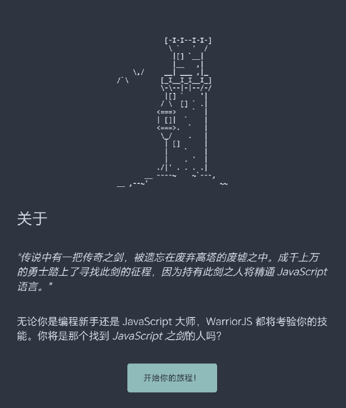

# 机器文摘 第 133 期
### 多模态智能体训练方法

[Visual Agentic Reinforcement Fine-Tuning](https://arxiv.org/pdf/2505.14246)，上海交大、上海 AI Lab、港中文、武汉大学的研究团队最新推出的多模态智能体训练方法，专为赋予视觉语言模型（LVLMs）以「工具智能体」能力而设计。

[机器之心解读这篇论文的文章](https://weibo.com/ttarticle/p/show?id=2309405170925888209091)

> Visual-ARFT 让模型不仅能看图、能理解，还能「动脑推理、动手操作」，主要包括以下三个方面的核心能力：

> 模型能够自动调用搜索引擎查资料或者编写并执行 Python 代码处理图像；
> 面对复杂任务，能够自主拆解问题、规划步骤、调用合适工具完成任务；
> 支持多步推理、多模态输入，具备强大的跨模态泛化能力！

### 开源跨平台智能对话机器人

[chatgpt-on-wechat](https://github.com//zhayujie/chatgpt-on-wechat)，基于大模型搭建的聊天机器人，同时支持 微信公众号、企业微信应用、飞书、钉钉 等接入，可选择 GPT4.1/GPT-4o/GPT-o1/ DeepSeek/Claude/文心一言/讯飞星火/通义千问/ Gemini/GLM-4/Kimi/LinkAI，能处理文本、语音和图片，访问操作系统和互联网，支持基于自有知识库进行定制企业智能客服。

支持的功能如下：

- ✅ 多端部署： 有多种部署方式可选择且功能完备，目前已支持微信公众号、企业微信应用、飞书、钉钉等部署方式
- ✅ 基础对话： 私聊及群聊的消息智能回复，支持多轮会话上下文记忆，支持 GPT-4o系列, GPT-4.1系列, Claude, Gemini, 文心一言, 讯飞星火, 通义千问，ChatGLM-4，Kimi, MiniMax, GiteeAI, ModelScope
- ✅ 语音能力： 可识别语音消息，通过文字或语音回复，支持 azure, baidu, google, openai(whisper/tts) 等多种语音模型
- ✅ 图像能力： 支持图片生成、图片识别、图生图（如照片修复），可选择 Dall-E-3, stable diffusion, replicate, midjourney, CogView-3, vision模型
- ✅ 丰富插件： 支持自定义插件扩展，已实现多角色切换、文字冒险、敏感词过滤、聊天记录总结、文档总结和对话、联网搜索等插件
- ✅ Agent能力： 支持访问浏览器、终端、文件系统、搜索引擎等各类工具，并可通过多智能体协作完成复杂任务，基于 AgentMesh 框架实现
- ✅ 知识库： 通过上传知识库文件自定义专属机器人，可作为数字分身、智能客服、私域助手使用，基于 LinkAI 实现

### 通过游戏学习 Javascript 编程

[warriorjs](https://warriorjs.com/)，一个通过游戏来学习 js 的网站​​​。

### 在安卓手机上跑本地大模型

[Google AI Edge Gallery](https://github.com/google-ai-edge/gallery)，谷歌发布的一个开源安卓应用，专门跑他们的本地模型。

主要特性：
- 完全离线使用
- 支持多模态理解

可以直接试用前几天发布的端侧多模态模型 Gemma 3n

### 基于 Markdown 的开源排版系统

[Quarkdown](https://github.com/iamgio/quarkdown)，是一个集成了 Markdown 和 LaTeX 功能的现代排式系统，免费且开源，用于创建演示文稿、文章或书籍。

### 跨平台剪贴板同步方案

[SyncClipboard](https://github.com/Jeric-X/SyncClipboard)，通过服务器同步各设备的剪贴板内容，支持文字、图片和文件，还能解决从浏览器复制动态图变静态的问题，甚至能自动转换图片格式。

主要功能：
- 多设备剪贴板实时同步，支持文字、图片和文件；
- 从浏览器复制图片时自动下载原图，保留动态图效果；
- 智能图片格式转换，解决不同应用间的兼容性问题；
- 支持 WebDAV 网盘作为服务器，也可独立部署；
- iOS 通过快捷指令、Android 通过多种工具实现同步；
- 支持自动提取并同步短信验证码。

服务器支持 Docker 一键部署，提供全平台桌面客户端，并内置了服务器功能。

### 强化学习后训练框架

[RL-Factory](https://github.com/Simple-Efficient/RL-Factory)，专门用于智能体学习的强化学习框架。该框架采用环境解耦设计，只需提供工具配置和奖励函数就能开始训练，还支持异步工具调用让训练速度提升 2 倍。

主要功能：

- 环境解耦设计，一键式配置 MCP 工具和自定义工具；
- 异步并行工具调用，训练效率比传统框架提升 2 倍；
- 原生支持 Qwen3 模型，无需 SFT 即可准确调用工具；
- 多种奖励计算方式，支持规则、模型判断和工具调用；
- 批处理和分布式模型判断，大幅提升训练效率；
- 多代理扩展支持，可转换为 MCP 格式进行交互。

### 在 VS Code 里管理 PostgreSQL 数据库

[微软推出的一款 VS Code 扩展](https://techcommunity.microsoft.com/blog/adforpostgresql/announcing-a-new-ide-for-postgresql-in-vs-code-from-microsoft/4414648)，该扩展为管理 PostgreSQL 数据库设计，旨在简化 PostgreSQL 数据库管理和开发工作流程。

这一扩展使开发者能够在不离开 VS Code 的情况下管理数据库对象、草拟查询，并获得上下文感知的 IntelliSense 和 GitHub Copilot 的 “@pgsql” 智能助手的智能协助。

### 图形引擎教程

[现代图形引擎入门指南](https://italink.github.io/ModernGraphicsEngineGuide/)，一本在线教程，从 c++ 开始讲起的现代图形引擎入门教程，作者写了两年多了，还一直在更新。

### Linux 命令行编程教程

[Linux Command Line Computing](https://learnbyexample.github.io/cli-computing/)，本书面向初级至中级用户，重点讲解 Linux 命令行工具与 Shell 脚本编程，核心内容涵盖文件管理及文本处理任务，不涉及系统管理和网络等高级主题。

本书包含大量的示例和练习，在线阅读免费，制作好的pdf版收费。

## 订阅
这里会不定期分享我看到的有趣的内容（不一定是最新的，但是有意思），因为大部分都与机器有关，所以先叫它“机器文摘”吧。

Github仓库地址：https://github.com/sbabybird/MachineDigest

喜欢的朋友可以订阅关注：

- 通过微信公众号“从容地狂奔”订阅。

